# Creating entry passes

Entry passes let clients prepay for a set number of sessions or a credit amount, which is then redeemed each time they book a session in a Pay-as-you-go programme. Entry passes are optional — without them, clients simply pay per session.

## Entry pass vs Prepaid credit

Zooza supports two types of prepaid products:

- **Entry pass** — A visits-based pass. The client purchases a fixed number of entries (e.g. 10 sessions). Each time they book a session, one entry is deducted.
- **Prepaid credit** — A money-based pass. The client purchases a credit amount (e.g. 50 EUR). Each time they book a session, the session price is deducted from their credit balance.

Both types work the same way in the booking flow. Choose based on whether you want to sell by number of visits or by monetary value.

## Step-by-step: Create an entry pass product

1. Go to **Products** → **Create New Product** → Create.

   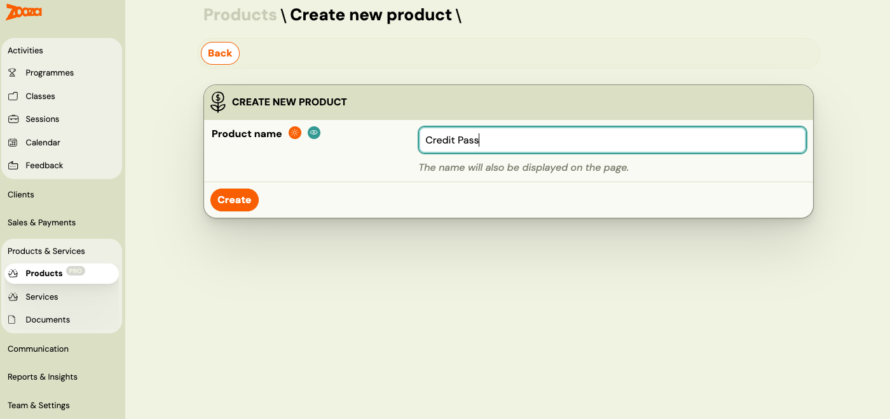

2. Enter the **credit value**, configure **payment methods** (online payment, bank transfer, cash, etc.) and save.

   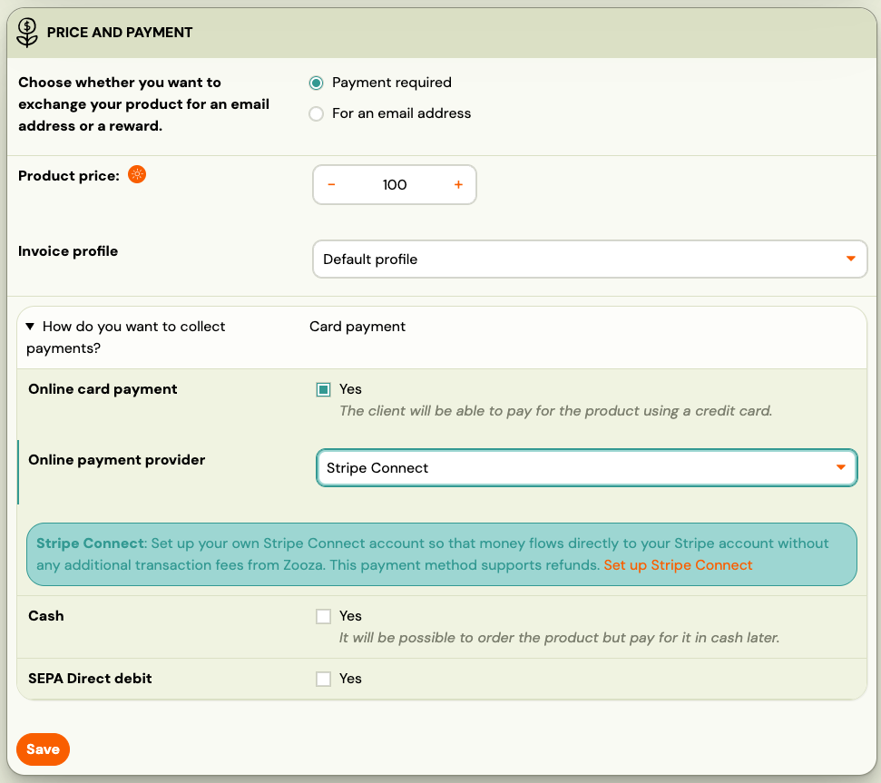

3. Go to **Items for sale** → click **Add**.

   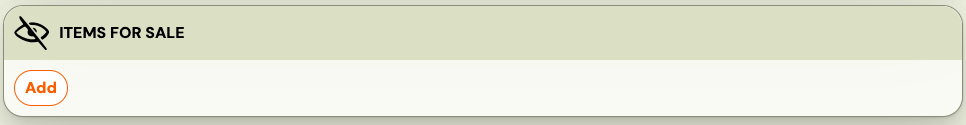

   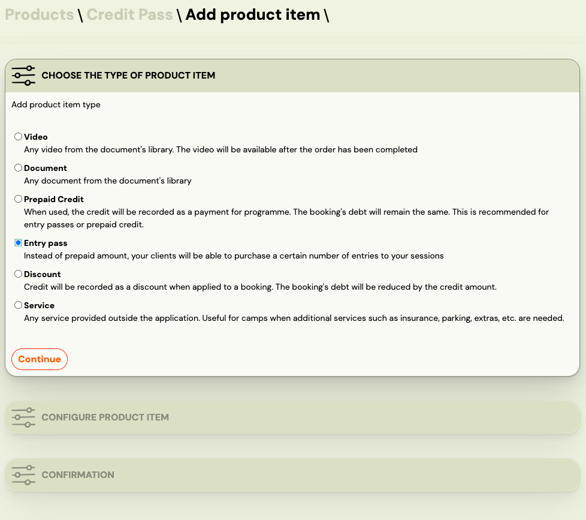
4. Select **Entry Pass** as the item type.
5. Set the **value** (number of entries or credit amount), **validity period**, **price**, and whether the item is **mandatory**.
6. To offer a discount, set the price lower than the value (e.g. 10 entries for 80 EUR instead of 100 EUR).

   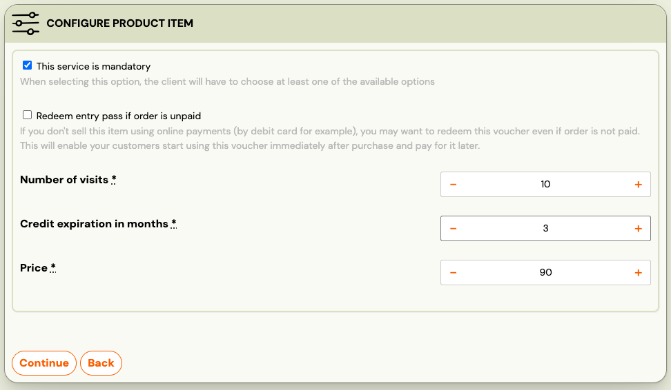
7. Click **Continue** → **Start and Continue**.
8. Add a **description** and **notification template** if needed.

   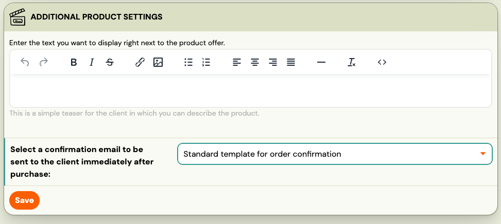

## Assign pass to a class

After creating the entry pass product, assign it to the relevant programme or class.

1. Go to the **Programme** → **Class** → **Select Product**.

   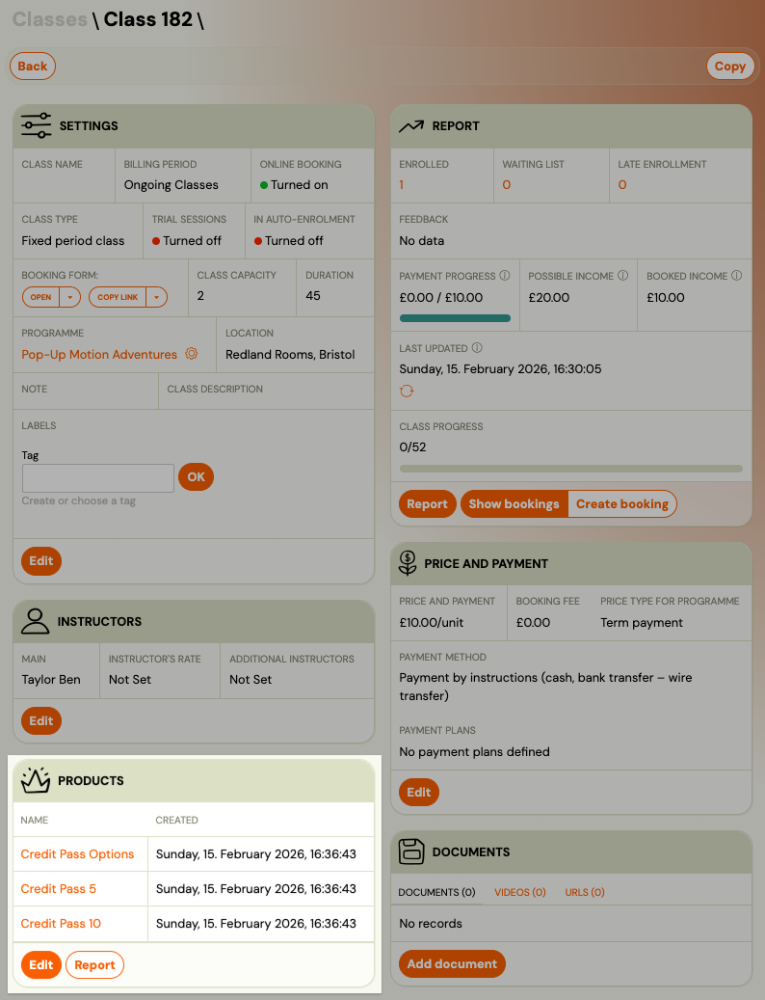

2. Choose the entry pass product you created.

   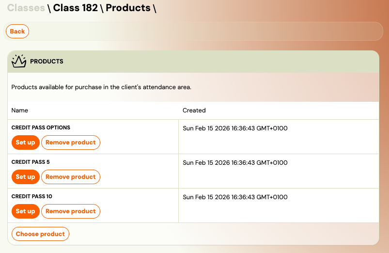
3. Click **Save**.

You can assign multiple pass types to the same class. For example, you might offer both a 5-session pass and a 10-session pass.

### Product settings per class

For each assigned product, you can configure where it appears:

- **Available in the client's profile** — clients can buy the pass from their
  profile after they have a booking. Ticked by default.

  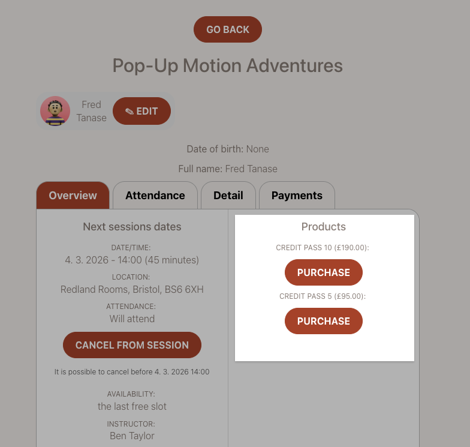

- **Make available in the booking form** — the pass is offered while the client
  is registering. Not ticked by default.

  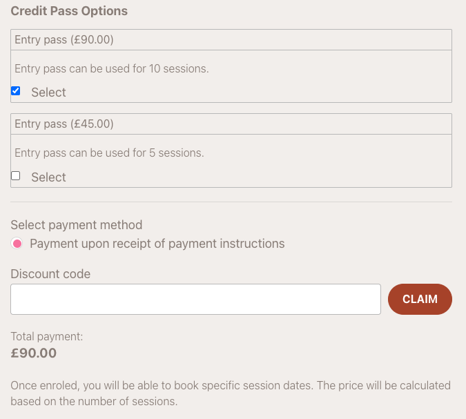

## Two-product setup for dual availability

**You usually do not need one.** The two checkboxes above are independent — tick
both on the same product and it is offered in the booking form and in the client
profile. One product, one price, one place to edit it.

Create a second product only when you want the two places to differ: a different
price in the booking form than in the profile, a bundle offered only during
registration, or a pass you sell at the desk but do not advertise to clients.

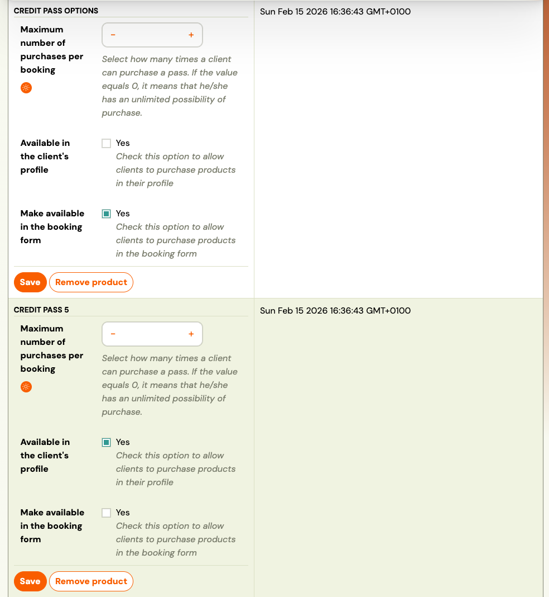

### Example: 5 EUR and 10 EUR passes

To offer two pass values in both places, create **two** products — a 5 EUR pass
and a 10 EUR pass — and tick both availability checkboxes on each. You do not
need four.

## Client perspective

After enroling for a Pay-as-you-go programme, clients can:

1. Purchase an entry pass from their profile (under **Orders** and in the detail of a booking).
2. See their credit balance or remaining entries on their profile home page.
3. Book sessions — the pass is automatically redeemed when they book.
4. If they cancel the session, the entry or credit is returned.

For a detailed walkthrough of how clients see and use entry passes, see [Entry pass — client view](entry-pass-client-view.md).

## Related guides

- [Pay-as-you-go programme](pay-as-you-go-programme.md) — How to set up the programme type that uses entry passes.
- [Linked classes](linked-classes.md) — Use one entry pass across multiple linked classes.
- [Selling products during booking](selling-products-during-booking.md) — How to offer products in the booking flow.
- [Entry pass — client view](entry-pass-client-view.md) — How clients see and use entry passes in their profile.
- [Pay-as-you-go FAQ](../faq/pay-as-you-go-faq.md) — Common questions about entry passes and Pay-as-you-go.
