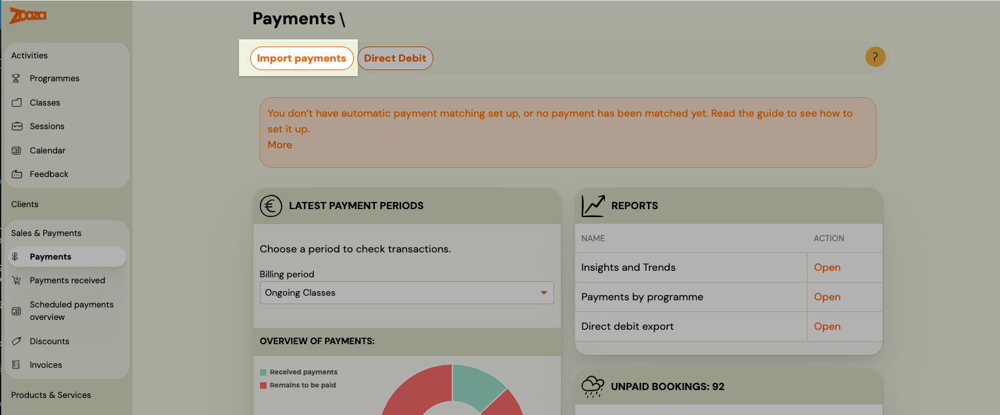
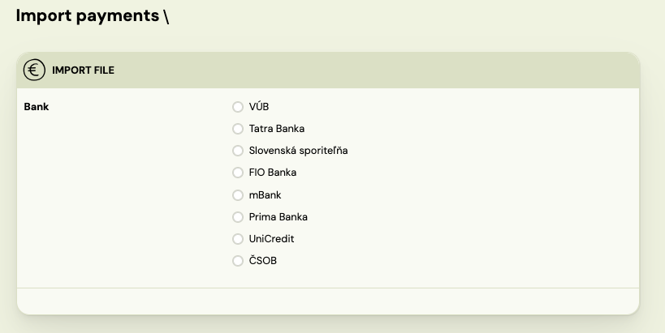
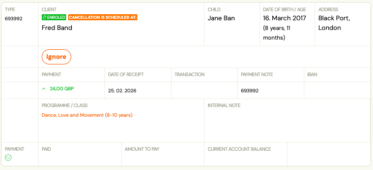
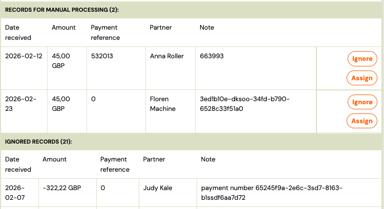
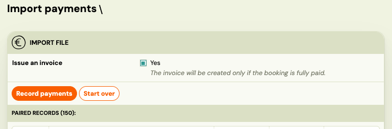

<!-- Synonyms: import payments, CSV import, bank statement import, bulk payment import, upload bank transactions, importovať platby, import platieb, bankový výpis import, CSV súbor platby, hromadný import platieb, fizetések importálása, CSV import fizetések, banki tranzakciók importálása -->

# Importing bank payments via CSV

CSV import lets you upload a bank statement export directly into Zooza to match payments against bookings in bulk. Zooza reads the file and automatically pairs each transaction to a booking using the payment reference number.

**When to use CSV import:**

- Your bank does not support live integration (GoCardless or email notifications).
- There was an outage in your live integration and payments from a specific period are missing in Zooza.
- You prefer to review and confirm payment batches manually rather than using automatic matching.

## Before you start

Export the transaction list from your bank as a **CSV file**. Zooza cannot process PDF statements or Excel files — CSV only.

Most internet banking systems have an "Export transactions" or "Download statement" option. Look for the CSV or text format.

> **Tip:** Export a complete, non-overlapping period — for example, from the 1st to yesterday. Avoid exporting "up to today" if you plan to run another import later, as the same transactions may appear in the next export and be imported twice.

## Step 1 — Go to the import screen

Go to **Payments → Import**.

## Step 2 — Select your bank

From the list, select the bank the CSV file came from.

If your bank is not in the list, contact Zooza support and attach your CSV export. The team will review the format and, if possible, add your bank to the list.

## Step 3 — Upload the file

Click **Upload** and select your CSV file. Zooza reads the file and displays a list of transactions.

## Step 4 — Review matched and unmatched transactions

Zooza automatically matches each transaction to a booking using the **payment reference number** (variable symbol).

- **Matched** — a booking was found with a matching payment reference. These are ready to import.
- **Unmatched** — no booking was found. This typically happens when the client sent the wrong or missing reference.

For unmatched transactions you have two options:

- **Match manually** — search for the correct booking and assign the transaction to it.
- **Ignore** — skip the transaction. It will not be imported. You can import it later if needed.

## Step 5 — Confirm the import

Once you have reviewed all transactions, click **Confirm import**.

At this step you can also choose to **generate invoices** for all imported payments in one action — this saves you from having to generate them one by one per booking.

After confirming, each matched payment is applied to the corresponding booking. The client receives a payment confirmation notification.

> **Note:** You can disable the payment confirmation notification in **Settings → Payments** if you do not want clients to be notified after a CSV import.

## Important: do not import the same file twice

If you upload and confirm the same CSV file a second time, every payment in the file will be recorded again. The booking balances will be doubled, and **this cannot be automatically reversed**.

If this happens, contact Zooza support immediately — the duplicate payments must be removed manually.

**To avoid this:**

- Keep a record of which date ranges you have already imported.
- Always export complete, non-overlapping periods (e.g., 1–28 February, then 1–31 March — never overlapping).
- When in doubt, export up to yesterday, not up to today.

## Related

- [Set up how Zooza collects money from clients](../setup/inbound-payments-setup.md) — configure automatic bank statement reading so imports are only needed as a fallback
- [Payment Pairing for Bank Transfers](../guides/payment-pairing.md) — overview of all pairing methods.
- [Email-notification payment matching](../setup/email-payment-notifications.md) — faster alternative that doesn't require manual file exports.
- [GoCardless Integration FAQ](../faq/gocardless-faq.md) — automatic pairing via GoCardless.
- [Edit payment on booking](../guides/edit-payment-on-booking.md) — how to manually adjust or correct a payment on a booking.
