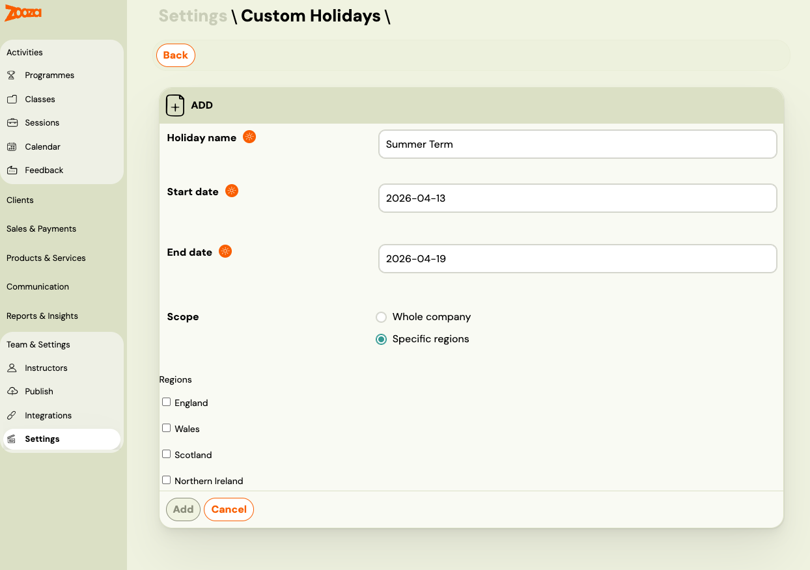

<!-- Synonyms: custom holiday, company holiday, firemný sviatok, vlastné voľno, company closure, block dates, skip dates, custom closure -->

# Custom holidays

Custom holidays let you block out specific dates for your Zooza account — such as a team retreat, a local event, or an unexpected closure. When a custom holiday is set, Zooza skips those dates during session scheduling, respects them in trainer availability, and applies them in cancellation deadline calculations — exactly like public or school holidays.

Custom holidays belong to your Zooza account and are never visible to other accounts.

> **Permission required:** You need the `manage_places` role to create, edit, or delete custom holidays.

---

## Types of custom holidays

When creating a custom holiday, you choose its **scope**:

| Scope | Behaviour |
|---|---|
| **Company-wide** | Applies to all locations and classes in your Zooza account, regardless of region. Behaves like a state holiday — sessions everywhere are skipped. |
| **Region-specific** | Applies only to locations in the selected regions. Behaves like a school holiday — only sessions at locations in those regions are skipped. |

---

## Create a custom holiday

1. Go to **Settings** > **Custom Holidays**.
2. Click **Add holiday**.
3. Fill in the details:
   - `Name` — a descriptive label (e.g. "Company Retreat" or "Summer Closure").
   - `Start date` — first day of the holiday period (inclusive).
   - `End date` — last day of the holiday period (inclusive). Can be the same as the start date for a single-day closure.
   - `Scope` — choose **Company-wide** or **Region-specific**.
4. If you selected **Region-specific**: in the `Regions` field, select one or more regions from the dropdown. The available regions are based on your company's country.
5. Click **Save**.

The holiday is immediately active. Any sessions you create after this point will automatically skip the custom holiday dates.

> **Note:** Custom holidays do not retroactively remove already-created sessions. If you have existing sessions that fall within the new holiday period, you must remove or reschedule them manually.

---

## Edit a custom holiday

1. Go to **Settings** > **Custom Holidays**.
2. Find the holiday you want to change and click **Edit** (pencil icon).
3. Update the name, dates, scope, or regions as needed.
4. Click **Save**.

> You can only edit holidays your company created. Public and school holidays synced from the national calendar are read-only.

---

## Delete a custom holiday

1. Go to **Settings** > **Custom Holidays**.
2. Find the holiday and click **Delete** (bin icon).
3. Confirm the deletion.

Deleting a custom holiday does not restore any sessions that were previously skipped because of it.

---

## How custom holidays interact with scheduling

### Session creation

When you add sessions to a class using the session wizard, Zooza checks all three holiday types:

- Public holidays (state level)
- School holidays (regional level)
- **Custom holidays (your company)**

If a session date falls within a custom holiday period, it is skipped automatically when the **Skip Holidays** or **Skip School Breaks** checkboxes are enabled — depending on the scope of your custom holiday.

For company-wide custom holidays, enable **Skip Holidays** to skip them.
For region-specific custom holidays, enable **Skip School Breaks** to skip them (they behave like school holidays for the affected regions).

### Existing sessions

Holiday-skip rules apply only at the time of initial session creation. If you create a custom holiday after sessions have already been generated, those existing sessions are **not** automatically cancelled or removed. Review and remove affected sessions manually.

### Trainer availability

Custom holidays automatically appear as conflicts in trainer availability. If a trainer is scheduled for a session that falls within a custom holiday, the system flags it.

### Cancellation deadlines

Custom holidays count as holidays for the purpose of the **Block cancellations on weekends and holidays** setting. If a cancellation deadline would land on a custom holiday, the deadline moves to the preceding business day.

---

## Viewing all holidays

To see all holidays (public, school, and custom) for a date range, go to the session creation screen for any class. The calendar highlights all holiday types. Custom holidays created in your account are visually distinguished from synced public and school holidays.

---

## Related

- [Holiday settings](../setup/holiday-settings.md) — how to configure regional holidays per location.
- [Holiday and Term Management FAQ](../faq/holiday-management-faq.md)
- [Cancellation limit settings](cancellation-limit-settings.md)
