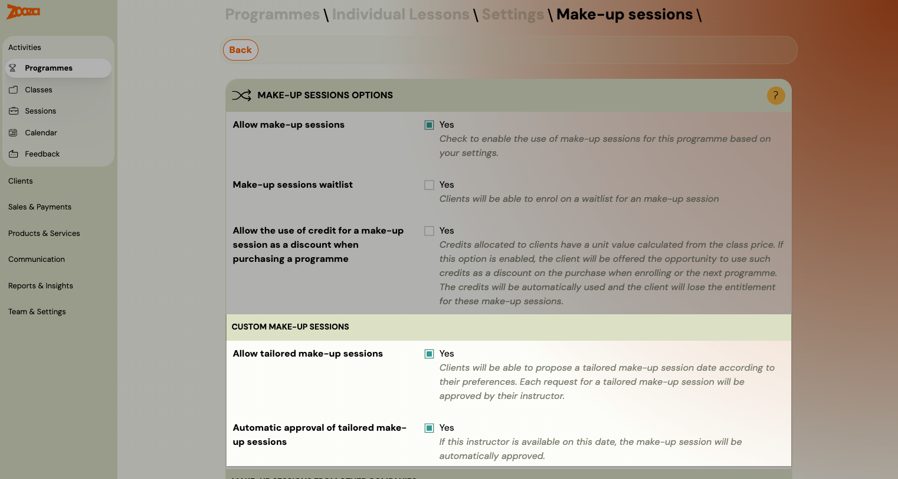
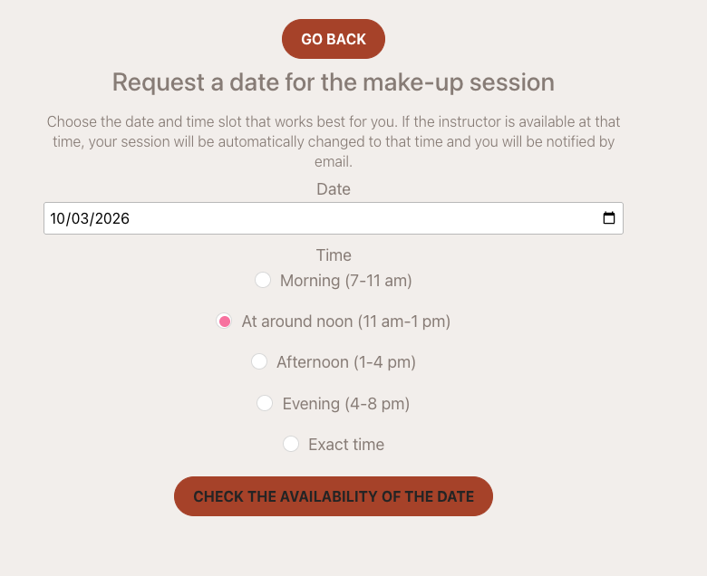
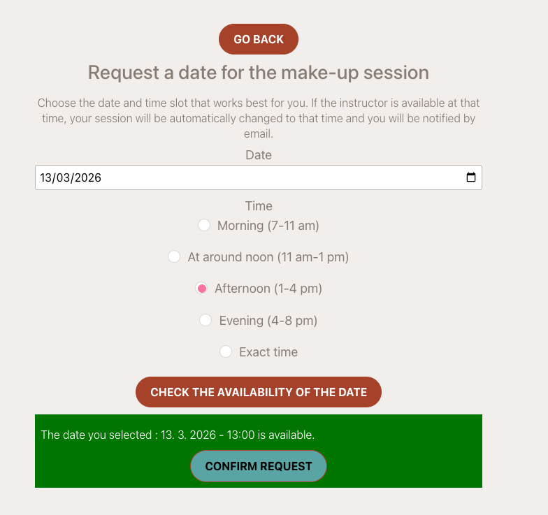
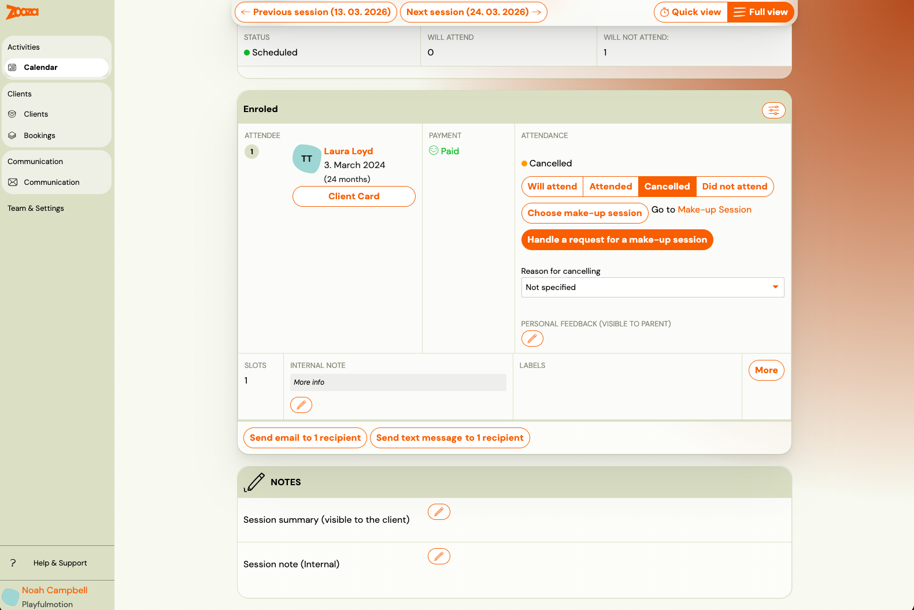

# Custom replacement lessons

Standard make-up sessions work by filling a vacant slot in another class — the client picks from whatever sessions have capacity. This works well for group classes, but not for individual or specialist sessions such as piano lessons, personal training, or counselling.

For those cases, **custom replacement lessons** let the client propose a specific date and time to their instructor, who then approves or declines the request. If approved, the replacement session is created automatically and the client is enrolled.

## Enable custom replacement lessons

Custom replacement lessons are configured at the programme level.

1. Go to the programme and open the **Replacement lessons** tile.
2. Click **Edit**.
3. First enable replacement lessons in general (the top checkbox).
4. Then enable the following options under **Custom Replacement Lessons**:

| Setting | Description |
|---|---|
| **Allow custom replacement lessons** | Enables the feature. Clients can submit a request for a specific date and time. |
| **Automatic approval of custom replacement lessons** | If enabled, requests are approved automatically without instructor action. Use this only if you trust clients to self-schedule without conflicts. If disabled, the instructor must manually approve each request. |

### Restrict standard make-ups (optional)

By default, standard make-up sessions (based on vacant seats) remain available alongside custom requests. If you want clients to use only custom requests — for example, to ensure the replacement always happens with their own instructor — disable standard make-ups by adjusting the **credit properties** on the programme.

## Client view

When a client cancels a session, the standard replacement session list appears (if any sessions have available slots). Below that list, a form for requesting a custom replacement is shown.

The client fills in:
- **Day** — minimum 3 days from today.
- **Time** — indicative or exact time.

After entering the preferred time, the client clicks to check the instructor's availability. The system evaluates whether the instructor is free at that time based on their calendar.

- If the instructor is **available** — the client can submit the request.
- If the instructor is **not available** — the request cannot be sent.

After submitting, the attendance record shows the request status. The client can cancel the request at any point before the instructor confirms it. Once the instructor confirms, the client receives an email notification with the outcome.

## Instructor view

When a client submits a request, the instructor receives an email notification.

In the attendance view (from the booking detail or calendar), the request appears alongside the regular attendance. The instructor can still choose a standard replacement session for the client, but is expected to respond to the custom request.

When handling the request, the instructor sees:
- A summary of the group's schedule.
- Their own calendar for the relevant time period — the **hatched area** shows the client's preferred time window, the **green area** shows when the real session takes place.

The instructor can adjust the proposed date and time before confirming.

### Approve

If approved, the replacement session is created automatically within the client's class and the client is signed in. The new session is highlighted in the class schedule.

### Decline

If declined, the instructor must provide a reason. The reason is sent to the client as an email notification. The client can then submit a new request with a different time.

## Related

- [Replacement hours — complete guide](replacement-hours-complete.md) — standard make-up session setup and workflow.
- [Make-up sessions FAQ](../faq/make-up-sessions-faq.md)
- [Instructor attendance management](instructor-attendance-management.md)
- [King of a group](king-of-a-group.md)
