# Customizing widgets

Zooza offers an easy way to customize the widgets you have deployed on your website. You can customize each widget to suit your needs - you can filter the programme offerings, set specific parameters or change the look and feel according to your site design.Widget integration and configuration options:

1. WordPress plugin – ideal solution if your website runs on the WordPress platform.
2. Embed version (HTML code) –copy the generated HTML code directly into your page.


Types of widgets available:


1. Booking form
2. Calendar
3. Profile
4. Videos
5. Product/Order form
6. Map widget


TIP: Think about the navigation on your site, it's best to place some of the subpages you create directly in the menu so that visitors can navigate as quickly as possible. We also recommend having your profile highlighted in the menu and it can be called anything you like - attendance, my profile, client profile.. for example like this:


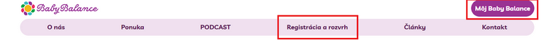

## Booking form


In its basic form, the booking form is displayed on a page listing all the programmes you have created and offered for online registration. The form contains basic fields to fill out and a preset display of information about each programme. If you wish to customize your programme selection, we recommend using the Embed version (HTML code). You can create your own specific settings in Zooza and use them to generate HTML code to embed on your page.

## Basic form fields


In the form you will see the basic fields that your client must fill in when registering, which are:

1. First name
2. Surname
3. E-mail
4. PhoneNote

1. You can modify their display in the booking form by overwriting the text. At the programme level, click *Online Registration – Edit.
 
 *
2. Scroll down to the *Customize Booking Form* section and enter new text in the field to change its display in the booking form. *Save *the change.
 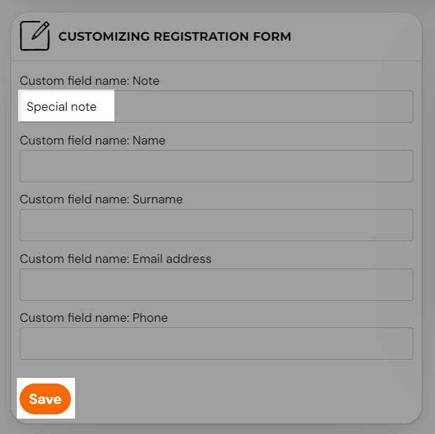

## Booking form settings for the children’s programme

1. At the programme level, in the *Programme Settings *section, if you click the *Edit *button.
 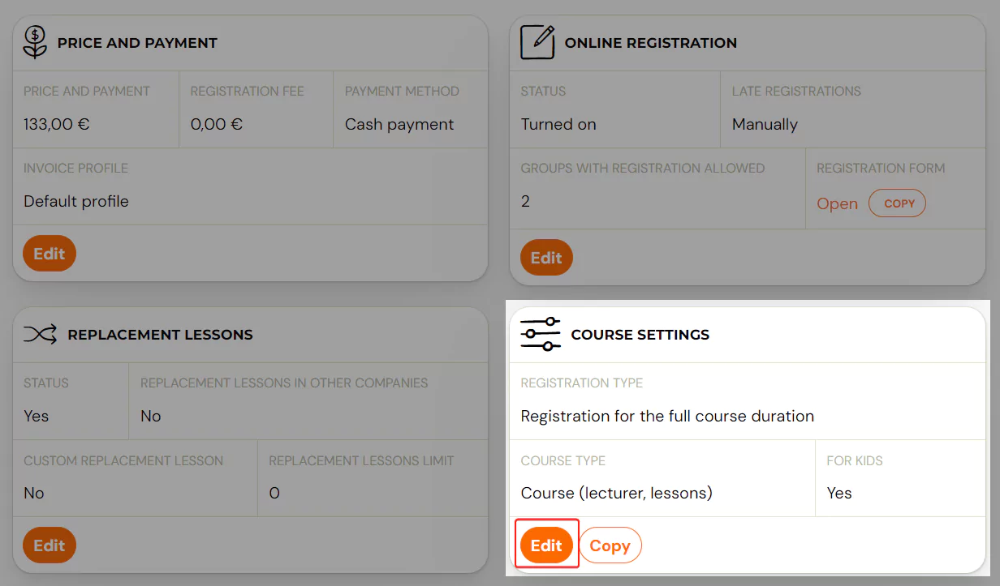

1. Under *Additional settings*, tick the For children checkbox and Save the setting
 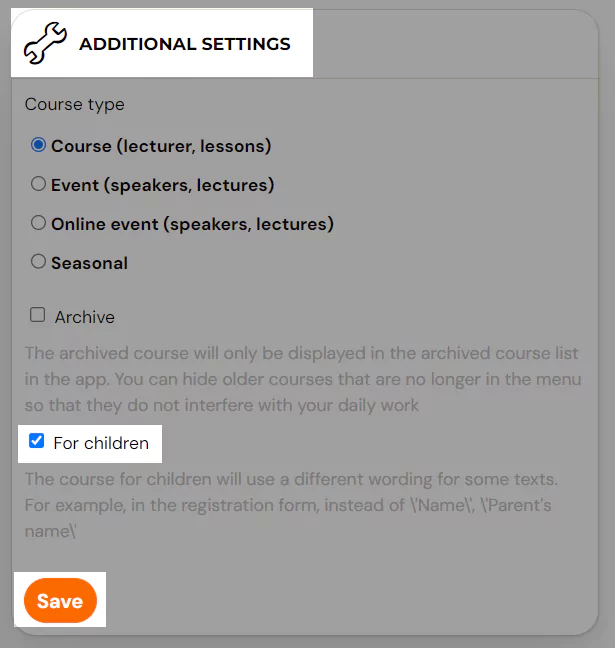
2. The booking form fields on your web page will automatically change from Name to Parent’s Name after this setting
 

## Extra fields in the form for more information collection


You
 can enrich the form with so-called Extra fields. The setting is done at
 the programme level. If you want detailed information about the use and
purpose of extra fields, see the [Additional fields on the booking form](additional-fields.md) guide.


After selecting a specific programme, click the *Edit *button in the *Extra Fields* tile.

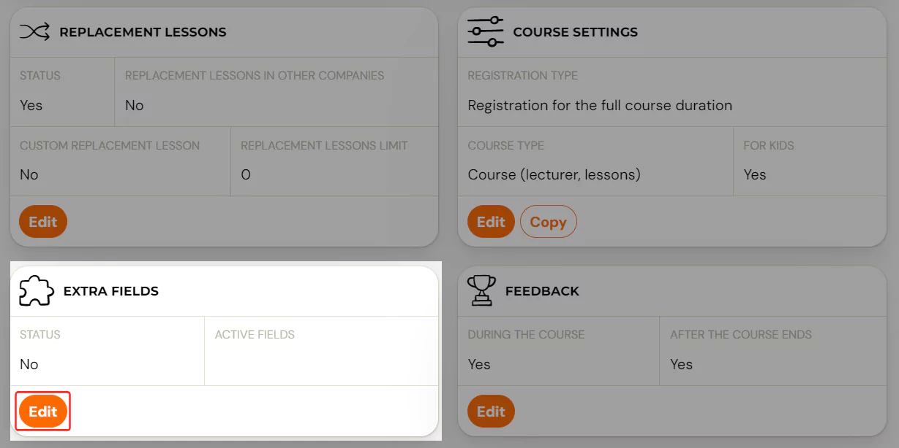

Click on *Extend booking form with extra fields*.
 After selecting a specific extra field you need to fill in its name,
only after this setting the field will be displayed in the booking
form. The field name is mandatory. Don’t forget to save your changes at
the bottom of the page.

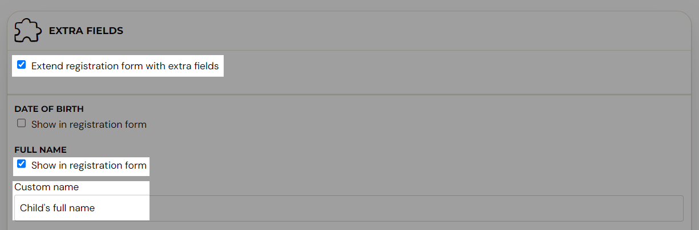

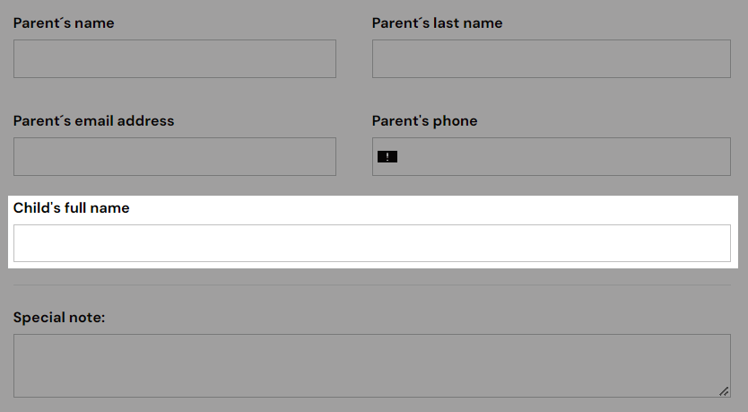


Note:
 Since the setting of the extra fields is done at the programme level, you
need to set the extra fields on all programmes separately. Or create one
programme with all necessary settings and then Copy the programme.

## Modification of the published booking form

### Customize the code to insert


If you have a variety of course offerings - for example, camps, children's programmes, or one-off sessions - you can easily customize the HTML code of your booking form to suit your needs.


1. In Zooza, go to the Publish section.
2. Choose Embed code.
3. This will open a window with the HTML code itself.
4. Below the code, click *Customize embed code
 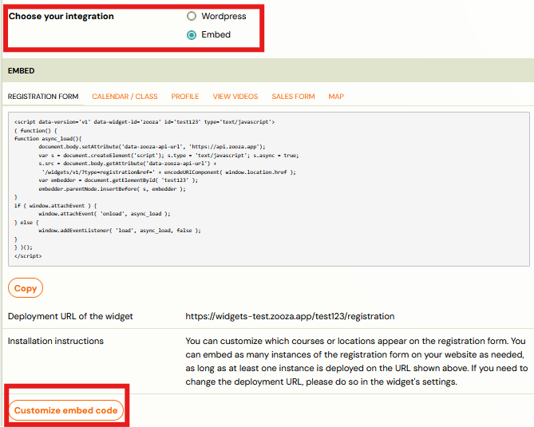
 *
5. Select which programmes and which locations to display on the page in the booking form
 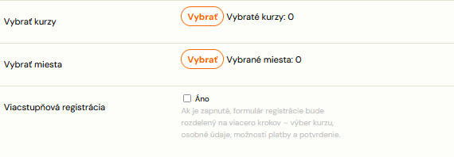
6. If you are collecting a larger amount of data or offering products for sale when you register, we recommend enabling the Multi-stage booking option. This feature breaks up the form into multiple clear steps, improving the user experience.
7. Copy the code by clicking Copy and place it on your page.

## Customizing the booking form


In the Publish section, you will also find additional options to customize the look and functionality of the booking form to suit your needs.


1. In the Publish section, click Set up in the widgets menu under Customize.
 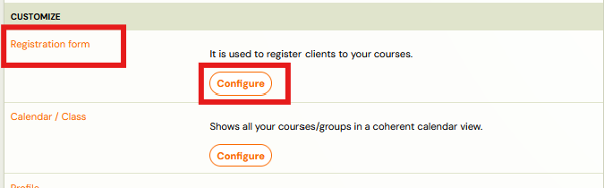
2. This will open a configuration window where you can set the display of different parts of the form - from the fields to be displayed to the way the programme is presented to the visitor.
 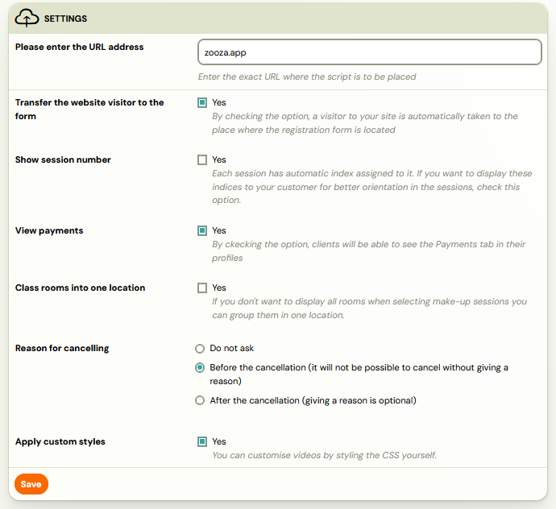


Note: In order to see what display works best for you, we recommend that you try displaying them on the page and decide based on that.


## Client Profile


Zooza allows you to create a client profile on your website, to which the client can easily log in.What the client can see and do in the profile:


1. List of ordered products and services
2. Payment status - he can see if he has anything outstanding and can make a payment directly
3. Within the programmes he can:
4. Cancel a session
5. Use make-up sessions

Access purchased videos or other digital content in secure mode


This form also offers various settings that you can customize to suit your needs. For example, you can turn on collecting reasons for cancelling from a programme - see the separate [manual](../setup/collecting-reason-for-cancelling.md)for details on this functionality.


## Calendar/Schedule


Allows you to display programme and meeting offerings on your site in a clear calendar. The calendar will always be up to date according to the settings in Zooz. Visitors will thus be able to select from the current offer and make a booking for a programme or meeting.


## Calendar View


You can customize the calendar view according to your own preferences and needs. In the settings, you can choose what information to display for each date.
Calendar display options:


1. Number of slots available or just information that it is possible to apply
2. Instructor's name, location, time of the session - optional elements that you can turn on or hide
3. Filter locations or exercise types - ideal if you offer multiple locations or different types of programmes

The best way to customize your calendar is to try out the different settings - you can toggle the options on and off and immediately see how they appear on the page.Once you've adjusted the settings, be sure to click Save Changes and then refresh the calendar page (on Windows, press F5).


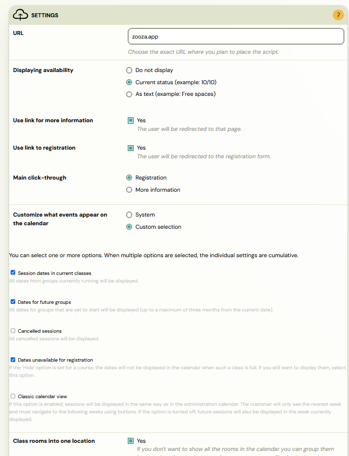

## Editing a published calendar


As with the booking form, you have the option to display only some programmes in one calendar - by customizing the HTML code of the calendar.


1. In Zooza, go to the Publish section.
2. Select the integration type: Embed code.
3. This will open a window with the HTML code itself.
4. Below the code, click Customize embed code
 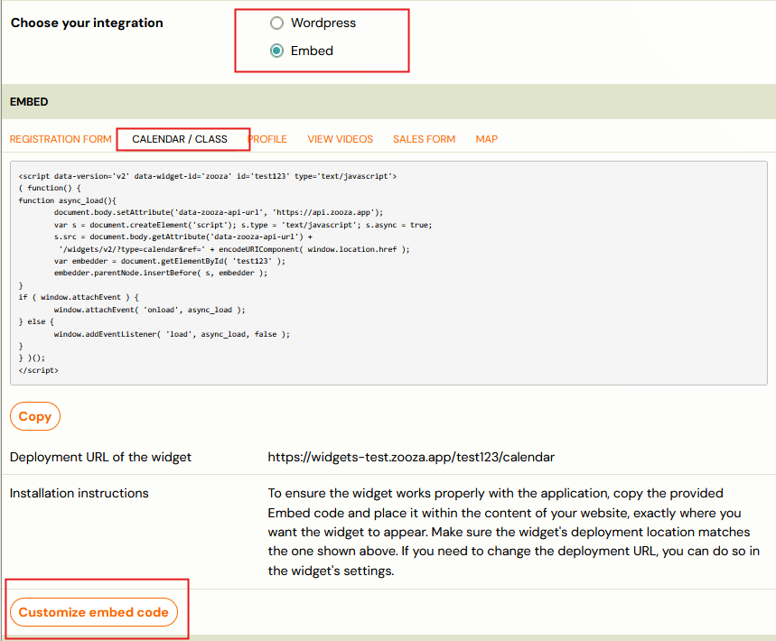
5. Select which programmes and which locations to display on the page in the booking form
 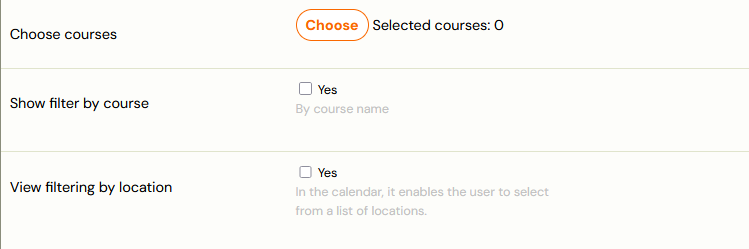
6. Copy the code by clicking Copy and place it on your page.
 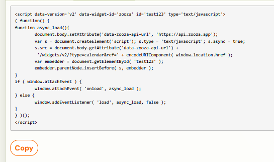

## Videos


Zooza is also unique in that it can mediate the video in security mode so that no one can access the video except by making it available to registrants (either by attribution or by sale). In order to play the video, you need to create a subpage where the videos will be displayed.


Note: Deploying a widget to display videos also needs to be done if you put the video in a class/term to display in the client profile.

## Order form


Allows you to collect orders for your digital products or other products. In the case of digital products, they will be directly accessible in the client profile after payment.


## Map widget


The map widget allows you to display your programmes directly on a map on your website. With this clear view, clients can quickly select a programme by location.

How it works:


1. The client enters their postcode
2. Selects the radius (e.g. 5, 10 or 20 km) within which they want to search for the nearest programmes.
3. Can select an age restriction - only programmes that match the participant's specified age will be displayed.
4. The system will automatically show him the nearest available classes:
5. on a map - visually distributed by location
6. in the list below the map - for quick overview and easy selection

Clicking on a specific location takes the user directly to the booking form of that location.

## Viewing the map widget

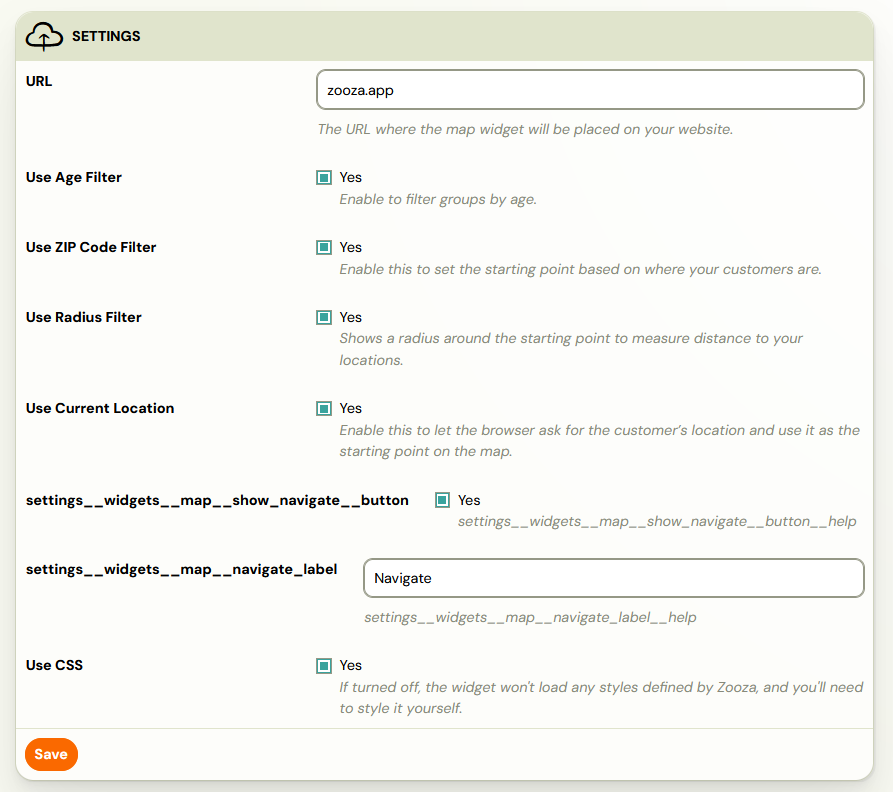

## Filtering widgets with URL parameters

You can filter which programmes, classes, or locations appear in a widget by adding parameters to the widget URL. This is useful when you have a dedicated page for a specific programme or venue.

### Available filter parameters

| Parameter | Purpose | Example |
|---|---|---|
| `course_id` | Show only a specific programme | `?course_id=4941` |
| `schedule_id` | Show only a specific class (group) | `?schedule_id=72709` |
| `place_id` | Show only a specific location | `?place_id=369_0` |

You can combine parameters using `&`:

```
https://yoursite.com/register/?course_id=4941&place_id=369_0&schedule_id=72709
```

### Separator syntax for multiple values

When filtering for multiple programmes or locations, the separator character matters:

- Use **semicolons** (`;`) to separate multiple IDs within a single parameter when generating embed code via the Zooza configurator.
- Do **not** use commas as separators. Using the wrong delimiter causes the filter to be ignored, and the widget displays all programmes instead of the filtered subset.

<!-- REVIEW: Confirm whether the correct multi-value separator is always semicolon, or whether it differs per parameter (e.g. course_id vs place_id). Support tickets consistently mention comma-vs-semicolon confusion as the root cause. -->

### Recommended workflow

1. Go to **Publish** > **Embed code** in Zooza.
2. Click **Customize embed code**.
3. Select the programmes and locations you want to display.
4. Click **Copy** and paste the generated code onto your page.
5. Do not manually edit filter parameters in the embed code. Always regenerate the code from the Zooza configurator to avoid syntax errors.

If the widget still displays all programmes after pasting filtered code, see [Widget Embedding Troubleshooting](../troubleshooting/widget-embedding.md) for debugging steps.

## Cookie consent and widget loading

Zooza widgets rely on JavaScript that loads from Zooza servers. If your website uses a cookie consent tool (such as CookieBot, OneTrust, or a CMS cookie plugin), that tool may block Zooza scripts before the visitor accepts cookies. When blocked, the widget area appears blank or the client profile login fails.

### Whitelisting Zooza in your consent tool

1. Open your cookie consent tool configuration.
2. Locate the script categorization or whitelist section.
3. Add Zooza script domains (e.g. `api.zooza.app` and associated JS resources) to the **Essential** or **Functional** category.
4. Save the configuration and test in an incognito browser window.

<!-- REVIEW: Confirm the exact list of Zooza script domains that need whitelisting. Support responses mention "api.zooza.app" and "Zooza JS resources" but a complete list should come from the dev team. -->

If your website embeds the widget inside an `<iframe>`, the consent tool on the parent page may additionally block third-party cookies required by the iframe. In this case, ensure the consent tool allows cookies from the Zooza domain.

Alternatively, if cookie management causes persistent issues during testing, you can temporarily disable the consent tool to confirm Zooza is loading correctly, then re-enable it with the correct whitelist settings.

> **Tip:** If you are unsure how to update your cookie consent settings, contact your web developer or the consent tool vendor and ask them to classify Zooza scripts as essential (technical) cookies.

## Capacity display in widgets

The calendar and booking form widgets can show how many spots are available. Zooza offers two ways to calculate this number: **group capacity** and **session capacity**. Understanding the difference helps avoid confusion for both admins and clients.

### Group capacity vs session capacity

- **Group capacity** shows how many open registration slots remain in the entire class. If a group has a capacity of 12 and 10 clients are registered, it displays `2 spots available`. This number does not change when a client cancels a single session.
- **Session capacity** shows how many people are attending a specific session. When a client cancels one session (e.g. for a make-up lesson), that session displays a free spot. This free spot is intended for replacement (make-up) lessons, not new registrations.

### Which setting to use

- If you do **not** use blocks, Zooza displays group capacity by default. This is the recommended setting for most programmes, because it prevents clients from mistakenly thinking a full group has open spots after a single-session cancellation.
- If you **do** use blocks, the widget displays per-session capacity by design. Block-based courses manage capacity at the session level, so the per-session count is the accurate number.

To verify or change the capacity display:

1. Go to **Publish** > select your widget > **Calendar** settings.
2. Check the occupancy display option.
3. Save changes and refresh the page on your website.

<!-- REVIEW: The group-vs-session capacity default was changed around Jan 2026. Confirm the exact setting name and location in the Publish > Calendar section. -->
