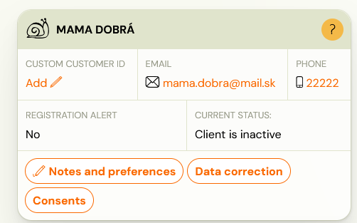
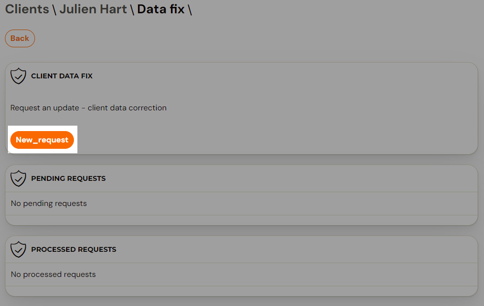
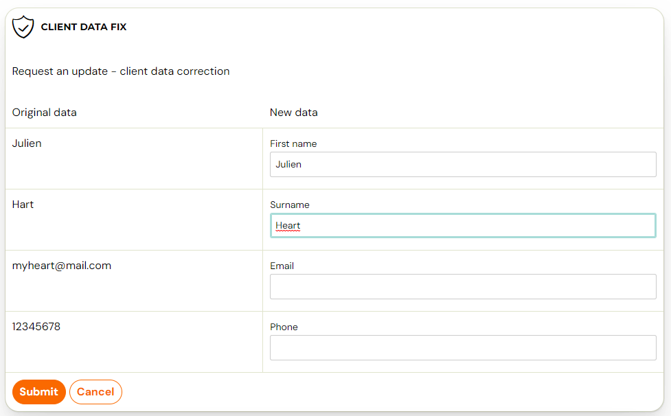
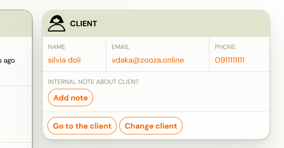
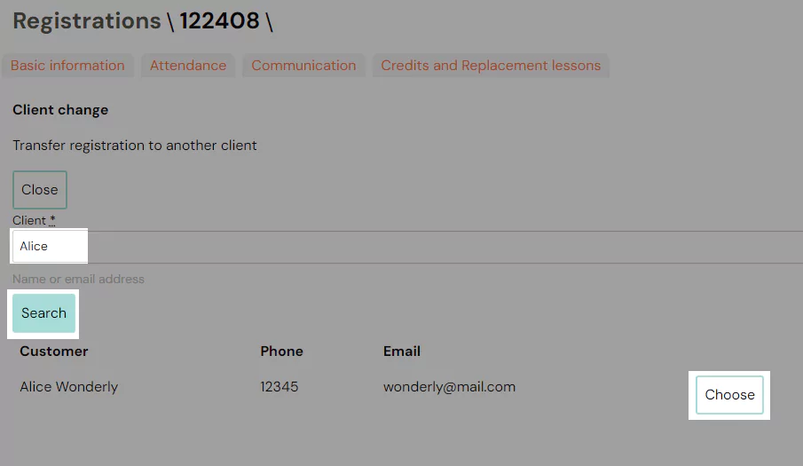

# Data correction or change client's data

There are two ways to change the details of a client or registration.

1. Data correction of client's data
2. Client change/registration change

## Data correction of client's data

If you request a data change at the client level, this will also change the data on all registrations that the client has created with you. For example, if you request a name change, it will change on all registrations. This change is made directly in the client card.

Changing the client’s details is done via a request that you send to us via the app. You are always informed by notification e-mail about the creation as well as about the approval or rejection of your request.

## Why was the application rejected?

We may reject your application for two reasons:

1. the form sent out contains data that is incorrect (with errors)
2. if it is a bulk overwrite of a client’s registration

## Data correction

1. The client data change request must be completed at the client level by clicking on the *Data correction* button.*
 
 *
2. You will then be presented with a screen that allows you to enter a new request, as well as an overview of all pending requests.
3. To create a new request, click on the New Request button and fill in the form.
 

4. Once you have filled in the required details to make the change, just click the Submit button. You can then find your applications in the application list and just wait for them to be processed. Changes to a client’s details usually occur within 2 days of the request being made.
 

## Client change/registration change

Changing a client, or in other words overwriting a registration, may at first glance appear to be the same as changing a client’s details. But it’s the opposite, in the sense that when you change the client, you’re just overwriting the registration under a different client than the one that was originally created. Thus, it is not a change of data on all its registrations, but only an overwriting of one registration.

The only condition of the override is that the client you wish to overwrite must be registered as a client and thus have another registration of any/all status.

1. To change the registration to a another client, click the *Change Client* button in the registration details.
 
2. In the Client field, enter the email or name of the client to whom you want to overwrite the registration and click the *Search *button followed by *Select*.
 
