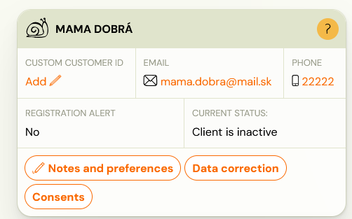
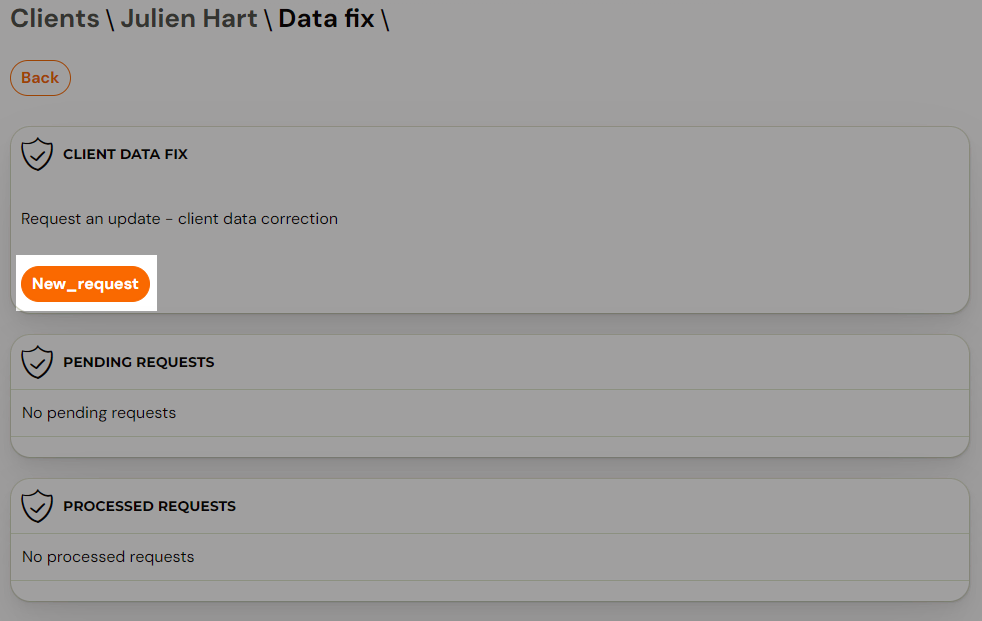
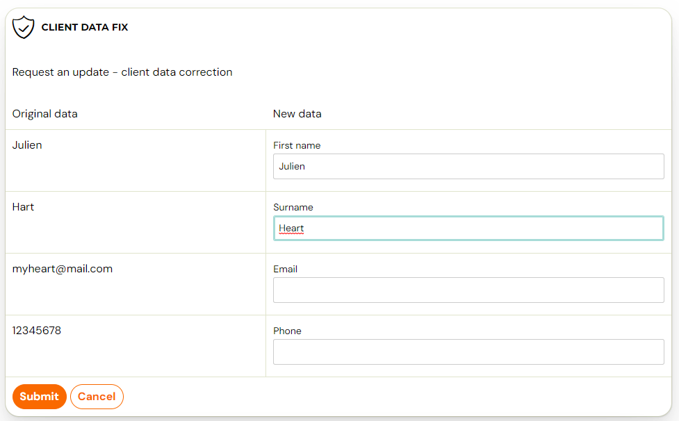
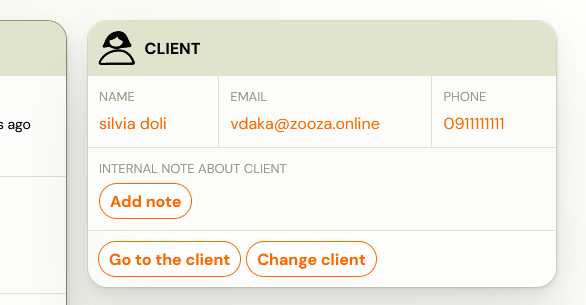
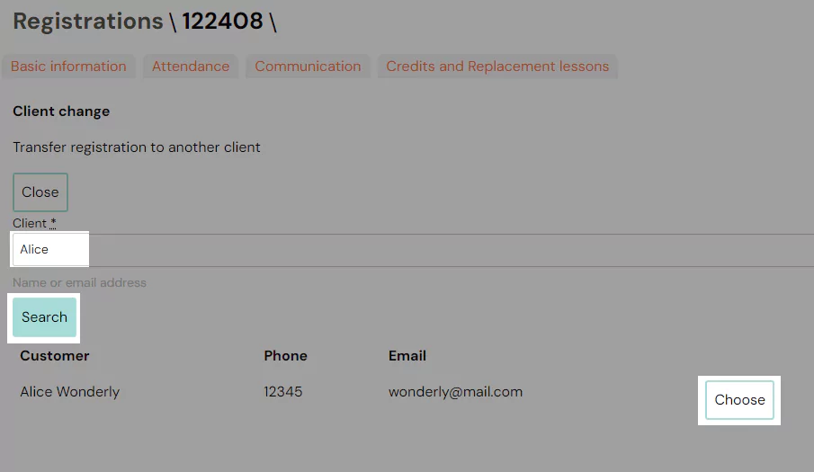

# Data correction or change client's data

There are two ways to change the details of a client or booking.

1. Data correction of client's data
2. Client change/booking change

## Data correction of client's data

If you request a data change at the client level, this will also change the data on all bookings that the client has created with you. For example, if you request a name change, it will change on all bookings. This change is made directly in the client card.

Changing the client’s details is done via a request that you send to us via the app. You are always informed by notification e-mail about the creation as well as about the approval or rejection of your request.

## What can and cannot be changed via data correction?

**Can be changed:**
- Name (typo corrections)
- Email address
- Phone number

**Cannot be changed:**
- Assigning the booking to a completely different person — use **Change Client** on the booking instead
- Bulk changes across many bookings at once

## How long does a data correction request take?

Zooza now classifies requests automatically by risk level:

- **Low-risk requests** (name typo corrections, phone number changes) are **auto-processed immediately**. You receive a confirmation email once the change is applied — no manual review needed.
- **Higher-risk requests** (email address changes, or cases where the system cannot safely auto-resolve) are still sent to the Zooza back-office team for manual review, typically within 24 hours on business days.

When you submit a request, the system tells you immediately whether the change was processed or sent for review.

## Which one do you actually need?

Requests get rejected most often because the wrong mechanism was chosen. Decide before you submit:

| Situation | Use |
|---|---|
| The client's own details are wrong (typo in the name, old email that exists nowhere else) | **Data correction** |
| **The email you want to move the booking to already exists in the database** | **Change client** — not data correction |
| You want to move one booking to a different person | **Change client** |
| You want to merge a client's several old emails into one | Neither — see below |

If the target email is already a client record, there is nothing to *correct*: both people exist. Open the booking, go to the **Client** card and choose **Change client**, then search for the existing record. Submitting this as a data correction will be rejected every time, no matter how you word it.

> **Before changing an email, check who loses access.** Changing a client from a work address to a personal one means they can no longer reach Zooza using the work address. If several people share the work address, that may be exactly what you do not want.

## Why was the application rejected?

A data correction request is rejected if:

1. **The name in the new email address does not match the client’s name on record.** For example, if the client’s name is "Jana Nováková" but the requested email contains a different name, the request will be declined. This is a security check to ensure the email belongs to the same person.
2. **The data submitted contains errors** (e.g. incorrectly formatted email address).
3. **The request is a bulk change** — data correction changes one client at a time.

## Data correction

1. The client data change request must be completed at the client level by clicking on the *Data correction* button.
 
 
2. You will then be presented with a screen that allows you to enter a new request, as well as an overview of all pending requests.
3. To create a new request, click on the New Request button and fill in the form.
 

4. Once you have filled in the required details to make the change, just click the Submit button. You can then find your requests in the application list and just wait for them to be processed. Changes to a client’s details usually occur within 2 days of the request being made.
 

## Client change/booking change

Changing a client, or in other words overwriting a booking, may at first glance appear to be the same as changing a client’s details. But it’s the opposite, in the sense that when you change the client, you’re just overwriting the booking under a different client than the one that was originally created. Thus, it is not a change of data on all its bookings, but only an overwriting of one booking.

The only condition of the override is that the client you wish to overwrite must be enroled as a client and thus have another booking of any/all status.

1. To change the booking to a another client, click the *Change Client* button in the booking details.
 
2. In the Client field, enter the email or name of the client to whom you want to overwrite the booking and click the *Search* button followed by *Select*.
 
