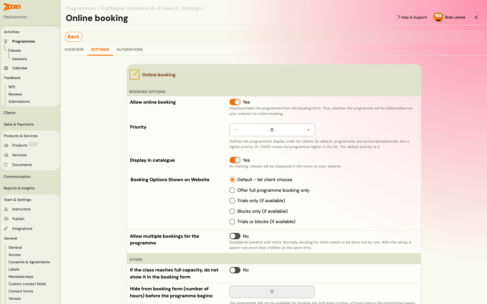
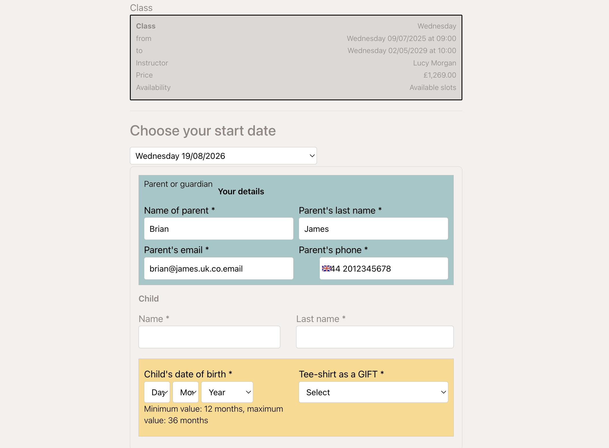

# Let clients register now and start later

A parent wants the place, but cannot come to the first few sessions — a holiday, a term that starts before they are back, an illness. Without this setting their only options are to book and pay for sessions they will miss, or to wait and risk the class filling up.

Delayed start lets them **secure the place now and join from a later session**, paying only from that date.

You could already do this as an admin by setting a start date on a booking. What this adds is letting the **client** choose it during registration, inside limits you set.

## Turning it on

1. Go to **Programmes → the programme → Settings → Online booking**.
2. Switch on **Allow register now, start later**.
3. Set **Latest start (days ahead)** — the maximum number of days ahead a client may set their start, counted from the earliest available date.
4. Save.

The window is the only control you need. You are not managing individual start dates; you are saying how far into the term someone may join and let the booking form work out the rest.

> A window of `0` disables the feature. That is the default, and it is the behaviour every class had before.

Individual classes can override the programme's setting where one class needs a different window.

## What the client sees

They do not get a free-form date picker. The booking form offers **two or three real session dates** as options, each showing the price for starting then. The price is calculated by Zooza, not by the form, so what they pick is what they pay.

The options are always actual upcoming sessions of that class, inside the window you set.

## What happens to the sessions before their start

They are excluded from the booking. The client is not marked absent for them, is not asked to pay for them, and — this is the part that matters operationally — **is not counted in those sessions' capacity**.

So a class that is full for the first three weeks but has room afterwards can still take the booking. The seat only has to be free from the date they actually start.

## Filling seats that would otherwise go to the waiting list

This is the second reason to switch it on.

When a class is full today, the booking form normally offers the waiting list. With delayed start enabled, Zooza first checks whether a seat opens up **durably** — free for every remaining session, not just one — within your window. If it finds one, it offers that later start instead of the waiting list.

If no seat opens inside the window, the waiting list behaves exactly as before.

The practical effect is fewer people parked on a waiting list for a class that could have taken them two weeks later.

## What the client pays

The price is worked out pro-rata from the start they chose, using the same calculation as any late booking. A client starting in week three of a twelve-week term pays for ten sessions, not twelve.

See [Late bookings (pro-rata management)](late-bookings.md) for how pro-rata is configured, since it is the same setting.

## Things worth knowing

- **The window is counted from today**, not from the class start. A class that began a month ago still only offers starts inside the window from now.
- **Every session from their start to the end of the term must have a seat.** A start date is only offered if the whole remaining span works — you will not get someone enrolled into a class that fills up again in week six.
- **Non-billable sessions are still non-billable.** A free session inside their span is not charged, exactly as it would be for anyone else.

## Related

- [Priority registration](priority-registration.md) — deciding *who* may book early.
- [Waiting list FAQ](../faq/waiting-list-faq.md) — what happens when no start date works.
- [Late bookings (pro-rata management)](late-bookings.md) — how the reduced price is calculated.
