# Discount code

A discount code is one of the types of client discounts you will find
within the app. Typical use is within campaigns or collaborations, where
 you generate a code with a certain name and setting and those clients
who know it can use it.

Note: The discount can only be applied to programmes by
entering the code in the registration form. In order for clients to be
able to enter the code, you must enable the *Discount* field in the main settings under *Registration Forms – Registration Form*.

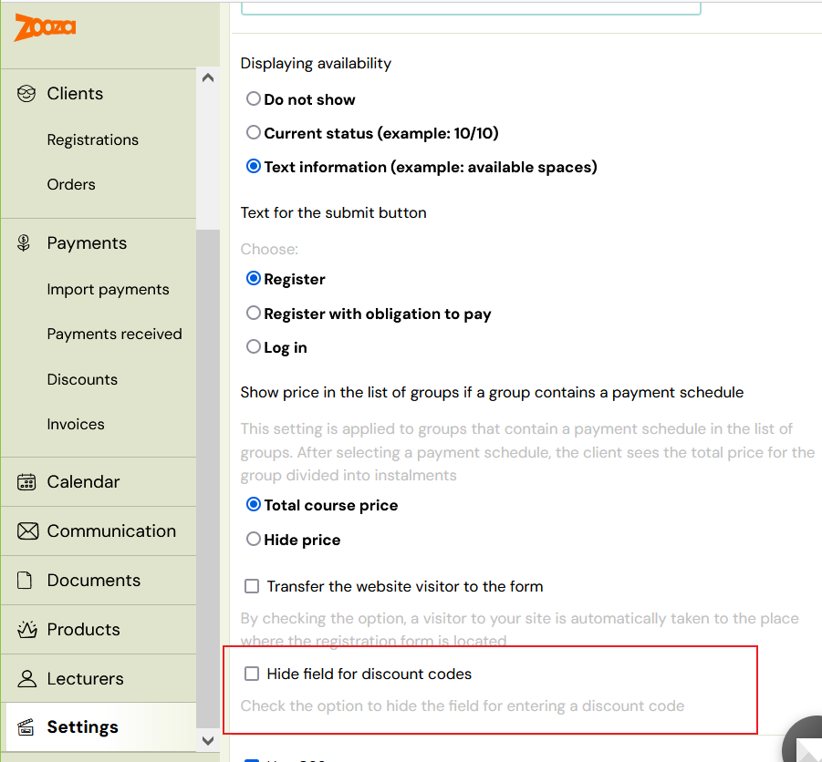

##

## Creating a discount code

- In the *Payments* category, click on the *Discounts* section
- In the *Discount Code* section, click on the *Create* button

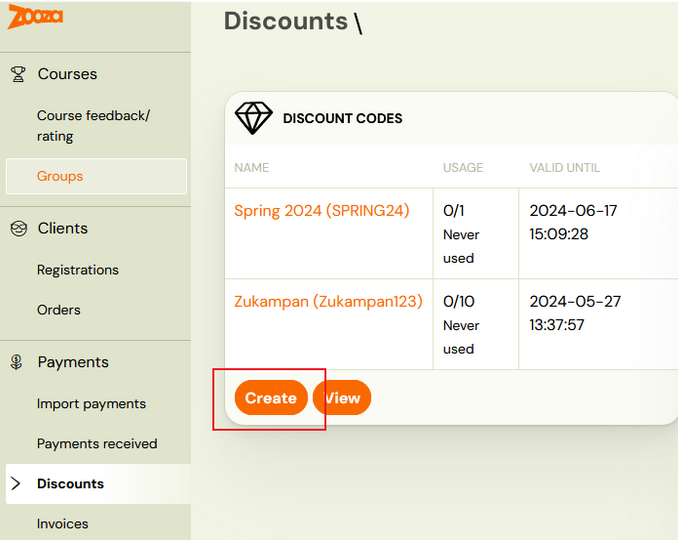
- Enter:
- name under which you will register it in the application
- code that you will provide to your clients, which they will enter into the registration form
- the number of uses of the code if you want to limit the
 number of uses. In case you do not want to limit the code to the number
 of uses, leave the setting to 0.
- discount amount
- absolute
- percentage - in this case you have the option to set a limit, which is applied as the maximum value of the discount granted

code validity

Set the conditions where the code can be applied by clicking the *Change* button

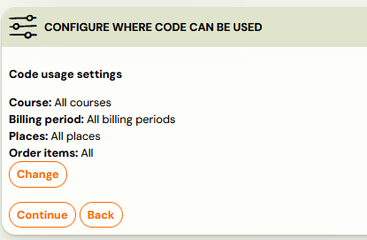

You can apply the code in:

- Programmes
- Billing periods
- Locations
- Products

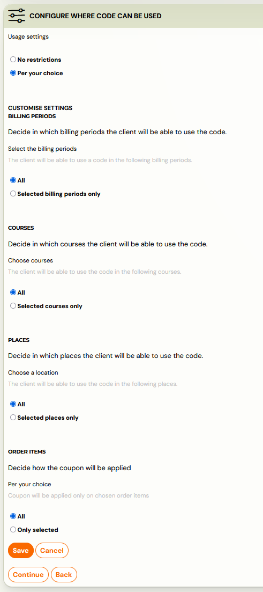

Attention! Remember to save your choice before proceeding to the next step.

 6. To finish creating the code, press *Start* to confirm your settings.

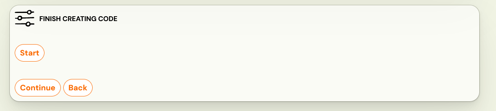

In the next step, Zooza will allow you to look at the created code as
 a whole, where you will see basic information as well as a graph of
usage or number of uses.
 In this section you have the option to change the code if you decide to use different settings.

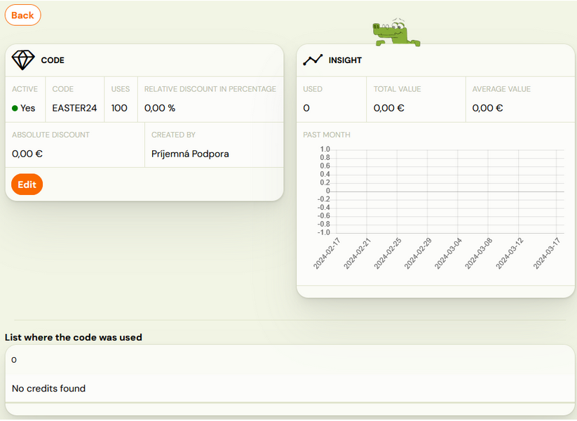

## Client use of discount code

The discount code can only be applied through the registration form located on your website.
 The client simply applies the code at booking by entering it and
can immediately check the amount of the discount you have given them.

Note: The discount code cannot be used in the product
form, the discount is only valid for programme booking, it does not
affect products.

## Where can I see the discount code in Zooza?

1. Booking level
2. In a specific client booking in *Payments* section
 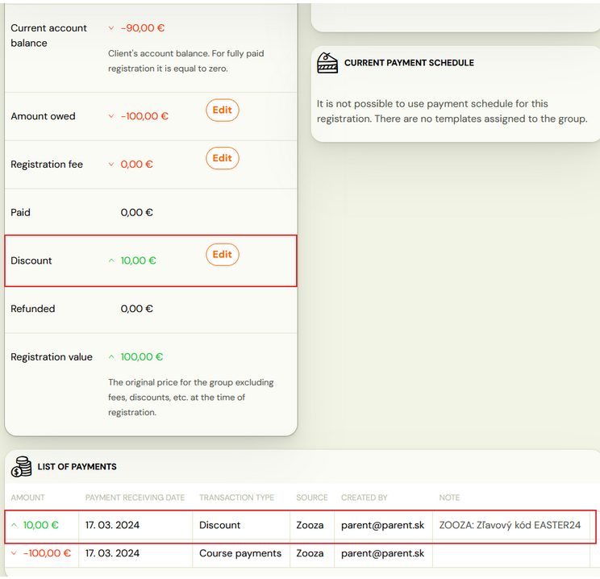
3. In *Credits and replacement sessions* section – when you click on the *More *button, you will see the name of the code applied at booking.
 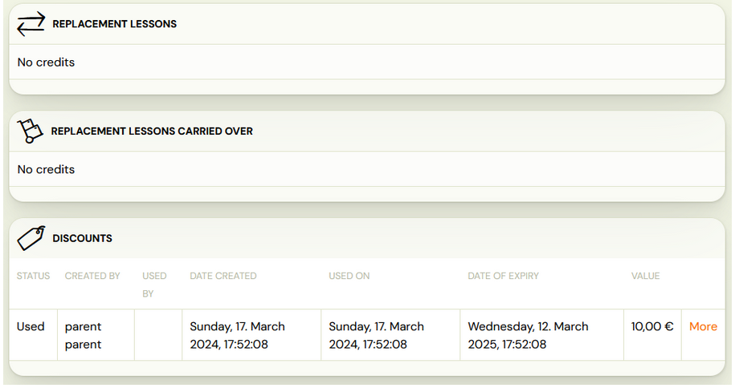

Client level

1. At the bottom of the client overview, you have the option to see all the
 credits associated with the client. One of the entries is also a
discount code that will appear after a client registered for a programme.
 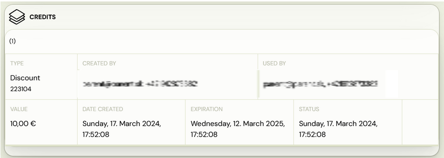

Discount level

1. In the *Payments *category of the *Discounts* section, you
 have a view of the code redemption in its summary – when and where it
was redeemed, how many codes were redeemed, and at what value.
2. In order to see the discount code overview click on the name of the discount code:
 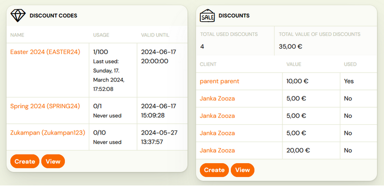
3. You will then see a detailed code report – setup detail,insight graph and list where the code was used.
 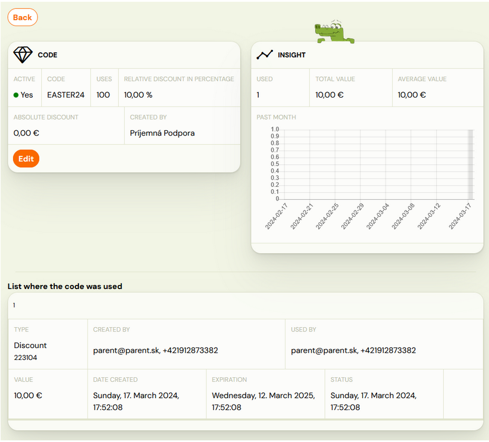
