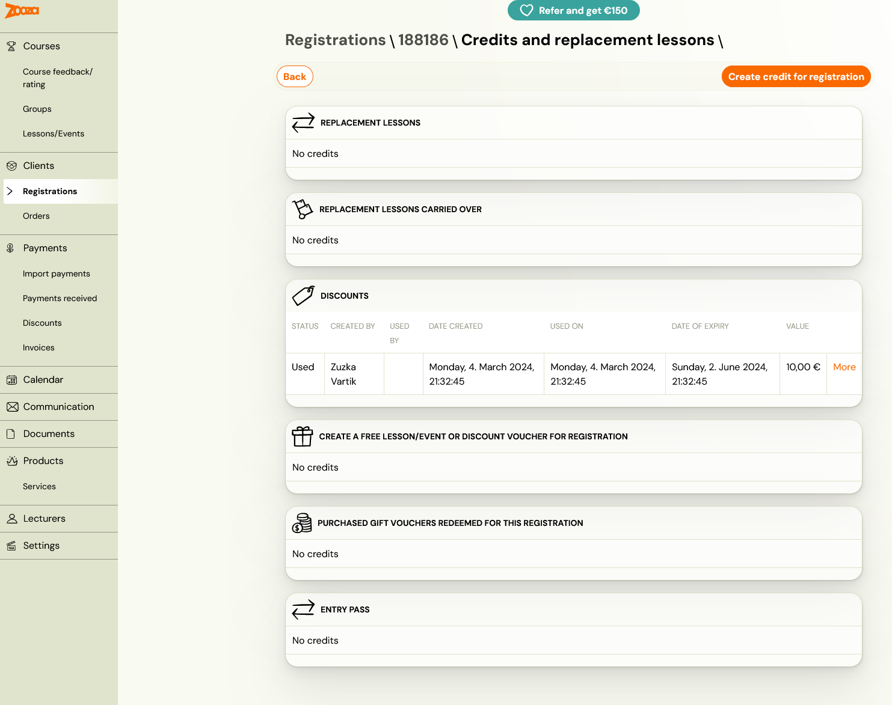
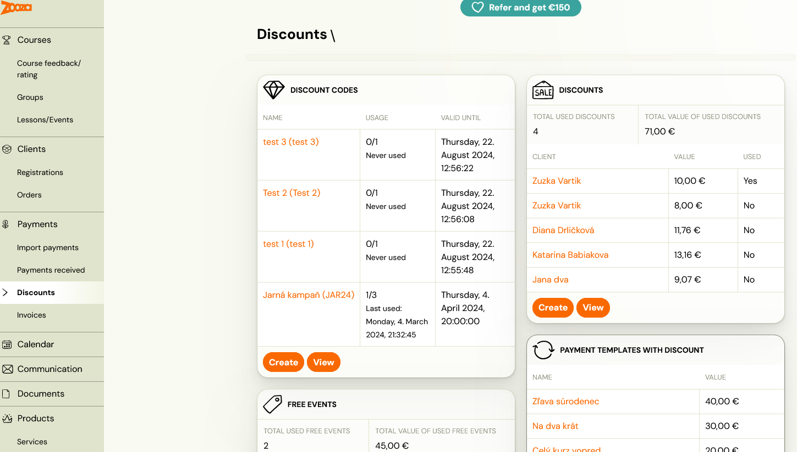
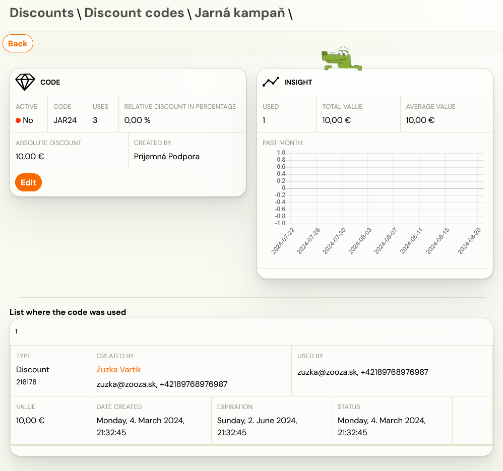

# Discount types

Within the app, you have the option to work with different types of discounts:

## Discount coupon

Discount coupon works as a gift card that clients can use for their loved ones or the organisation for their clients as a discount on their next booking. Follow instructions on how to enter a credit follow the instructions in How to work with credits?

## Free of charge session/session

Free of charge session/session works as replacement session for the client for your services. For instructions follow How to work with credits?

Application: In case you have a client you want to give a discount to, you give them an appointment/session on an already created booking.

## Discount code

Discount code is a code containing information such as discount and a form of discount (absolute value/relative value) chosen by you. It can be reused by all users (clients) who know the code. For instructions on how to enter a new discount code, follow instructions.

Application: You want to run a campaign and use influencer networks to do it. You generate a discount code of your choice and come up with an easy-to-remember code that you publish via influencer.

## Booking discount

This type of a discount is useful, when used on an existing booking of a client.
For more information read the manual HERE.

Application: In case you have a client, you want to give a discount to, you give them individual discount on an already created regi

## Payment template discount

Another way to redeem the discount is through payment types. Thus, by creating a new payment type, such as one-time or monthly discount, and then setting it up at booking or entering it in the registration form.

Note: This type can be applied ONLY for programmes that have a booking type of Continuous – per term. How to create payment templates can be found in HERE

Application: You want to provide different options for clients to pay for your programmes – one-off, quarterly and annual. In order to motivate clients to pay the entire programme upfront and therefore choose the annual payment, discount it.

## Gift voucher

This type of product is created as a product and can therefore be sold via the product form or via the client profile. It serves as a voucher that clients can use for their loved one. To enter the voucher, follow the instructions in How to work with credits?

Application: During Christmas time, create a voucher with different discount amounts and offer it to clients for sale in the product form or within their profile. Clients will then be able to purchase the voucher and gift the code from it to their loved ones to enroll them in your programmes.

## Where can I find discounts?

You can set up discounts in two places within the app. However, there is a difference on how you look at them.

## Client booking

At the booking level, you can manage and view client discounts/credits in Credits and replacement sessions. This view is very individual and you can only see specific discount and credits that a given client has used. We recommend working with discounts/credits at this level when you want to address a specific client and their individual needs on a programme.

## Category Discounts

At the discounts level in the *Payments *section, you have the option to look at discounts as a whole. This means you get an overview of where, how much and at what value discounts have been applied. This can be used as a report of all discounts and is recommended if you want to have an overview of the total use of discounts as such.

