# Documents

Zooza offers the ability to insert and manage different types of documents. This functionality allows users to upload documents in formats such as PDF and Word, insert URLs for online meetings (e.g. Google meetings) or insert videos. The goal of this feature is to make it easier to organize and share important files and information directly through the app, making communication and collaboration more efficient. All documents shared in this way can be found in the client's profile, where they are always available.

Documents are set up on these in the Documents section and can be used at the following levels:

1. Class level
2. Session level
3. Booking level

## 1. Document management

To add new documents, you need to enter the *Documents *section in the left menu of the application, where you will get an overview of all the documents you have uploaded so far.

1. To add a new one, just click on *Add New.*
 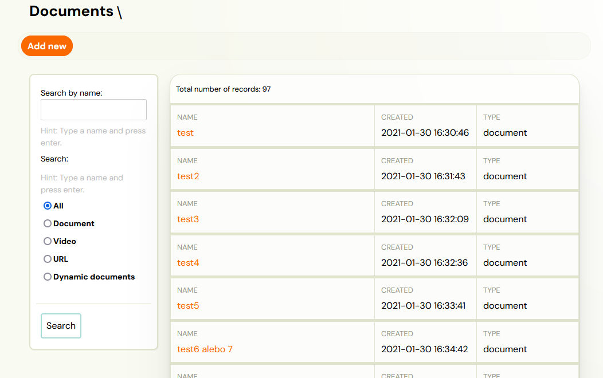
2. You have the option to add:
3. Document
4. Video
5. URL
6. Dynamic document
 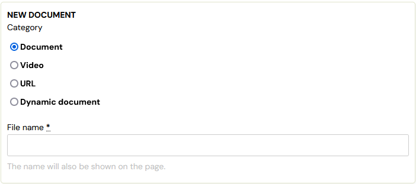

## Document

To insert a new document, enter the title and the document itself that you want to offer to clients later. You cannot edit this document further in the application, which means that once uploaded, you have the option to share it to clients in the state you saved it in the application. This can be various teaching materials, manuals, images. Click *Browse *to select the file you want to upload to the app and then click *Upload*. If you are uploading a file again, you will overwrite the previous one.

The document can be in all formats, including formats for images.

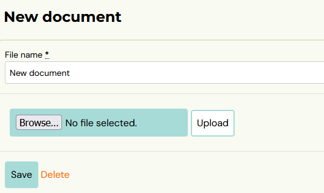

## Video

The app allows you to embed videos in all available formats, which you can use to inform participants about programme content, important instructions, or to share recordings of sessions for further training or refresher sessions. This functionality provides a flexible way to better communicate and share content with clients.

1. As with uploading documents, upload a video by clicking Browse and then Upload.
 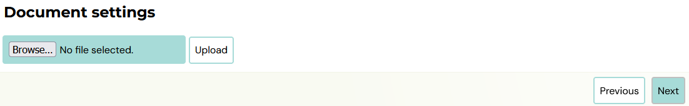
2. A confirmation message lets you know if you've successfully uploaded the video to the app, and you can click *Next *to see the detail and current status of the video.
 
3. In the last section, check the settings of the video and its preview image. The preview image of the video is then displayed in the client's profile. Clicking on it will start the video.
 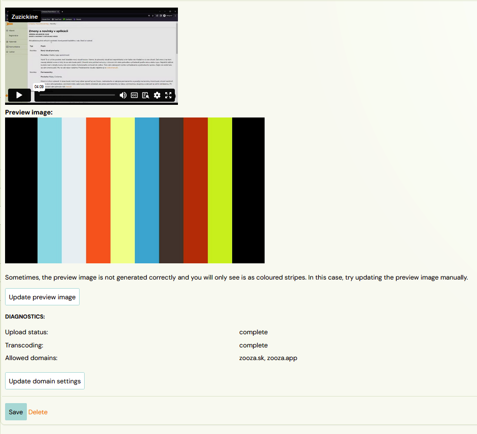

## URL

URL links are most commonly used to share online programmes, articles or videos. You can also embed links using dynamic tags that allow you to customize the URL for specific communications, such as online meetings via Google Meet. In this case, the dynamic tag identifies a unique part of the URL for the correct meetup. For more information on exactly how to work with this functionality, see *Using a link with a dynamic tag *in this manual section below. If you don't want to use dynamic tags, simply enter the desired URL in the *New URL Link* field, which you then share with clients, and click *Next*.

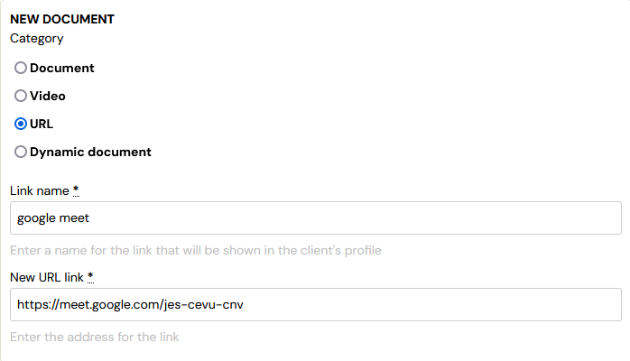

### Using a link with a dynamic tag

The dynamic tag link insertion functionality allows you to create personalized links for different classes or individual bookings. This option is ideal when you need to share a unique link to a meeting, save folder, or any other digital content. The dynamic tag in the link automatically customizes to each booking or class, ensuring that everyone gets a unique and relevant link without the need for manual editing. This is handy when organizing various online sessions such as Zoom meetings or when sharing private documents. You can find the full list of dynamic tags [here](dynamic-tags.md).
To use a dynamic tag, follow these steps:

1. In the *New URL link* field, enter a URL with a dynamic tag.
 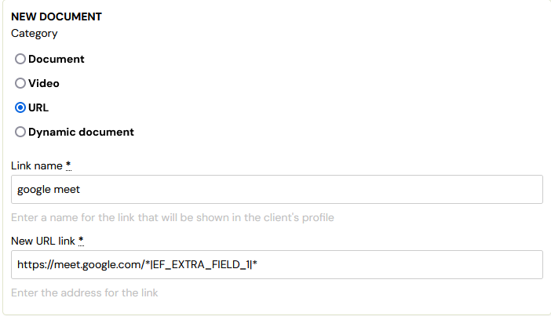
2. At the class level insert, enter the URL.
 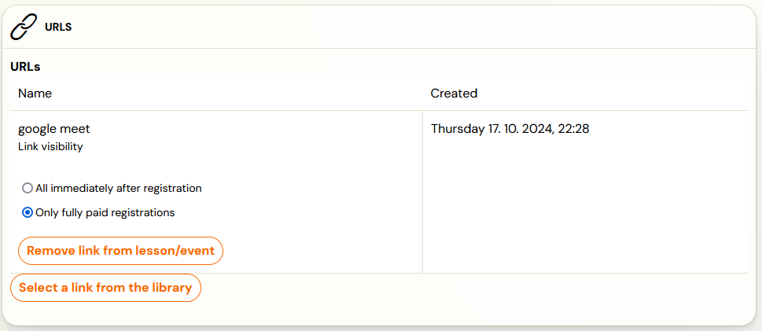
3. In the *additional field *in the booking form, fill in the dynamic tag part at the booking level.
 

## Dynamic document

We recommend using this functionality to generate documents such as payment receipts or receipts for the needs of the end client's insurance company or employer.Therefore, dynamic documents can only be generated at the booking level. In this section you only create a template for the document. Its final form is generated only at booking (see Inserting a document at booking level).

The function is used to generate PDF documents that can contain:

1. Company logo
2. Company name
3. Text according to the specific requirements
4. Dynamic tags

### Dynamic document creation

 1. In the *Documents* section, click *Add New *and select *Dynamic Document.*

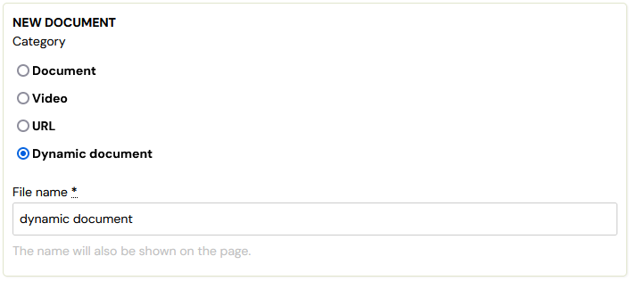

 2. Create a name and press *Next *to access the details of the document.

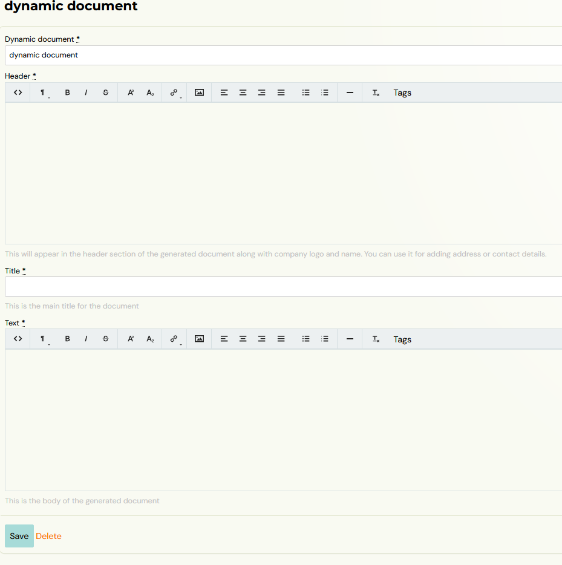

 a. In the *Header *section, you need to list the company's details.

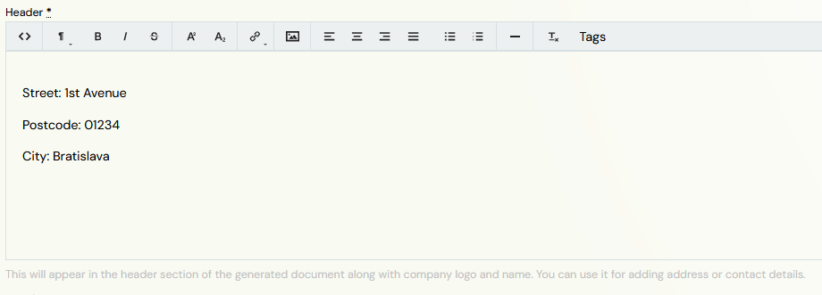

Note: The company logo and name is automatically generated in the header without manually adding it to the template. It needs to be inserted in the *General Settings* of the application to be filled in the document.

 b. *The document name *is the field that will be displayed to the client in the profile and in the application. This name can be different than the dynamic document name that was set when the document was created. You can use dynamic tags with programme/class name and others in this field.

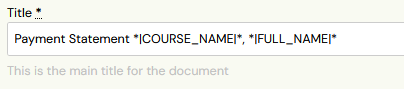

 c. In the *Text *section, you enter all the information you need to pass on to the client. Since these documents are for client use only, we recommend using dynamic tags to automatically retrieve information about the client themselves and their booking. The full list of tags can be found [here](dynamic-tags.md).

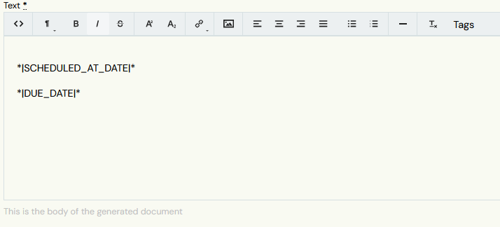

## 2. Adding documents at class level

You can assign documents that you have already created at the class level. You can do this in the details of the selected class in the *Documents *tile.

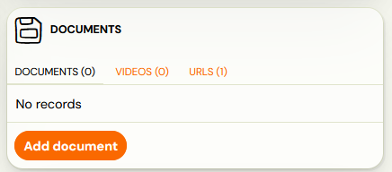

Warning! You cannot assign dynamic documents at the class level. This feature is only available at the booking level.

1. In the tile, select what exactly you need to select - Documents, Videos, URLs. In case of documents and URLs you can only assign digital content from the library, in case of videos you can also upload new content directly at this level.
 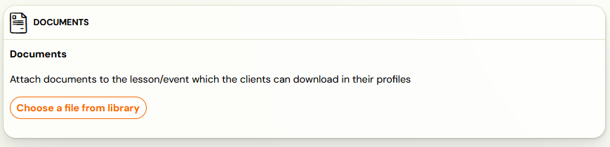
2. For selected documents, you can set when they are shown to bookings.
 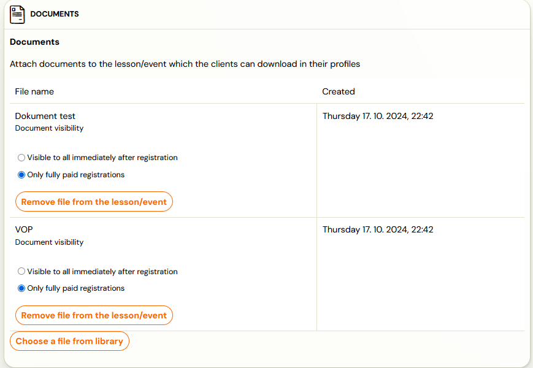

## 3. Adding documents at session/session level

The last option where you can assign digital content is at the session level. This works in the same way as assigning to a class or booking. In the *Documents *tile, add the ones you want to offer to clients directly on the term.

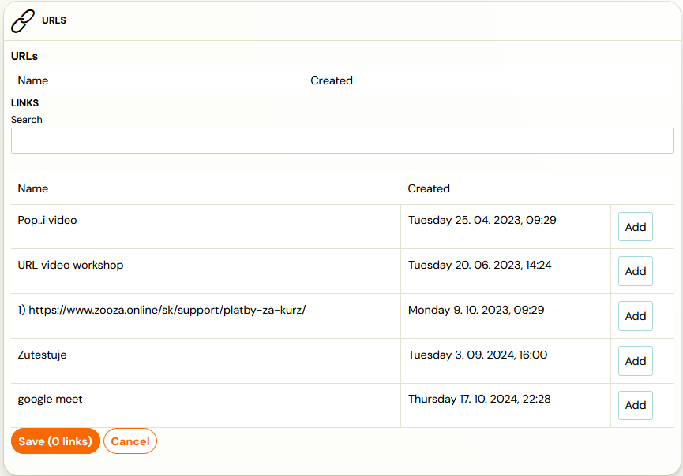

Warning. Clients only see these documents in their profile after the session has taken place.

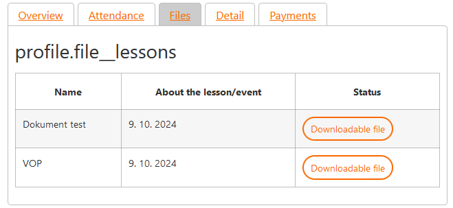

## 4. Adding documents at booking level

If you only want to provide digital content to a single booking, you can achieve this in the booking details in the Documents tile. You can also assign dynamic documents at the booking level.

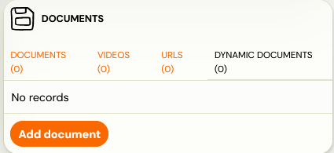

Select which document you want to send to the client from the drop down list and press *Generate*. You will be shown the generated document, which can be downloaded and, if you are not satisfied with it, deleted.

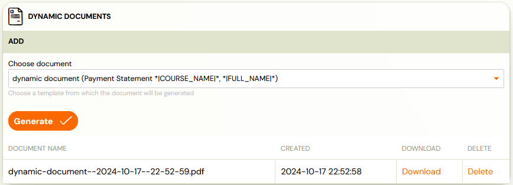

For example, the document with the dynamic tags used might look like this:

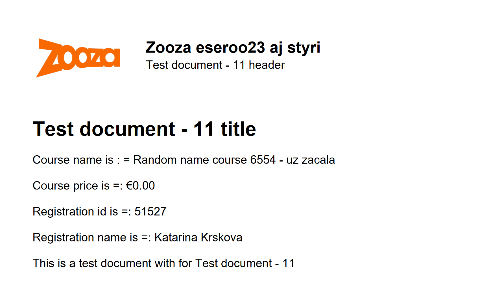
