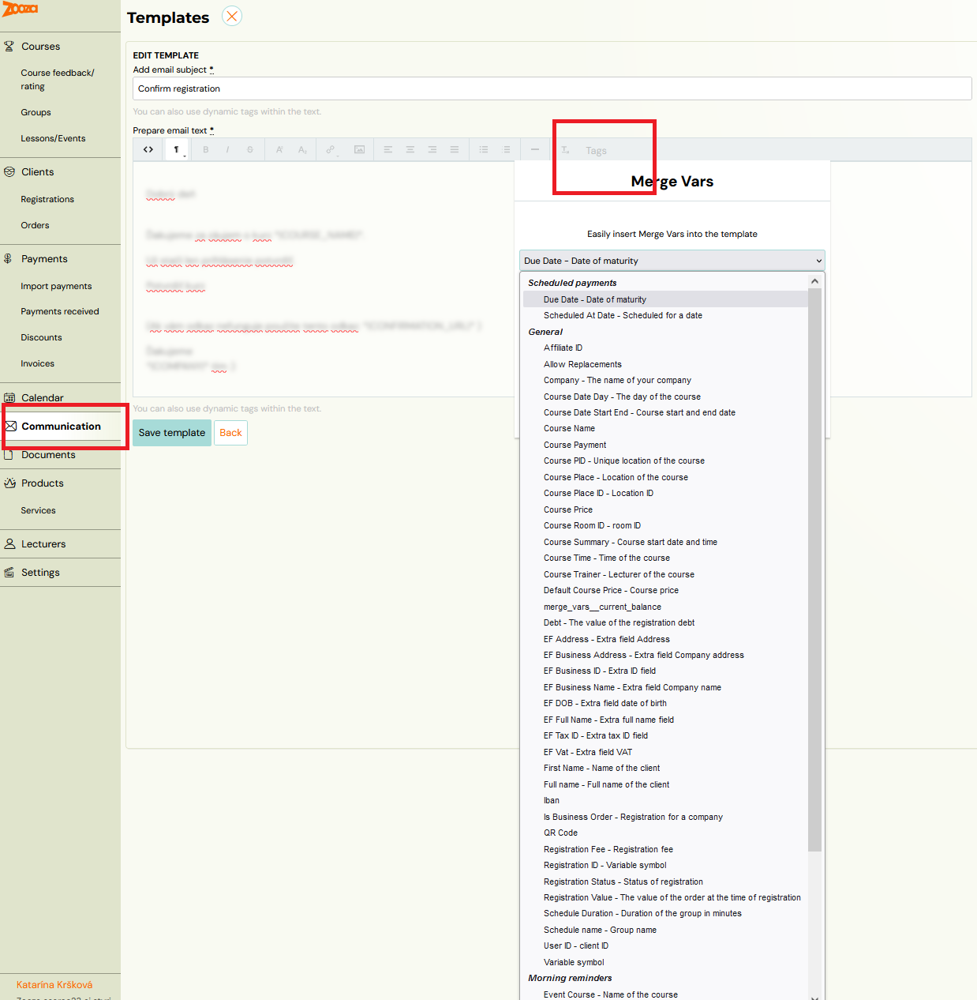

# Dynamic tags

When creating templates, Zooza provides dynamic tags to speed up communication with your clients. These tags pull specific information -- such as programme name, time, and location -- into emails automatically, keeping communication relevant without manual effort.

You can add dynamic tags via the **Tags** icon in the text formatting panel. Clicking the icon shows a full list of dynamic tags with explanations.

> **Attention!** Some dynamic tags can only be applied to certain templates. Take care when selecting the template and the tags.

## For bookings

Each email sent for a specific booking allows you to dynamically fill in client data. At the time the email is sent, Zooza replaces these tags with specific values.

| Dynamic tag | Definition | Example |
|---|---|---|
| `*\|COURSE_PRICE\|*` | Current programme price. If the class has its own price, the class price is used. | 20.00 EUR |
| `*\|REGISTRATION_VALUE\|*` | Value of the booking at the time of creation. Shows the original full amount. | 20.00 EUR |
| `*\|AFFILIATE_ID\|*` | ID of the partner who facilitated the booking | 12345 |
| `*\|REGISTRATION_ID\|*` | Booking number | 12345 |
| `*\|REGISTRATION_STATUS\|*` | Booking status | registered |
| `*\|REGISTRATION_FEE\|*` | Registration fee. If not listed on the booking, it is taken from the programme. | 30 EUR |
| `*\|VARIABLE_SYMBOL\|*` | Variable symbol used for payment. Typically the booking number. | 12345 |
| `*\|COMPANY\|*` | Your company name | My company Ltd. |
| `*\|COURSE_PLACE\|*` | Programme location. Composed of room and location data. | Big hall, Free time center, 323 Green Lane, Edinburgh |
| `*\|COURSE_PLACE_ID\|*` | Location ID | 123 |
| `*\|COURSE_ROOM_ID\|*` | Room ID | 456 |
| `*\|COURSE_PID\|*` | Unique combination of location and room | 123_456 |
| `*\|COURSE_NAME\|*` | Programme name -- class name | Exercising with babies -- MINI1 |
| `*\|COURSE_DATE_DAY\|*` | Day of the programme | Monday |
| `*\|COURSE_SUMMARY\|*` | Start time of the programme together with the date | 13. 5. -- 13.9.2023 at 15:00 |
| `*\|COURSE_TIME\|*` | Programme start time | 14:00 |
| `*\|COURSE_PAYMENT\|*` | Programme price derived from booking. If none on booking, the programme price is used. | 135 EUR |
| `*\|CURRENT_BALANCE\|*` | Current balance on the client's booking. Can be positive or negative. | -30 EUR |
| `*\|SCHEDULE_DURATION\|*` | Programme duration in hours | 15:00 |
| `*\|SCHEDULE_NAME\|*` | Class name (without programme name) | Butterflies, tuesdays at 17:00 |
| `*\|SCHEDULED_AT_DATE\|*` | Date when the instalment (debt) is due on the booking | 10 |
| `*\|FIRST_NAME\|*` | Client name | John |
| `*\|QR_CODE\|*` | QR code for payment. Requires: amount due on booking, IBAN and SWIFT on programme/company. | Picture with QR code |
| `*\|IBAN\|*` | Bank account for payment. If specified at the programme level, that value is used. | GB54BARC20039545449825 |
| `*\|COURSE_DATE_START_END\|*` | Start and end date of the programme | 14. 5. 2022 -- 14. 8. 2022 |
| `*\|COURSE_TRAINER\|*` | Instructor's name | John Winslow |
| `*\|USER_ID\|*` | Client user ID | 12345 |
| `*\|WIDGET_VIDEO_URL\|*` | URL to view the video | `https://www.zooza.sk/video?token=12345` |
| `*\|WIDGET_PROFILE_URL\|*` | URL to view profile | `https://www.zooza.sk/profil?token=12345` |
| `*\|EF_DOB\|*` | Extra field -- date of birth | 13. 4. 2000 |
| `*\|EF_FULL_NAME\|*` | Extra field -- full name | John Winslow |
| `*\|EF_ADDRESS\|*` | Extra field -- address | 65 Wood Lane, Bristol |
| `*\|EF_BUSINESS_NAME\|*` | Extra field -- company name | Zooza |
| `*\|EF_BUSINESS_ADDRESS\|*` | Extra field -- company address | 65 Wood Lane, Bristol |
| `*\|EF_BUSINESS_ID\|*` | Extra field -- ID number | 123456 |
| `*\|EF_TAX_ID\|*` | Extra field -- TIN | 1234546 |
| `*\|EF_VAT\|*` | Extra field -- VAT ID number | 123456 |
| `*\|IS_BUSINESS_ORDER\|*` | Whether a booking is on a company or not | 1 |
| `*\|TURN_OFF_EVENT_NOTIFICATIONS_URL\|*` | URL to turn off morning notifications. Works only in the Morning Reminders template. | |
| `*\|CANCELED_CONFIRMATION_URL\|*` | URL for opting out from the term. Works only in the Morning Reminders template. | |
| `*\|ALLOW_REPLACEMENTS\|*` | Whether make-up sessions are available for the booking | 1 |
| `*\|FULL_NAME\|*` | Client's full name | Raymond Robbins |
| `*\|EVENT_NAME\|*` | Name of the term (not the programme or class). Available for term reminder only. | Individual session, Cambridge |
| `*\|EVENT_DATE\|*` | Date of the term. Available for term reminder only. | 14. 5. 2021 |
| `*\|EVENT_PLACE\|*` | Venue of the term. Works only in the Morning Reminders template. | Big hall, Free time center, 323 Green Lane, Edinburgh |
| `*\|EVENT_DATE_DAY\|*` | Day of the term. Available for term reminder only. | Monday |
| `*\|EVENT_TIME\|*` | Term time. Available for term reminder only. | 14:30 |
| `*\|EVENT_COURSE\|*` | Programme name for the term. Available for term reminder only. | Summer camp 07/2023 |
| `*\|EVENT_TRAINER\|*` | Main instructor name at the session/session level. Available for upcoming session/session notification. | Suzan Winslow |
| `*\|DEFAULT_COURSE_PRICE\|*` | Programme price if class price is 0; otherwise the class price. | 34.43 EUR |
| `*\|DEBT\|*` | Debt value on booking. If no debt, displays the same as `DEFAULT_COURSE_PRICE`. | 100 EUR |
| `*\|DUE_DATE\|*` | Due date for payment | 33 EUR |

## Conditioning tags

You can use conditional tags in templates. For example, if you accept business orders, you can add a conditional block to confirm to the client that you are recording their booking as a business and will send them an invoice shortly.

| Tag name | Definition | Application |
|---|---|---|
| `IF` | If the condition is true | `*\|IF:BUSINESS_ORDER\|*` Content `*\|END:IF\|*` |
| `ELSE` | Otherwise | `*\|IF:BUSINESS_ORDER\|*` content if yes `*\|ELSE:\|*` content if not `*\|END:IF\|*` |
| `ELSEIF` | Or if | `*\|IF:BUSINESS_ORDER\|*` content if yes `*\|ELSEIF:REGISTRATION_STATUS=registered\|*` content if status `*\|ELSE:\|*` content if not `*\|END:IF\|*` |
| `IFNOT` | If it is not | `*\|IFNOT:BUSINESS_ORDER\|*` Content `*\|END:IF\|*` |

### Comparison operators

| Tag | Definition |
|---|---|
| `=` | Equals |
| `!=` | Does not equal |
| `>` | Greater than |
| `<` | Less than |
| `>=` | Greater than or equal |
| `<=` | Less than or equal |
