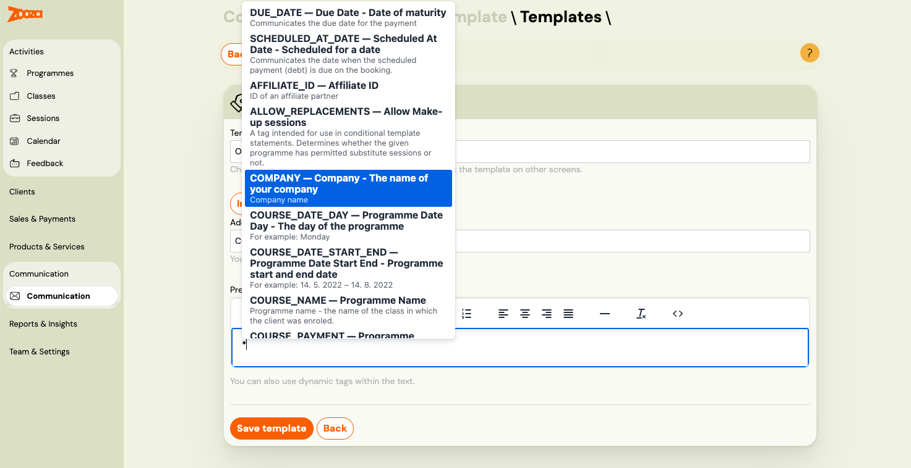

# Dynamic tags

When creating templates, Zooza provides dynamic tags to speed up communication with your clients. These tags pull specific information — such as programme name, time, and location — into emails automatically, keeping communication relevant without manual effort.

## How to insert dynamic tags

**Option 1 — Autocomplete (fastest):** Type `*` anywhere in the email body or subject line. A dropdown appears with all tags available for that template. Start typing to filter the list, then click to insert.

**Option 2 — Tags panel:** Click the **Tags** icon in the text formatting toolbar. A full list of available dynamic tags with explanations opens — click any tag to insert it.

**Option 3 — Copy and paste:** Open **Instructions and a complete list of tags** (link below the subject/body field in the template editor) and copy the tag text directly, for example `*|FIRST_NAME|*`.

> **Note:** Not all tags work in every template. The autocomplete and Tags panel only show tags valid for the current template type. Using a tag in the wrong template will result in a blank value in the sent email.

## For bookings

Each email sent for a specific booking allows you to dynamically fill in client data. At the time the email is sent, Zooza replaces these tags with specific values.

| Dynamic tag                                                         | Definition                                                                                 | Example                                               |
| ------------------------------------------------------------------- | ------------------------------------------------------------------------------------------ | ----------------------------------------------------- |
| <code>&#42;&#124;COURSE_PRICE&#124;&#42;</code>                     | Current programme price. If the class has its own price, the class price is used.          | 20.00 EUR                                             |
| <code>&#42;&#124;REGISTRATION_VALUE&#124;&#42;</code>               | Value of the booking at the time of creation. Shows the original full amount.              | 20.00 EUR                                             |
| <code>&#42;&#124;AFFILIATE_ID&#124;&#42;</code>                     | ID of the partner who facilitated the booking                                              | 12345                                                 |
| <code>&#42;&#124;REGISTRATION_ID&#124;&#42;</code>                  | Booking number                                                                             | 12345                                                 |
| <code>&#42;&#124;REGISTRATION_STATUS&#124;&#42;</code>              | Booking status                                                                             | registered                                            |
| <code>&#42;&#124;REGISTRATION_FEE&#124;&#42;</code>                 | Booking fee. If not listed on the booking, it is taken from the programme.                 | 30 EUR                                                |
| <code>&#42;&#124;VARIABLE_SYMBOL&#124;&#42;</code>                  | Variable symbol used for payment. Typically the booking number.                            | 12345                                                 |
| <code>&#42;&#124;COMPANY&#124;&#42;</code>                          | Your company name                                                                          | My company Ltd.                                       |
| <code>&#42;&#124;COURSE_PLACE&#124;&#42;</code>                     | Programme location. Composed of room and location data.                                    | Big hall, Free time center, 323 Green Lane, Edinburgh |
| <code>&#42;&#124;ONLINE_MEETING_LINK&#124;&#42;</code>              | Clickable link to the online meeting room (e.g. Zoom, Teams) configured on the class. Renders as an `<a>` tag. | Join Zoom meeting                                     |
| <code>&#42;&#124;ONLINE_MEETING_URL&#124;&#42;</code>               | Raw URL of the online meeting room configured on the class. Use when you want to embed the link yourself. | https://zoom.us/j/12345                               |
| <code>&#42;&#124;HAS_ONLINE_MEETING&#124;&#42;</code>               | Returns `1` if an online meeting is linked to the class, `0` if not. Use with `*\|IF:HAS_ONLINE_MEETING\|*` to include meeting details only when relevant. | 1                                                     |
| <code>&#42;&#124;PLACE_DIRECTIONS&#124;&#42;</code>                 | Directions text for the venue, pulled from the venue settings.                             | Take bus 42 to Central Station                        |
| <code>&#42;&#124;PLACE_MAP&#124;&#42;</code>                        | Map image or embed for the venue, pulled from the venue settings.                          |                                                       |
| <code>&#42;&#124;COURSE_PLACE_ID&#124;&#42;</code>                  | Location ID                                                                                | 123                                                   |
| <code>&#42;&#124;COURSE_ROOM_ID&#124;&#42;</code>                   | Room ID                                                                                    | 456                                                   |
| <code>&#42;&#124;COURSE_PID&#124;&#42;</code>                       | Unique combination of location and room                                                    | 123_456                                               |
| <code>&#42;&#124;COURSE_NAME&#124;&#42;</code>                      | Programme name -- class name                                                               | Exercising with babies -- MINI1                       |
| <code>&#42;&#124;COURSE_DATE_DAY&#124;&#42;</code>                  | Day of the programme                                                                       | Monday                                                |
| <code>&#42;&#124;COURSE_DATE&#124;&#42;</code>                      | Start date of the first session in the programme.                                          | 14. 5. 2022                                           |
| <code>&#42;&#124;COURSE_SUMMARY&#124;&#42;</code>                   | Start time of the programme together with the date                                         | 13. 5. -- 13.9.2023 at 15:00                          |
| <code>&#42;&#124;COURSE_TIME&#124;&#42;</code>                      | Programme start time                                                                       | 14:00                                                 |
| <code>&#42;&#124;COURSE_PAYMENT&#124;&#42;</code>                   | Programme price derived from booking. If none on booking, the programme price is used.     | 135 EUR                                               |
| <code>&#42;&#124;CURRENT_BALANCE&#124;&#42;</code>                  | Current balance on the client's booking. Can be positive or negative.                      | -30 EUR                                               |
| <code>&#42;&#124;CURRENT_BALANCE_ABS&#124;&#42;</code>              | Absolute value of the current balance — shown without a minus sign. Useful in sentences like "You owe X EUR". | 30 EUR                                                |
| <code>&#42;&#124;PAID&#124;&#42;</code>                             | Total amount paid on the booking so far.                                                   | 100 EUR                                               |
| <code>&#42;&#124;PAYMENT_STATUS&#124;&#42;</code>                   | Payment status of the booking. Possible values: `unpaid`, `partial`, `paid`.               | partial                                               |
| <code>&#42;&#124;SCHEDULE_DURATION&#124;&#42;</code>                | Programme duration in hours                                                                | 15:00                                                 |
| <code>&#42;&#124;SCHEDULE_NAME&#124;&#42;</code>                    | Class name (without programme name)                                                        | Butterflies, tuesdays at 17:00                        |
| <code>&#42;&#124;SCHEDULED_AT_DATE&#124;&#42;</code>                | Date when the scheduled payment (debt) is due on the booking                               | 10                                                    |
| <code>&#42;&#124;FIRST_NAME&#124;&#42;</code>                       | Client name                                                                                | John                                                  |
| <code>&#42;&#124;DOWNPAYMENT&#124;&#42;</code>                      | Downpayment (deposit) amount set on the booking. Use this to show the deposit sum as text in your email template. | 50 EUR                                                |
| <code>&#42;&#124;DOWNPAYMENT_DUE_DATE&#124;&#42;</code>             | Due date for the downpayment. Only populated when a downpayment is set on the booking.     | 31. 5. 2022                                           |
| <code>&#42;&#124;HAS_DOWNPAYMENT&#124;&#42;</code>                  | Returns `1` if a downpayment amount is set on the booking, `0` if not. Use with `*\|IF:HAS_DOWNPAYMENT\|*` to show deposit-related content only when applicable. | 1                                                     |
| <code>&#42;&#124;HAS_UNPAID_DOWNPAYMENT&#124;&#42;</code>           | Returns `1` if the downpayment has not yet been paid, `0` if it has been paid. Use with `*\|IF:HAS_UNPAID_DOWNPAYMENT\|*`. | 1                                                     |
| <code>&#42;&#124;QR_CODE&#124;&#42;</code>                          | QR code for the full payment amount due on the booking. Requires: IBAN and SWIFT on programme/company. | Picture with QR code                                  |
| <code>&#42;&#124;QR_CODE_DOWNPAYMENT&#124;&#42;</code>              | QR code for the downpayment amount. Same conditions as QR Code, but generates a code for the downpayment sum instead of the full balance. | Picture with QR code                                  |
| <code>&#42;&#124;IBAN&#124;&#42;</code>                             | Bank account for payment. If specified at the programme level, that value is used.         | GB54BARC20039545449825                                |
| <code>&#42;&#124;COURSE_DATE_START_END&#124;&#42;</code>            | Start and end date of the programme                                                        | 14. 5. 2022 -- 14. 8. 2022                            |
| <code>&#42;&#124;COURSE_TRAINER&#124;&#42;</code>                   | Instructor's name                                                                          | John Winslow                                          |
| <code>&#42;&#124;USER_ID&#124;&#42;</code>                          | Client user ID                                                                             | 12345                                                 |
| <code>&#42;&#124;WIDGET_VIDEO_URL&#124;&#42;</code>                 | URL to view the video                                                                      | `https://www.zooza.sk/video?token=12345`              |
| <code>&#42;&#124;WIDGET_PROFILE_URL&#124;&#42;</code>               | URL to view profile                                                                        | `https://www.zooza.sk/profil?token=12345`             |
| <code>&#42;&#124;EF_DOB&#124;&#42;</code>                           | Extra field -- date of birth                                                               | 13. 4. 2000                                           |
| <code>&#42;&#124;EF_IDENTIFICATION_NUMBER&#124;&#42;</code>         | Extra field -- identification number (birth number, national ID, etc.)                     | 900101/1234                                           |
| <code>&#42;&#124;EF_FULL_NAME&#124;&#42;</code>                     | Extra field -- full name                                                                   | John Winslow                                          |
| <code>&#42;&#124;EF_CITIZENSHIP&#124;&#42;</code>                   | Extra field -- citizenship (ISO 3166-1 alpha-2 country code)                               | SK                                                    |
| <code>&#42;&#124;EF_EXTRA_FIELD_1&#124;&#42;</code>                 | Custom field 1                                                                             |                                                       |
| <code>&#42;&#124;EF_EXTRA_FIELD_2&#124;&#42;</code>                 | Custom field 2                                                                             |                                                       |
| <code>&#42;&#124;EF_EXTRA_FIELD_3&#124;&#42;</code>                 | Custom field 3                                                                             |                                                       |
| <code>&#42;&#124;EF_EXTRA_FIELD_4&#124;&#42;</code>                 | Custom field 4                                                                             |                                                       |
| <code>&#42;&#124;EF_EXTRA_FIELD_5&#124;&#42;</code>                 | Custom field 5                                                                             |                                                       |
| <code>&#42;&#124;EF_EXTRA_FIELD_6&#124;&#42;</code>                 | Custom field 6                                                                             |                                                       |
| <code>&#42;&#124;EF_EXTRA_FIELD_7&#124;&#42;</code>                 | Custom field 7                                                                             |                                                       |
| <code>&#42;&#124;EF_EXTRA_FIELD_8&#124;&#42;</code>                 | Custom field 8                                                                             |                                                       |
| <code>&#42;&#124;EF_EXTRA_FIELD_9&#124;&#42;</code>                 | Custom field 9                                                                             |                                                       |
| <code>&#42;&#124;EF_EXTRA_FIELD_10&#124;&#42;</code>                | Custom field 10                                                                            |                                                       |
| <code>&#42;&#124;EF_EXTRA_FIELD_11&#124;&#42;</code>                | Custom field 11                                                                            |                                                       |
| <code>&#42;&#124;EF_EXTRA_FIELD_12&#124;&#42;</code>                | Custom field 12                                                                            |                                                       |
| <code>&#42;&#124;EF_EXTRA_FIELD_13&#124;&#42;</code>                | Custom field 13                                                                            |                                                       |
| <code>&#42;&#124;EF_EXTRA_FIELD_14&#124;&#42;</code>                | Custom field 14                                                                            |                                                       |
| <code>&#42;&#124;EF_EXTRA_FIELD_15&#124;&#42;</code>                | Custom field 15                                                                            |                                                       |
| <code>&#42;&#124;EF_ADDRESS&#124;&#42;</code>                       | Extra field -- address                                                                     | 65 Wood Lane, Bristol                                 |
| <code>&#42;&#124;EF_BUSINESS_NAME&#124;&#42;</code>                 | Extra field -- company name                                                                | Zooza                                                 |
| <code>&#42;&#124;EF_BUSINESS_ADDRESS&#124;&#42;</code>              | Extra field -- company address                                                             | 65 Wood Lane, Bristol                                 |
| <code>&#42;&#124;EF_BUSINESS_ID&#124;&#42;</code>                   | Extra field -- ID number                                                                   | 123456                                                |
| <code>&#42;&#124;EF_TAX_ID&#124;&#42;</code>                        | Extra field -- TIN                                                                         | 1234546                                               |
| <code>&#42;&#124;EF_VAT&#124;&#42;</code>                           | Extra field -- VAT ID number                                                               | 123456                                                |
| <code>&#42;&#124;IS_BUSINESS_ORDER&#124;&#42;</code>                | Whether a booking is on a company or not                                                   | 1                                                     |
| <code>&#42;&#124;TURN_OFF_EVENT_NOTIFICATIONS_URL&#124;&#42;</code> | URL to turn off morning notifications. Works only in the Morning Reminders template.       |                                                       |
| <code>&#42;&#124;CANCELED_CONFIRMATION_URL&#124;&#42;</code>        | URL for canceling from the session. Works only in the Morning Reminders template.          |                                                       |
| <code>&#42;&#124;ALLOW_REPLACEMENTS&#124;&#42;</code>               | Whether make-up sessions are available for the booking                                     | 1                                                     |
| <code>&#42;&#124;FULL_NAME&#124;&#42;</code>                        | Client's full name                                                                         | Raymond Robbins                                       |
| <code>&#42;&#124;LAST_NAME&#124;&#42;</code>                        | Client's last name                                                                         | Robbins                                               |
| <code>&#42;&#124;EVENT_NAME&#124;&#42;</code>                       | Name of the session (not the programme or class). Available for session reminder only.     | Individual session, Cambridge                         |
| <code>&#42;&#124;EVENT_DATE&#124;&#42;</code>                       | Date of the session. Available for session reminder only.                                  | 14. 5. 2021                                           |
| <code>&#42;&#124;EVENT_PLACE&#124;&#42;</code>                      | Venue of the session. Available for session reminder only.                                 | Big hall, Free time center, 323 Green Lane, Edinburgh |
| <code>&#42;&#124;EVENT_ONLINE_MEETING_LINK&#124;&#42;</code>        | Clickable link to the online meeting room for the specific session. Available for session reminder only. | Join Zoom meeting                                     |
| <code>&#42;&#124;EVENT_ONLINE_MEETING_URL&#124;&#42;</code>         | Raw URL of the online meeting room for the specific session. Available for session reminder only. | https://zoom.us/j/12345                               |
| <code>&#42;&#124;EVENT_HAS_ONLINE_MEETING&#124;&#42;</code>         | Returns `1` if the specific session has an online meeting, `0` if not. Available for session reminder only. | 1                                                     |
| <code>&#42;&#124;EVENT_PLACE_DIRECTIONS&#124;&#42;</code>           | Directions text for the session venue. Available for session reminder only.                | Take bus 42 to Central Station                        |
| <code>&#42;&#124;EVENT_PLACE_MAP&#124;&#42;</code>                  | Map image or embed for the session venue. Available for session reminder only.             |                                                       |
| <code>&#42;&#124;EVENT_DATE_DAY&#124;&#42;</code>                   | Day of the session. Available for session reminder only.                                   | Monday                                                |
| <code>&#42;&#124;EVENT_TIME&#124;&#42;</code>                       | Session time. Available for session reminder only.                                         | 14:30                                                 |
| <code>&#42;&#124;EVENT_COURSE&#124;&#42;</code>                     | Programme name for the session. Available for session reminder only.                       | Summer camp 07/2023                                   |
| <code>&#42;&#124;EVENT_TRAINER&#124;&#42;</code>                    | Main instructor name at the session level. Available for upcoming session notification.    | Suzan Winslow                                         |
| <code>&#42;&#124;DEFAULT_COURSE_PRICE&#124;&#42;</code>             | Programme price if class price is 0; otherwise the class price.                            | 34.43 EUR                                             |
| <code>&#42;&#124;DEBT&#124;&#42;</code>                             | Debt value on booking. If no debt, displays the same as `DEFAULT_COURSE_PRICE`.            | 100 EUR                                               |
| <code>&#42;&#124;ORDER_SUMMARY&#124;&#42;</code>                    | Full summary of the booking including programme name, class, date, and price. Recommended for make-up sessions and block-based programmes where individual tags may show incorrect data. | Yoga Beginners -- Mondays at 10:00, 14. 5. 2022, 50 EUR |
| <code>&#42;&#124;BOOKING_URL&#124;&#42;</code>                      | URL to open the registration widget pre-filled for the client's class. Useful in trial follow-up emails to prompt full registration. | https://www.zooza.sk/registracia?schedule=123         |
| <code>&#42;&#124;WIDGET_REGISTRATION_URL&#124;&#42;</code>          | Base URL of the registration widget. Use to link clients back to the registration page.    | https://www.zooza.sk/registracia                      |
| <code>&#42;&#124;GOING_CONFIRMATION_URL&#124;&#42;</code>           | URL for the client to confirm their attendance. Use in attendance confirmation templates.  | https://www.zooza.sk/confirm?token=abc                |
| <code>&#42;&#124;UPCOMING_EVENTS&#124;&#42;</code>                  | Rendered list of upcoming sessions for the booking. Available in the Upcoming Events Notification template only. |                                                       |
| <code>&#42;&#124;TURN_OFF_UPCOMING_EVENTS_NOTIFICATIONS_URL&#124;&#42;</code> | URL to turn off upcoming event morning notifications. Available in the Upcoming Events Notification template only. |                                                 |
| <code>&#42;&#124;UNSUBSCRIBE&#124;&#42;</code>                      | URL to unsubscribe from all marketing emails.                                              | https://unsubscribe.zooza.sk/?token=abc               |
| <code>&#42;&#124;VOTING&#124;&#42;</code>                           | URL to open the feedback / rating form for the booking.                                    | https://feedback.zooza.app/#id=123                    |
| <code>&#42;&#124;CURDATE&#124;&#42;</code>                          | Today's date at the time the email is sent.                                                | 2. 4. 2026                                            |
| <code>&#42;&#124;NOW&#124;&#42;</code>                              | Current date and time at the moment the email is sent.                                     | 2. 4. 2026 14:30                                      |
| <code>&#42;&#124;DUE_DATE&#124;&#42;</code>                         | Due date for payment                                                                       | 33 EUR                                                |

## Conditional tags

You can use conditional tags in templates. For example, if you accept business orders, you can add a conditional block to confirm to the client that you are recording their booking as a business and will send them an invoice shortly.

| Tag name | Definition | Application |
|---|---|---|
| `IF` | If the condition is true | <code>&#42;&#124;IF:BUSINESS_ORDER&#124;&#42;</code> Content <code>&#42;&#124;END:IF&#124;&#42;</code> |
| `ELSE` | Otherwise | <code>&#42;&#124;IF:BUSINESS_ORDER&#124;&#42;</code> content if yes <code>&#42;&#124;ELSE:&#124;&#42;</code> content if not <code>&#42;&#124;END:IF&#124;&#42;</code> |
| `ELSEIF` | Or if | <code>&#42;&#124;IF:BUSINESS_ORDER&#124;&#42;</code> content if yes <code>&#42;&#124;ELSEIF:REGISTRATION_STATUS=registered&#124;&#42;</code> content if status <code>&#42;&#124;ELSE:&#124;&#42;</code> content if not <code>&#42;&#124;END:IF&#124;&#42;</code> |
| `IFNOT` | If it is not | <code>&#42;&#124;IFNOT:BUSINESS_ORDER&#124;&#42;</code> Content <code>&#42;&#124;END:IF&#124;&#42;</code> |

### Comparison operators

| Tag | Definition |
|---|---|
| `=` | Equals |
| `!=` | Does not equal |
| `>` | Greater than |
| `<` | Less than |
| `>=` | Greater than or equal |
| `<=` | Less than or equal |

## Known limitations and troubleshooting

### Tags in make-up sessions

When a client books a make-up session, tags like `*|COURSE_TIME|*`, `*|COURSE_DATE_DAY|*`, and `*|COURSE_PLACE|*` pull data from the **primary class's first session**, not the make-up session. This means the email may show incorrect time, day, or location for the make-up.

**Workaround:** Use `*|ORDER_SUMMARY|*` instead — it includes the correct session details for the specific booking context.

### Tags in block-based programmes

For programmes using blocks (term segments), `*|COURSE_DATE_DAY|*` and `*|COURSE_TIME|*` pull from the first session in the class, which may not match the client's enrolled block.

**Workaround:** Use `*|ORDER_SUMMARY|*` to display the correct block-specific information. A dedicated block-specific date tag is not yet available.

<!-- REVIEW: Monitor for a dedicated block-specific dynamic tag — it has been requested by multiple customers. -->

### Tags in order confirmation emails

Dynamic tags are **not fully supported** in order (product purchase) confirmation emails. Tags like `*|COURSE_NAME|*`, `*|COURSE_TIME|*`, etc. will not populate because orders are not linked to a specific class or session.

Only basic client tags (`*|FIRST_NAME|*`, `*|FULL_NAME|*`, etc.) work in order emails.

### Tags in subject lines

Most dynamic tags work in email subject lines, but some may not populate in certain template types. Always test your email before sending to a large class.

### Tag rendering outages

In rare cases, the dynamic tag rendering service may experience temporary outages, causing tags to appear as blank in sent emails. If you notice blank tags in recently sent emails:

1. Check **Communication → Sent emails** to verify which emails were affected.
2. Contact support to confirm whether a service issue occurred.
3. Resend affected emails after the issue is resolved.
