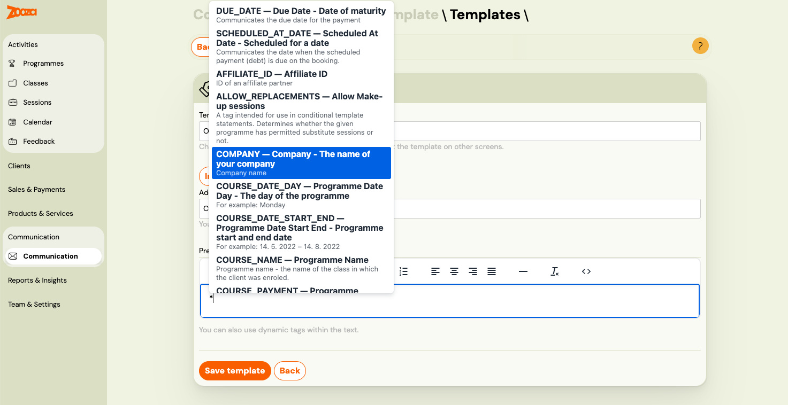

# Dynamic tags

When creating templates, Zooza provides dynamic tags to speed up communication with your clients. These tags pull specific information — such as programme name, time, and location — into emails automatically, keeping communication relevant without manual effort.

## How to insert dynamic tags

**Option 1 — Autocomplete (fastest):** Type `*` anywhere in the email body or subject line. A dropdown appears with all tags available for that template. Start typing to filter the list, then click to insert.

**Option 2 — Tags panel:** Click the **Tags** icon in the text formatting toolbar. A full list of available dynamic tags with explanations opens — click any tag to insert it.

**Option 3 — Copy and paste:** Open **Instructions and a complete list of tags** (link below the subject/body field in the template editor) and copy the tag text directly, for example `*|FIRST_NAME|*`.

> **Note:** Not all tags work in every template. The autocomplete and Tags panel only show tags valid for the current template type. Using a tag in the wrong template will result in a blank value in the sent email.

## For bookings

Each email sent for a specific booking allows you to dynamically fill in client data. At the time the email is sent, Zooza replaces these tags with specific values.

| Dynamic tag                                                         | Definition                                                                                 | Example                                               |
| ------------------------------------------------------------------- | ------------------------------------------------------------------------------------------ | ----------------------------------------------------- |
| <code>&#42;&#124;COURSE_PRICE&#124;&#42;</code>                     | Current programme price. If the class has its own price, the class price is used.          | 20.00 EUR                                             |
| <code>&#42;&#124;REGISTRATION_VALUE&#124;&#42;</code>               | Value of the booking at the time of creation. Shows the original full amount.              | 20.00 EUR                                             |
| <code>&#42;&#124;AFFILIATE_ID&#124;&#42;</code>                     | ID of the partner who facilitated the booking                                              | 12345                                                 |
| <code>&#42;&#124;REGISTRATION_ID&#124;&#42;</code>                  | Booking number                                                                             | 12345                                                 |
| <code>&#42;&#124;REGISTRATION_STATUS&#124;&#42;</code>              | Booking status                                                                             | registered                                            |
| <code>&#42;&#124;REGISTRATION_FEE&#124;&#42;</code>                 | Booking fee. If not listed on the booking, it is taken from the programme.                 | 30 EUR                                                |
| <code>&#42;&#124;VARIABLE_SYMBOL&#124;&#42;</code>                  | Variable symbol used for payment. Typically the booking number.                            | 12345                                                 |
| <code>&#42;&#124;COMPANY&#124;&#42;</code>                          | Your company name                                                                          | My company Ltd.                                       |
| <code>&#42;&#124;COURSE_PLACE&#124;&#42;</code>                     | Programme location. Composed of room and location data. Works without a room assigned — if no room is set, it shows the location name only. If the tag returns blank, the cause is a data sync issue, not a missing room.                                    | Big hall, Free time center, 323 Green Lane, Edinburgh |
| <code>&#42;&#124;ONLINE_MEETING_LINK&#124;&#42;</code>              | Clickable link to the online meeting room (e.g. Zoom, Teams) configured on the class. Renders as an `<a>` tag. | Join Zoom meeting                                     |
| <code>&#42;&#124;ONLINE_MEETING_URL&#124;&#42;</code>               | Raw URL of the online meeting room configured on the class. Use when you want to embed the link yourself. | https://zoom.us/j/12345                               |
| <code>&#42;&#124;HAS_ONLINE_MEETING&#124;&#42;</code>               | Returns `1` if an online meeting is linked to the class, `0` if not. Use with `*\|IF:HAS_ONLINE_MEETING\|*` to include meeting details only when relevant. | 1                                                     |
| <code>&#42;&#124;PLACE_DIRECTIONS&#124;&#42;</code>                 | Directions text for the venue, pulled from the venue settings.                             | Take bus 42 to Central Station                        |
| <code>&#42;&#124;PLACE_MAP&#124;&#42;</code>                        | Map image or embed for the venue, pulled from the venue settings.                          |                                                       |
| <code>&#42;&#124;COURSE_PLACE_ID&#124;&#42;</code>                  | Location ID                                                                                | 123                                                   |
| <code>&#42;&#124;COURSE_ROOM_ID&#124;&#42;</code>                   | Room ID                                                                                    | 456                                                   |
| <code>&#42;&#124;COURSE_PID&#124;&#42;</code>                       | Unique combination of location and room                                                    | 123_456                                               |
| <code>&#42;&#124;COURSE_NAME&#124;&#42;</code>                      | Programme name -- class name                                                               | Exercising with babies -- MINI1                       |
| <code>&#42;&#124;COURSE_DATE_DAY&#124;&#42;</code>                  | Day of the programme                                                                       | Monday                                                |
| <code>&#42;&#124;COURSE_DATE&#124;&#42;</code>                      | Start date of the first session in the programme.                                          | 14. 5. 2022                                           |
| <code>&#42;&#124;COURSE_SUMMARY&#124;&#42;</code>                   | Start time of the programme together with the date                                         | 13. 5. -- 13.9.2023 at 15:00                          |
| <code>&#42;&#124;COURSE_TIME&#124;&#42;</code>                      | Programme start time                                                                       | 14:00                                                 |
| <code>&#42;&#124;COURSE_PAYMENT&#124;&#42;</code>                   | Programme price derived from booking. If none on booking, the programme price is used.     | 135 EUR                                               |
| <code>&#42;&#124;CURRENT_BALANCE&#124;&#42;</code>                  | Current balance on the client's booking. Can be positive or negative.                      | -30 EUR                                               |
| <code>&#42;&#124;CURRENT_BALANCE_ABS&#124;&#42;</code>              | Absolute value of the current balance — shown without a minus sign. Useful in sentences like "You owe X EUR". | 30 EUR                                                |
| <code>&#42;&#124;PAID&#124;&#42;</code>                             | Total amount paid on the booking so far.                                                   | 100 EUR                                               |
| <code>&#42;&#124;PAYMENT_STATUS&#124;&#42;</code>                   | Payment status of the booking. Possible values: `unpaid`, `partial`, `paid`.               | partial                                               |
| <code>&#42;&#124;SCHEDULE_DURATION&#124;&#42;</code>                | Programme duration in hours                                                                | 15:00                                                 |
| <code>&#42;&#124;SCHEDULE_NAME&#124;&#42;</code>                    | Class name (without programme name)                                                        | Butterflies, tuesdays at 17:00                        |
| <code>&#42;&#124;SCHEDULED_AT_DATE&#124;&#42;</code>                | Date when the scheduled payment (debt) is due on the booking                               | 10                                                    |
| <code>&#42;&#124;FIRST_NAME&#124;&#42;</code>                       | Client name                                                                                | John                                                  |
| <code>&#42;&#124;DOWNPAYMENT&#124;&#42;</code>                      | Downpayment (deposit) amount set on the booking. Use this to show the deposit sum as text in your email template. | 50 EUR                                                |
| <code>&#42;&#124;DOWNPAYMENT_DUE_DATE&#124;&#42;</code>             | Due date for the downpayment. Only populated when a downpayment is set on the booking.     | 31. 5. 2022                                           |
| <code>&#42;&#124;HAS_DOWNPAYMENT&#124;&#42;</code>                  | Returns `1` if a downpayment amount is set on the booking, `0` if not. Use with `*\|IF:HAS_DOWNPAYMENT\|*` to show deposit-related content only when applicable. | 1                                                     |
| <code>&#42;&#124;HAS_UNPAID_DOWNPAYMENT&#124;&#42;</code>           | Returns `1` if the downpayment has not yet been paid, `0` if it has been paid. Use with `*\|IF:HAS_UNPAID_DOWNPAYMENT\|*`. | 1                                                     |
| <code>&#42;&#124;CANCELLATION_SCHEDULED&#124;&#42;</code>           | Returns `1` if a future cancellation is scheduled on this booking, `0` if not. Use with `*\|IF:CANCELLATION_SCHEDULED\|*` to show content only when a cancellation is pending. | 1                                                     |
| <code>&#42;&#124;CANCELLATION_DATE&#124;&#42;</code>                | The date the booking is scheduled to cancel, in `YYYY-MM-DD` format. Empty string if no cancellation is scheduled. Use together with `CANCELLATION_SCHEDULED`. | 2026-06-30                                            |
| <code>&#42;&#124;QR_CODE&#124;&#42;</code>                          | QR code for the full payment amount due on the booking. Requires: IBAN and SWIFT on programme/company. | Picture with QR code                                  |
| <code>&#42;&#124;QR_CODE_DOWNPAYMENT&#124;&#42;</code>              | QR code for the downpayment amount. Same conditions as QR Code, but generates a code for the downpayment sum instead of the full balance. | Picture with QR code                                  |
| <code>&#42;&#124;IBAN&#124;&#42;</code>                             | Bank account for payment. If specified at the programme level, that value is used.         | GB54BARC20039545449825                                |
| <code>&#42;&#124;DD_SETUP_INSTRUCTIONS&#124;&#42;</code>            | HTML table of direct debit setup instructions, rendered for the active scheme. **SEPA (ERSTE):** creditor name, Creditor Identifier, mandate reference, and IBAN/BIC to authorise. **BACS/FastPay (UK):** confirmation that bank details are already captured and the mandate will be set up on the client's behalf, plus the mandate reference and Direct Debit Guarantee. Only available for direct debit programmes. | HTML table |
| <code>&#42;&#124;COURSE_DATE_START_END&#124;&#42;</code>            | Start and end date of the programme                                                        | 14. 5. 2022 -- 14. 8. 2022                            |
| <code>&#42;&#124;COURSE_TRAINER&#124;&#42;</code>                   | Instructor's name                                                                          | John Winslow                                          |
| <code>&#42;&#124;USER_ID&#124;&#42;</code>                          | Client user ID                                                                             | 12345                                                 |
| <code>&#42;&#124;WIDGET_VIDEO_URL&#124;&#42;</code>                 | URL to view the video                                                                      | `https://www.zooza.sk/video?token=12345`              |
| <code>&#42;&#124;WIDGET_PROFILE_URL&#124;&#42;</code>               | URL to view profile                                                                        | `https://www.zooza.sk/profil?token=12345`             |
| <code>&#42;&#124;EF_DOB&#124;&#42;</code>                           | Extra field -- date of birth                                                               | 13. 4. 2000                                           |
| <code>&#42;&#124;EF_IDENTIFICATION_NUMBER&#124;&#42;</code>         | Extra field -- identification number (birth number, national ID, etc.)                     | 900101/1234                                           |
| <code>&#42;&#124;EF_FULL_NAME&#124;&#42;</code>                     | Extra field -- full name                                                                   | John Winslow                                          |
| <code>&#42;&#124;EF_CITIZENSHIP&#124;&#42;</code>                   | Extra field -- citizenship (ISO 3166-1 alpha-2 country code)                               | SK                                                    |
| <code>&#42;&#124;EF_EXTRA_FIELD_1&#124;&#42;</code>                 | Custom field 1                                                                             |                                                       |
| <code>&#42;&#124;EF_EXTRA_FIELD_2&#124;&#42;</code>                 | Custom field 2                                                                             |                                                       |
| <code>&#42;&#124;EF_EXTRA_FIELD_3&#124;&#42;</code>                 | Custom field 3                                                                             |                                                       |
| <code>&#42;&#124;EF_EXTRA_FIELD_4&#124;&#42;</code>                 | Custom field 4                                                                             |                                                       |
| <code>&#42;&#124;EF_EXTRA_FIELD_5&#124;&#42;</code>                 | Custom field 5                                                                             |                                                       |
| <code>&#42;&#124;EF_EXTRA_FIELD_6&#124;&#42;</code>                 | Custom field 6                                                                             |                                                       |
| <code>&#42;&#124;EF_EXTRA_FIELD_7&#124;&#42;</code>                 | Custom field 7                                                                             |                                                       |
| <code>&#42;&#124;EF_EXTRA_FIELD_8&#124;&#42;</code>                 | Custom field 8                                                                             |                                                       |
| <code>&#42;&#124;EF_EXTRA_FIELD_9&#124;&#42;</code>                 | Custom field 9                                                                             |                                                       |
| <code>&#42;&#124;EF_EXTRA_FIELD_10&#124;&#42;</code>                | Custom field 10                                                                            |                                                       |
| <code>&#42;&#124;EF_EXTRA_FIELD_11&#124;&#42;</code>                | Custom field 11                                                                            |                                                       |
| <code>&#42;&#124;EF_EXTRA_FIELD_12&#124;&#42;</code>                | Custom field 12                                                                            |                                                       |
| <code>&#42;&#124;EF_EXTRA_FIELD_13&#124;&#42;</code>                | Custom field 13                                                                            |                                                       |
| <code>&#42;&#124;EF_EXTRA_FIELD_14&#124;&#42;</code>                | Custom field 14                                                                            |                                                       |
| <code>&#42;&#124;EF_EXTRA_FIELD_15&#124;&#42;</code>                | Custom field 15                                                                            |                                                       |
| <code>&#42;&#124;EF_ADDRESS&#124;&#42;</code>                       | Extra field -- address                                                                     | 65 Wood Lane, Bristol                                 |
| <code>&#42;&#124;EF_BUSINESS_NAME&#124;&#42;</code>                 | Extra field -- company name                                                                | Zooza                                                 |
| <code>&#42;&#124;EF_BUSINESS_ADDRESS&#124;&#42;</code>              | Extra field -- company address                                                             | 65 Wood Lane, Bristol                                 |
| <code>&#42;&#124;EF_BUSINESS_ID&#124;&#42;</code>                   | Extra field -- ID number                                                                   | 123456                                                |
| <code>&#42;&#124;EF_TAX_ID&#124;&#42;</code>                        | Extra field -- TIN                                                                         | 1234546                                               |
| <code>&#42;&#124;EF_VAT&#124;&#42;</code>                           | Extra field -- VAT ID number                                                               | 123456                                                |
| <code>&#42;&#124;IS_BUSINESS_ORDER&#124;&#42;</code>                | Whether a booking is on a company or not                                                   | 1                                                     |
| <code>&#42;&#124;TURN_OFF_EVENT_NOTIFICATIONS_URL&#124;&#42;</code> | URL to turn off morning notifications. Works only in the Morning Reminders template.       |                                                       |
| <code>&#42;&#124;CANCELED_CONFIRMATION_URL&#124;&#42;</code>        | URL for canceling from the session. Works only in the Morning Reminders template.          |                                                       |
| <code>&#42;&#124;ALLOW_REPLACEMENTS&#124;&#42;</code>               | Whether make-up sessions are available for the booking                                     | 1                                                     |
| <code>&#42;&#124;FULL_NAME&#124;&#42;</code>                        | Client's full name                                                                         | Raymond Robbins                                       |
| <code>&#42;&#124;LAST_NAME&#124;&#42;</code>                        | Client's last name                                                                         | Robbins                                               |
| <code>&#42;&#124;EVENT_NAME&#124;&#42;</code>                       | Name of the session (not the programme or class). Available for session reminder only.     | Individual session, Cambridge                         |
| <code>&#42;&#124;EVENT_DATE&#124;&#42;</code>                       | Date of the session. Available for session reminder only.                                  | 14. 5. 2021                                           |
| <code>&#42;&#124;EVENT_PLACE&#124;&#42;</code>                      | Venue of the session. Available for session reminder only.                                 | Big hall, Free time center, 323 Green Lane, Edinburgh |
| <code>&#42;&#124;EVENT_ONLINE_MEETING_LINK&#124;&#42;</code>        | Clickable link to the online meeting room for the specific session. Available for session reminder only. | Join Zoom meeting                                     |
| <code>&#42;&#124;EVENT_ONLINE_MEETING_URL&#124;&#42;</code>         | Raw URL of the online meeting room for the specific session. Available for session reminder only. | https://zoom.us/j/12345                               |
| <code>&#42;&#124;EVENT_HAS_ONLINE_MEETING&#124;&#42;</code>         | Returns `1` if the specific session has an online meeting, `0` if not. Available for session reminder only. | 1                                                     |
| <code>&#42;&#124;EVENT_PLACE_DIRECTIONS&#124;&#42;</code>           | Directions text for the session venue. Available for session reminder only.                | Take bus 42 to Central Station                        |
| <code>&#42;&#124;EVENT_PLACE_MAP&#124;&#42;</code>                  | Map image or embed for the session venue. Available for session reminder only.             |                                                       |
| <code>&#42;&#124;EVENT_DATE_DAY&#124;&#42;</code>                   | Day of the session. Available for session reminder only.                                   | Monday                                                |
| <code>&#42;&#124;EVENT_TIME&#124;&#42;</code>                       | Session time. Available for session reminder only.                                         | 14:30                                                 |
| <code>&#42;&#124;EVENT_COURSE&#124;&#42;</code>                     | Programme name for the session. Available for session reminder only.                       | Summer camp 07/2023                                   |
| <code>&#42;&#124;EVENT_TRAINER&#124;&#42;</code>                    | Main instructor name at the session level. Available for upcoming session notification.    | Suzan Winslow                                         |
| <code>&#42;&#124;DEFAULT_COURSE_PRICE&#124;&#42;</code>             | Programme price if class price is 0; otherwise the class price.                            | 34.43 EUR                                             |
| <code>&#42;&#124;DEBT&#124;&#42;</code>                             | Debt value on booking. If no debt, displays the same as `DEFAULT_COURSE_PRICE`.            | 100 EUR                                               |
| <code>&#42;&#124;ORDER_SUMMARY&#124;&#42;</code>                    | Full summary of the booking including programme name, class, date, and price. Recommended for make-up sessions and block-based programmes where individual tags may show incorrect data. | Yoga Beginners -- Mondays at 10:00, 14. 5. 2022, 50 EUR |
| <code>&#42;&#124;SEGMENTS_SUMMARY&#124;&#42;</code>                 | The blocks the client is enrolled in, each with its **total price**. One line per block. | Math — 195,00 € English — 195,00 €                 |
| <code>&#42;&#124;SEGMENTS_INSTALLMENTS&#124;&#42;</code>            | The same blocks on **one line**, followed by what the client **actually pays each period**. See the section below — the figure is representative, not a schedule. | Math, English — 97,50 €/month                         |
| <code>&#42;&#124;BOOKING_URL&#124;&#42;</code>                      | URL to open the registration widget pre-filled for the client's class. Useful in trial follow-up emails to prompt full registration. | https://www.zooza.sk/registracia?schedule=123         |
| <code>&#42;&#124;WIDGET_REGISTRATION_URL&#124;&#42;</code>          | Base URL of the registration widget. Use to link clients back to the registration page.    | https://www.zooza.sk/registracia                      |
| <code>&#42;&#124;GOING_CONFIRMATION_URL&#124;&#42;</code>           | URL for the client to confirm their attendance. Use in attendance confirmation templates.  | https://www.zooza.sk/confirm?token=abc                |
| <code>&#42;&#124;UPCOMING_EVENTS&#124;&#42;</code>                  | Rendered list of upcoming sessions for the booking. Available in the Upcoming Events Notification template only. |                                                       |
| <code>&#42;&#124;TURN_OFF_UPCOMING_EVENTS_NOTIFICATIONS_URL&#124;&#42;</code> | URL to turn off upcoming event morning notifications. Available in the Upcoming Events Notification template only. |                                                 |
| <code>&#42;&#124;UNSUBSCRIBE&#124;&#42;</code>                      | URL to unsubscribe from all marketing emails.                                              | https://unsubscribe.zooza.sk/?token=abc               |
| <code>&#42;&#124;VOTING&#124;&#42;</code>                           | URL to open the feedback / rating form for the booking.                                    | https://feedback.zooza.app/#id=123                    |
| <code>&#42;&#124;CURDATE&#124;&#42;</code>                          | Today's date at the time the email is sent.                                                | 2. 4. 2026                                            |
| <code>&#42;&#124;NOW&#124;&#42;</code>                              | Current date and time at the moment the email is sent.                                     | 2. 4. 2026 14:30                                      |
| <code>&#42;&#124;DUE_DATE&#124;&#42;</code>                         | Due date for payment                                                                       | 33 EUR                                                |

> **Scheduled cancellation and attendance:** When a future cancellation is set on a booking, Zooza automatically hides the client's attendance for sessions on or after the cancellation date. This keeps the trainer roster and the client's widget clean — only sessions up to the effective end date are shown. If the scheduled cancellation is later revoked, attendance is restored automatically.

## Conditional tags

You can use conditional tags in templates. For example, if you accept business orders, you can add a conditional block to confirm to the client that you are recording their booking as a business and will send them an invoice shortly.

| Tag name | Definition | Application |
|---|---|---|
| `IF` | If the condition is true | <code>&#42;&#124;IF:BUSINESS_ORDER&#124;&#42;</code> Content <code>&#42;&#124;END:IF&#124;&#42;</code> |
| `ELSE` | Otherwise | <code>&#42;&#124;IF:BUSINESS_ORDER&#124;&#42;</code> content if yes <code>&#42;&#124;ELSE:&#124;&#42;</code> content if not <code>&#42;&#124;END:IF&#124;&#42;</code> |
| `ELSEIF` | Or if | <code>&#42;&#124;IF:BUSINESS_ORDER&#124;&#42;</code> content if yes <code>&#42;&#124;ELSEIF:REGISTRATION_STATUS=registered&#124;&#42;</code> content if status <code>&#42;&#124;ELSE:&#124;&#42;</code> content if not <code>&#42;&#124;END:IF&#124;&#42;</code> |
| `IFNOT` | If it is not | <code>&#42;&#124;IFNOT:BUSINESS_ORDER&#124;&#42;</code> Content <code>&#42;&#124;END:IF&#124;&#42;</code> |

### Comparison operators

| Tag | Definition |
|---|---|
| `=` | Equals |
| `!=` | Does not equal |
| `>` | Greater than |
| `<` | Less than |
| `>=` | Greater than or equal |
| `<=` | Less than or equal |

## Block summary tags

Two tags summarise the blocks (term segments) a client enrolled in, without printing the rest of the order. Both work in **email only** — they render formatted output, so they are not available for SMS.

| Tag | What it shows |
|---|---|
| <code>&#42;&#124;SEGMENTS_SUMMARY&#124;&#42;</code> | Each block on its own line, with the **total price** of that block. |
| <code>&#42;&#124;SEGMENTS_INSTALLMENTS&#124;&#42;</code> | All blocks on **one line**, followed by what the client **actually pays each period**. |

For a client enrolled in Math and English, each block costing 195,00 € in total and billed monthly:

- `SEGMENTS_SUMMARY` → `Math — 195,00 €` / `English — 195,00 €`
- `SEGMENTS_INSTALLMENTS` → `Math, English — 97,50 €/month`

Use `SEGMENTS_SUMMARY` when the client needs to see what each block costs. Use `SEGMENTS_INSTALLMENTS` when they need to see what will leave their account.

### The period is not always a month

`SEGMENTS_INSTALLMENTS` prints whatever period the payment plan actually uses — monthly, quarterly, half-yearly, yearly, per a number of sessions, or a fixed number of instalments. Do not write template copy that calls it "your monthly payment"; let the tag say it. Wording such as *"Your payments: `*|SEGMENTS_INSTALLMENTS|*`"* stays correct for every plan.

### When the first payment differs

If the first payment is not the same as the rest, the tag prints both parts:

`45,00 €, then 97,50 €/month`

### The figure is representative, not a schedule

`SEGMENTS_INSTALLMENTS` shows one figure that stands for the plan. It is not a payment schedule, and in three situations it will not match every individual payment:

- **Blocks of different lengths.** Where a block-based plan bills blocks that do not run for the same number of weeks, the payments differ between them.
- **A shortened final payment.** When the plan does not divide evenly, the last payment is smaller.
- **Hand-edited payments.** Any payment you edited by hand on the booking is left as you set it.

This is intended — a single representative figure is more use to a client than a wall of dates. When someone needs the exact list, use `*|ORDER_SUMMARY|*`, which carries every payment with its due date.

> Tell clients the number is indicative if your template is the only thing they will see. A parent comparing `97,50 €/month` against a final payment of 62,00 € will otherwise report it as an error.

### When the tags show nothing

Two cases are deliberate, not faults:

- **No payment plan on the booking.** `SEGMENTS_INSTALLMENTS` renders nothing at all. There is no instalment to describe, so it stays silent rather than printing a zero.
- **Pay-per-attendance.** Block names appear, but with no amount — the price depends on attendance, so it is not known in advance.

If a tag is blank and the booking falls into neither case, check that the client is actually enrolled in a block. A booking with no blocks has nothing for these tags to list.

## Known limitations and troubleshooting

### Tags in make-up sessions

When a client books a make-up session, tags like `*|COURSE_TIME|*`, `*|COURSE_DATE_DAY|*`, and `*|COURSE_PLACE|*` pull data from the **primary class's first session**, not the make-up session. This means the email may show incorrect time, day, or location for the make-up.

**Workaround:** Use `*|ORDER_SUMMARY|*` instead — it includes the correct session details for the specific booking context.

### Tags in block-based programmes

For programmes using blocks (term segments), `*|COURSE_DATE_DAY|*` and `*|COURSE_TIME|*` pull from the first session in the class, which may not match the client's enrolled block.

**Workaround:** Use `*|ORDER_SUMMARY|*` to display the correct block-specific information. A dedicated block-specific date tag is not yet available.

**Alternative workaround for time slot:** Include the time slot in the block name itself (e.g. "Mondays 17:00" or "January — Mon 17:00"). `*|ORDER_SUMMARY|*` includes the block name, so clients see the time in their confirmation email even without a dedicated tag.

**A per-block tag is not planned, and will not be added.** This is worth understanding rather than waiting for, because the reason is structural: blocks belong to a single class and there is no relationship between the blocks of one class and those of another. A tag such as `BLOCK_1` could not mean anything reliable — you would have no way of knowing whether the class in question has a first block at all, let alone whether it is the one you meant.

The same constraint is why blocks cannot be included in the registration export. Blocks can be reported per class, but not across registrations drawn from different courses.

A summary tag that lists **only** blocks, without the rest of the order, now exists — two of them, in fact. See [Block summary tags](#block-summary-tags) above. Showing blocks in the client profile is still planned.

### The confirmation email shows only the day of the week

If your booking confirmation says "Monday" where you expected "Monday 8 September", the template is using <code>&#42;&#124;COURSE_DATE_DAY&#124;&#42;</code>. That tag outputs the weekday and nothing else — by design.

For the actual dates, use <code>&#42;&#124;COURSE_SUMMARY&#124;&#42;</code>, which outputs the start and end date together with the time (`13. 5. — 13. 9. 2023 at 15:00`). It is the right tag for "when does this run", and the one to reach for in a booking confirmation.

Use <code>&#42;&#124;ORDER_SUMMARY&#124;&#42;</code> instead when you want the whole booking — programme, class, dates *and* price — rather than just the schedule.

### Tags in order confirmation emails

Dynamic tags are **not fully supported** in order (product purchase) confirmation emails. Tags like `*|COURSE_NAME|*`, `*|COURSE_TIME|*`, etc. will not populate because orders are not linked to a specific class or session.

Only basic client tags (`*|FIRST_NAME|*`, `*|FULL_NAME|*`, etc.) work in order emails.

### Tags in subject lines

Most dynamic tags work in email subject lines, but some may not populate in certain template types. Always test your email before sending to a large class.

### COURSE_* tags in session reminder templates

`COURSE_*` tags (e.g. `*|COURSE_DATE_DAY|*`, `*|COURSE_TIME|*`, `*|COURSE_PLACE|*`) pull from the **class at the time it was created** — specifically from the first session that existed when the class was set up. If the original schedule was later changed or sessions were deleted and recreated, `COURSE_*` tags may show outdated values.

In **session reminder templates**, always use `EVENT_*` tags instead — they pull from the actual session being reminded about:

| Instead of | Use |
|---|---|
| `*\|COURSE_DATE_DAY\|*` | `*\|EVENT_DATE_DAY\|*` |
| `*\|COURSE_DATE\|*` | `*\|EVENT_DATE\|*` |
| `*\|COURSE_TIME\|*` | `*\|EVENT_TIME\|*` |

`EVENT_*` tags are only available in session reminder templates.

### The cancellation confirmation template also needs EVENT_*

The same rule applies to the **cancellation confirmation** template (`#communication/templates?type=cancelation_confirmation`), and this one catches people out because the mistake stays invisible for years.

The template tells a client which session they just cancelled, so every tag in it must describe **the session**, not the class:

| Instead of | Use |
|---|---|
| `*\|COURSE_PLACE\|*` | `*\|EVENT_PLACE\|*` |
| `*\|COURSE_NAME\|*` | `*\|EVENT_NAME\|*` |
| `*\|COURSE_DATE\|*` | `*\|EVENT_DATE\|*` |
| `*\|COURSE_TIME\|*` | `*\|EVENT_TIME\|*` |

Why it hides: `COURSE_PLACE` is the venue on the **class**, `EVENT_PLACE` is the venue on the **session**. As long as those two match, the email looks correct. It only breaks once a session runs somewhere else — which is normal for group programmes, where the class venue and the session venue often differ.

`COURSE_NAME` fails the same way on make-up sessions. If a client attends a make-up in a different class and then cancels it, `COURSE_NAME` names the class they are enrolled in, not the one they just cancelled out of. Use `EVENT_NAME`.

> If you have never edited this template, check it anyway. Both cases seen in support were on templates the customer had not touched.

### Session-context tags in manual sends

Tags that pull session-specific data — `*|COURSE_PLACE|*`, `*|COURSE_TIME|*`, `*|COURSE_DATE_DAY|*`, `*|EVENT_DATE|*`, etc. — require an **automatic send triggered by a session event** (e.g. session reminder, booking confirmation). When you compose and send a message manually from the Communication tab without a session trigger, these tags have **no context** to pull from and will return blank.

**If session-context tags are not populating in your manual send:**
- Check whether you need the data in the message body or if you can reference it another way (e.g. include the session date in the subject line manually, or use `*|ORDER_SUMMARY|*` which includes session details).
- If the email is intended to be automated (sent on a schedule or event), configure it as an automatic template rather than a manual send.

### QR_CODE tag returns blank or doesn't appear

`*|QR_CODE|*` requires both **IBAN** and **SWIFT/BIC** to be set on the billing profile. Without these, the tag silently returns blank — the QR image is not rendered.

**Fix:** Go to **Settings → Billing profiles**, open your active profile, and confirm that IBAN and SWIFT/BIC are filled in. If you use per-programme billing settings, check the programme's **Payment** tile as well.

> QR codes are currently available for SK, CZ, and other SEPA markets. If your account is based outside these markets, the `*|QR_CODE|*` tag may not generate a QR image regardless of the settings.

### Tag rendering outages

In rare cases, the dynamic tag rendering service may experience temporary outages, causing tags to appear as blank in sent emails. If you notice blank tags in recently sent emails:

1. Check **Communication → Sent emails** to verify which emails were affected.
2. Contact support to confirm whether a service issue occurred.
3. Resend affected emails after the issue is resolved.
