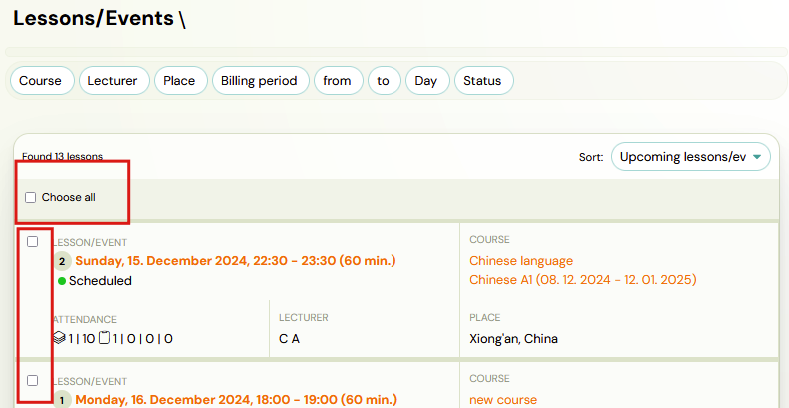
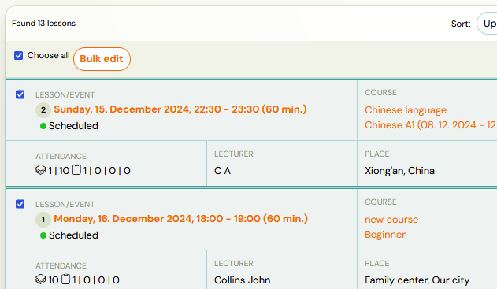
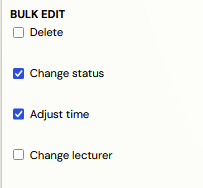
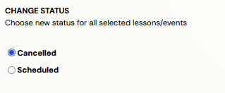
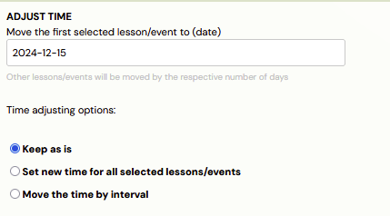
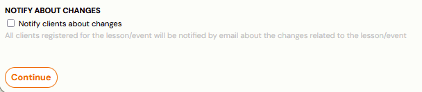
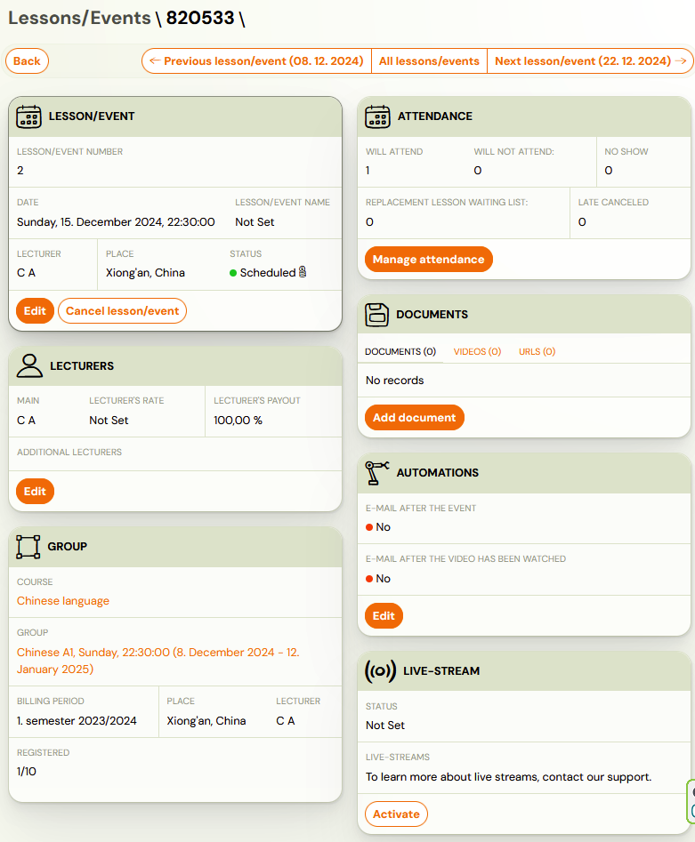
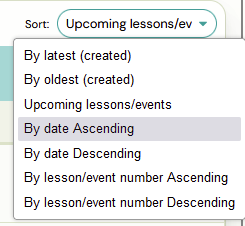

# Edit lessons/events in courses

Each created date can be changed additionally - change the lecturer or time. Each term can be cancelled or deleted.To change a term you have several options on how to proceed:

Bulk edit of events

The quickest way to edit events is directly in the Lessons/Events section. You can make bulk edits as soon as you filter the dates you want to edit.

1. Use the filter bar at the top of the page to filter by group/lecturer/location. Note: After applying the filter, you have the option to make bulk edits to your selected events by checking the Select All box or selecting only those that require editing.
 

1. Click on *Bulk Edit* to open a menu for editing the appointments:
 
2. Follow the instructions for each of the actions. More than 1 change can be made.

1. *Delete*Clicking the Delete button will completely delete the term. We recommend using delete term if you made a mistake and such term should never have existed.
2. *Change status*Clicking Cancel will change the status of the term to Cancelled. We recommend using cancel if the term was supposed to take place, was scheduled, but was cancelled due to, for example, a lecturer's illness. This way you will have a better overview of how many appointments were originally scheduled.
 
3. *Adjust time*When adjusting the time, you can choose from three options for adjusting the date:
4. *Keep as is – *if you want to move the date
5. *Set new time for all selected lessons/events – *enter the new valid time
6. *Move the time by interval – *you can add or subtract from the original time, for example 1 hour)
 

Alert! When creating sessions, you can choose whether the system should skip public holidays and school breaks. This setting only applies during the initial creation of sessions.After the sessions are created, you work with specific dates. If you later make a bulk change (for example, moving sessions from Monday to Thursday), the system no longer checks whether the new date falls on a holiday or not.
Additionally, the system does not automatically add new sessions if some dates were originally skipped due to holidays — for example, if Monday was a holiday and you move sessions to Thursday, which is not a holiday, the Thursday session will not be added automatically.
If you want holidays and breaks to be considered again after such a change, you need to delete the existing sessions and create them again with the desired setting.

Attention! Do not forget to set whether you want to notify clients about the changes you are making and press *Continue*.

1. Confirm the changes to the selected dates by clicking Start and press Continue again to complete the bulk edit.

## Edit a single event

If you only have 1 term that you need to edit, you can do this by following the same steps as in the chapter above or directly in the event details. For more information about working with appointments, see the manual about [Creating events/lessons](https://support.zooza.online/portal/en/kb/articles/creating-events-in-groups).

## At group level

1. Select the course and group in which you want to change the event and open the event overview at the bottom of the group in the Events/Lessons tab*
 
 *
2. This will open a list of all the upcoming events you have created in the group.
3. If you only want to edit 1 event, open that event and make the edits as in the Edit a single event section of this manual.
4. If you want to make a bulk edit of lessons, click the Overview button and you will be taken to the Events/Lessons section with the filter already active. Next, proceed as in the Bulk Edit Events section of this manual.

Attention! At the group level you will be shown ONLY the upcoming dates, if you are interested in viewing all dates (previous and upcoming) and then editing those, you need to change the sort order to something other than Upcoming Lessons.

