# Edit payment on registration

You can correct, edit or move each payment. Adjustments can be made individually at the level of registrations, in which case it is a change to the outstanding amount. What constitutes an outstanding amount is explained in detail [HERE](outstanding-amount.md).The amount owed on the registration itself can be modified in the form of discounts, adding a new payment, refunding a payment or entering a payment plan.

## Entering a payment

Manual editing of a payment, i.e. you manually enter the amount and the way in which the payment was made to you.

1. In the *Registrations *tab, find the registration on which you want to edit the payment.
2. In the registration details, click on the *Add Payment* button.
 
3. Fill in the required fields and click OK
 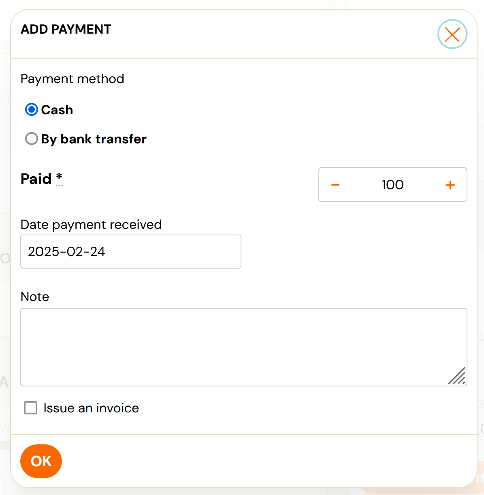

## Editing a payment

You can edit payments in several ways. Therefore, it is up to you which option you choose.

1. In the *Registrations *tab, search for the registration on which you want to edit the payment.
2. In the *Payments *section, click the *Show Payments* button. This field will already appear in the list of found registrations for faster editing.
 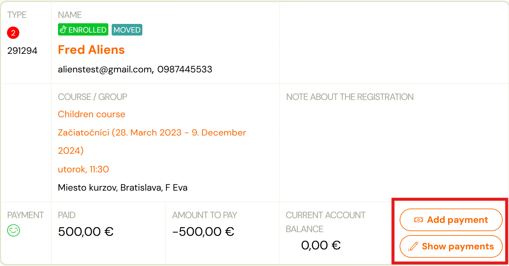
 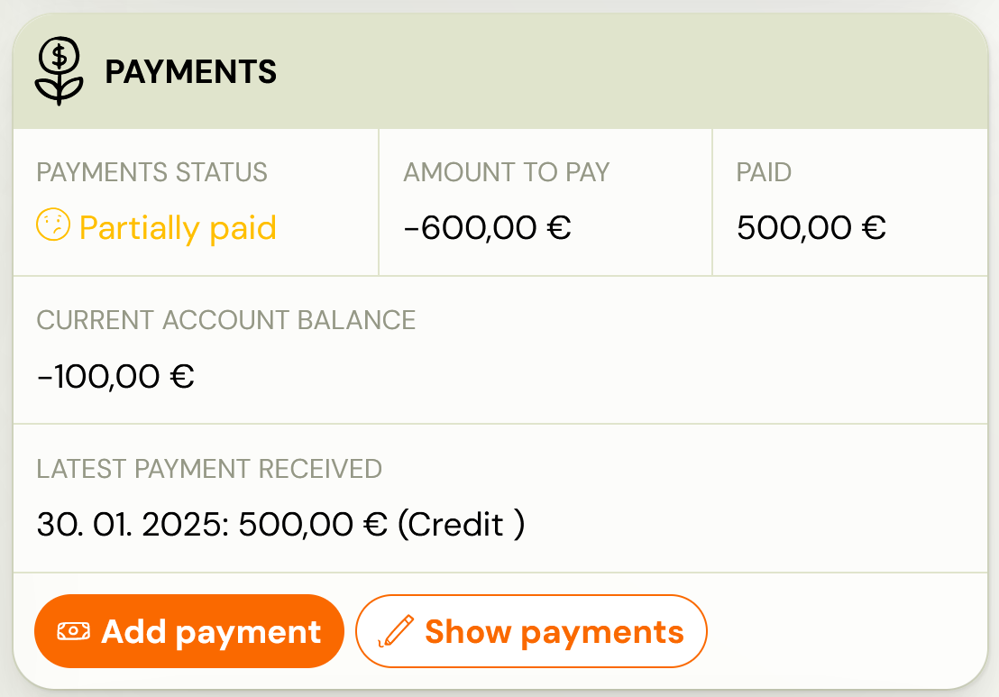
3. Select your desired option
4. Amount owed – modify the amount the client has to pay you
5. Registration fee – modify the registration fee
6. Discount - modify the amount owed by granting a discount
7. Payment schedule – modify the payment of the amount owed via installments.
 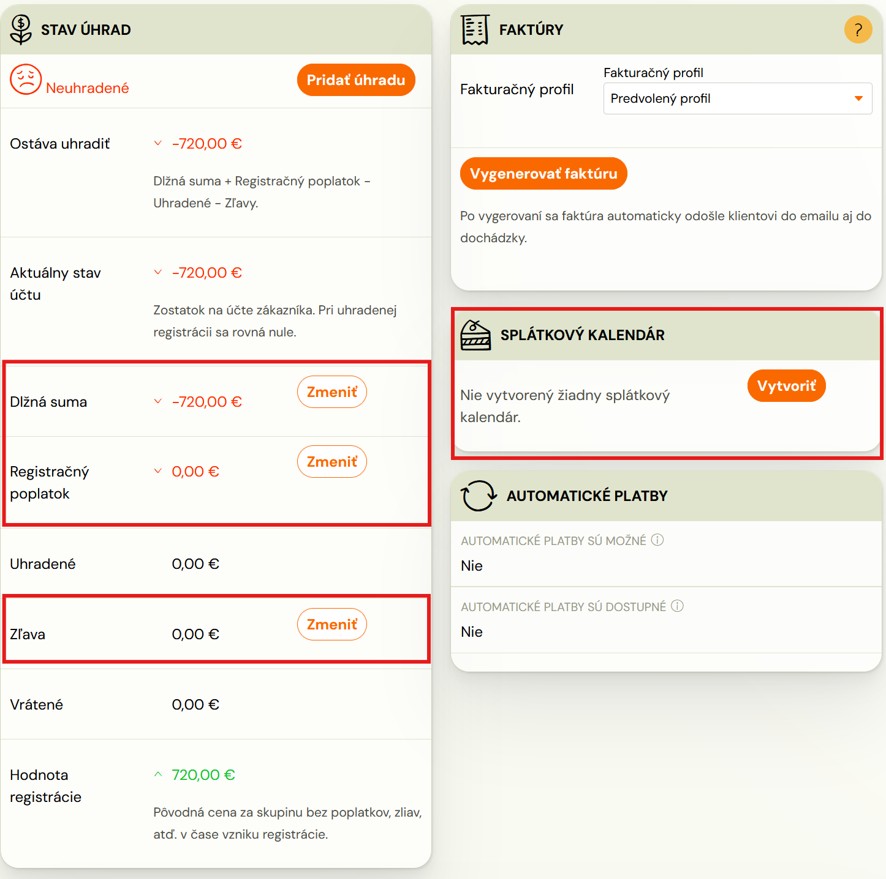

After each adjustment of the amount due, the balance of payments will also be recalculated. Thus, it may happen that a registration goes from ‘*paid*’ to *'unpaid*' or vice versa ‘*overpaid*’.

For a detailed breakdown of both payments and adjustments, please refer to the *List of Payments* section.

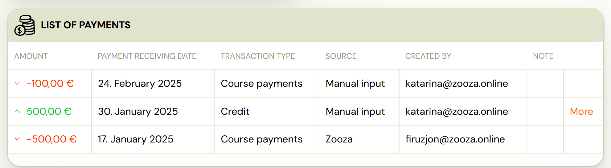

## Editing a transaction

It happens that the payment was incorrectly paid by the client or, on the contrary, incorrectly entered by you directly in the system. In this case it is necessary to modify the transaction itself. This option is only available for payment type transactions. Payment can come from several sources:

1. Manual entry - the payment was manually entered into the system directly on registration. A refund or correction does not actually return money to the client's account. It is just an adjustment in the application. The charge back must be made manually to the client from your bank account.
2. Automatic pairing - the reimbursement has been entered into the system via automatic payment pairing via email notifications from bank. The refund or adjustment does not actually return money to the client's account. It is just an adjustment in the application. The charge back must be made manually to the client from your bank account.
3. Online payment by card/transfer – the transaction has been entered into the system automatically after the client has made the payment. The refund is returned to the client - directly to the card/account. At the same time, the transaction is also recorded in the application. Correction of the transaction is not possible for this type of reimbursement.

## Refund of transaction

In case of an incorrect payment, we recommend using a refund for customers.

1. In the *Registrations *tab, locate the registration on which you want to edit the transaction. In the *List of Payments* section, click the *More *button next to the payment you wish to refund.
 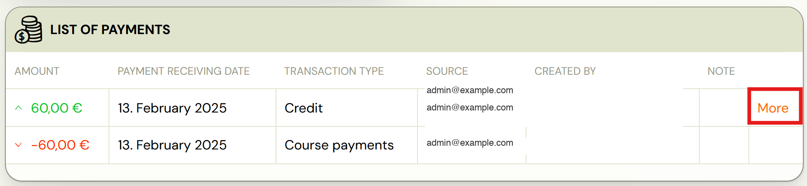
2. Click *Refund payment
 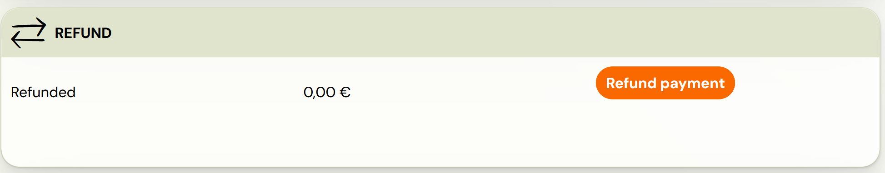
 *
3. Enter the amount to be refunded and then click OK
 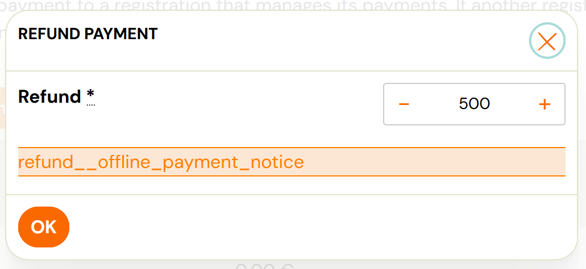

## Correct payment

If you happen to have entered a payment incorrectly, you have the option to opt for a correction instead of a refund. This works in the same way as refunding a transaction in its details on all offline payments.

1. In the *Registrations *tab, locate the registration on which you want to edit the transaction. In the *List of Payments *section, click the *More *button next to the payment you wish to refund.
 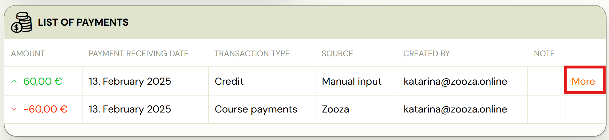
2. Click Correct payment*
 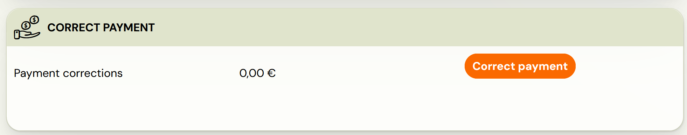
 *
3. Enter the amount and then click OK
 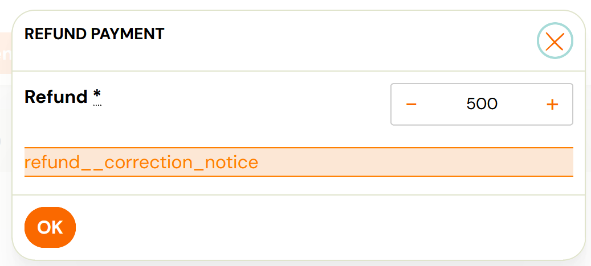

Note: In the case of a correction, this is not a refund of the payment back to the client's account. It is just a system change. Also, you don't have to worry about the client seeing these changes in their account. The client only sees the resulting amounts in their profile - the amount to be paid, the amount of the registration fee, the amount of the discount and, in the case of a payment plan, a breakdown of future payments.

## Move payment

It occasionally happens that a client makes a payment to a variable symbol that belongs to another registration. Zooza therefore allows you to transfer the payment, regardless of whether it has been paired manually, via email notification or via GoCardless, which will make it easier for you to manage payments on registrations.

Warning! You can only move a payment if there has been no refund or correction on that transaction, and only to a registration that manages its payments. If another registration manages payments on the target registration, move the payment directly to that registration.
To move a payment:

1. In the *Registrations *tab, locate the registration on which you want to edit the transaction. In the *List of Payments *section, click the *More *button next to the payment you wish to refund.
 
2. Click *Move payment
 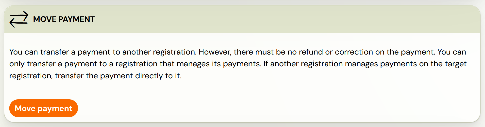
 *
3. Locate the client by name, email address, or registration number and click *Choose*.
 

4. A screen opens with the name of the registration you want to move the transaction to. If the information is correct, click *Move Payment.*
5. On this registration, you will see a note that the payment has been fully refunded with an option to move to the registration on which the payment is registered.*
 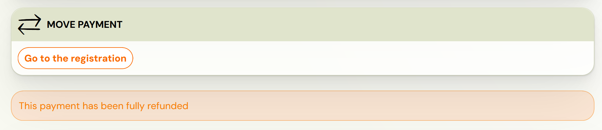
 *

Once moved, you will see a note on the original registration that the payment has been moved, with an option to go to the registration where the payment is recorded. In the details of the new registration, the transaction statement displays information about the original registration from which the payment was moved.

*

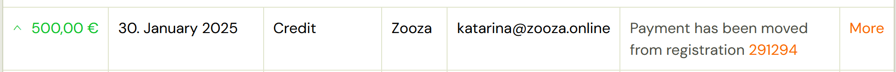

*
