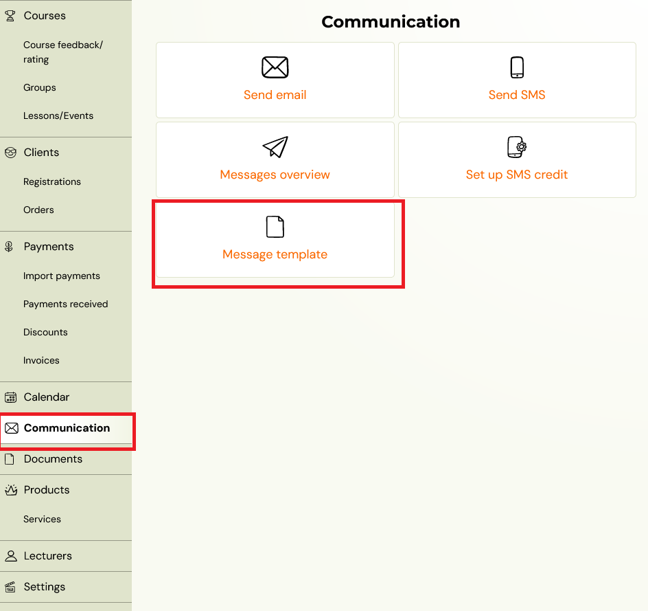
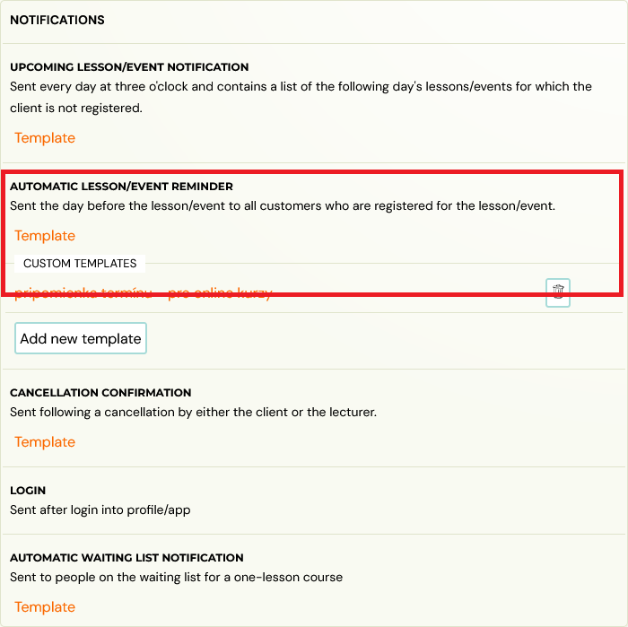
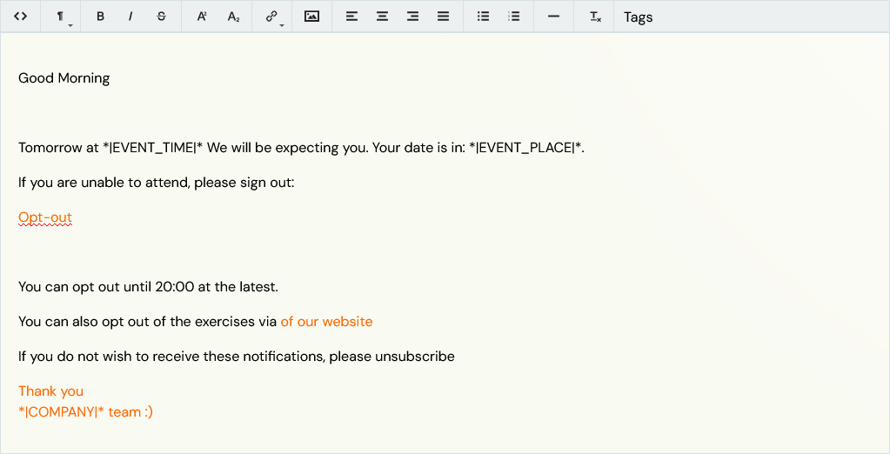
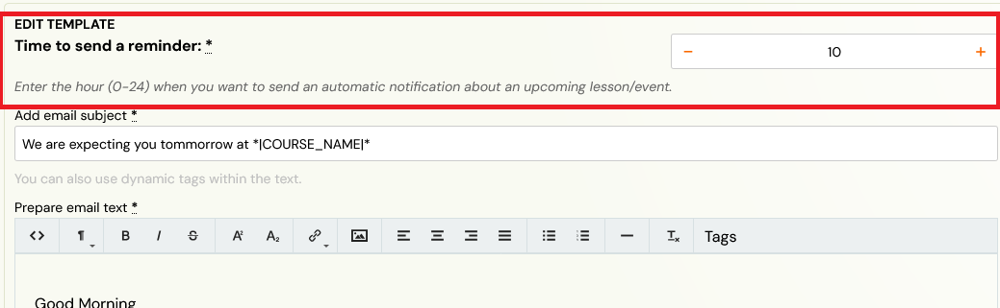

# Edit automatic notifications of an upcoming session

The [automatic notification](automatic-session-notification.md) is one of the messages that you can customise in the message templates. You can adjust the message text to suit your organisation's needs:

1. Change the way of reaching out
2. Change the terminology (cancel session for the session/exercise/session)
3. Add written information on the latest time to cancel the session

## Setting up the template

Message templates can be found under **Communication --> Message templates**.

When you open the window, you will see a longer list of different templates. This particular template can be found a little further down in the **Notifications** section.

The prepared text in the template is for your inspiration and needs to be checked. It should contain written information on the latest date by which the client can log out from the session. However, this is only textual information and is not linked to the sign-out rules you have set up in Zooza. You can set the latest possible time to log out or check your settings in **Settings --> General settings**.

## Time to send a reminder

You can set the time when the email is sent to the client directly in the template, under the template name, above the subject and the text of the email. The time can be set between 0-24 hours. The reminder is sent the day before the session.

> **Tip:** Set the reminder to send so that the client has enough time to cancel, according to your rules. For example, if you have set the log-out time in Zooza to a fixed hour -- until 22:00 the day before the session -- sending a reminder at 18:00 creates at least a 4-hour window for the client to log out.

For instructions on how to edit message templates and how to use dynamic tags, see the [message templates manual](message-templates.md).
