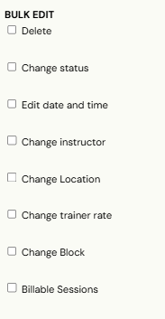
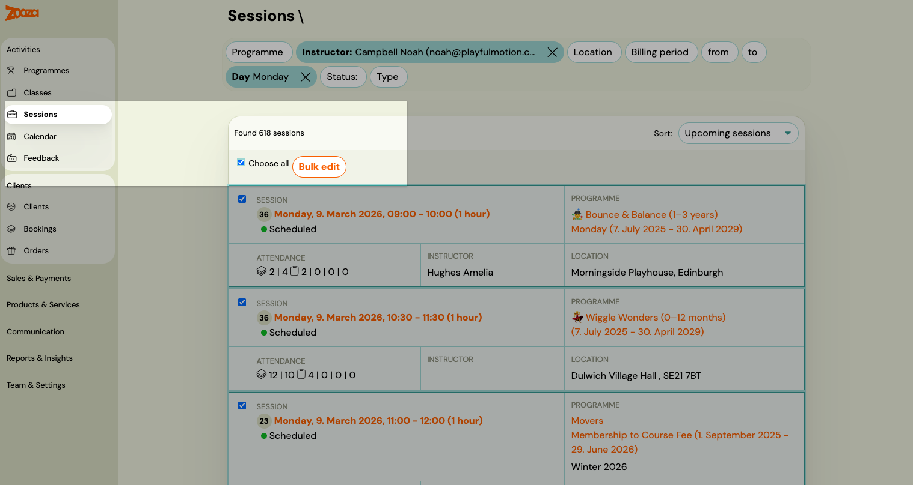
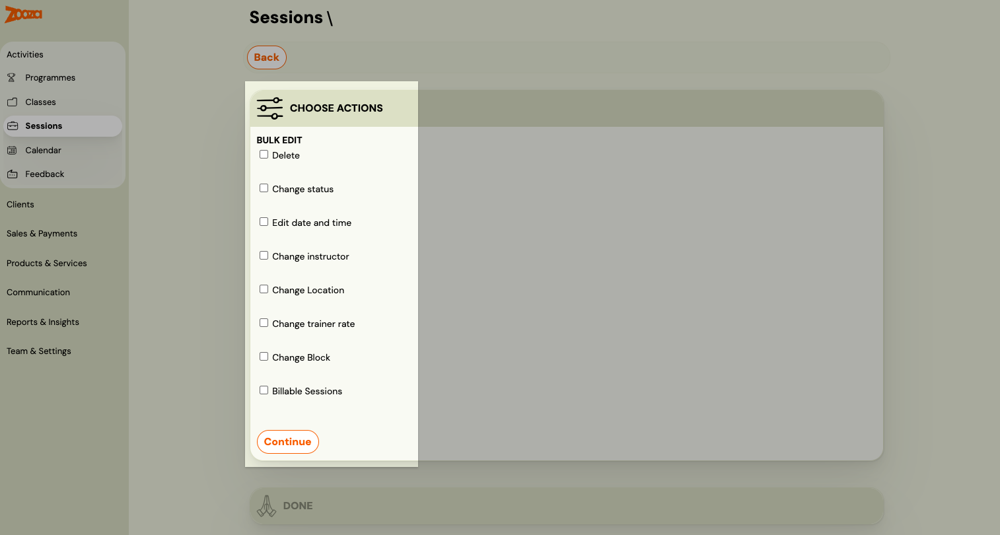
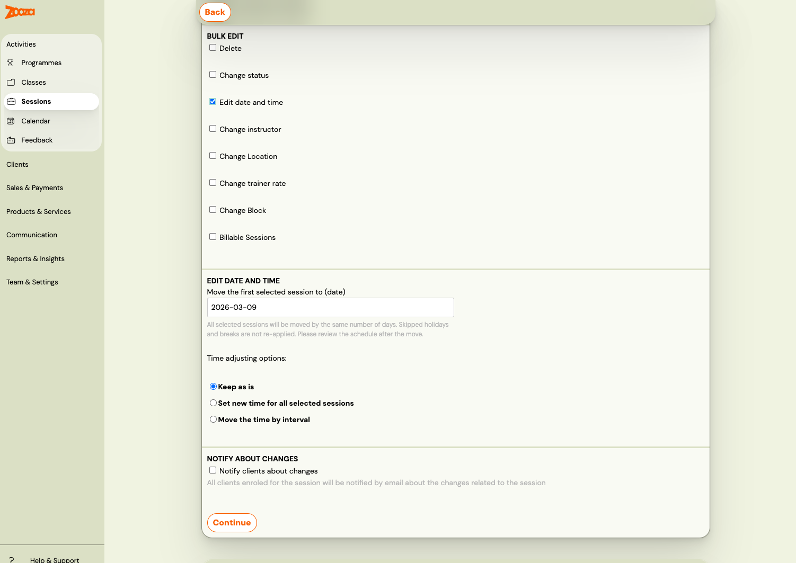
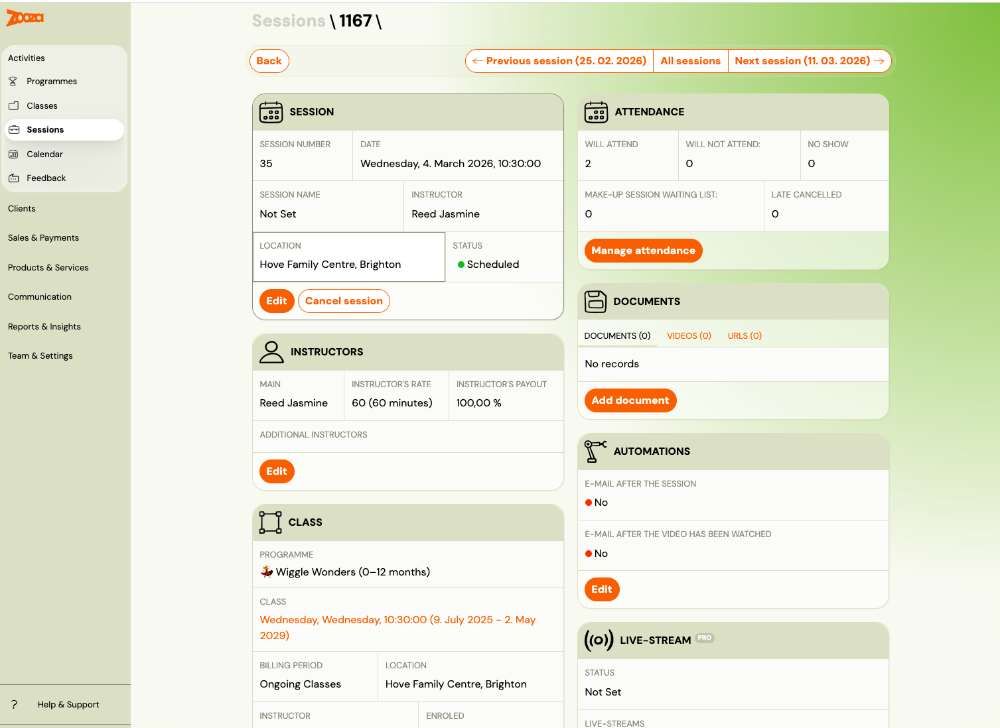
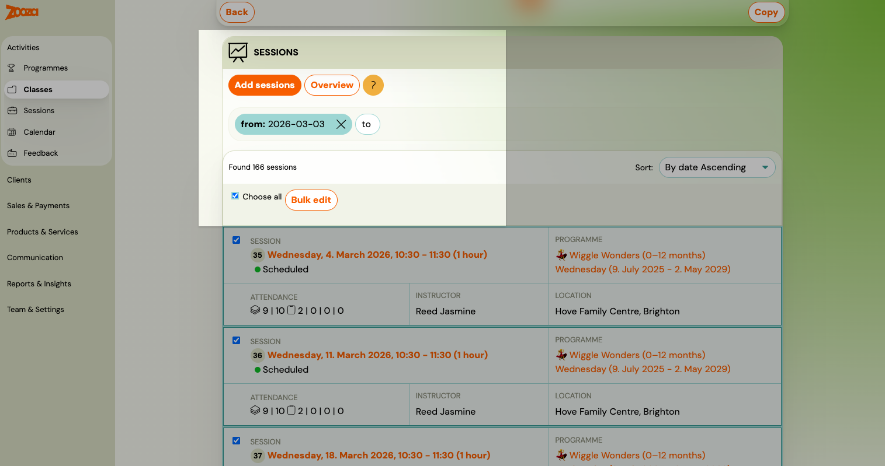

# Managing sessions in a class

Sessions are the individual dates within a class. You can add new sessions at any time, edit or reschedule existing ones in bulk, cancel sessions that did not take place, or delete sessions added by mistake.

## Adding sessions to an existing class

If you skipped session creation when setting up the class, or need to add more dates later:

1. Go to **Classes** and open the class.
2. In the **Sessions** tab, click **Add sessions**.
3. Choose a setup mode:

| Mode | When to use |
|---|---|
| **Simple setup** | Start date, end date, and repetition (e.g. every Monday). Zooza calculates the session count automatically. |
| **Advanced setup** | Full wizard — specific dates, times, holidays to skip, billable sessions, and blocks. |

## Bulk editing sessions

The fastest way to edit multiple sessions is from the **Sessions** section.

1. Go to **Sessions** and use the filter bar to narrow down by class, instructor, or location.

2. Check **Select All** or select individual sessions, then click **Bulk Edit**.

3. Choose one or more actions (described below) and set whether to notify clients.
4. Click **Continue**, then **Start** to confirm.

> **Note:** Do not forget to set whether you want to notify clients about the changes before clicking **Continue**.

### Delete

Permanently removes the session. Use this only if the session was created by mistake and should never have existed.

### Cancel

Changes the session status to **Cancelled**. Use this when a session was planned but did not take place (e.g. instructor illness). The session stays in the record so you have an accurate count of originally scheduled sessions.

> **Reminders are suppressed automatically.** Once a session is set to Cancelled, Zooza will not send any automated notifications (session reminders, day-before alerts) for that date. You do not need to disable reminders manually — the Cancelled status handles it.

### Edit date and time

Three options are available:

| Option | Effect |
|---|---|
| **Keep date, change time** | Moves the session to a different time on the same day. |
| **Set new date and time** | Replaces the date and time with a specific value for all selected sessions. |
| **Move by interval** | Shifts the date or time by a set amount (e.g. +1 hour, +7 days). |

> **Important:** Holiday and school-break skip rules apply only during the initial session creation. If you later bulk-reschedule sessions to a different day, the system does not re-check whether the new date falls on a holiday. If you need holidays respected again, delete the affected sessions and recreate them with the correct settings.

## Editing a single session

Open the session directly from the calendar or from the Sessions tab in the class. Edit the date, time, instructor, or location, and save.

## Working from the class detail

You can also manage sessions without leaving the class:

1. Open the class and go to the **Sessions** tab.
2. To edit one session, click it and make changes inline.
3. To bulk-edit, click **Overview** — this takes you to the Sessions section with the class filter already applied.

> **Note:** The Sessions tab in the class detail shows only **upcoming** sessions by default. To see past sessions as well, change the sort order from **Upcoming sessions** to another option.

## Known limitation: bulk date change on one-off (single-session) programmes

If you use **Calendar → Bulk Edit → Edit date** to reschedule a session that belongs to a **one-off event programme** (a programme with only one session), the date visible in the client-facing output (booking confirmations, email tags such as `COURSE_SUMMARY`) may not update immediately.

**Why:** One-off event programmes derive their displayed date from the programme's first session at the class level. When you reschedule via Calendar bulk edit rather than editing the session directly inside the class, the class-level date can lag behind.

**Workaround:** After rescheduling via bulk edit, open the class in the **Classes** list and close/save it again (no changes needed — just open and confirm). This triggers a recalculation of the displayed dates.

**Permanent fix:** For single-session programmes, reschedule by going directly to the session inside the class detail (Classes → open class → Sessions tab → click the session → change the date), rather than via Calendar bulk edit.

## Troubleshooting: nothing is showing in the calendar or classes list

If classes, sessions, or groups suddenly show as "undefined" or are not visible despite being set up correctly, this is usually caused by the nightly data migration not completing (a background process that pre-computes certain views).

**Fix:** Refresh the page (F5 or hard refresh Ctrl+Shift+R). The data will reload correctly. No data is lost — this is a display issue only.

If the problem persists after a refresh, contact Zooza support.

## Related

- [Creating a class](creating-a-class.md) — defining sessions during class setup.
- [Billable sessions](billable-sessions.md)
- [Automatic session notification](automatic-session-notification.md)
