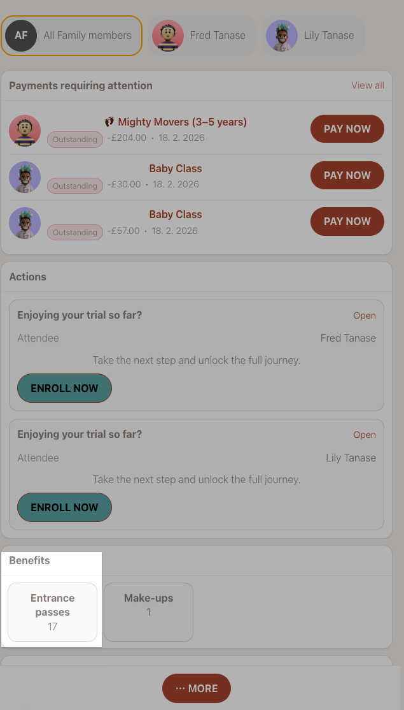
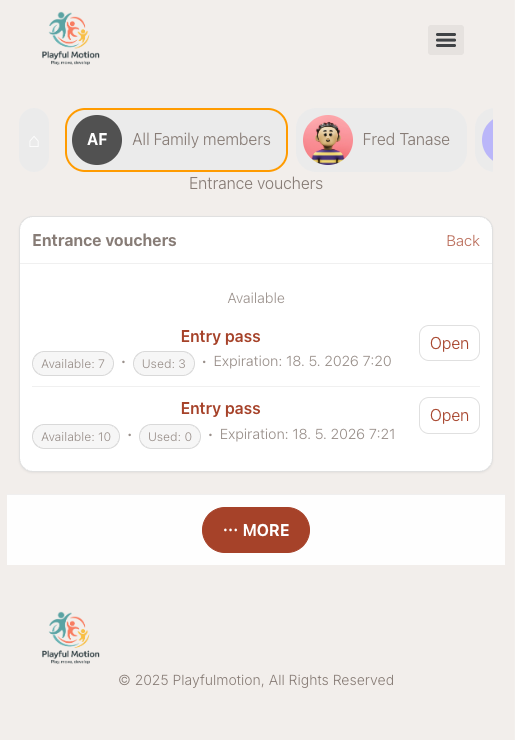
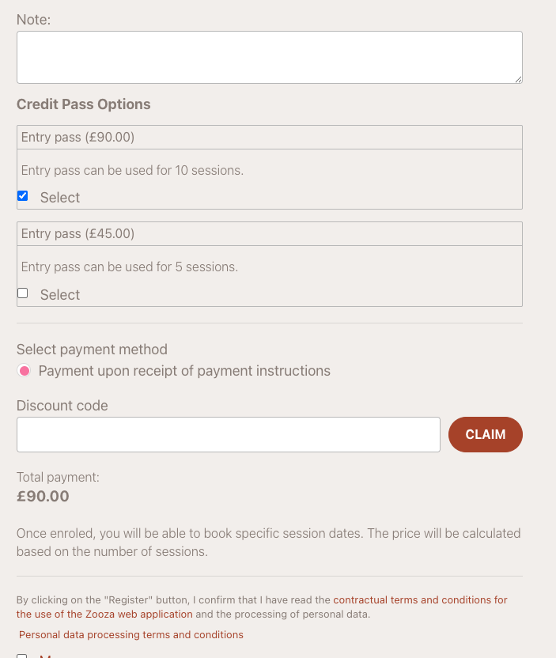
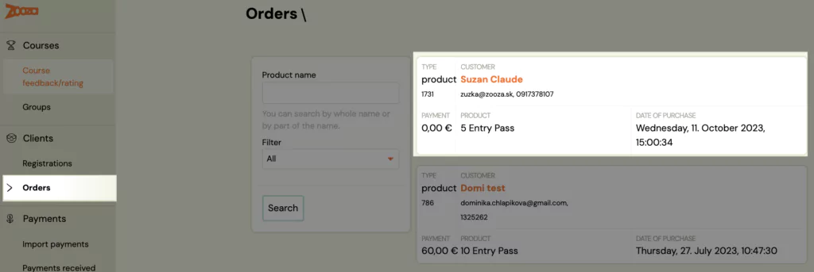
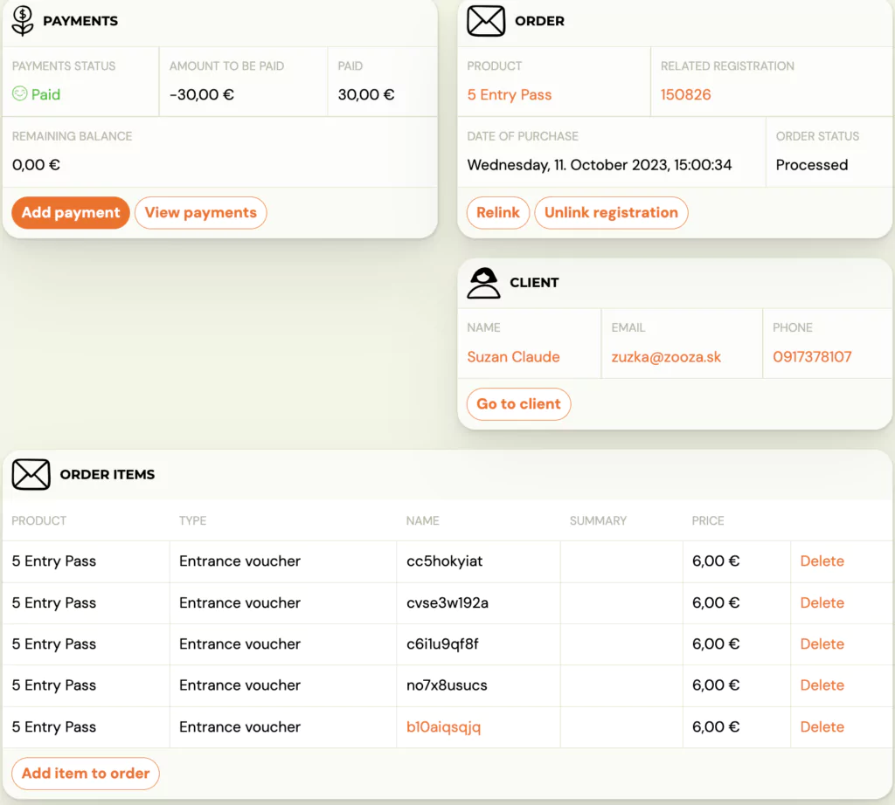
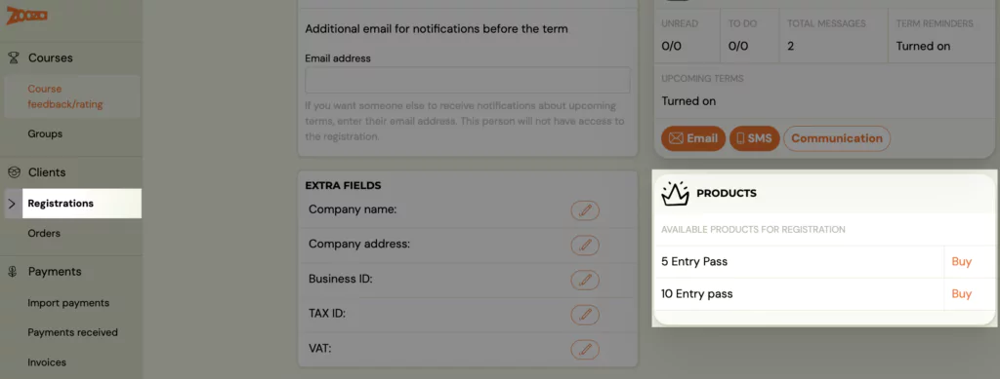

<!-- Synonyms: entry pass client profile, pass status, remaining entries, how client uses pass, permanentka klient, stav permanentky, zostávajúce vstupy, kreditná permanentka -->

# Entry pass — client view

This guide explains how clients see and use entry passes in their profile. It is intended for admins who want to understand the client experience, and for clients who need help navigating their passes.

For instructions on creating and configuring entry passes, see [Creating entry passes](creating-entry-passes.md).

## Entry pass status on the home page

After purchasing an entry pass, the client sees its status directly on the home page of their profile. The pass card shows:

- **Pass name** — the product name you configured.
- **Remaining entries** — how many sessions are left on the pass.
- **Expiration date** — when the pass expires.
- **Status** — active, expired, or fully used.

This gives clients a quick overview without having to navigate deeper into their profile.

## How clients purchase an entry pass

Clients can purchase entry passes in three ways, depending on how you configured the product availability.

### From the booking form

When the client registers for a Pay-as-you-go programme, the entry pass is offered directly in the booking form. The client selects the pass they want and pays during registration.

### From the client profile

After the client has an active booking in a programme, the available entry passes appear in their profile under the booking detail. The client can browse the pass options and choose the one that suits them.

### From the order form (widget)

If you have the order form widget deployed on your website, clients can purchase entry passes directly from there without needing an existing booking first.

## How entries are deducted

Each time a client books a session in a Pay-as-you-go programme, one entry is deducted from their pass. The process is automatic:

1. The client opens their profile and navigates to the programme.
2. They select an available session and click to book it.
3. The system checks if the client has a valid entry pass (non-expired, with remaining entries).
4. If valid, one entry is deducted and the session is booked.
5. If the client cancels the session, the entry is returned to their pass.

> **Note:** If **Require a valid entry pass** is enabled on the programme, clients without a valid pass cannot book sessions at all. If disabled, clients can book and pay per session normally.

## Viewing the pass on a booking

When a client has an entry pass, the booking detail shows the linked order. The payment and individual entries of the pass are managed separately on the order — not on the booking itself.

The admin can access the client's order via the booking detail or separately via **Orders** in the left menu.

## Order detail — managing entries

The order detail shows the full state of the entry pass:

- **Entries used** — which sessions the client has booked.
- **Entries remaining** — how many sessions are still available.
- **Expiration** — when the pass expires.
- **Payment status** — whether the pass has been paid.

From the order detail, the admin can also manually adjust entries if needed (e.g., add bonus entries or extend expiration).

## Manual assignment by admin

Admins can manually assign an entry pass to a specific booking from the admin interface. This is useful when a client pays in person or when you want to grant a complimentary pass.

1. Open the booking detail.
2. Click **Buy** next to the entry pass product.
3. Select the payment method.
4. Optionally check **Paid** if the client has already paid.
5. Confirm.

> **Tip:** If you do not see the desired payment method, return to the product settings and activate it there.

## What happens when a pass expires or runs out

| Scenario | What the client sees |
|---|---|
| **All entries used** | The pass shows as fully used. The client needs to purchase a new pass to continue booking sessions (if entry pass is required). |
| **Pass expired** | The pass shows as expired. Remaining unused entries are lost. The client needs a new pass. |
| **No valid pass, entry pass required** | The client cannot book sessions. They see a message that a valid pass is required. |
| **No valid pass, entry pass not required** | The client can still book sessions and pay per session at the unit price. |

## Related

- [Creating entry passes](creating-entry-passes.md) — how to create and configure entry pass products.
- [Pay-as-you-go programme](pay-as-you-go-programme.md) — the programme type that uses entry passes.
- [Client Profile 101](client-profile-101.md) — full guide to the Client Profile including benefits, payments, and sessions.
- [Pay-as-you-go FAQ](../faq/pay-as-you-go-faq.md) — common questions about entry passes.
