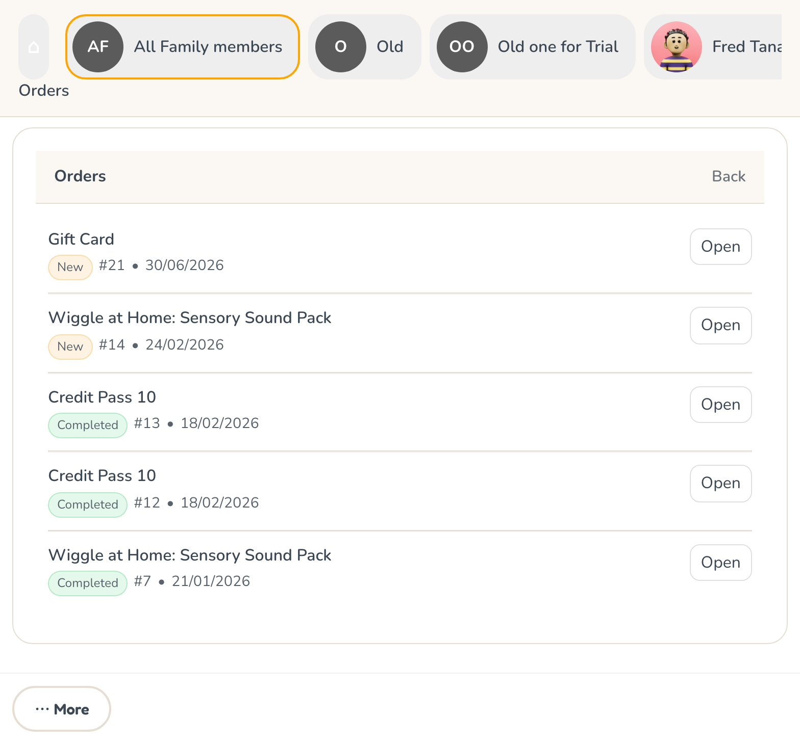
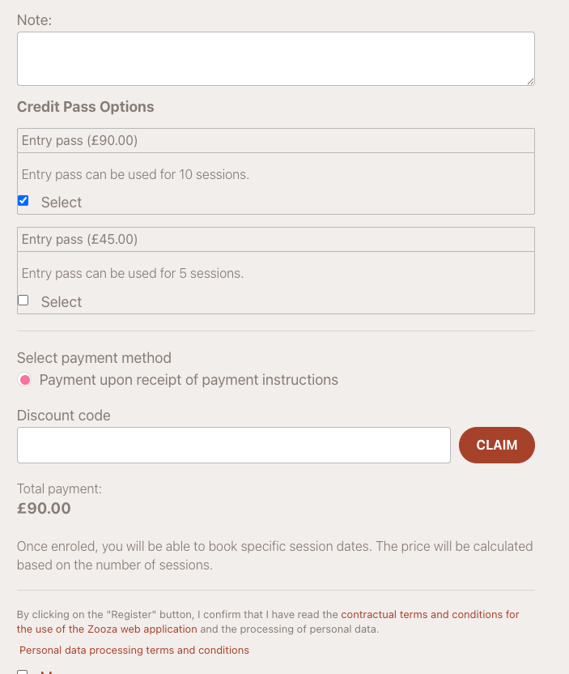
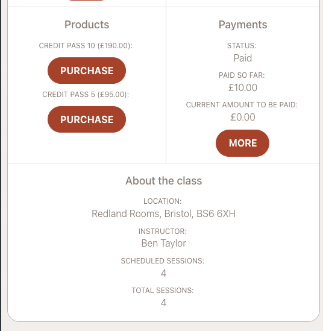
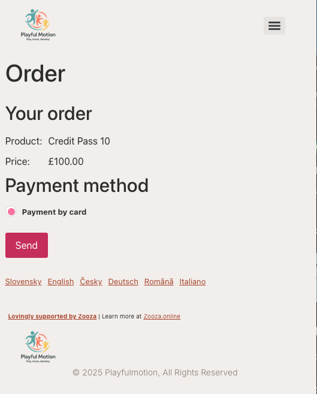
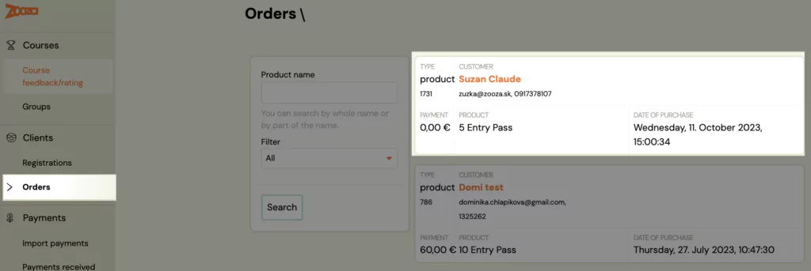
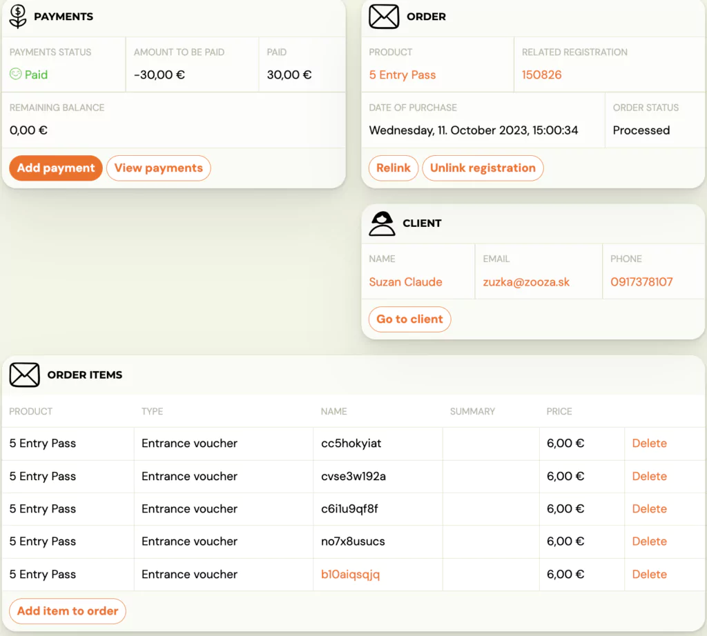
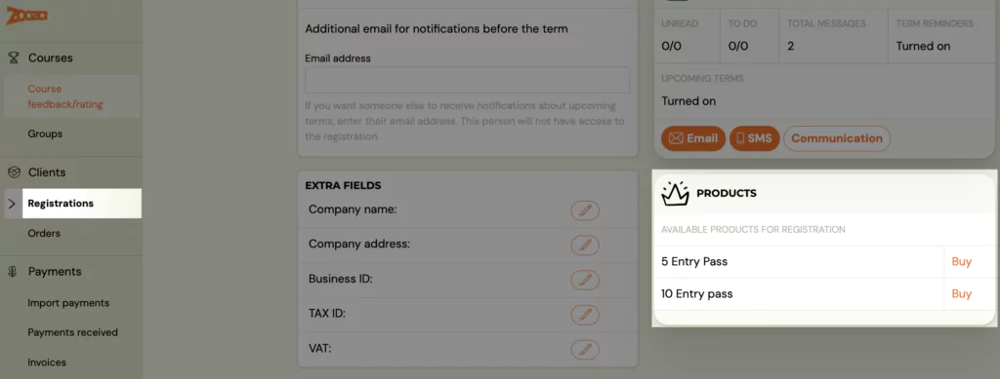

# Entry pass — client view

This guide explains how clients see and use entry passes in their profile. It is intended for admins who want to understand the client experience, and for clients who need help navigating their passes.

For instructions on creating and configuring entry passes, see [Creating entry passes](creating-entry-passes.md).

## Entry pass status on the home page

After purchasing an entry pass, the client sees its status directly on the home page of their profile. The pass card shows:

- **Pass name** — the product name you configured.
- **Remaining entries** — how many sessions are left on the pass.
- **Expiration date** — when the pass expires.
- **Status** — active, expired, or fully used.

This gives clients a quick overview without having to navigate deeper into their profile.

## How clients purchase an entry pass

Clients can purchase entry passes in three ways, depending on how you configured the product availability.

### From the booking form

When the client registers for a Pay-as-you-go programme, the entry pass is offered directly in the booking form. The client selects the pass they want and pays during registration.

### From the client profile

After the client has an active booking in a programme, the available entry passes appear in their profile under the booking detail. The client can browse the pass options and choose the one that suits them.

### From the order form (widget)

If you have the order form widget deployed on your website, clients can purchase entry passes directly from there without needing an existing booking first.

## How entries are deducted

Each time a client books a session in a Pay-as-you-go programme, one entry is deducted from their pass. The process is automatic:

1. The client opens their profile and navigates to the programme.
2. They select an available session and click to book it.
3. The system checks if the client has a valid entry pass (non-expired, with remaining entries).
4. If valid, one entry is deducted and the session is booked.
5. If the client cancels the session, the entry is returned to their pass.

> **Note:** If **Require a valid entry pass** is enabled on the programme, clients without a valid pass cannot book sessions at all. If disabled, clients can book and pay per session normally.

## Viewing the pass on a booking

When a client has an entry pass, the booking detail shows the linked order. The payment and individual entries of the pass are managed separately on the order — not on the booking itself.

The admin can access the client's order via the booking detail or separately via **Orders** in the left menu.

## Order detail — managing entries

The order detail shows the full state of the entry pass:

- **Entries used** — which sessions the client has booked.
- **Entries remaining** — how many sessions are still available.
- **Expiration** — when the pass expires.
- **Payment status** — whether the pass has been paid.

From the order detail, the admin can also manually adjust entries if needed (e.g., add bonus entries or extend expiration).

## Adding passes to a booking yourself

<!-- SCREENSHOT NEEDED (two): 1) the Buy dialog on a booking with the payment method ticked; 2) an order that shows the "Add item to order" button. The existing image below covers neither. -->

Passes reach a booking one of two ways: **the parent buys them** from their profile, or
**you add them** from the admin side. Use the second when somebody paid you in person,
paid before the programme was finished, or when you are giving passes away.

1. Open the booking and click **Buy** — the products card sits on the right-hand side of
   the booking detail.
2. Tick the payment method and confirm. This creates an **order** attached to the booking.
3. What happens next depends on the product:
   - **Passes are mandatory on it** — Zooza has already put them on the order.
   - **The parent normally picks an option at booking** — then nothing was picked for
     them. Open the order, click **Add item to order**, and work through the wizard.
4. Go back to the booking and click **Add payment** to record that the client has paid.

> **Step 4 is not bookkeeping — it is what releases the passes.** The entries are created
> at the moment the order is marked paid. Until then the parent has nothing to book with.

### "Adding passes only made the balance worse"

That is the usual way this goes wrong, and it is a half-finished procedure rather than a
fault. Adding passes creates an order; an unpaid order raises the amount outstanding on
the booking. If the client has already paid you, the balance stays up until you record it
with **Add payment** — then it drops back to zero and the passes appear in the parent's
profile.

So a parent who paid before the programme was properly set up does not need a refund and
a fresh booking. Create the order, add the item if the product expects a choice, mark it
paid, and the booking settles at zero with the passes live.

> **Tip:** If you do not see the desired payment method, return to the product settings and activate it there.

## What happens when a pass expires or runs out

| Scenario | What the client sees |
|---|---|
| **All entries used** | The pass shows as fully used. The client needs to purchase a new pass to continue booking sessions (if entry pass is required). |
| **Pass expired** | The pass shows as expired. Remaining unused entries are lost. The client needs a new pass. |
| **No valid pass, entry pass required** | The client cannot book sessions. They see a message that a valid pass is required. |
| **No valid pass, entry pass not required** | The client can still book sessions and pay per session at the unit price. |

## Related

- [Creating entry passes](creating-entry-passes.md) — how to create and configure entry pass products.
- [Pay-as-you-go programme](pay-as-you-go-programme.md) — the programme type that uses entry passes.
- [Client Profile 101](client-profile-101.md) — full guide to the Client Profile including benefits, payments, and sessions.
- [Pay-as-you-go FAQ](../faq/pay-as-you-go-faq.md) — common questions about entry passes.
