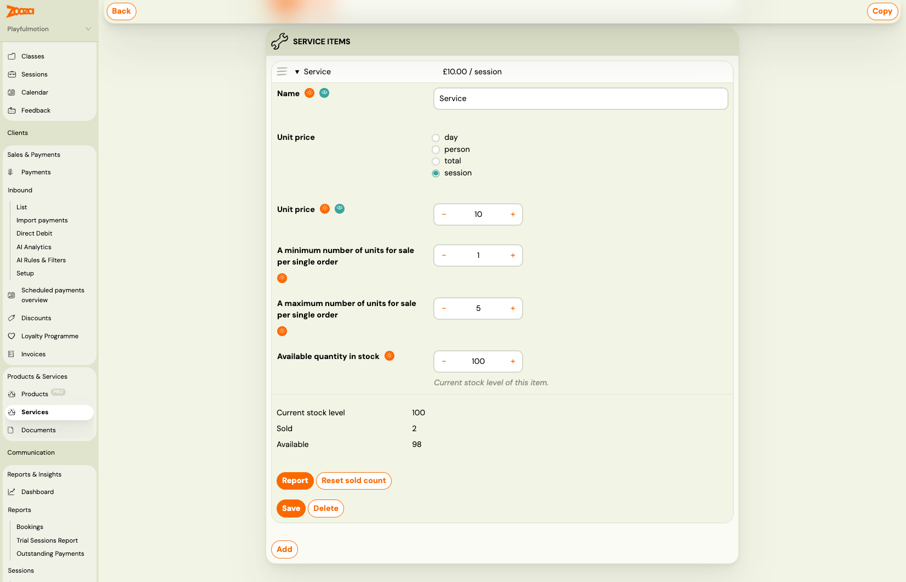

# Charge per remaining session with per-session pricing

Per-session pricing calculates a service add-on price by multiplying the unit price by the number of remaining sessions in the class at the time of booking. A client who joins halfway through a term automatically pays for half the sessions — without any manual adjustment.

> **When to use:** Insurance add-ons, material fees, or any service where the cost should scale with how many sessions the client will actually attend.

---

## How the price is calculated

When a client registers, Zooza counts the sessions that are still in the future for that class (or for the segments the client selected, if the class uses segments). It then multiplies that count by the unit price you set.

**Example:** Unit price £10, class has 12 sessions remaining → client pays £120. A second client who registers when 6 sessions are left pays £60.

If the class has a **billable sessions** override set (a fixed number of sessions to bill regardless of actual schedule), Zooza uses that override instead of counting future sessions directly.

---

## Setting up a service item with per-session pricing

> **Navigation:** Go to **Products & Services** → **Services** → select a service → expand an item (or click **Add**).

1. Open or create a service item.
2. Under **Unit price**, select **session**.
3. Enter the price per session in the amount field.
4. Set minimum and maximum units per order if needed (e.g. minimum 1, maximum 5 if you sell optional extras).
5. Click **Save**.

The item is now configured for per-session pricing. When clients register for a class that includes this service, the price preview in the booking widget shows the calculated total based on remaining sessions at that moment.

---

## Attaching the service to a product

A service item with per-session pricing must be attached to a product before it appears during booking. If you have not done this yet:

1. Go to **Products & Services** → **Products**.
2. Open the product linked to the class.
3. Add the service to the product's service list.

See [Selling products during booking](selling-products-during-booking.md) for the full setup.

---

## Notes and limits

- **Price is calculated at booking time.** If the schedule changes after the client registers (sessions added or cancelled), the booked price is not recalculated automatically.
- **Past sessions are never counted.** Only sessions with a future date contribute to the price.
- **Per-session pricing works alongside other pricing units.** A single service can have multiple items — one per-session item and one flat-fee item, for example.
- **Segments:** If the client selects specific segments (sub-groups within a class), the count uses only the sessions linked to those segments. Shared sessions that appear in multiple segments are counted once.
