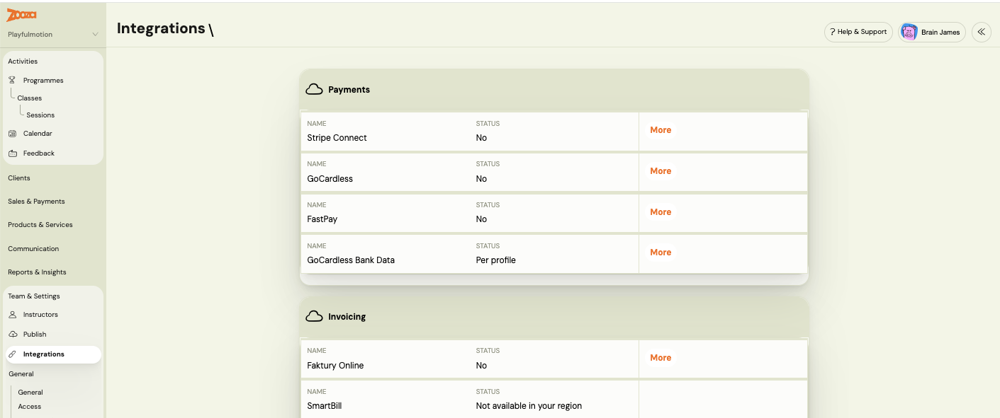
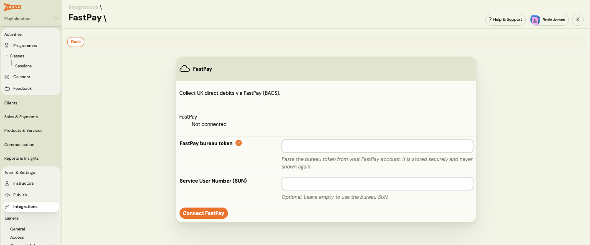
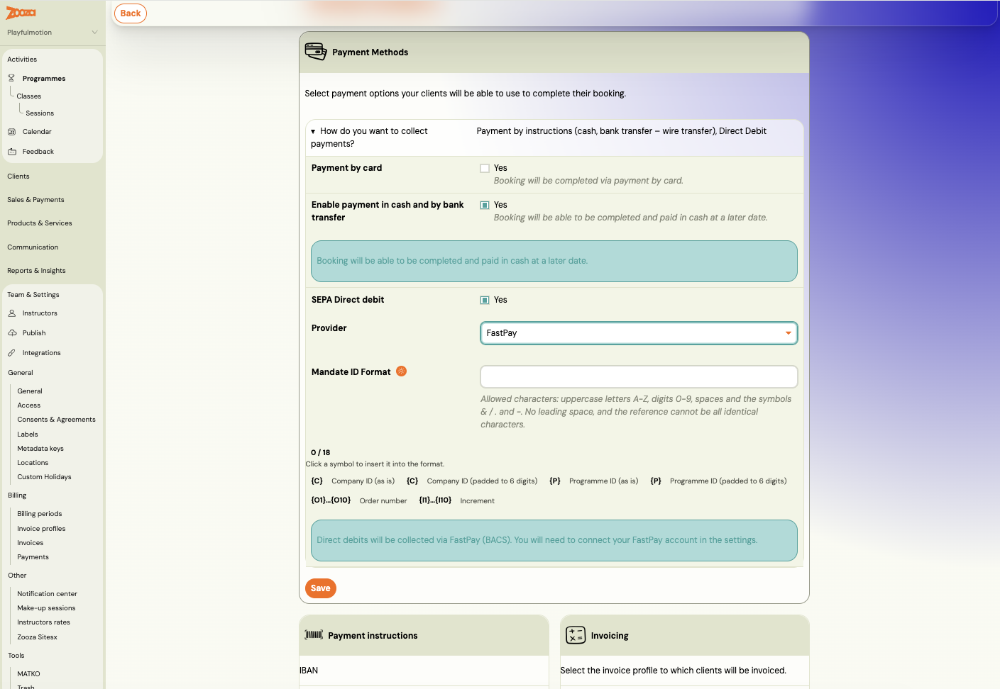
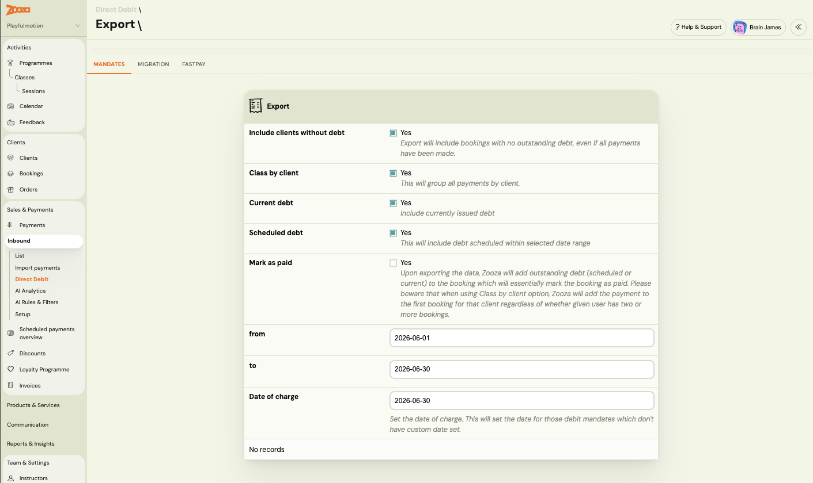
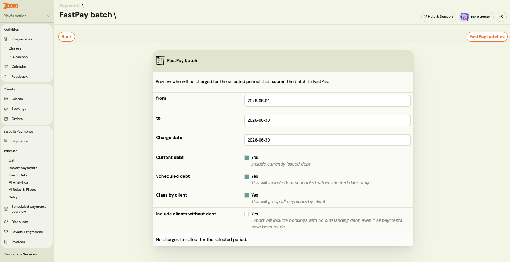

# Collect Direct Debit payments with FastPay (UK BACS)

**FastPay** is a UK Direct Debit bureau. Connecting it lets you collect tuition fees by **BACS Direct Debit** straight from Zooza: you push a monthly collection to FastPay, and Zooza reconciles which payments were collected or failed — without exporting a spreadsheet or keying anything into a bank portal.

> FastPay is **UK only**. In other regions it appears as *Not available in your region*.

## How FastPay compares to the other Direct Debit options

Zooza supports three Direct Debit models. FastPay sits between the manual and the fully automated one:

| | Manual / ERSTE (SEPA) | **FastPay (BACS)** | GoCardless (SEPA) |
|---|---|---|---|
| **Region** | SEPA / EU | **UK** | SEPA / EU |
| **Mandate setup** | Customer sets up at their bank | **Paper Direct Debit Instruction → you key it into the FastPay portal** | Customer authorises online via GoCardless |
| **Monthly collection** | You export a file and import it into your bank | **Zooza pushes the file to FastPay** | Zooza charges via the GoCardless API |
| **Outcome tracking** | You check the bank manually | **Zooza reconciles automatically (2–3 working days)** | Automatic |

The key difference from the manual flow: with FastPay there is **no spreadsheet and no bank-portal import** for the collection — Zooza submits it for you and reports back the result.

## Before you start

You need a **FastPay bureau account**. FastPay issues you a **bureau token** (your `Bearer-Token`) out-of-band — Zooza does not create it. If you have your own **Service User Number (SUN)**, keep it handy; if you don't, Zooza falls back to FastPay's central bureau SUN automatically.

---

## Step 1 — Connect FastPay

1. Go to **Team & Settings → Integrations**.
2. In the **Payments** section, find **FastPay** and click **More**.

3. Paste your **FastPay bureau token** — Zooza stores it securely and never shows it again.
4. *(Optional)* Enter your own **Service User Number (SUN)**. Leave it empty to use FastPay's bureau SUN.
5. Click **Connect FastPay**.

Zooza checks the token against FastPay immediately. If it's valid, the status changes to **Connected**. If it's rejected, you'll see an error and nothing is stored — re-check the token with FastPay.

The token is **stored encrypted and never shown again**. Return to **Team & Settings → Integrations → FastPay** any time to check the status or disconnect.

---

## Step 2 — Set a course or product to collect via FastPay

1. Open the course or product and go to its **Payment Methods** settings.
2. Turn on **SEPA Direct debit**, then set the **Provider** to **FastPay**. (The toggle is labelled *SEPA Direct debit*; selecting FastPay as the provider switches that course to UK BACS collection.)
3. Set the **Mandate ID Format** — the pattern Zooza uses to generate each mandate's reference (the FastPay `DDReference`).

**BACS reference rule:** the generated reference must be **up to 18 characters, uppercase letters and digits, and unique**. If your format would produce a reference that breaks these rules, Zooza **warns you when you save** — not later at booking time. (For comparison, SEPA mandates allow up to 35 characters, so a format that worked for ERSTE may be too long for BACS.)

For how the Mandate ID Format tokens work, see [Price and payment setup](price-and-payment-setup.md).

---

## Step 3 — Capture the customer's bank details

To collect by BACS, Zooza needs the customer's **sort code**, **account number**, and **account-holder name**. There are two ways these reach Zooza:

- **At booking (recommended).** When the course collects via FastPay, the registration widget asks the customer for their UK bank details. This is the primary path and also lets Zooza pre-fill the Direct Debit Instruction for them.
- **Entered by you.** If a customer returns a paper form, you can add or edit the bank details on the mandate in Zooza.

<!-- SCREENSHOT: Admin bank-details entry/edit on a FastPay mandate (sort code / account number / account name) -->

> The **account-holder name** is its own field — it may differ from the payer (for example a company account, a joint account, or a parent paying for a child). Always capture it as it appears on the bank account. Sort codes and account numbers keep their leading zeros.

---

## Step 4 — The customer sets up the mandate

BACS mandates are **not** created through Zooza or the FastPay API. The flow is:

1. The customer completes a **paper Direct Debit Instruction (DDI)** — account-holder name, sort code, account number, their bank details, and a **signature**.
2. They return it **to you** (the merchant).
3. You **key it into the FastPay portal**, which lodges the mandate under FastPay's bureau.

To reassure the customer, you can include the **`DD_SETUP_INSTRUCTIONS`** merge variable in a confirmation email. For BACS it confirms there's **nothing further for them to do** — Zooza already has their bank details and you set up the mandate — and shows their reference and the Direct Debit Guarantee.

> Zooza can optionally generate a **pre-filled DDI** (with the reference and your bureau details) for the customer to sign, when bank details are captured through the widget.

---

## Step 5 — Push a monthly collection

When it's time to collect, you push a batch to FastPay from **Sales & Payments → Payments → Direct Debit**, on the **FastPay** tab.

1. Set the collection period — **from**, **to**, and the **charge date**.
2. Choose what to include: **Current debt** (debt already issued), **Scheduled debt** (debt due within the range), and **Class by client** (group all of a client's payments together).

3. **Preview** the batch — Zooza shows every payer who will be charged, their reference, and the amount.

4. **Submit** the batch to FastPay.

Zooza builds the BACS collection file, submits it to FastPay, and creates one **pending** charge per payer. If FastPay rejects the file, no batch is created and no charges are made — you'll see the error. You can review past batches and their outcomes from **FastPay batches**.

> ⚠️ **Never push the same period twice.** FastPay does **not** detect duplicate files — submitting the same collection again would **charge every customer a second time**. Zooza blocks a second push for a period that has already been submitted.

This is a **manual push** (a button you click each period). Automatic monthly scheduling is planned for a later release.

---

## Step 6 — Reconciliation happens automatically

BACS settles **2–3 working days** after submission, so charges stay **pending** for a few days. You don't need to do anything — Zooza checks FastPay daily and updates each charge:

- **Collected** → Zooza records a Direct Debit payment against the booking and updates the order status.
- **Failed / bounced** → Zooza marks the charge as failed and sends you a **system message** in your admin inbox, with the bounce reason. (This is the same failed-payment notification you already get for offline charges — nothing extra to set up.)

<!-- SCREENSHOT: A failed-collection system message in the admin inbox -->

### Batch report

To see how a past collection turned out, open the **batch report**. For each batch it shows how many charges were **collected**, **failed**, or still **pending**.

<!-- SCREENSHOT: Batch report — collected / failed / pending per batch -->

---

## Mandate cancellations

If a customer cancels their Direct Debit at their own bank, Zooza detects it (the mandate is reported **Cancelled** or **Expired**), **deactivates** the mandate so it is **skipped in future pushes**, and notifies you with a system message. This protects you from submitting a collection against a dead mandate.

## Refunds

FastPay has **no refund API**. If you need to refund a collected Direct Debit, do it **manually in the FastPay portal**, then correct the payment in Zooza. See [Payment correction vs refund](payment-correction-vs-refund.md).

---

## Related

- [Integrations](../setup/integrations-hub.md) — where you connect FastPay and other payment providers
- [Price and payment setup](price-and-payment-setup.md) — Mandate ID Format and payment plans
- [How to assign Direct Debit mandates to bookings (GoCardless)](gocardless-direct-debit-mandates.md) — the SEPA/GoCardless equivalent
- [FastPay FAQ](../faq/fastpay-faq.md)
