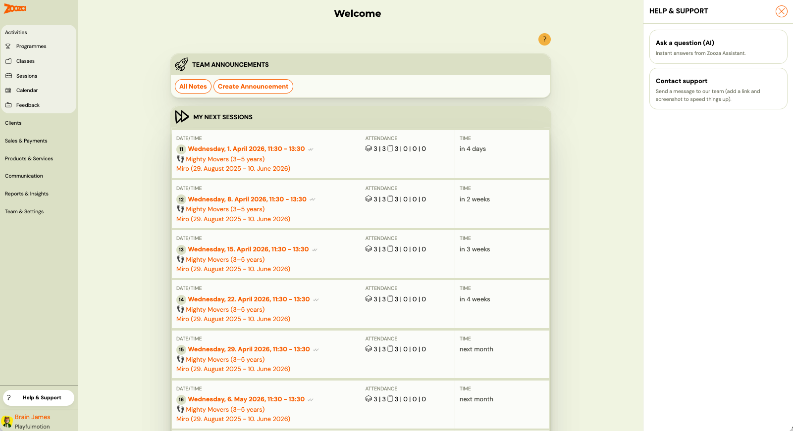
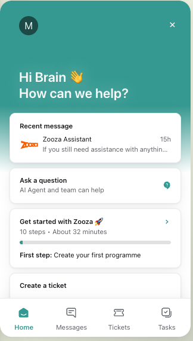
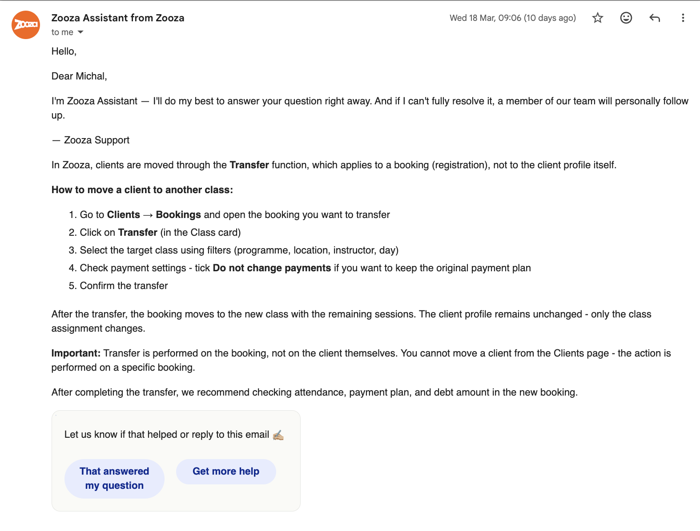
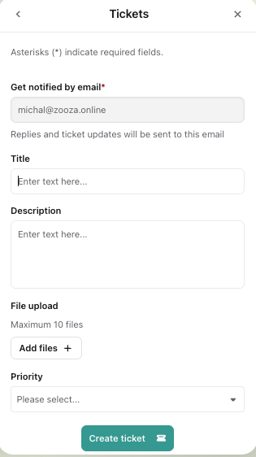
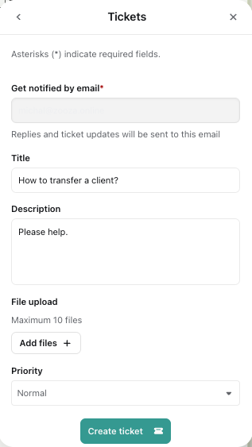
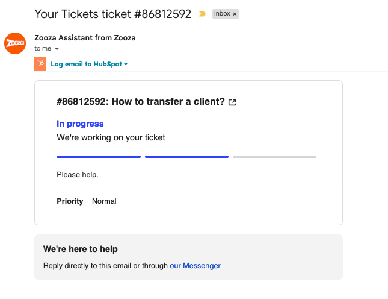
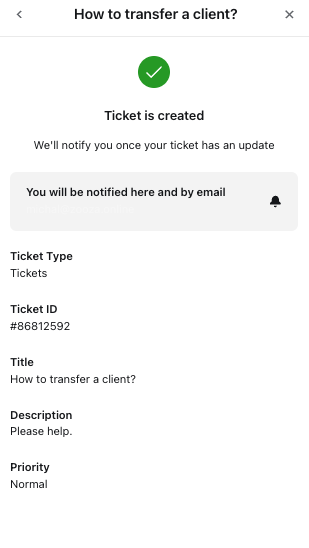
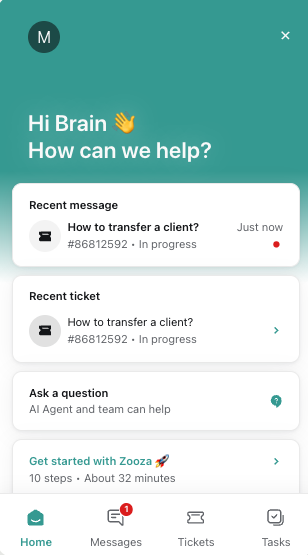
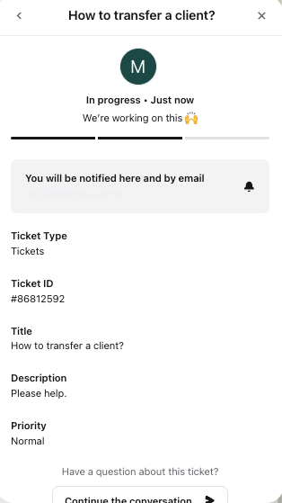
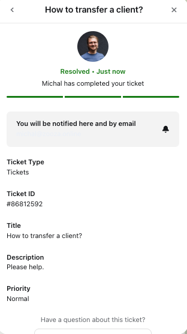

# Getting Help and Support

Zooza has a built-in support system that gives you instant answers from an AI assistant and lets you reach the team directly when you need a human touch. Everything is accessible from a single button in the app.

## Opening the Help panel

Click the **?** button in the bottom-left corner of any page in Zooza. A panel slides in with two options:

- **Ask a question (AI)** — start a chat with the AI assistant
- **Contact support** — go straight to creating a ticket

---

## Zooza Assistant (AI chat)

Zooza Assistant is the AI built into your support panel. It has access to the entire Zooza knowledge base. It can help you with:

- how to set up programmes, classes, bookings, and payments
- understanding what Zooza can and cannot do
- step-by-step instructions for any workflow
- general business questions related to running your activity business

It can share links, walk you through exact steps, and even hold a broader discussion about how to structure your setup.

### What Zooza Assistant cannot do

Zooza Assistant works with documentation and general knowledge — it does not have access to your Zooza account data. This means it cannot:

- look up specific clients, bookings, or payments from your account
- follow exact record links or ticket numbers
- interpret data directly from your app

If your question is about something specific in your account (e.g. a payment that looks wrong), it's best to open a ticket and include a screenshot.

### Language

Write in any language and Zooza Assistant will respond in kind. Slovak and Czech are both supported — it occasionally confuses them but the quality is generally good.

### Escalating to a human

When you start a chat, Zooza Assistant will respond first and try to help. If it doesn't fully resolve your issue, you can ask it to escalate — a team member will pick up the conversation and take it from there.

All conversations are monitored by the Zooza team. If something needs a human response, the team will step in even without you asking.

You can also reach the team directly by email — your first reply may still come from Zooza Assistant, after which a team member will follow up if needed.

---

## Creating a ticket

If you prefer to go straight to a human, use the **Create a ticket** option. You can find it:

- on the Home tab of the chat panel
- by clicking **Create a ticket** from the Help & Support screen

Fill in the ticket form:

| Field | Notes |
|---|---|
| **Email** | Pre-filled with your account email. Replies and status updates go here. |
| **Title** | A short description of the issue |
| **Description** | As much detail as you can provide |
| **File upload** | Attach up to 10 screenshots or files |
| **Priority** | Select based on urgency |

Click **Create ticket** to submit.

### Tips for faster resolution

- Include a screenshot or screen recording — it removes back-and-forth.
- Describe what you were trying to do and what happened instead.
- If it's a payment or booking issue, include the client name or relevant date.

---

## Tracking your tickets

Open the chat panel and go to the **Tickets** tab. You'll see a list of all your submitted tickets with their current status:

- **Submitted** — received, awaiting response
- **Resolved** — completed by the team

Click any ticket to see its full detail, including any replies. If you have a follow-up question, use **Continue the conversation** to keep the thread open.

---

## The more you use it, the better it gets

Every conversation you have with Zooza Assistant helps improve future answers. The system learns from real usage, so regular questions — even small ones — contribute to better responses for your whole team over time.
