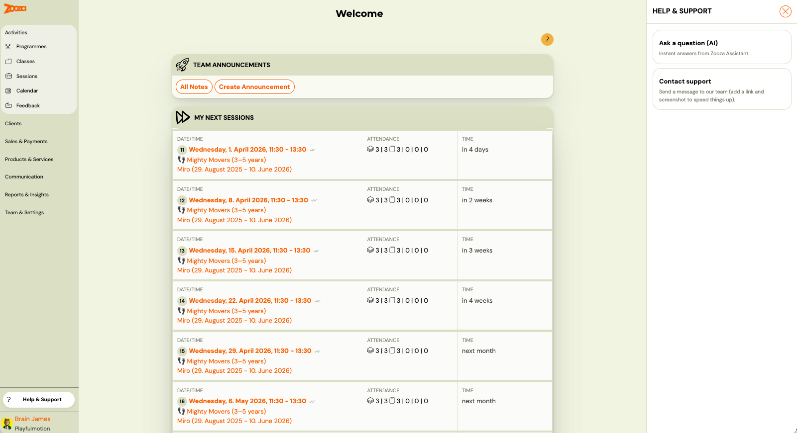
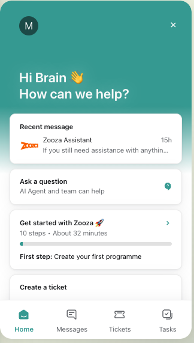
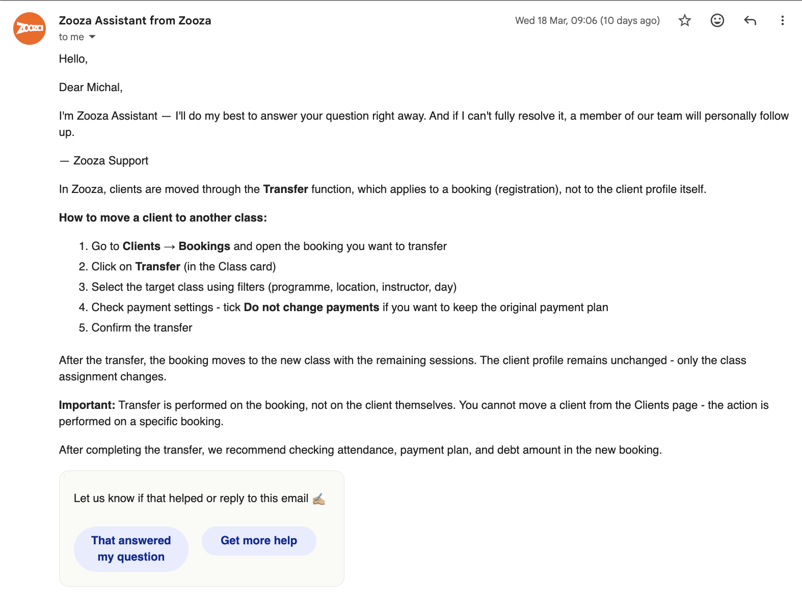
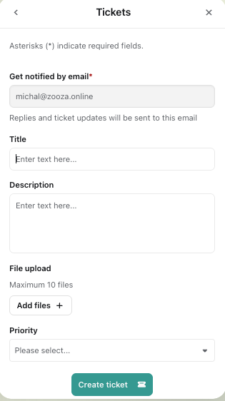
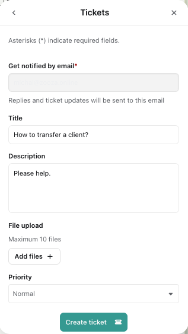
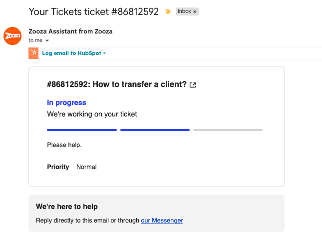
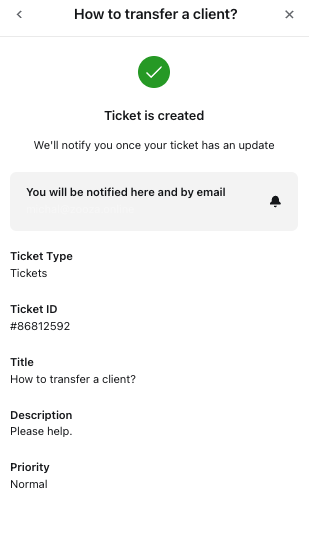
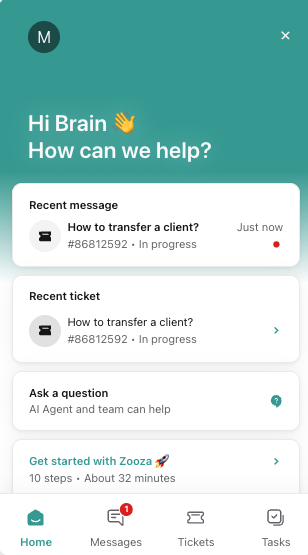
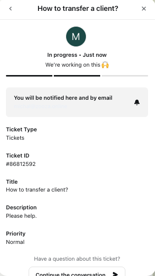
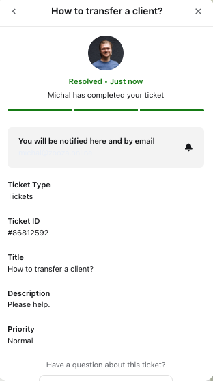

# Getting Help and Support

Zooza has a built-in support system that gives you instant answers from an AI assistant and lets you reach the team directly when you need a human touch. Everything is accessible from a single button in the app.

## Opening the Help panel

Click the **?** button in the bottom-left corner of any page in Zooza. A panel slides in with two options:

- **Ask a question (AI)** — start a chat with the AI assistant
- **Contact support** — go straight to creating a ticket

---

## Zooza Assistant (AI chat)

Zooza Assistant is the AI built into your support panel. It has access to the entire Zooza knowledge base. It can help you with:

- how to set up programmes, classes, bookings, and payments
- understanding what Zooza can and cannot do
- step-by-step instructions for any workflow
- general business questions related to running your activity business

It can share links, walk you through exact steps, and even hold a broader discussion about how to structure your setup.

### What Zooza Assistant cannot do

Zooza Assistant works with documentation and general knowledge — it does not have access to your Zooza account data. This means it cannot:

- look up specific clients, bookings, or payments from your account
- follow exact record links or ticket numbers
- interpret data directly from your app

It also **cannot do anything in your account**. Asking it to "check my settings", "set this up for me" or "pull a report" will only produce general advice, because it has no way to reach your data or change anything.

If your question is about something specific in your account (e.g. a payment that looks wrong), it's best to open a ticket and include a screenshot.

### If you want something looked up or done — use Zooza AI

This is the part worth knowing, because it turns half the questions people bring to this chat into a one-line request.

**Zooza AI** is a separate connector between your Zooza account and an AI tool you already use (Claude, ChatGPT). Unlike the chat here, it *does* reach your data and *can* act on it. It is the right tool for anything of the form "tell me who…", "how many…", "set up…", "send…":

- attendance across all of one client's registrations
- who has not paid, filtered however you like
- creating classes and whole schedules
- marking attendance, adding session summaries
- pulling clients by an extra field and messaging exactly that group

Set it up at **`zooza.app/#mcp`** — use your regional address if you have one (for example `uk.zooza.app/#mcp`). It is free for active customers.

> **Rule of thumb:** this chat explains *how*. Zooza AI does it, or tells you *what* your data says. If you find yourself describing your account to the chat, you want the connector instead.

See [Connect Zooza to Claude](../setup/claude-plugin.md).

### Language

Write in any language and Zooza Assistant will respond in kind.

**If it answers in the wrong language — usually Czech when you wrote Slovak — that is a known limitation, and asking it again will not fix it.** The assistant detects the language of your message and picks its reply from that. Slovak and Czech are close enough that the detection sometimes lands on the wrong one, and once it has decided, repeating the request in the same language tends to produce the same result.

There is currently no setting to force a language, and no phrasing that reliably overrides it. What usually works:

- **Ask in English for one message.** The detection is unambiguous, and the answer is easier to act on than a Czech one you have to translate mentally.
- **Ask for a human.** A person will reply in your language.

We know this is irritating, particularly when you have asked three times. It is a limitation of the language model behind the assistant rather than a setting anyone at Zooza can change, so we would rather tell you plainly than have you keep trying.

The technical content of the answer is not affected by which of the two it picks — it is the same information, in the wrong language.

### Escalating to a human

When you start a chat, Zooza Assistant will respond first and try to help. If it doesn't fully resolve your issue, you can ask it to escalate — a team member will pick up the conversation and take it from there.

All conversations are monitored by the Zooza team. If something needs a human response, the team will step in even without you asking.

You can also reach the team directly by email — your first reply may still come from Zooza Assistant, after which a team member will follow up if needed.

---

## Creating a ticket

If you prefer to go straight to a human, use the **Create a ticket** option. You can find it:

- on the Home tab of the chat panel
- by clicking **Create a ticket** from the Help & Support screen

Fill in the ticket form:

| Field | Notes |
|---|---|
| **Email** | Pre-filled with your account email. Replies and status updates go here. |
| **Title** | A short description of the issue |
| **Description** | As much detail as you can provide |
| **File upload** | Attach up to 10 screenshots or files |
| **Priority** | Select based on urgency |

Click **Create ticket** to submit.

### Tips for faster resolution

- Include a screenshot or screen recording — it removes back-and-forth.
- Describe what you were trying to do and what happened instead.
- If it's a payment or booking issue, include the client name or relevant date.

---

## Tracking your tickets

Open the chat panel and go to the **Tickets** tab. You'll see a list of all your submitted tickets with their current status:

- **Submitted** — received, awaiting response
- **Resolved** — completed by the team

Click any ticket to see its full detail, including any replies. If you have a follow-up question, use **Continue the conversation** to keep the thread open.

---

## The more you use it, the better it gets

Every conversation you have with Zooza Assistant helps improve future answers. The system learns from real usage, so regular questions — even small ones — contribute to better responses for your whole team over time.
