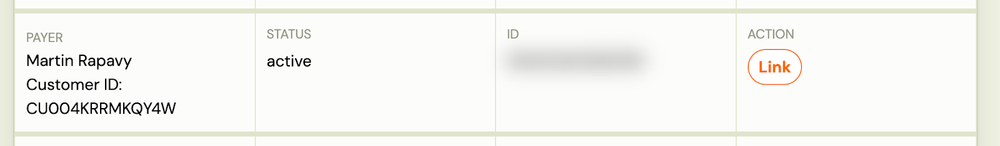
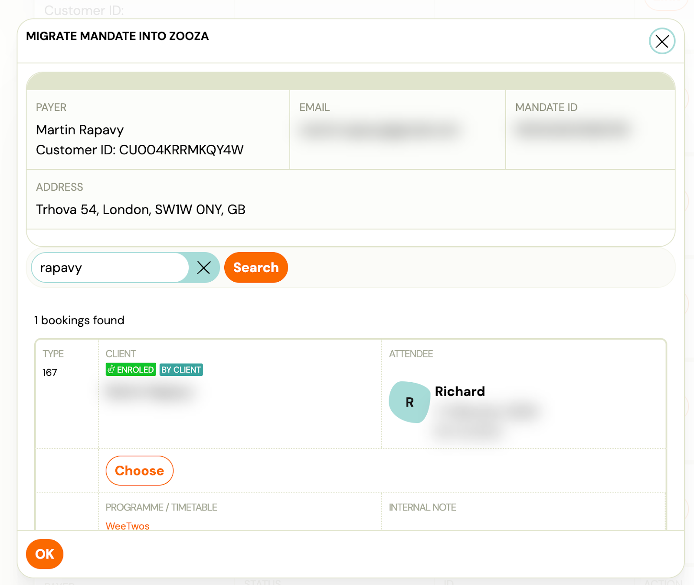

# How to assign Direct Debit mandates to bookings (GoCardless)

After the import, you can assign existing Direct Debit mandates to the imported bookings.

## Link existing Direct Debit mandates (Migration)

Linking mandates is safe — no money will be collected until a payment plan is created later.

#### Quick step-by-step

1. Go to Payments
2. Click Direct Debit (top menu)
3. Click Migration

You will see this option only if:

- Your GoCardless account is connected, and (If not > Zooza (Team & Settins) > Settings > Payments)
- At least one programme previously used Direct Debit

1. A list of all Direct Debit mandates not yet linked in Zooza will be displayed
2. Click Link next to a mandate

1. Choose the correct booking for that mandate

1. Confirm OK

Once linked:

- The mandate is connected to the booking
- It will disappear from the migration list
- No payment will be taken at this point

💡 Payments are collected only after a payment plan is manually created in the next step.

Doing this early allows us later to simply apply payment plans to bookings, without any additional setup.

## Create payment plans

#### Option A: Apply a payment template to the whole class (recommended)

For each class:

1. Open the class
2. Go to Price & Payments
3. Click “Apply payment template”
4. Set the amount (based on the class)
5. Select start date: e.g. 1 January 2026
6. Choose which bookings it applies to (usually all)
7. Confirm and continue

#### Option B: Create payment plans manually per booking (Guide)

The logic is the same, just done individually.
