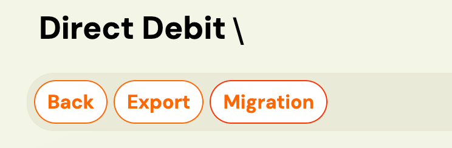
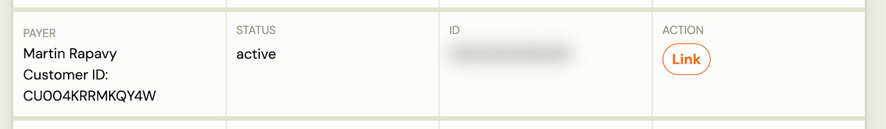
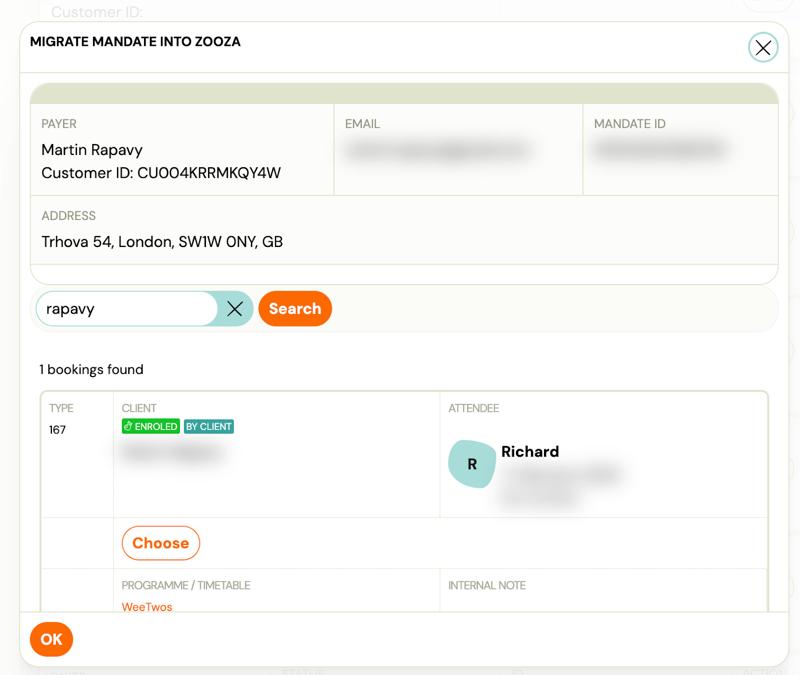
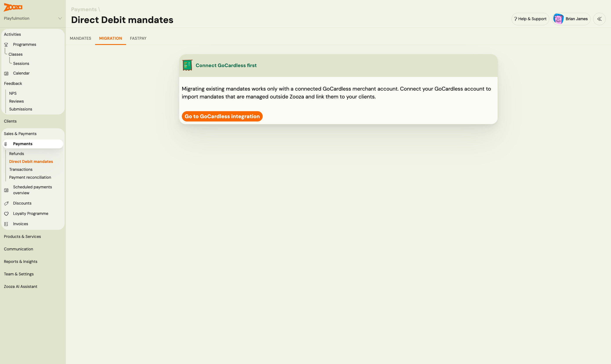

# How to assign Direct Debit mandates to bookings (GoCardless)

After the import, you can assign existing Direct Debit mandates to the imported bookings.

## Link existing Direct Debit mandates (Migration)

Linking mandates is safe — no money will be collected until a payment plan is created later.

### Quick step-by-step

1. Go to Payments
2. Click Direct Debit (top menu)
3. Click Migration

You will see this option only if:

- Your GoCardless account is connected, and (If not > Zooza (Team & Settins) > Settings > Payments)
- At least one programme previously used Direct Debit

1. A list of all Direct Debit mandates not yet linked in Zooza will be displayed
2. Click Link next to a mandate

3. Choose the correct booking for that mandate

4. Confirm OK

Once linked:

- The mandate is connected to the booking
- It will disappear from the migration list
- No payment will be taken at this point

💡 Payments are collected only after a payment plan is manually created in the next step.

Doing this early allows us later to simply apply payment plans to bookings, without any additional setup.

## Create payment plans

### Option A: Apply a payment template to the whole class (recommended)

For each class:

1. Open the class
2. Go to Price & Payments
3. Click “Apply payment template”
4. Set the amount (based on the class)
5. Select start date: e.g. 1 January 2026
6. Choose which bookings it applies to (usually all)
7. Confirm and continue

### Option B: Create payment plans manually per booking (Guide)

The logic is the same, just done individually.

## Monitoring and troubleshooting mandates

The mandate list lives at **Payments → Direct Debit mandates**.

> **Navigation:** Go to **Payments → Direct Debit → Mandates**.

The Mandates tab is a filterable list of all your GoCardless mandates. Each row shows the payer, their linked order, the payment progress (paid vs. outstanding), whether the mandate is currently collecting offline payments, and the last payment date versus when the covered schedule ends.

### Understanding the status signals

Each mandate shows two key health indicators:

| Signal | What it means |
|---|---|
| **Offline-capable** | The mandate is technically able to charge offline (GoCardless, active, valid mandate ID). |
| **Currently collecting** | The mandate is currently enabled to charge scheduled payments. A mandate can be capable but not collecting. |

A mandate that is **offline-capable but not currently collecting** while it still has outstanding payments is flagged as **Needs attention**.

### Triage filters

| Filter | What it shows |
|---|---|
| **Needs attention** | Mandates that can charge offline but are not currently collecting, with unpaid payments outstanding. These need investigation. |
| **Not collecting offline** | All mandates where offline collection is currently disabled, regardless of capability. Wider than "Needs attention". |
| **Provider** | Filter by payment provider (GoCardless). |
| **Active** | Active or inactive mandates. |
| **Search** | Filter by payer name or order ID. |

### Recalculating offline-charge availability

If a mandate shows "not collecting" but you believe it should be active, click **Recalculate** on that mandate row. Zooza re-evaluates the offline-charge eligibility and refreshes the displayed state.

Recalculate is per-mandate only — there is no bulk recalculate in the current version.

### Offline charge columns on payment plans

When you open a registration's **Payment Plan** tab and the plan uses offline charging, you will see two additional columns on the scheduled payments table:

| Column | What it means |
|---|---|
| **Will charge offline** | This scheduled payment is set up to charge via the linked mandate. |
| **Sent to offline** | The payment has been dispatched to the offline charging queue. |

A header at the top of the payment plan indicates whether the plan is currently able to charge offline at all.

### When the schedule ends before the mandate

A mandate may stay active even after the covered payment schedule has ended. This is normal — Zooza shows the schedule end date on the mandate row for reference but does not treat this as an error on its own.

## Connection maintenance

After initial setup, your GoCardless bank connection requires periodic renewal.

**Important:** Most bank connections expire every **90 days** due to bank security policies (PSD2 regulation). When the connection expires, Zooza stops receiving transaction data until you re-authorize.

For full details on managing connection expiry, renewal, and troubleshooting bank-specific issues, see the [GoCardless Connection Lifecycle guide](gocardless-connection-lifecycle.md).

For quick answers about GoCardless, see the [GoCardless FAQ](../faq/gocardless-faq.md).
