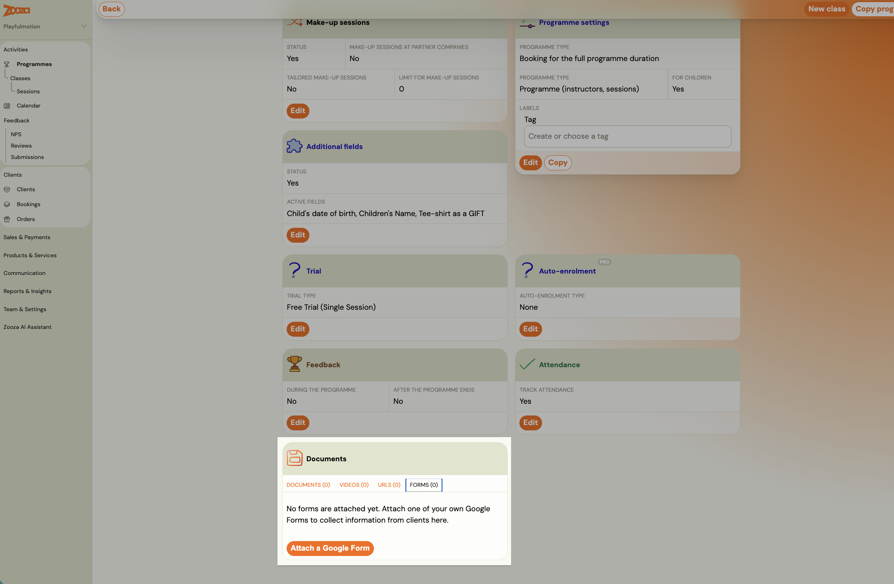
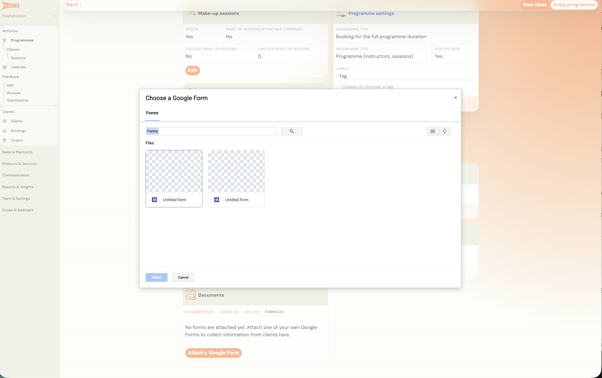
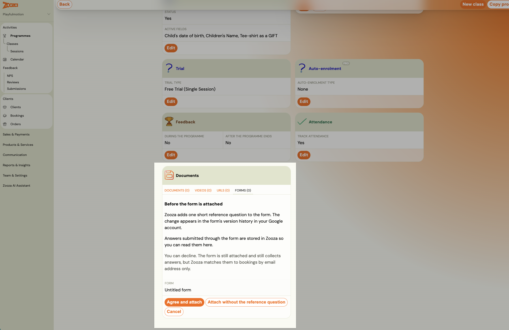
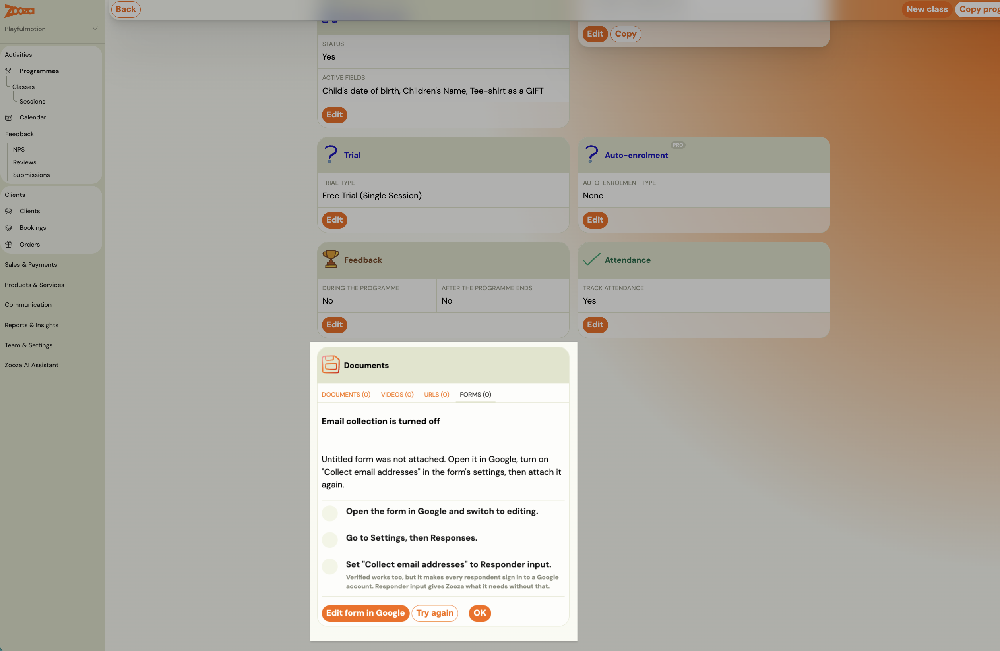
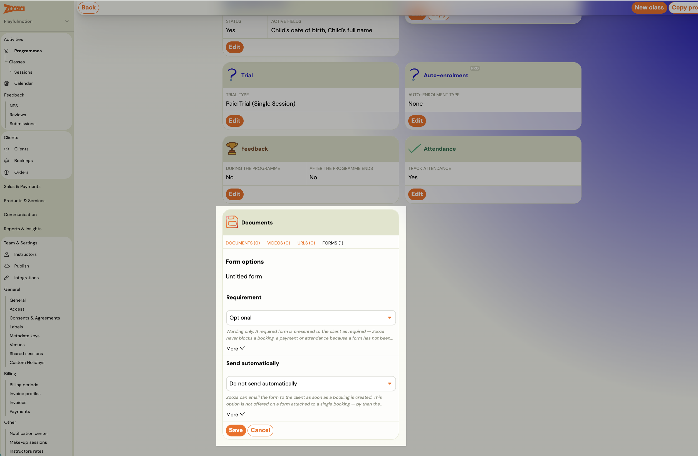
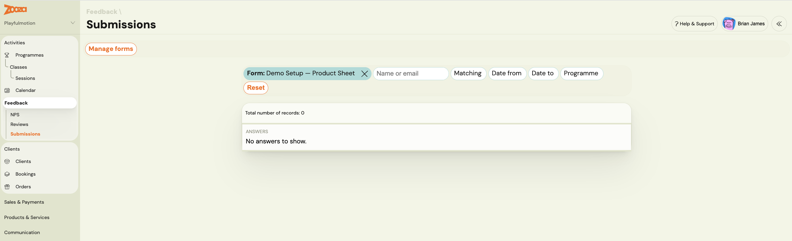
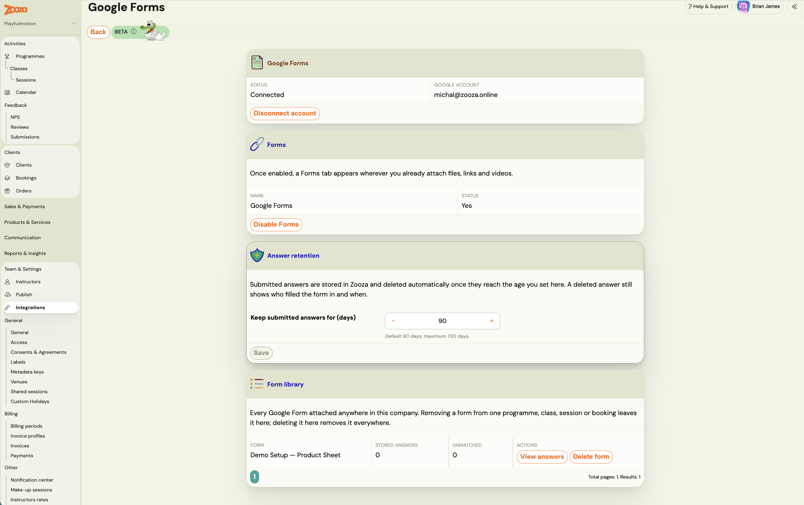

# Collect information with a Google Form

You often need something from a client **after** they book — a health declaration, swimming ability, photo consent, dietary needs. If you already do this with your own Google Form, you know the problem: the link goes out by hand, and nobody can tell who has filled it in. An instructor arrives at a session with no idea whether a parent completed the health declaration.

Attaching the form to Zooza fixes the delivery and the visibility. **Google stays in charge of the form** — it is yours, the responses are yours, and Zooza never edits or deletes anything there. Zooza delivers it to the right people and mirrors the answers so staff can read them without a Google login.

## Before you start

Two things must be true, and Zooza tells you when they are not:

- **Google is connected for your company.** If not, the Forms area says so and offers **Set up Google Forms**. Only an owner or an administrator can do it — everyone else is told to ask one.
- **Your form collects email addresses.** Open the form in Google, switch on **Collect email addresses** in its settings, and then attach it. Without that, Zooza cannot tell whose answer is whose and the form is not attached.

## Attaching a form

You can attach a form to a **programme**, a **class**, a **session** or a **single booking** — put it where it belongs, and everyone under it gets it. A form on the programme reaches every class in it; a form on one class reaches only that class.

**Attaching the same form at two levels is safe.** A form on the programme *and* on one of its classes still counts as one form for that client — they are not asked to fill it in twice, and their completion is not counted twice. Where the two attachments disagree on the options, the more specific one wins, so a class can override what the programme set.

One exception worth knowing: if either attachment says to send automatically, it is sent.

1. Open the thing you want to attach it to, find its **Documents** card, and switch to the **FORMS** tab — it sits alongside **DOCUMENTS**, **VIDEOS** and **URLS**, and the count in brackets tells you how many are attached.
2. Click **Attach a Google Form** and pick it in **Choose a Google Form**.
3. Read the consent step (below) and choose.

> Sign in to Google with the account your company's forms are connected to. Zooza cannot read a form picked from a different account, and it will tell you which account to switch to.

### The question Zooza asks to add

Before attaching, Zooza asks permission to add **one short reference question** to your form. The change shows up in the form's version history in your Google account.

That question is how Zooza ties an answer to the right booking.

**You can decline.** Choose **Attach without the reference question** and the form still attaches and still collects answers — Zooza then matches them **by email address only**. That works, but it is less reliable: a parent who fills the form in from a different address produces an answer nobody can place.

The form's status tells you which mode it is in: **Collecting answers**, or **Matched by email only**.

## Form options

Each attached form has two settings.

**Requirement** — **Optional** or **Required**.

> **This is wording only.** A required form is *presented* to the client as required. **Zooza never blocks a booking, a payment or attendance because a form has not been filled in.** If you need something before a client can book, that is an [additional field](additional-fields.md) on the booking form, not a Google Form.

**Send automatically** — **Do not send automatically**, or **Send when a booking is created**. With the second, Zooza emails the form to the client as soon as they book.

The send option is not offered on a form attached to a single booking, because by then the booking already exists.

## What the client sees

The form appears in the client's profile alongside their other files. If it is one of the ones that genuinely needs attention, it is surfaced first rather than buried in a tab, and it shows whether it is still outstanding.

## Reading the answers

Answers are mirrored into Zooza, so you and your instructors read them in place — on the client's card, without a Google login.

In the **Answers** view you can see who filled it in and when, and filter by name or email.

### Unmatched answers

An **unmatched** answer is one Zooza could not tie to a booking, usually because it was filled in from a different email address than the one on the booking.

Open it, click **Match**, find the right booking, and the answers move onto that client's card. The Forms library shows a count of how many are waiting to be matched.

## The form library

**Settings → Integrations → Forms** lists every Google Form attached anywhere in your company, with the number of stored answers for each.

This is where the difference between two actions matters:

| Action | What happens |
|---|---|
| **Detach** (on a programme, class, session or booking) | The form stops being attached there. **Answers already submitted are kept**, and the form stays in the library. |
| **Delete form** (in the library) | The form is detached **everywhere**, and **every answer to it is permanently deleted, across every booking**. |

Deleting does not touch the form in your Google Drive — that is still yours, with its own responses. It is the copy of the answers inside Zooza that goes, and it cannot be undone.

## Troubleshooting

**The form would not attach.** The usual cause is **Collect email addresses** being off in Google. Turn it on and attach again.

**It attached, but says "Matched by email only".** Either you declined the reference question, or Zooza could not add it. Answers still arrive; they are just matched by email address, so expect some to land as unmatched.

**A parent says they filled it in but you cannot see it.** Look in the unmatched answers. They almost certainly used a different email address.

**The picker will not open.** Your company's Google connection is missing something Zooza needs. Reconnect Google from the integrations page, and contact support if it keeps happening.
