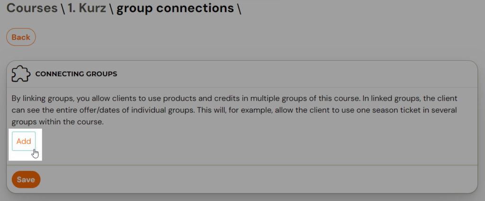
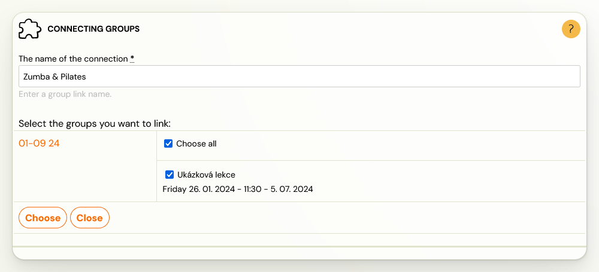
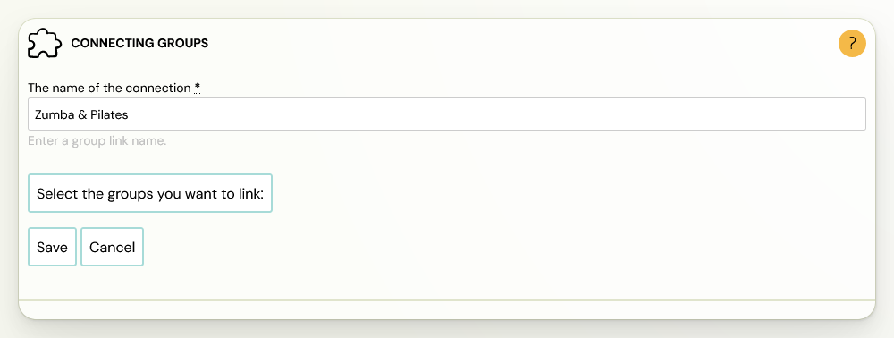

# Group connection

Group connection is a functionality that is used to merge groups within a course that you want to work together in certain ways. This linking allows multiple groups to continue to function as one at several levels.

Currently this functionality is only available for open courses. This is because, for now, the links only serve to make terms in multiple groups available in a single offering.

Example: if a client is enrolled in a Yoga course, but you have an offer split into multiple groups: Mondays at 9:00am and Wednesdays at 6:00pm, then linking will allow them to select dates from both the Monday and Wednesday groups.

You will definitely benefit from groups connection even if you use a season pass product. Clients with linked groups can pay for dates from one season ticket.

## Group connection - procedure

- In the left menu, click on the* Courses* category and select the course within which you want to create a link.
- Then click the *Edit* button in the* Group connection* section.

- Click on the Add button

- Write the link name
- Click on the *Select Groups to connect* button and select the groups from the course that you want to connect together

- Click on *Choose

*
- Click *the Save* button

You can then *Add* another connection, *Edit* or *Delete* existing connections in the list.

This way you can create multiple connections within a single course.
This allows you to be more variable in your course offerings and the
application of products within them. It also allows you to make new
connections of new groups in new billing period.
