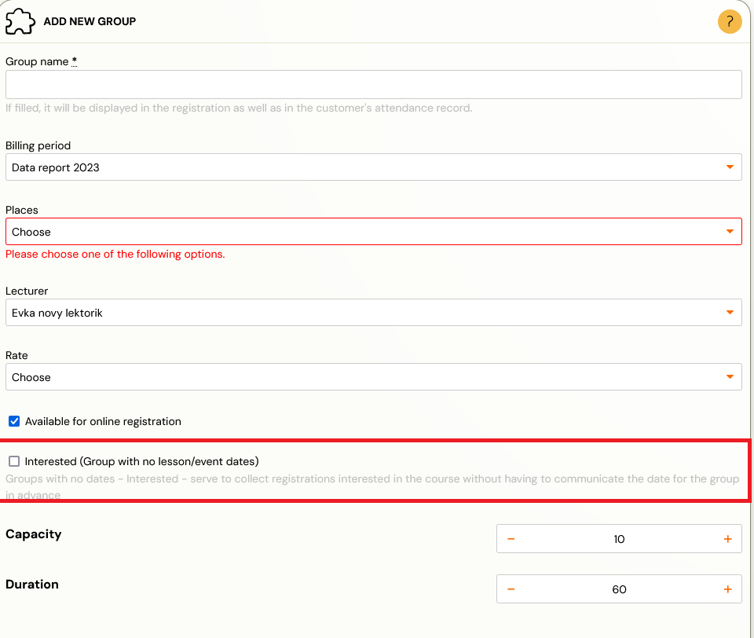
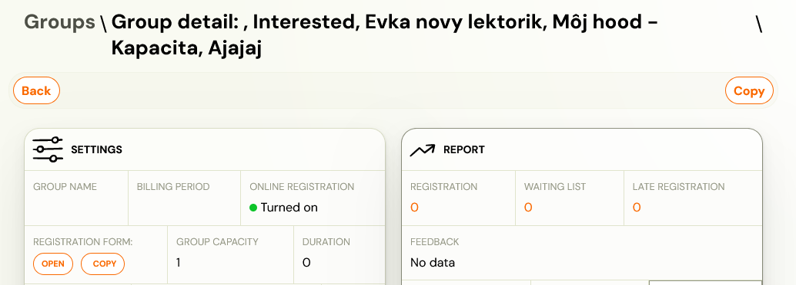
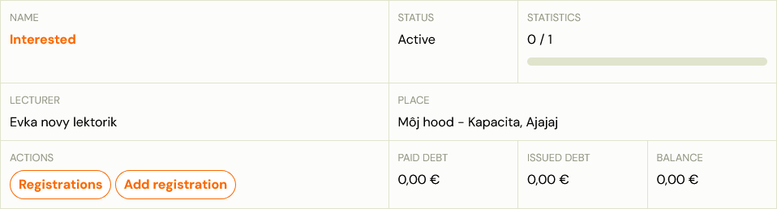

# Group Interested

Group – interested is a class that does not contain any term. This class is used to record interest from your clients in your programme. For example, it could be a language programme or a new type of course that you want to launch, but since you only want to launch it when there’s enough interest, you’ll use this type of course to do just that.

You set up interest collection at the class level by selecting the *Interested *option.

The class set up in this way will also appear in the registration form with the option to register.
Then, once you have enough applicants, you define the dates and the group – Interested automatically changes to a classic group. Your clients will also see all the information in their profiles. This change also works retroactively, so if you delete all dates from a class, it will automatically change to the class – *Interested*.
You can see whether it is a group – Interested or a class with dates based on the name of the class.

