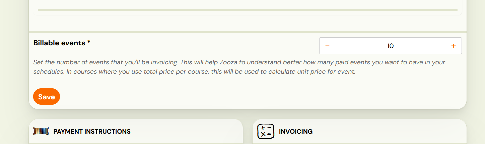
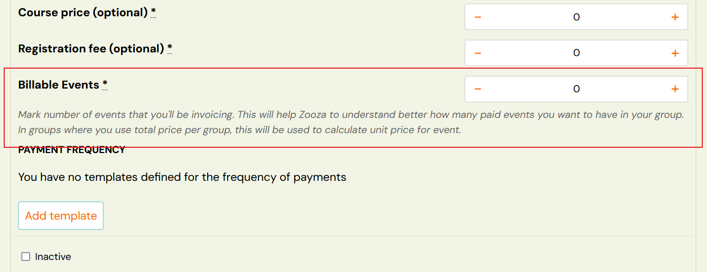
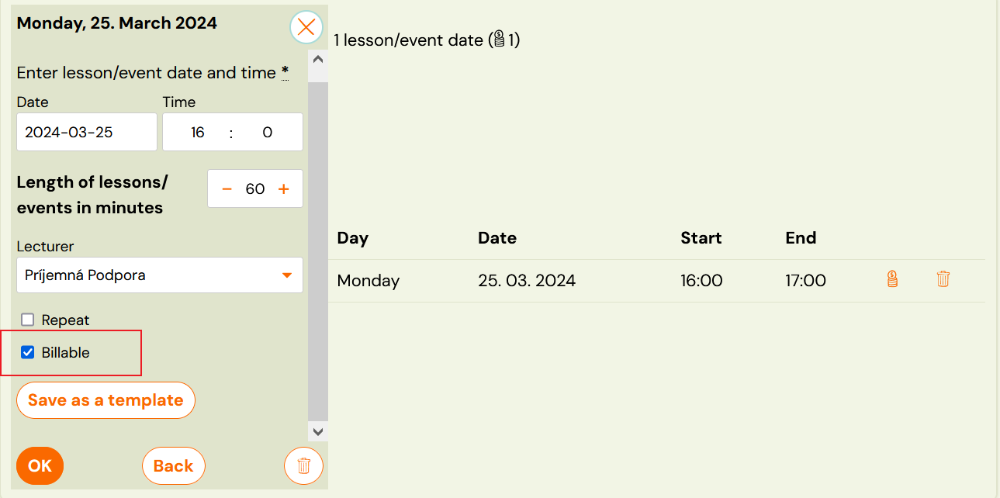
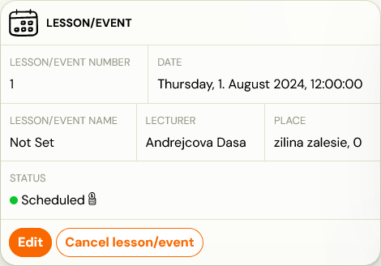
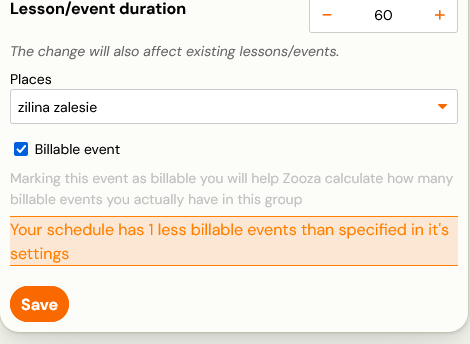
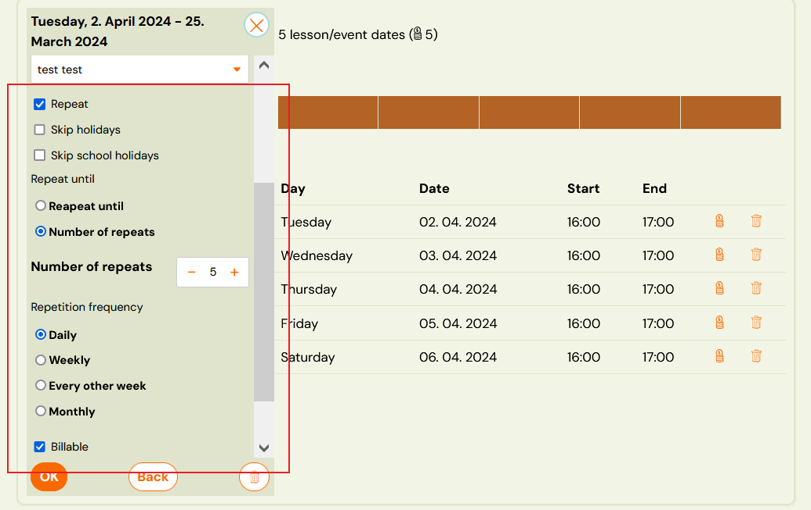
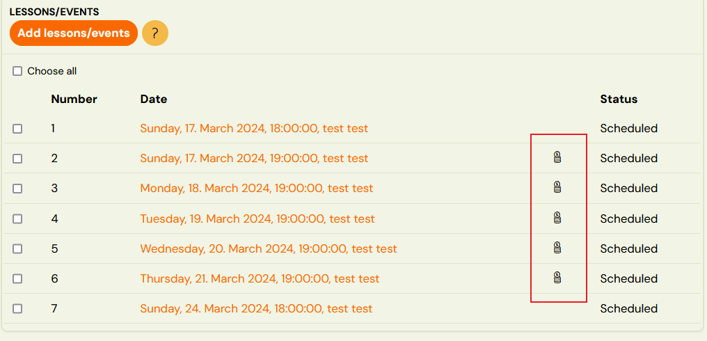

# How to create paid events?

The paid appointments functionality is a way for Zooza to “know” how many appointments in a class should be paid. For various reasons, sometimes the dates in a class do not match the number of paid dates. For example:

- In a full programme – add a “Free of charge
session/session” to the schedule as a credit for “cancelled” sessions. This
increases the number of sessions within the class and when Zooza
calculates the unit price, it uses all these sessions and has no way of
knowing that a particular session is free/unpaid.
- In language school – custom replacement sessions also create more sessions in the class than originally set by the admin.

In other words, paid events are a contract between company and
client, where you agree that the client will pay for e.g. 12 sessions.
Whether the class has 4 or 20 sessions, the price always applies to 12
sessions.

The point of this functionality is as follows: clients can have a
different number of sessions in a class than what is actually paid for.

## How to set it up?

Setting up paid events needs to be synchronized at three levels: programme, class and session.

1. In *Programmes* section of > *Price and Payment* section there is a field – *Billable sessions*. By filling out this setting it will make it the default value for all classes within the programme.
 
2. In *Classes* > *Price and Payment* – *Billable Sessions* -the same setting as in the programme, but if the field is populated in a
class, it will override the setting on the programme. This allows classes to
 have an individual number of billable sessions.

Attention! If a programme has billable sessions set and the setting on the class is 0,
it will always use the programme value That means if a programme has billable
sessions set to 12, classes within this programme cannot have 0 such sessions.

 3. In Sessions/sessions section:

1. mark sessions as *Billable* when creating them

1. in Session detail open Session settings and find a field called *Billable *session
 
 

Should you decide to change the setting during the programme you need to
keep in mind that it is not enough to just increase the number of paid
terms on the programme/class, but also to increase the price of the
programme/class so that the price is correctly budgeted per unit.

## How does it work?

In order for the setup to work correctly, it needs to be done at all
levels. This means that if you want to have 10 billable sessions in the
programme, you need to have 10 sessions marked as billable at the session level
 as well.

In case of adding terms to a class, if you have the number of
billable sessions set to 5 on the class/programme level and you click on
repeat, the number in the *Repetition frequency* field will automatically be preset to 5 (as an indication that there are 5 billable sessions missing from the class).

After you set up billable sessions, you will see a checkbox at the
appointment level that allows you to set all newly created appointments
as billable or not billable. You can adjust the settings by clicking on
the “money pile” icon.

## Calculation of the unit price of the session

When a class has set up billable sessions, the unit price for the class
 is calculated using that setting instead of the total number of sessions
in the class. This only applies to continuous programmes. One-off and Open
programmes are already predefined by the unit price.

How to view and work with billable sessions read manual called [Viewing/Tracking billable sessions](viewing-billable-events.md)
