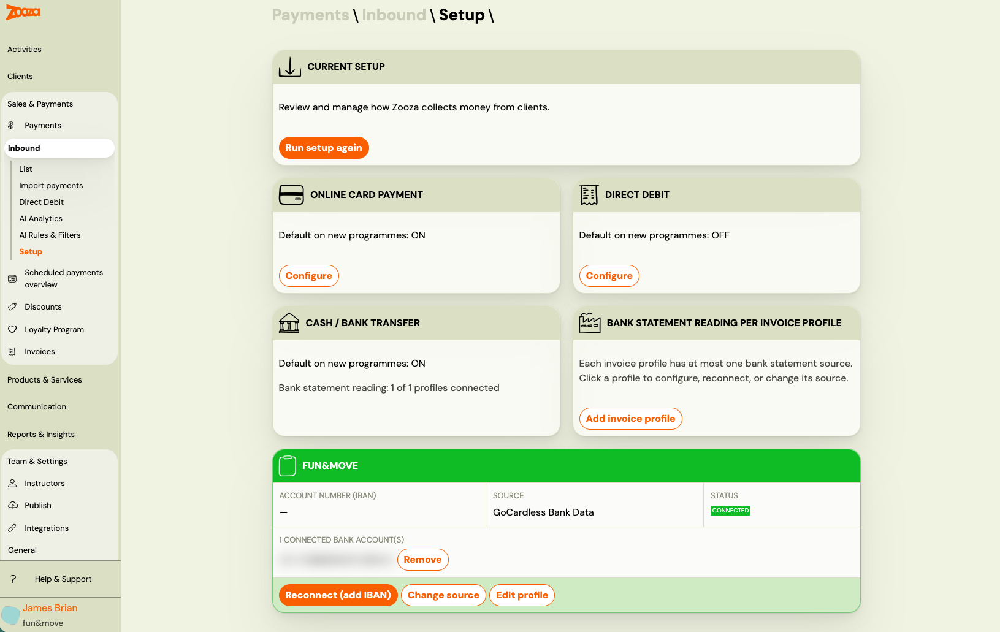

<!-- Synonyms: bank transfer matching, payment pairing, incoming payments, match payment to booking, payment not paired, platba nespárovaná, príchodzí platba, párovanie platieb, bejövő fizetés párosítás, platba nepřiřazena -->

# Inbound payments — setup and pairing

Inbound payments is the system that watches your bank account for incoming transfers and automatically matches each payment to the correct booking or order. When a client pays by bank transfer, Zooza picks it up, identifies which registration it belongs to, and records it — without manual entry.

---

## How it works

1. Your client pays to your bank account using the reference number (variable symbol) from their invoice or payment schedule.
2. The bank notifies Zooza (via GoCardless, email notification, or CSV import).
3. Zooza parses the transaction and looks for a matching booking using the reference number.
4. If a match is found and there are no issues, the payment is paired automatically and appears on the registration.
5. If something is unclear, the payment lands in **Manual review** for you to handle.

---

## Setting up ingestion

All payment channel setup is done through the **Setup wizard** at **Payments → Inbound → Setup**. The wizard walks you through each channel — online card, direct debit, and cash / bank transfer — and lets you configure bank statement reading per billing profile.

Before Zooza can receive bank transfers, you must connect at least one ingestion channel.

### GoCardless (open banking)

GoCardless here acts as a **bank account reader**, not a payment processor. It monitors your bank account for incoming transactions and reports them to Zooza in real time.

> **This is separate from GoCardless as a direct debit gateway.** GoCardless has two roles in Zooza — collecting direct debits from clients, and reading your bank account for incoming transfers. These are independent features.

**To connect:**

1. Go to **Payments → Inbound → Setup**.
2. In the **Current setup** screen, find your billing profile and click **Reconnect (add IBAN)** or configure it from the Cash / bank transfer step of the wizard.
3. Select your bank and authorise GoCardless to read your transaction data (standard open banking consent flow).
4. Once connected, incoming transactions are detected and processed automatically.

**Important — consent expiry:** Your open banking consent expires periodically (varies by bank, typically 90 days under PSD2). When it expires, transaction notifications stop. Zooza does not send an alert when the consent expires — you will notice the absence of incoming payments in the dashboard. Reconnect promptly via **Payments → Inbound → Setup**.

### Bank email notifications

Most banks can send you an email when a payment arrives. Zooza generates a unique email address for each of your billing profiles. You set your bank to forward payment notifications to that address.

**To find your inbound email address:**

1. Go to **Payments → Inbound → Setup**.
2. Open the **Cash / bank transfer** step.
3. Select your billing profile and choose **Email parser**.
4. Copy the generated email address and configure your bank to forward payment notifications to it.

**Supported banks:**

| Country | Banks |
|---------|-------|
| Slovakia | Tatra Banka, VÚB, SLSP (Slovenská sporiteľňa), UniCredit, Prima Banka, FIO, ČSOB |
| Czech Republic | ČSOB, Raiffeisenbank, FIO, Komerční banka |

Each bank uses a different email format — Zooza has a specific parser for each.

### CSV import

For manual or one-off import of bank statement data:

1. Go to **Payments → Inbound → Import**.
2. Upload a CSV file with the required columns: `posting_date`, `amount`, `currency` (required), plus optional `payers_iban`, `variable_symbol`, `information_for_beneficiary`.
3. Each row is processed individually. Duplicates are detected and skipped automatically.

Maximum 100 rows per import.

---

## How payments are matched

Zooza uses the **variable symbol** (reference number) from the transaction as the primary matching mechanism. This is the number printed on the client's invoice and in their payment instructions — it matches the registration or order ID in Zooza.

**Matching order:**

1. **Variable symbol → registration** — direct lookup by order number.
2. **Variable symbol → product order** — if no registration found.
3. **Custom customer ID** — if the client used their own customer ID as the reference number.

After a match is found, Zooza runs validation checks: the booking must be active, the payment status must allow new payments, and the schedule must not be expired.

> **Delegation chains:** Some registrations delegate payment management to another registration (e.g. a parent registration managing siblings). Zooza follows these chains automatically and pairs to the correct managing registration.

Finally, an AI layer checks for duplicates — it confirms the match or flags anything suspicious for manual review.

---

## Payment statuses

| Status | Meaning |
|--------|---------|
| **New** (manual review) | Zooza could not match the payment automatically. You need to pair it or ignore it manually. |
| **Paired** | Payment was matched to a registration and recorded in the payments ledger. |
| **Ignored** | Payment was identified as not relevant (rent, utilities, etc.) and will not be processed. |

There is no "pending" state visible to admins — a payment is either waiting for you (New) or already handled (Paired/Ignored).

---

## Manual review — what to do

Payments that land in **New** status need your attention. Go to **Payments → Inbound → List** and look for payments with status **New**.

### Pairing manually

1. Click the payment.
2. Select the registration or order it belongs to.
3. Confirm.

The payment is recorded on the booking and the payment status updates immediately.

### Ignoring a payment

If the payment is not related to Zooza (rent, utilities, salary, etc.):

1. Click the payment.
2. Click **Ignore**.
3. Optionally, choose **Create filter** — Zooza will set up an automatic rule to ignore similar payments in the future (based on the payer's IBAN and payment note).

---

## Ignore filters

Filters let you automatically ignore recurring non-Zooza payments. When a filter matches an incoming payment, it is ignored immediately without any manual action.

A filter matches when:
- The **payer's IBAN** matches exactly, AND
- The **note pattern** matches (if configured).

Filters have built-in safeguards — a filter cannot be so broad that it starts catching real Zooza payments. If you manually override 3 ignored payments from the same filter (by pairing them instead), the filter is automatically deactivated.

You can manage filters in **Payments → Inbound → AI Rules & Filters**.

---

## Business rules

Business rules are natural language instructions you write to guide how payments are evaluated. They are included in the AI's context when it reviews incoming payments.

**Example rules:**
- *"Payments from IBAN SK12... arriving within 3 days of each other with the same amount are duplicates."*
- *"When the reference number starts with 9, it belongs to a product order, not a course registration."*

**Rule types:**

| Type | Purpose |
|------|---------|
| **Dedup** | When to consider two payments duplicates |
| **Ignore** | When to ignore a payment regardless of match |
| **Pairing** | Special logic for matching payments to orders |

To add rules: **Payments → Inbound → AI Rules & Filters**. Maximum 10 active rules per account.

---

## Troubleshooting

**Payment is in manual review (New) — why wasn't it auto-paired?**

To find the exact reason for a specific payment, open the payment in **Payments → Inbound → List** and look for the **Matching Process Summary** section. It shows which step the matching stopped at and why.

Common reasons:
- The client used a different reference number (not the variable symbol from the invoice).
- The booking was cancelled or deleted by the time the payment arrived.
- The payment schedule ended more than 3 months ago.
- The payment amount is larger than the remaining balance (flagged as suspicious).
- GoCardless consent has expired — no new transactions are being received.
- **AI confidence too low** — the match looked probable but not certain enough for automatic pairing. The payment is left for manual review even though the customer and amount appear correct. Open the payment and pair it manually.

**Payments stopped arriving — GoCardless connection issue?**

Go to **Payments → Inbound → Setup** and check the current setup screen. If a billing profile shows a reconnection warning (yellow or red status), click **Reconnect (add IBAN)** and go through the GoCardless authorisation flow again.

**Duplicate payment appeared — how to handle it?**

Ignore the duplicate. If you have a filter set up for the payer's IBAN, the duplicate would have been caught automatically. If not, manually ignoring it and creating a filter prevents future occurrences.

---

## Related

- [Set up how Zooza collects money from clients](../setup/inbound-payments-setup.md) — step-by-step wizard for configuring channels and bank statement reading
- [Inbound payments — technical reference](../reference/inbound-payments-internals.md) — full algorithm details, AI evaluation, delegation chains
- [Billing and invoicing](../setup/billing-and-invoicing.md) — billing profiles and IBAN setup
- [GoCardless direct debit](./gocardless-direct-debit-mandates.md) — collecting payments from clients (separate from bank account reading)
- [Payments and Billing FAQ](../faq/payments-and-billing-faq.md)
