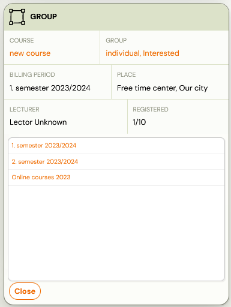
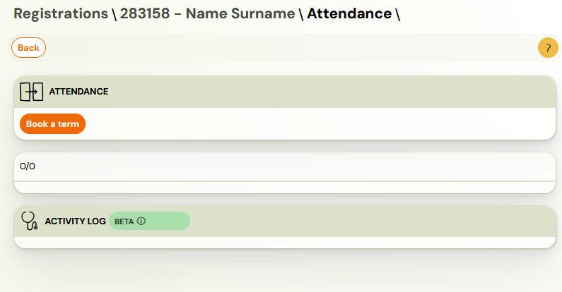

# Individual sessions via lead collection class

If, as a language school or a project offering individual sessions, you are first collecting interest and then creating dates and schedules, it is ideal to use a class – [Interested](lead-collection.md)(classes without dates).

The first question to ask yourself is how well you can tell when and how many dates you are offering a client. Individual sessions can be created with a schedule:

1. Full – you know exactly when the dates will take place and how much you want to be paid for them. In this case, use progress programmes with payment in advance or according to your own payment template. See [Creating a class](creating-a-class.md). 
2. Gradual - you don't know exactly when the dates will take place and the client pays by the number of hours. In this case, use Pay-as-you-go programmes and create hours on a rolling basis with ongoing payments. If the client has prepaid credit, you can record it on the booking.
3. How to create a [Pay-as-you-go programme](pay-as-you-go-programme.md)
4. Instructions on how to edit payments on booking.

Based on the above, start making an offer as follows:

1. Create classes as Interested in a given courseInterested parties will gradually register in the class and wait for instructions. Don’t forget to edit the email template that will come as a confirmation of inclusion in the class – *Interested*.[Instructions](lead-collection.md)
2. Create an individual groupThen create sessions for individual bookings by creating a class of one capacity. [Instructions](creating-a-class.md)
3. Move the client from the lead collection class to an individual groupCreate session/session dates and move the given booking to this class from the class – *Interested*. In the booking details, click on the *Class *tab and then on the *Move *option where you select where.
 
 
4. Choose the client’s first date or let him choose it himselfIn the client’s attendance section, sign the client in for the appointment or they can do so in their profile.
 

Summary for open sessions:

1. Create a class for a client
2. Insert the first session
3. The client signs up for the appointment in the profile by selecting it or you select the appointment for the client in the booking details. In both cases, the debt for that hour is immediately created; if there is a credit, it is deducted from the credit.
4. If the session is cancelled, the credit will be refunded. If the session is moved in time, the credit remains applied.

Note: If you do not want to display the class in the public calendar menu or booking form, just uncheck the class in the programme properties and save the change. You leave the lead collection class up for booking and the other individual classes remain hidden.
