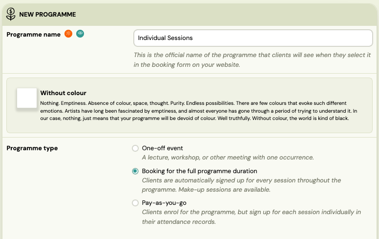
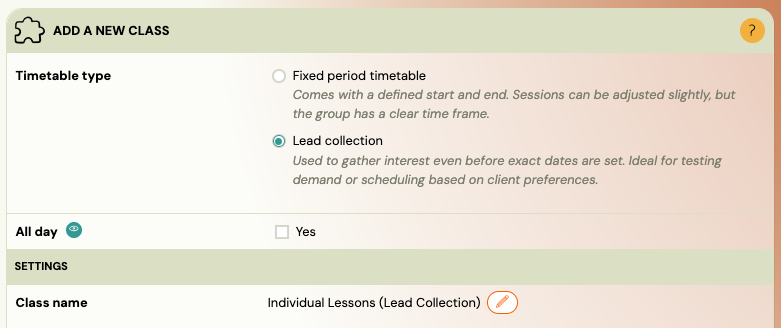
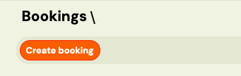
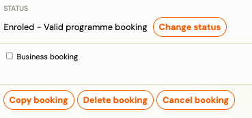
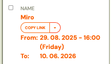
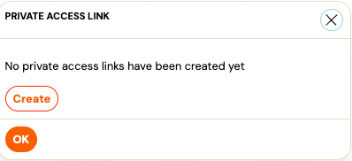
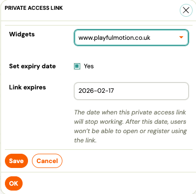
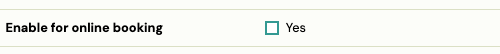

# Individual Sessions: How to Sell, Plan, and Manage 1:1 Sessions in Zooza

This guide explains a practical workflow for individual (1:1) sessions in Zooza:

1. Collect interest / bookings for 1:1 sessions (even without fixed dates)
2. Create a private individual plan for each client (with sessions and payments)

## Option A: Collect interest first (recommended)

### Why this approach works

- You can advertise “Individual sessions” without publishing a real schedule.
- You still get bookings inside Zooza (client record + booking context).
- Later, you convert each booking into a personal 1:1 plan (a private class/class with sessions).

## Step 1: Create a programme for “Individual sessions”

1. Go to Programmes
2. Create a new programme, e.g. “Individual Sessions”
3. Set the programme type to Ongoing
4. Save

Tip: Keep the programme simple. The goal is to have a “container” to collect interest and later manage bookings.

## Step 2: Create a class/class without dates (for interest collection)

1. Open the programme Individual Sessions
2. Create a new Class/Class
3. Do not add any sessions/timetable dates yet
4. Ensure it is visible for online registration only if you want to collect sign-ups publicly

Result: you can collect sign-ups even though there are no sessions yet.You now have bookings in Zooza, ready to be assigned to an individual plan.

##

## Step 3: Collect bookings (interest)

Clients can register via your online booking flow (or you can add them [manually](personas.md)).
Once submitted, you will see these bookings in Zooza.

### What happens next?

- You now have a booking record linked to:the client
- the programme (“Individual Sessions”)
- the initial class/class (interest placeholder)

From here, you can create the real 1:1 plan.

## Step 4: Create a booking manually (optional)

You can also create bookings manually in Zooza, for example when:

- a client calls / messages you directly
- you want to register them without using the website
- you want to copy an existing booking and tweak it

### Where to do it (typical places)

Use whichever is most natural in your workflow:

A) From the Client profile

- Open Zooza > Clients > Bookings
- Use an action Create booking

B) Copy an existing booking

- Open an existing booking
- Use Copy booking
- Adjust programme/class/payment plan

##

## Optional: Share a private booking link for a specific individual class

Sometimes you want the class to stay non-public, but still allow the parent to register online (instead of you creating the booking manually).

You can do this by sharing a private booking link to that specific class/class.

### How it works

- The class/class is not publicly listed on your website/widget.
- Only people with the direct link can open the booking page and submit the booking.

### Steps

1. Open the individual class/class (e.g. “1:1 – John Smith”)
2. Find the option to copy the booking URL:Copy URL
 

3. or Customized link
 
 

4. Send this link to the parent.

Result: the parent can register the child into that specific individual plan via the link, while the class remains private.

Option B: Build the individual plan (private class per client)

This is the core model: one client = one private plan (one private class/class, sessions, and payment plan).

## Step 5: Create a private 1:1 class/class for the client

1. In the programme Individual Sessions, create a new Class
2. Name it something like:“1:1 – John Smith”
3. or “John Smith (Individual Plan)”
4. Disable online registration (so it’s not publicly bookable) (during the process of class creation, or in the class settings).

Use this setting:

See guide: [Online registration options](../setup/online-registration.md)

Goal: This class exists only for internal scheduling and client management.

## Step 6: Add sessions (the actual 1:1 schedule)

Now add the real schedule for that client.

Example: every Tuesday at 10:00.

[

Guide: Creating Sessions in a Class](https://support.zooza.online/portal/en/kb/articles/creating-events-in-groups)

Tip: You can create sessions as:

- recurring weekly sessions, or
- individual dates when needed (more flexible for ad-hoc coaching)

##

## Step 7: Make-up sessions (optional)

If you want to allow a client to cancel and pick another available time, enable custom replacements.

[

Guide: Custom make-up sessions](https://support.zooza.online/portal/en/kb/articles/replacement-lessons)

Typical use-case:

- The instructor has a set of “available slots”
- The client can reschedule into those slots (based on capacity/settings)

## Step 8: Payment plan per individual booking

Each individual plan (booking) can have its own payment setup.

This is especially useful if:

- client pays monthly
- client pays per block (e.g. 10 sessions)
- you want a tailored schedule (down payment, recurring invoices, etc.)

[

Guide: Payment templates on booking](https://support.zooza.online/portal/en/kb/articles/payment-templates-creation)

Best practice: Keep a few reusable payment templates (e.g. “Monthly 1:1”, “10-pack”, “Pay-as-you-go”), and assign the right one per booking.

Recommended workflow summary

1) Create programme “Individual Sessions” (Ongoing)2) Create interest class (no sessions)3) Collect bookings (online or manual)4) For each client:

- Create a private 1:1 class/class named after the client
- Add sessions (weekly or ad-hoc)
- Enable replacement logic if needed
- Assign the payment template for that booking

Notes & common pitfalls

- Don’t publish the real 1:1 class online (unless you intentionally sell bookable slots).
- Use a separate private class per client if you want clean reporting, payments, and scheduling.
- If you want to offer “pick a time from available slots”, build availability via the replacement approach rather than publishing a fixed timetable.
