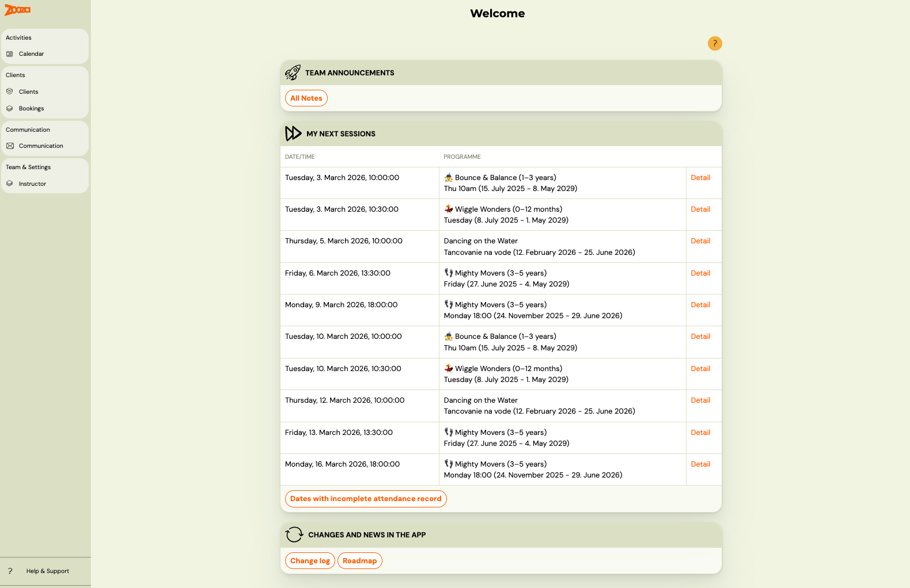
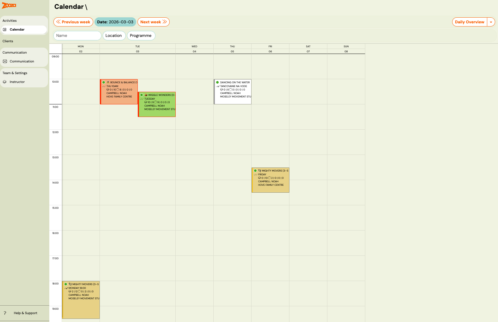
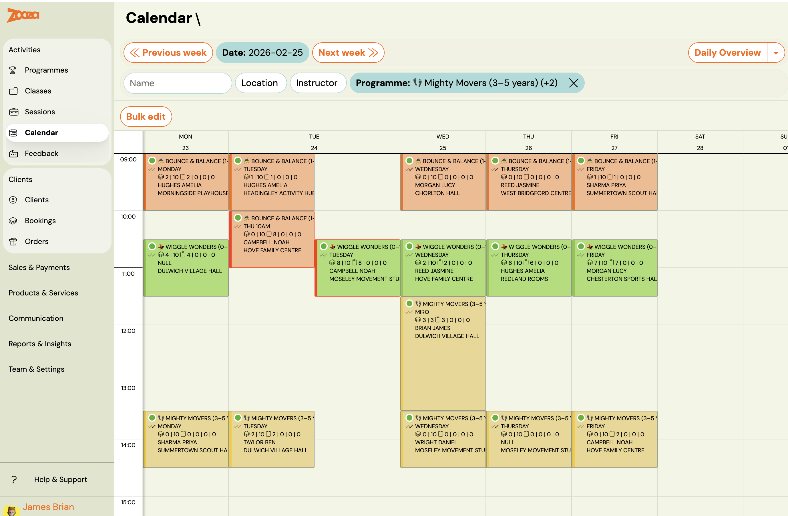
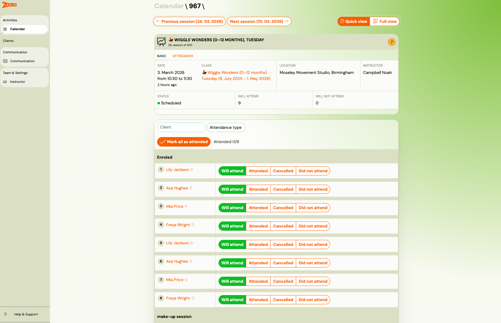
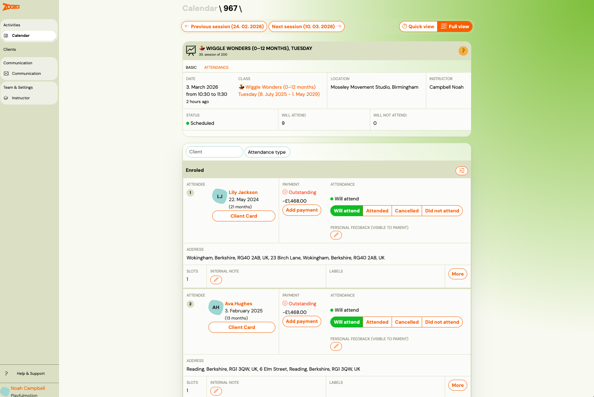
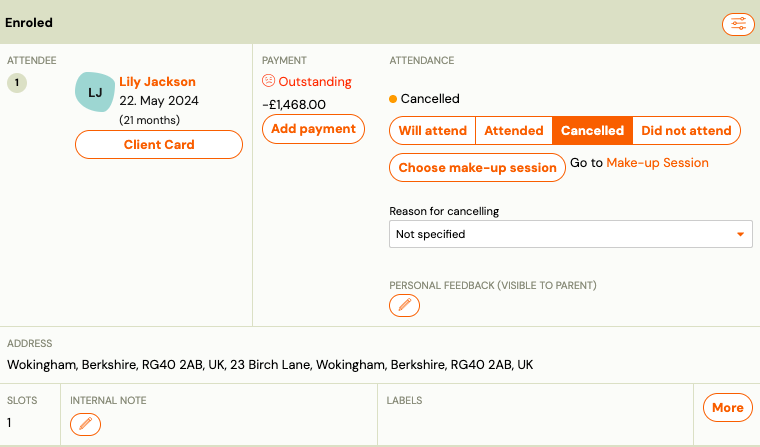
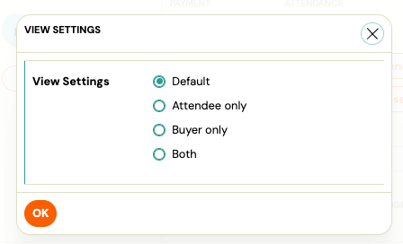

# Attendance management for instructors

This guide covers everything an instructor needs to manage attendance in Zooza — from finding your sessions on the dashboard to marking attendance, reading consents, writing notes, and communicating with the group.

## Dashboard — your upcoming sessions

After logging in, the **Welcome** screen shows your personal dashboard. The **My Next Sessions** section lists all upcoming sessions assigned to you, sorted by date and time.

Each row shows the date, time, and class name. Click **Detail** to go directly to that session's attendance view.

At the bottom of the section, the **Dates with incomplete attendance record** button highlights any past sessions where attendance has not been recorded. Use this to catch up on missed entries.

## Calendar — weekly overview

Go to **Calendar** in the left menu to see your sessions in a weekly grid.

Each session tile shows the class name, instructor, location, and a count of enrolled and attending clients.

 Use the **Previous week** and **Next week** buttons to navigate, or switch to **Daily Overview** for a single-day layout.

You can filter sessions by **Name**, **Location**, or **Programme** using the filter bar at the top.

Click any session tile to open the session detail.

## Session detail — Quick view and Full view

When you open a session, you land on the **Attendance** tab. In the top right corner, toggle between **Quick view** and **Full view**.

### Quick view

Quick view is the fastest way to mark attendance. It shows:

- Session header: date, time, class, location, instructor, status, and the current **Will attend** count.
- **Mark all as attended** button — sets all enrolled clients to Attended in one click. You can still adjust individual statuses afterwards.
- A compact client list with four status buttons per client.

Use Quick view for daily attendance marking, especially on mobile.

### Full view

Full view shows additional detail for each client:

- Payment status (e.g. Outstanding) — visible to help you identify clients with payment issues.
- **Personal feedback** icon — lets you add a note visible only to that child's parent.
- make-up session clients appear in a separate **make-up session** section below the enrolled list.

## Attendance states

For each client, select one of four states:

| State | Meaning | Generates make-up credit? |
|-------|---------|--------------------------|
| **Will attend** | Default — client is expected. | No |
| **Attended** | Client was present. | No |
| **Cancelled** | Client cancelled in advance. | **Yes** |
| **Did not attend** | No-show, no prior cancellation. | No |

> Only **Cancelled** generates a make-up credit. If a parent says they didn't receive a credit, check whether the state was set to "Did not attend" instead of "Cancelled".

## make-up session clients

In Full view, make-up session attendees appear in a separate **make-up session** section at the bottom of the list.

For each make-up client you can:

- Mark their attendance the same way as enrolled clients.
- Click **Change make-up session** to move them to a different session.
- Click **Cancel make-up session** to remove their make-up booking.
- Click **Go to Make-up Session Original Session** to see the original session they missed.

Instructor could decide to see the list of names only for Attendee or Buyer (usually parent) or both.

## Session notes

At the bottom of the session detail, in the **Notes** section, you can add two types of notes:

- **Session summary (visible to the client)** — this note is shared with parents. Use it to describe what was covered in the session, homework, or announcements.
- **Session note (Internal)** — visible to admins and instructors only. Use it for internal observations or reminders.

Notes are optional and availability may depend on your organisation's settings.

## Consents

The **Consents** section in the session detail shows the consents each client has given. This is useful before activities where consent matters — for example, to check who has given permission for photos to be taken during the session.

Consents are set by parents when registering and cannot be changed from the session view.

## Group communication

At the bottom of the Full view, you will find two buttons:

- **Send email to N recipients** — sends an email to all clients enrolled in this session.
- **Send text message to N recipients** — sends an SMS to the same group.

Use these to communicate with the whole group for that specific session — for example, to announce a change of location or send a reminder.

> Note: Communication buttons may not appear if your instructor role does not include communication permissions. Contact your admin if you do not see these options.

## Related

- [Zooza 101 for instructors](zooza-101-instructors.md)
- [Attendance and catch-up classes FAQ](../faq/attendance-and-catchups-faq.md)
- [Cancellation limit settings](cancellation-limit-settings.md)
- [Make-up sessions FAQ](../faq/make-up-sessions-faq.md)
