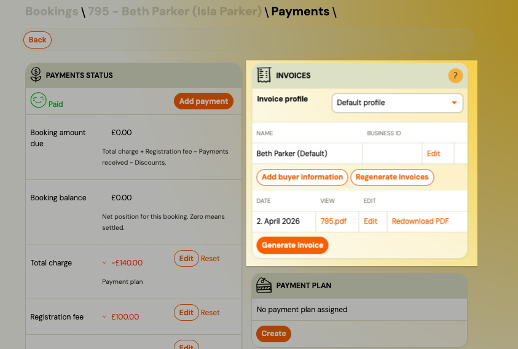
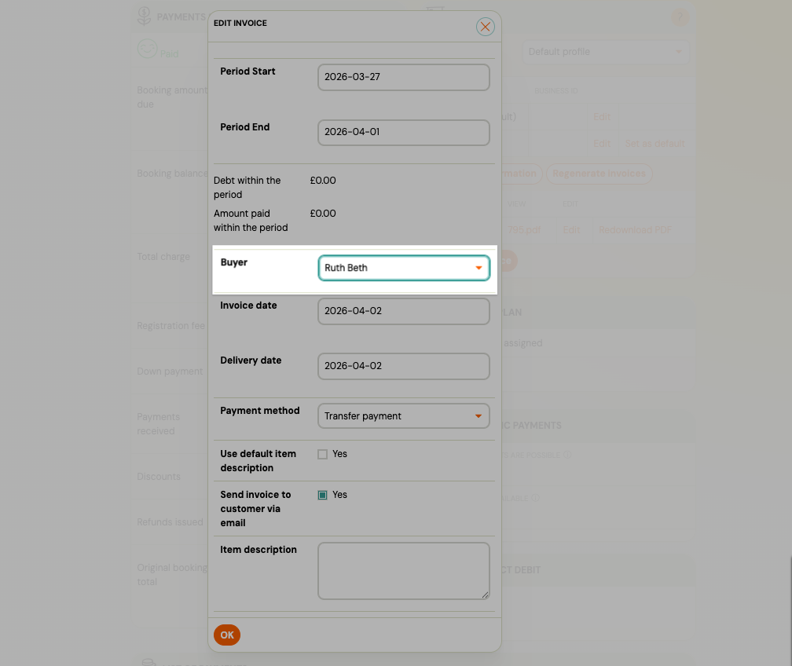

# Invoice buyer data (orderer details)

The **invoice buyer** is the entity that appears as the recipient (orderer) on an invoice — usually the parent registering a child, or a company when a business booking is made. Zooza stores buyer details separately from personal data so the same billing profile can be reused across registrations without re-entering details each time.

---

## How buyer data is populated

When an invoice is generated for the first time, Zooza automatically creates a buyer data record from the registration:

- If the registration was made as a business booking (company name, address, IDs entered at registration) → the buyer profile is created from those fields.
- Otherwise → the buyer profile is created from the client's name, email, and phone number.

This happens silently — no admin action needed. The buyer profile is stored against the client record (person) and reused for future invoices from the same registration.

**Deduplication:** If the same client registers again with the same billing details, Zooza reuses the existing buyer profile instead of creating a duplicate. If the billing details change (e.g. a different company name or VAT number), a new profile is created automatically and linked to the new registration.

---

## Viewing and editing buyer profiles

Each client can have one or more buyer profiles. To view and manage them:

1. Open the booking detail page (**Bookings** → select the booking).
2. Find the **Payment > Invoice** section.
3. Click **Edit** next to a profile to update it, or click **Add Buyer Information** to create a new one.

Each profile can contain:

| Field           | Description                                                   |
| --------------- | ------------------------------------------------------------- |
| **Name**        | Full name or company name as it should appear on the invoice. |
| **Street**      | Street address.                                               |
| **City**        | City.                                                         |
| **ZIP**         | Postal / ZIP code.                                            |
| **State**       | State or region (optional).                                   |
| **Business ID** | Company registration number (ID).                             |
| **Tax ID**      | Tax identification number (TAX ID).                           |
| **VAT ID**      | VAT number (VAT ID).                                          |
| **Email**       | Billing email address (optional).                             |
| **Phone**       | Billing phone number (optional).                              |

> **Note:** Changing the buyer profile here does not automatically update already-issued invoices. To apply the corrected details to existing invoices, use the **Regenerate invoices** action (see below).

---

## Selecting buyer data per registration

Each registration is linked to the buyer profile that was active when its invoices were last generated. If a client has multiple buyer profiles (e.g. two companies), you can select which one to use for a specific registration:

1. Open the booking detail.
2. Go to **Invoices**.
3. Click the edit icon next to the invoice.
4. Select the **Buyer** from the dropdown — showing all buyer profiles on record for this client.
5. Save.

The invoice is updated with the selected buyer details.

---

## Regenerating invoices with updated buyer data

If you corrected buyer details after invoices were already issued, you can regenerate them without creating duplicates:

1. Open the booking detail.
2. Go to **Invoices**.
3. Click **Regenerate invoices**.
4. Optionally select a different buyer profile if needed.
5. Confirm.

Zooza regenerates all invoice on that registration using the selected buyer profile.

> **Supported engines:** Invoice regeneration is available for **Faktury Online** and **Xero** only. For other invoice engines, you must cancel and re-issue the invoice manually through your accounting software.

> **What happens to the old invoice:** The previous invoice version is archived. The new invoice replaces it with the updated buyer details. The invoice number is preserved.

---

## Common scenarios

### The invoice has the wrong company name

The client registered as a company but entered the name incorrectly. Steps:

1. Go to **Clients** → open the client's profile.
2. Find **Invoice Buyer Data** and edit the relevant profile — correct the name.
3. Go to the booking → **Invoices** → **Regenerate invoices**.
4. The invoice is updated with the corrected company name.

### The client has two companies and needs separate invoices per registration

Each registration can use a different buyer profile:

1. Add a second buyer profile to the client's record if it doesn't exist.
2. For each registration, open the booking → **Payments** → edit the invoice → select the correct buyer from the dropdown.

### A logged-in client could not change the buyer name during registration

When a client is logged in to the booking widget, the buyer name is pre-filled from their account and **cannot be changed during registration**. The system locks it to the account holder's name to protect billing and refund history integrity.

If the client needed the invoice in a different name (e.g., their partner's or spouse's name):

1. Go to **Clients** → open the client's profile → **Invoice Buyer Data** → **Add**.
2. Enter the alternative name (and optionally the address).
3. Go to the booking → **Invoices** → edit the invoice → select the new buyer profile from the dropdown.
4. Regenerate the invoice if needed.

> This keeps the client's account (email, history, credits) intact while letting the invoice show a different name.

### The invoice was originally in the client's personal name but should be in their company name

The client did not fill in business fields during registration but now needs a business invoice:

1. Go to **Clients** → open the client → **Invoice Buyer Data** → **Add**.
2. Enter the company details.
3. Go to the booking → **Invoices** → edit the invoice → select the new company profile.
4. Regenerate (if using Faktury Online or Xero) or update manually in your accounting system.

---

## Related

- [Billing and invoicing](../setup/billing-and-invoicing.md) — Invoice Profiles, billing settings
- [Business booking](./business-booking.md) — registering as a company on the booking form
- [Payments and Billing FAQ](../faq/payments-and-billing-faq.md) — common questions about invoices
- [Additional fields on the booking form](./additional-fields.md) — business fields (company name, VAT, etc.)
