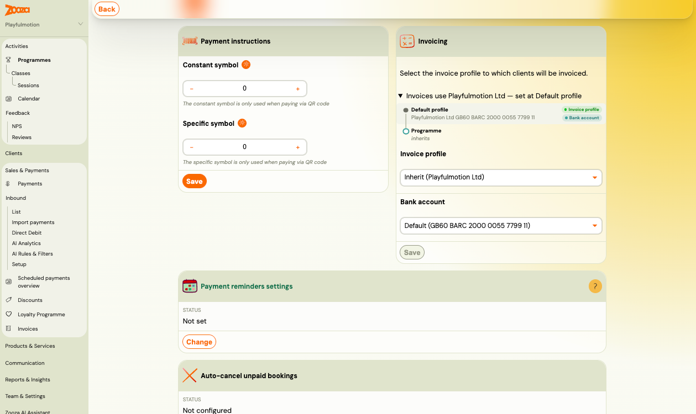
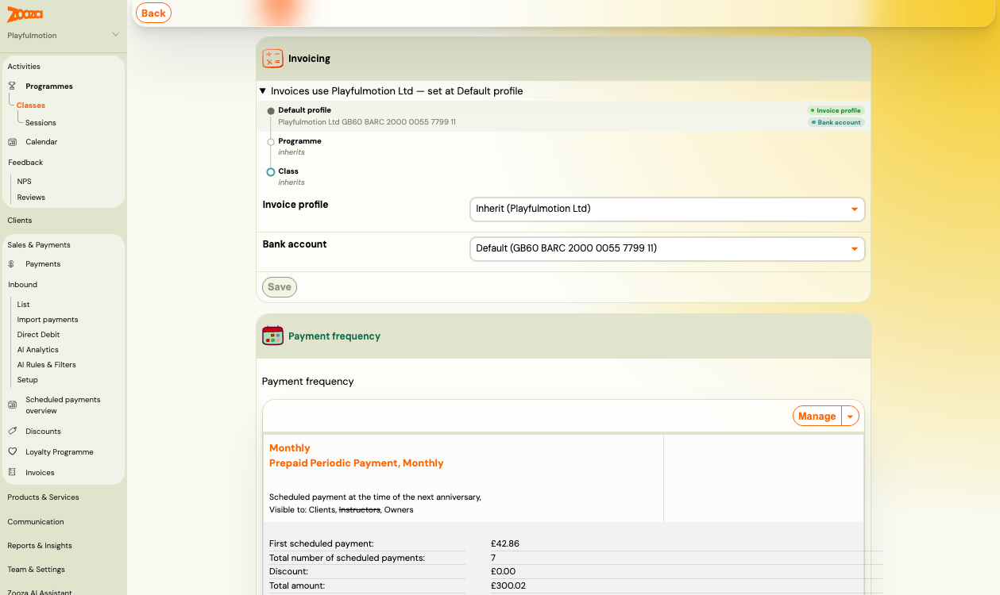
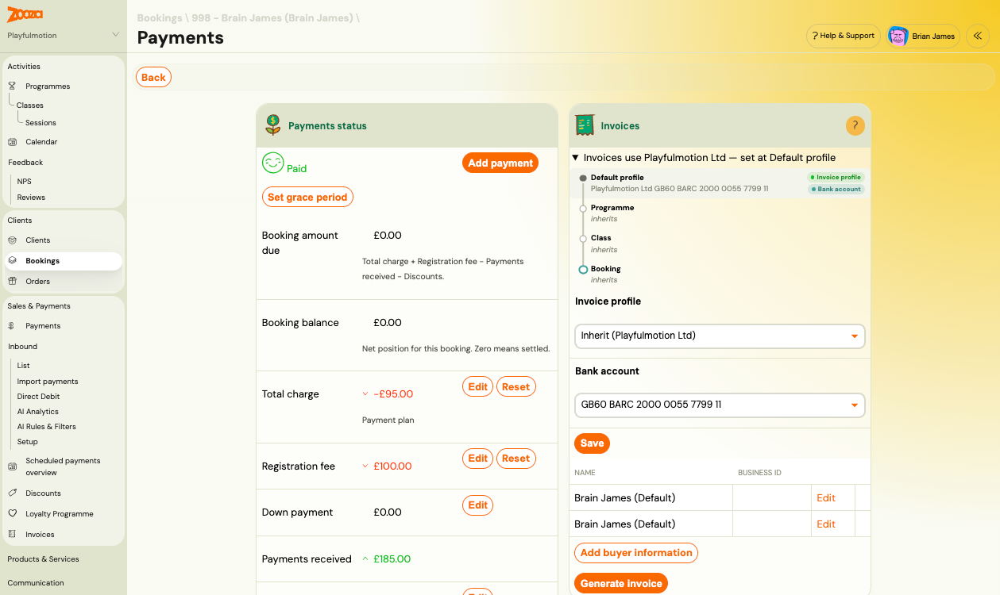

# Choose which invoice profile applies

Every booking invoices under one **invoice profile** and collects to one **bank account**. Zooza works both out by walking down a chain: **Default profile → Programme → Class → Booking**. The lowest level that has something set wins; every level above it is simply inherited.

The **Invoicing** card shows that chain, and lets you change it at the level you are looking at.

> **Where to find it:** the Invoicing card on a programme's settings, on a class, and on a booking's Payments screen.
> **Permission:** Owner role (or an assistant with company-editing rights)

---

## Reading the Invoicing card

The card has three parts:

1. **The summary line** — *"Invoices use Playfulmotion Ltd — set at Default profile"*. This is the answer: which entity invoices, and which level decided it.
2. **The chain** — every level from the default profile down to the thing you are looking at. Levels that decide nothing say *inherits*; the level that won is marked, with a badge for **Invoice profile** and a badge for **Bank account**.
3. **The two selects** — `Invoice profile` and `Bank account` for this level. When the level inherits, the profile select reads *Inherit (name of the inherited profile)* and the account select reads *Default (IBAN)*.

On a class the chain adds a Class row; on a booking it runs the whole way down.

---

## Set an override

1. Open the Invoicing card on the programme, class or booking.
2. Pick an entity in `Invoice profile` — or leave *Inherit* to keep following the level above.
3. Pick an account in `Bank account`. The list only offers accounts belonging to the chosen profile.
4. Click **Save**.

The chain redraws immediately and the summary line names the new level.

To go back to inheriting, select the **Inherit** option again and save. Nothing is deleted — the level just stops deciding, and the answer comes from above.

---

## Three things that surprise people

### The profile and the bank account are decided separately

They walk the same chain but each finds its own nearest setting, so they can be decided at **different levels** — for example the profile comes from the default while the bank account was pinned on the programme. That is why the chain has two badges instead of one, and why the summary line names both.

If nothing sets an account anywhere, the account used is simply the default account of whichever profile won.

### An override sticks when a booking moves

Once you set a profile on a booking, moving that booking to another class or programme does **not** clear it. The booking keeps invoicing under the entity you chose until you set it back to inherit.

This is deliberate — a booking that was deliberately assigned to another legal entity should not silently switch entities because it was rescheduled. It also means: if a booking looks wrong after a move, check whether it holds its own override.

### Changing a level does not touch levels that override

When a programme or class has classes or bookings below it that hold their own override, the card tells you — for example *"2 classes and 5 bookings below use their own invoice profile"* — and offers to reset them back to inheriting. Zooza asks for confirmation and states exactly how many rows will be reset.

Without that reset, changing the profile at the top leaves the overriding rows exactly as they were.

---

## When there is no picker

**Bookings whose payments are managed by another booking** do not choose their own profile. The card shows a note saying billing follows the managing booking, and no selects. Invoicing and payment instructions for the whole group resolve under the profile of the booking that actually pays.

This is the intended behaviour: one payer, one entity, one IBAN on the payment instructions. If you need such a booking on a different entity, change it on the managing booking.

---

## Switching a profile when money is outstanding

If you change the invoice profile on something that already has unpaid amounts, Zooza warns you before saving and asks you to confirm. Payments already received stay attributed to the entity that received them — changing the profile affects what happens next, not what already happened.

For programmes and classes mid-term, the safest moment to switch entities is a period boundary.

---

## Products and orders

Products carry their own invoice profile too, and after your account moves to the new billing model that profile is used **for invoicing as well** — not only in the booking widget. If a product was set to an entity other than your company default, its invoices now come from that entity.

---

## Related

- [Set up invoice profiles and bank accounts](../setup/invoice-profiles-and-bank-accounts.md) — creating entities and their accounts
- [Price and payment setup](./price-and-payment-setup.md) — the rest of a programme's payment settings
- [Billing and invoicing](../setup/billing-and-invoicing.md) — invoice generation and numbering
- [Payments and Billing FAQ](../faq/payments-and-billing-faq.md)
