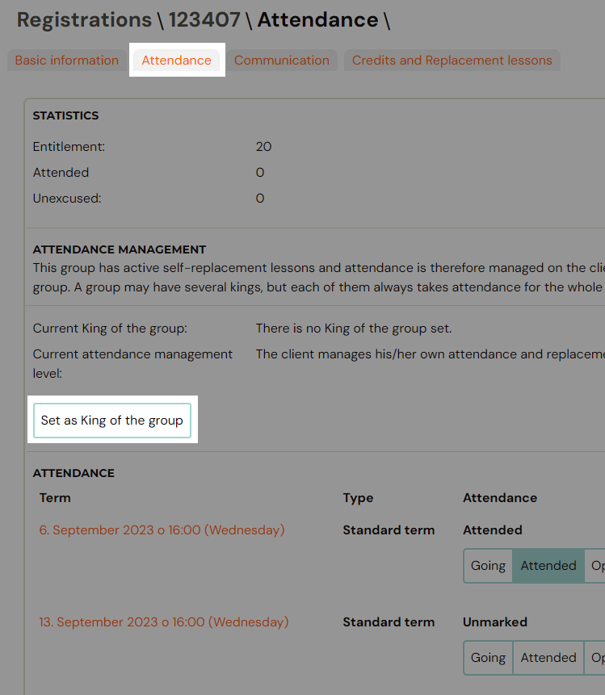
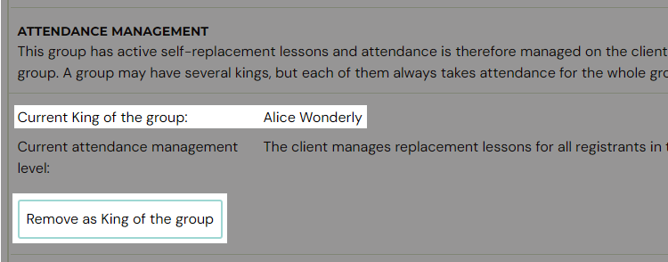

# King of a class

King of a class is a feature that lets one client manage make-up session attendance on behalf of all registrations in a class. Instead of each participant booking or cancelling their own make-up sessions individually, the designated king handles it for the entire class.

> **Prerequisite:** This feature is only available in classes where **custom make-up sessions (self-replacement)** are enabled. If make-up sessions are not enabled on the class, the King of a class option will not appear.

## How it works

- The king is assigned to a **booking** (registration), not to a person. If a client has multiple bookings in different classes and is set as king on only one of them, they can only manage attendance for that one class.
- A class can have **more than one king** at a time. Each king manages make-up session for the whole class simultaneously.
- Once a king is set, **all other participants in the class lose the ability to book or cancel make-up sessions individually**. The king takes over this responsibility for everyone.
- Individual participants can still **opt out** on their own — they are not forced to follow the king's decisions.

## Set a king

1. Open the booking you want to designate as king.
2. Go to the **Attendance** tab.
3. Click **Set as King of the class**.

Once a king is set, any other booking in the same class will show who the current king is in the **Attendance Management** section.

## Remove a king

On the king's booking, go to the **Attendance** tab and click **Remove as King of the class**. This returns attendance management back to individual participants.

## Related

- [Make-up session — complete guide](replacement-hours-complete.md) — full guide on how make-up sessions work.
- [Make-up sessions FAQ](../faq/make-up-sessions-faq.md)
- [Instructor attendance management](instructor-attendance-management.md)
