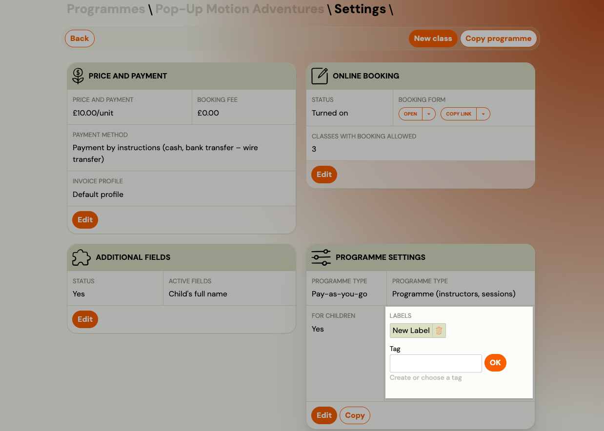
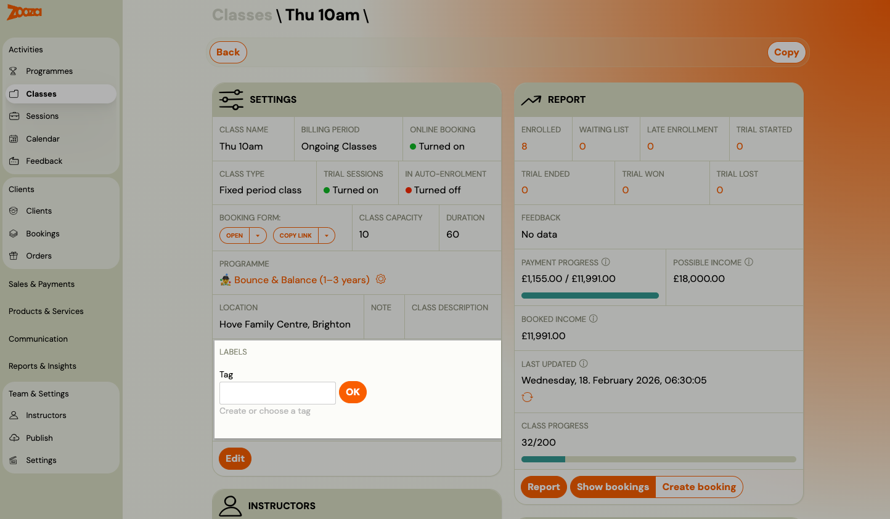
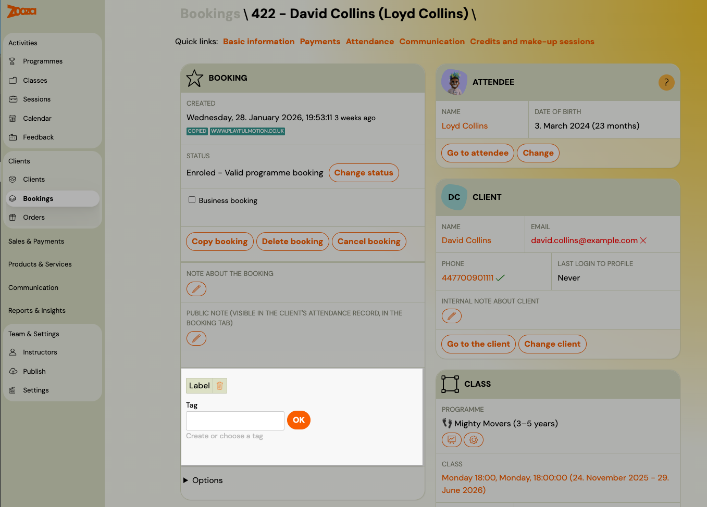
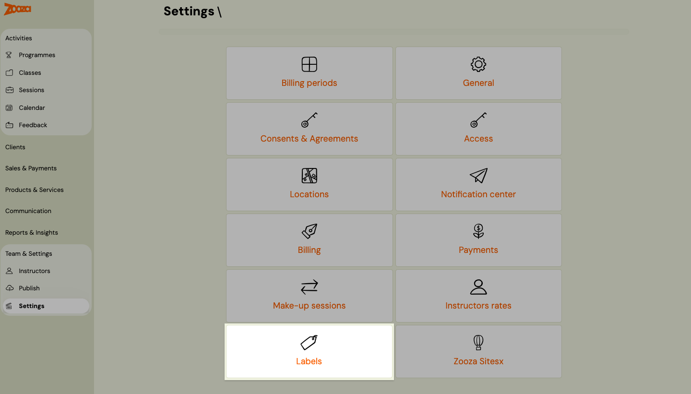
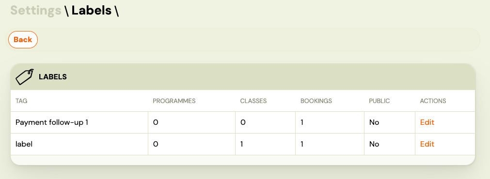

<!-- Synonyms: tags, categories, tagging, filtering, programme labels, class labels, booking labels, štítky, kategórie -->

# Labels

Labels are custom tags you can attach to programmes, classes, and bookings. They help you organise your data, filter lists quickly, and — when marked as public — let clients filter your offering on the booking widget. 

> **Navigation:** Go to **Team & Settings** → **Settings** → **Labels**.

## How labels work

Labels exist at three levels:

| Level | Where you assign them | What they do |
|---|---|---|
| **Programme** | Programme settings → Programme Settings tile → Labels | Categorise programmes (e.g., "Swimming", "Dance", "Ages 3–5"). Appear in the Programmes list filter. |
| **Class** | Class detail → Labels field | Tag individual classes within a programme (e.g., "Monday group", "Advanced"). Appear in the Classes list filter. |
| **Booking** | Booking detail → Label field | Tag individual bookings (e.g., "VIP", "Sibling discount applied"). Appear in the Bookings list filter. |

Labels are reusable — once created, they appear in dropdown menus across the application.

## Creating and managing labels

1. Go to **Team & Settings** → **Settings** → **Labels**.
2. Click **Create new label**.
3. Enter a label name (e.g., "Swimming", "Summer 2025", "Trial").
4. Choose the label level: **Programme**, **Class**, or **Booking**.
5. Save.

You can edit or delete labels from the same screen. Deleting a label removes it from all items it was attached to.

## Assigning labels

### Programme labels

1. Go to **Programmes** → select a programme → **Edit Settings**.
2. Open the **Programme Settings** tile.
3. In the **Labels** section, select one or more labels from the dropdown.
4. Save.

Programme labels appear in the **Programmes** list and can be used as a filter to narrow down your programme list.

### Class labels

1. Go to the class detail page.
2. In the **Labels** field, select a label from the dropdown.
3. Save.

### Booking labels

1. Open a booking detail.
2. In the **Label** field, select a label.
3. Save.

Booking labels are visible in the **Bookings** list and can be used to filter bookings.

## Public labels (widget filtering)

Labels can be marked as **public**. Public labels appear on your booking widget, allowing clients to filter your programmes before booking. Integration needed. It won't be shown automatically. <a href="https://docs.zooza.online/">See documentation.</a>

For example, if you offer swimming, dance, and music programmes, clients can use public labels to show only the category they are interested in.

To make a label public:

1. Go to **Team & Settings** → **Settings** → **Labels**.
2. Edit the label.
3. Enable the **Public** option.
4. Save.

Public labels only work at the programme level. Class and booking labels are internal only.

## Using labels to filter

Labels appear as filter options in several views:

- **Programmes list** → filter by programme labels.
- **Classes list** → filter by class labels.
- **Bookings list** → filter by booking labels.

This is especially useful when managing a large number of programmes or classes across multiple locations or age groups.

## Labels in reports and exports

Labels are included in data exports and Power BI reports. The Labels table in Power BI contains all labels with their associations. For details, see [Power BI Data description](power-bi-data-description.md).

## Related

- [Programme settings tile](programme-settings-tile.md) — assigning labels and colours to programmes.
- [Customizing widgets](customizing-widgets.md) — configuring the booking widget appearance.
- [Programmes List](../reference/programmes-list.md) — filtering the programme list.
