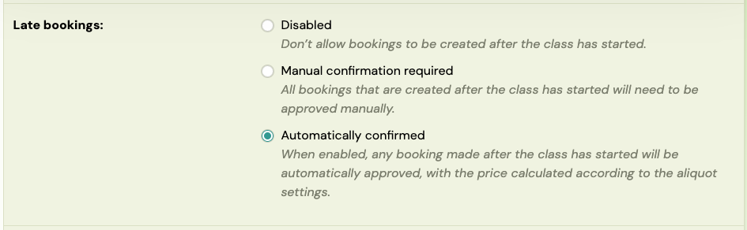
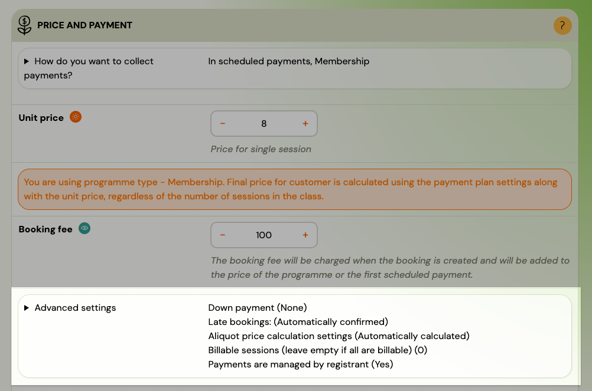

# Late bookings (pro-rata management)

A **late booking** occurs when a client registers for a class that has already started. Zooza marks these bookings with a snail icon and a "Late booking" status so you can easily identify them.

Zooza gives you full control over what happens when someone joins late: whether the booking is accepted automatically or requires your approval, and how the price is calculated — from a fully automatic pro-rata reduction to a fixed full price.

> **Navigation:** Go to **Programmes** → select the programme → **Settings** → **Price and Payment** → **Advanced settings**.

## Late booking modes

The **Late bookings** setting controls whether clients can register after the class has started, and what happens when they do.

| Mode | What happens |
|---|---|
| **Disabled** | Clients cannot book after the class has started. The class does not appear in the registration form once it has begun. |
| **Manual confirmation required** | The client can register, but the booking goes to a waiting state. The admin receives a notification, reviews the booking, and manually approves or declines it. |
| **Automatically confirmed** | The booking is approved instantly. The price is calculated according to the aliquot settings below. The client receives a confirmation email as with any regular booking. |

**Disabled** is useful when you do not want latecomers at all — for example, progressive programmes where missing the first sessions makes the rest difficult to follow.

**Manual confirmation required** gives you full control. You see every late booking before it is confirmed, and you can adjust the price, change the class, or decline the booking. This is the most common choice for programmes with instalment-based pricing.

**Automatically confirmed** is ideal for memberships, drop-in classes, or any programme where joining late is normal and the price calculation is straightforward.

## Pro-rata (aliquot) price calculation

The **Aliquot price calculation settings** control how the price is calculated for late bookings. This is the core of pro-rata management in Zooza.

| Option | How it works |
|---|---|
| **Automatically calculated** | Price = remaining sessions / total sessions x full price. Best for term-based programmes with a fixed number of sessions. |
| **Calculated automatically by the number of days** | Price is based on the number of remaining days in the current billing period plus one full upcoming period. Best for memberships and recurring billing. |
| **No value** | For one-off payments: zero debt is calculated. For scheduled payments: no debt is generated until the start of the next billing period. Useful for free trial periods or when you want to manually set the price. |
| **Full programme price** | The full price is always charged, regardless of when the client joins. No automatic reduction. |

### How the session-based calculation works

The formula is straightforward:

**Remaining sessions / Total sessions x Full price = Pro-rata price**

**Example:** A programme has 30 sessions at 300 EUR. A client joins when 18 sessions remain:

18 / 30 x 300 = **180 EUR**

If the programme uses a payment template (e.g., 3 monthly instalments), the 180 EUR is split across the remaining instalments.

### How the day-based calculation works

The system counts the remaining days in the current billing period and calculates a proportional price for that period. The next full period is charged at the standard rate.

**Example:** Monthly billing at 50 EUR/month. The billing period starts on the 1st. A client joins on the 16th (15 days remaining out of 30):

15 / 30 x 50 = **25 EUR** for the first month, then **50 EUR** per month going forward.

### Which option to choose

| Business scenario | Recommended setting |
|---|---|
| Term-based programme, clients join a few sessions late | **Automatically calculated** |
| Monthly membership, clients join mid-month | **Calculated automatically by the number of days** |
| You want to manually set each late joiner's price | **No value** (set debt manually on each booking) |
| Drop-in or membership where everyone pays the same | **Full programme price** |
| Free trial period — charge nothing until next period | **No value** |

## Include Initial Full Scheduled Payment

When using scheduled payments (monthly, termly, or other recurring billing), the **Include Initial Full Scheduled Payment** setting controls whether the first payment includes an extra full instalment on top of the pro-rata amount.

- **Checked:** The client pays the pro-rata amount **plus** one full instalment immediately. This ensures the client always pays for at least two billing periods upfront. Common for term-based programmes where you want a meaningful first payment.
- **Unchecked:** The client pays only the pro-rata amount initially. The next full instalment follows the regular payment schedule. Better for Netflix-style memberships where clients simply start paying on the next billing cycle.

**Example:** Monthly billing at 60 EUR. Client joins mid-month, pro-rata is 30 EUR.

- **Checked:** First payment = 30 EUR (pro-rata) + 60 EUR (full month) = **90 EUR**
- **Unchecked:** First payment = **30 EUR**, then 60 EUR next month

This setting is especially useful for programmes with longer billing periods (termly, yearly). If you bill yearly in 2 instalments at 300 EUR each and a student joins mid-year, the system calculates a pro-rata first instalment and bundles it with one full instalment — so the client pays a fair amount on day one.

## How to configure late bookings

1. Go to **Programmes** and select the programme.
2. Click **Settings**.
3. Open the **Price and Payment** tile.
4. Expand **Advanced settings**.
5. Set the **Late bookings** mode (Disabled / Manual confirmation required / Automatically confirmed).
6. Set the **Aliquot price calculation** method.
7. Optionally check **Include Initial Full Scheduled Payment**.
8. Save the settings.

These settings apply to all classes within the programme. You do not need to configure each class separately.

## Manual approval workflow

When **Manual confirmation required** is selected, every late booking requires admin action before the client is enrolled.

### What the client sees

1. The client selects a class that has already started.
2. At the end of the booking form, a message informs them that the class has already started and they will be contacted once they are placed in a class.
3. After submitting, the client receives an email confirming that the booking was received and is pending review.

### What the admin does

1. The admin receives a notification in the **notification centre** about the new late booking.
2. Open the booking — review the automatically calculated debt amount.
3. If the amount needs adjustment, edit the debt value directly on the booking detail.
4. Click **Change status** and select **Enrolled – Valid programme booking**.
5. Optionally check **Send confirmation email** to notify the client.
6. Click **Change status** to confirm.

> **Important:** Change the booking status to **Enrolled** on the same day. At midnight, the system validates payment schedules — any schedule linked to a booking that is still in "Late booking" status is automatically removed. Always approve the booking before the end of the day.

### Declining a late booking

If you do not want to accept a late booking:

1. Open the booking.
2. Click **Change status** and select **Cancelled booking (during the programme)**.
3. Send a cancellation message individually via **Send email/SMS** on the booking.

The system does not automatically notify the client when a late booking is declined — you must communicate this yourself.

## Payment schedules for late bookings

When a client registers late with **manual approval** enabled, the payment schedule (instalment plan) is **not** applied automatically — even if the client selected one during registration.

To apply a payment schedule:

1. Open the booking detail and go to the **Payments** section.
2. In the **Instalment Plan** area, click **Create** and follow the wizard to select a payment template.
3. Change the booking status to **Enrolled** on the same day.

For **automatically confirmed** late bookings, the payment schedule is applied automatically based on the programme's payment template settings.

## Common scenarios

### "Our courses are yearly prices paid in two instalments. Students often join mid-year."

Set up:

1. **Late bookings:** Manual confirmation required (so you can review each case).
2. **Aliquot price calculation:** Automatically calculated.
3. **Include Initial Full Scheduled Payment:** Checked (so the student pays a pro-rata amount plus one full instalment upfront).

The system calculates the remaining price automatically. You review each booking, adjust if needed, and approve. No need to manually change prices weekly — Zooza recalculates based on how many sessions remain at the time of booking.

### "We run monthly memberships. Clients join any time."

Set up:

1. **Late bookings:** Automatically confirmed.
2. **Aliquot price calculation:** Calculated automatically by the number of days.
3. **Include Initial Full Scheduled Payment:** Unchecked.

Clients who join mid-month pay a proportional first month. From the next month, they pay the full amount. No admin action needed.

### "We want everyone to pay the same price regardless of when they join."

Set up:

1. **Late bookings:** Automatically confirmed.
2. **Aliquot price calculation:** Full programme price.

Every late booking is charged the full price. Simple.

### "We want to offer a free trial period — no charge until the next billing cycle."

Set up:

1. **Late bookings:** Automatically confirmed (or manual if you want to review).
2. **Aliquot price calculation:** No value.

The client is enrolled with zero debt for the current period. Billing starts on the next scheduled payment date.

## Related

- [Programme Settings Reference](../reference/programme-settings.md) — Price and Payment tile, Advanced settings.
- [Programme Automations](../reference/programme-automations.md) — Late Booking Automations flow.
- [Payment Templates](payment-templates-creation.md) — configuring payment methods and templates.
- [Membership Subscription Setup](membership-subscription-setup.md) — Netflix-style recurring billing configuration.
- [Payments and Billing FAQ](../faq/payments-and-billing-faq.md) — common payment questions including pro-rata pricing.
