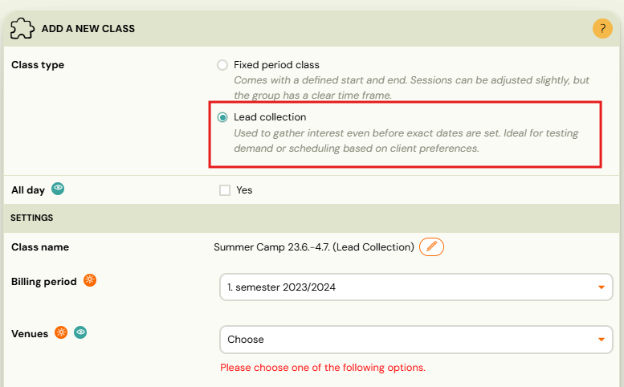
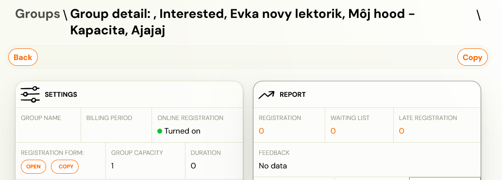
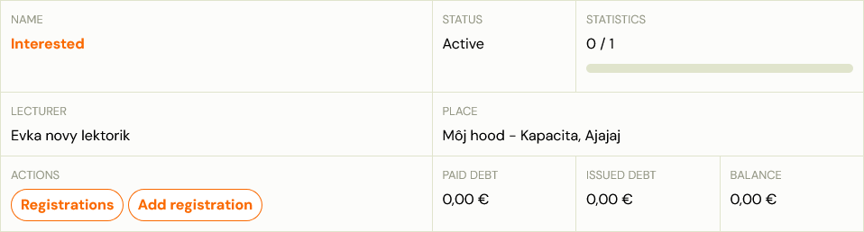

# Lead collection

A lead collection class is a class without sessions. Use it to collect interest from clients before you have a schedule ready. For example, you want to launch a new programme but only if enough people are interested.

You set up lead collection at the class level by selecting the **Lead collection** option.

The class will also appear in the booking form with the option to enrol. Once you have enough applicants, define the sessions and the lead collection class automatically becomes a regular class. Your clients will see all the information in their profiles.

This change also works retroactively — if you delete all sessions from a class, it automatically changes back to a lead collection class.

You can see whether it is a lead collection class or a class with sessions based on the name of the class.

## What the client sees

When a client enrols in a lead collection class through the booking form or widget, they are registered with a pending status and receive a confirmation email. No sessions or schedule are shown — the client knows they are on the interest list, not a fixed schedule.

Once you add sessions to the class and it becomes a regular class, clients automatically see their sessions in their profile.

> **Trials:** Trials require sessions to be scheduled. A lead collection class cannot accept trial bookings.

## Confirmation email template

The email sent to clients after joining a lead collection class is a separate template from the standard booking confirmation.

Go to **Communication → Message Templates** and look for the **Lead collection** or **Interested** template. Customise the subject and body there — for example, to set expectations about when the schedule will be announced.

## Using lead collection for seasonal closures

Lead collection is useful when you want to accept interest before your schedule is ready — for example, pausing over summer and relaunching in September.

**Recommended approach:**

1. At the end of the season, set each class to **Lead collection** (remove all sessions, or toggle the Lead collection option).
2. Leave online registration active — clients who find your booking form can still register their interest.
3. When the new season is ready, add sessions. The class becomes a regular class automatically.
4. Clients who registered their interest can be moved to the regular class (or offered a booking via auto-enrolment).

> **Does switching to lead collection prevent bookings?** No. Clients can still enrol and will appear in your bookings list. Only trial bookings are blocked (because trials require sessions).

## Related

- [Individual sessions — lead collection](individual-sessions-lead-collection.md)
- [Locations and Venues FAQ](../faq/locations-and-venues-faq.md)
