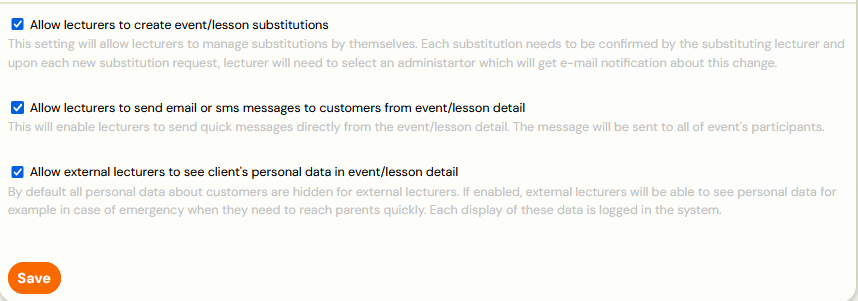
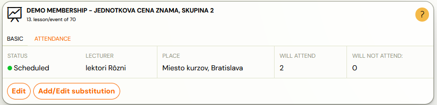
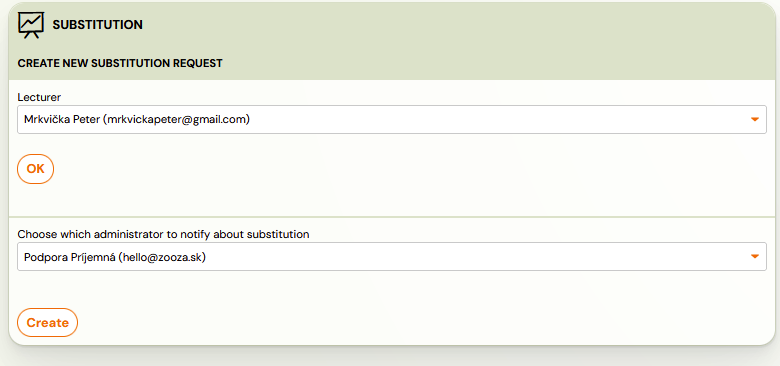
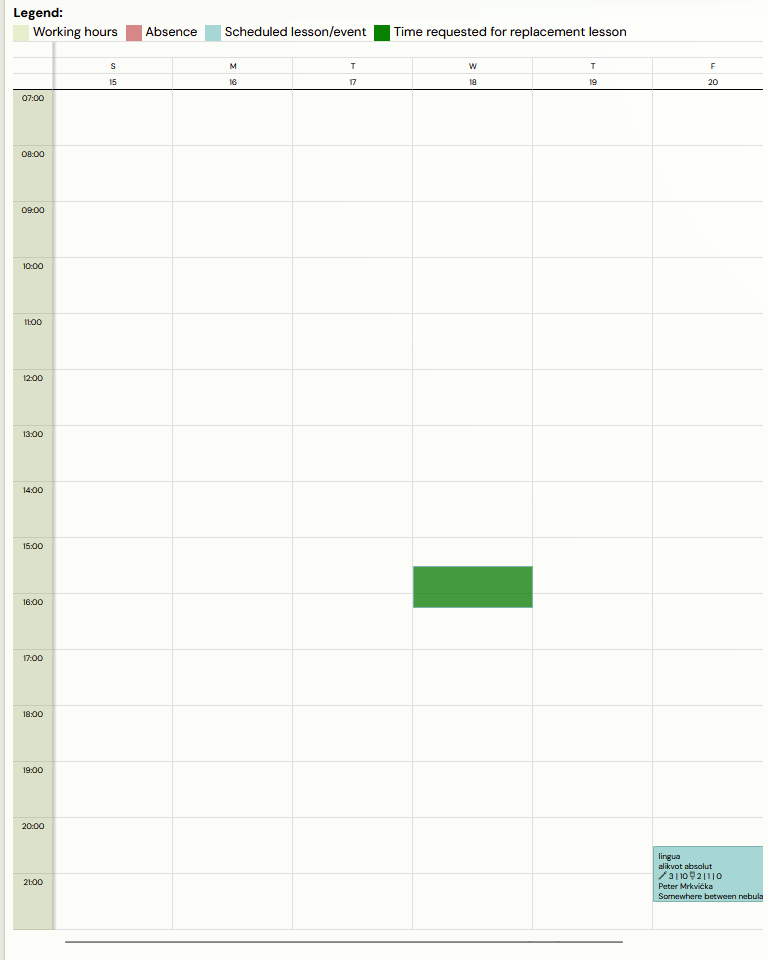
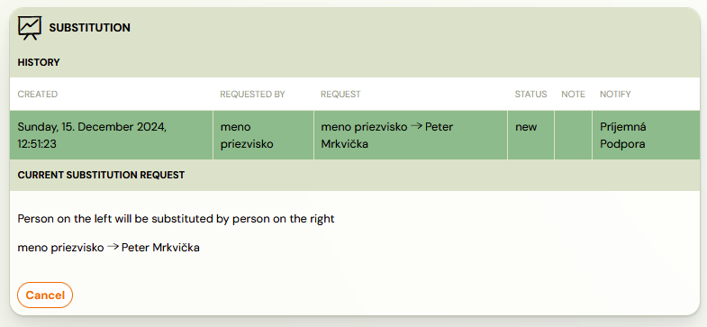
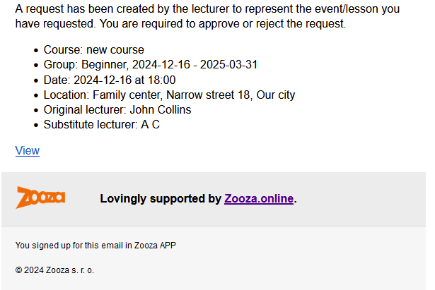
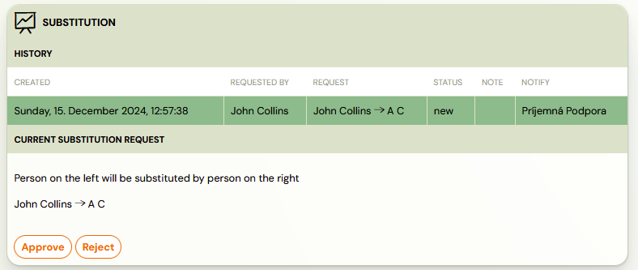

# Lecturer substitution

Lecturer substitution is a functionality in which an unavailable lecturer is replaced by another one. This feature is available as a setting that, when activated, applies to all lecturer roles and accesses. Its main goal is to simplify the substitution process by allowing lecturers to manage schedule changes themselves without the need for administrator interaction.

Once activated, lecturers have the flexibility to set up a substitute on a selected term when they are unavailable, increasing their independence and efficiency in organising teaching. The administrator does not need to manually interfere with the process, which saves time and streamlines schedule management. The function is designed to facilitate coordination between lecturers and ensure smooth running of courses even in case of unplanned changes (illness,...).

## Setting up substitution of lecturers

1. This feature is set in the *Settings *category under Access section, where you just need to turn on Allow lecturers to create substitutions on terms. This setting is visible in the attendance on the term for all lecturer roles (main, lecturer, external lecturer).
 
2. In the event details, open the *Attendance *tile to access the list of registered clients. In this section you can add/edit substitutions*.*
 
3. Select a lecturer from the list to cover the lesson. If the substitution is set by an administrator, Zooza will not offer a picdropdown list with administrator notification.
 
4. After selecting a lecturer, a window will open with the availability of the substitute lecturer. As long as the lecturer has filled in their office hours and scheduled lessons, they will show up in their schedule and you will be able to see if you can send them a substitution request.
 

Note: If a substitute is set up by an administrator, the request will automatically be approved. The substituting lecturer can still change it by creating a new request or cancel it.

 5. Click *Create *to send the request to the lecturer's email.

 6. The substituting lecturer is required to click on *View *to approve or cancel the substitution request.

Warning! In case the substituting lecturer agrees to the given event, this change will not be sent to the clients by email notification, it will only be visible in the profile next to the appointment. In the application, the change is also visible in the appointment details.

Note: If a lecturer rate is used, it will automatically be calculated on the substitute lecturer as well. A lecturer who is unable to attend a given lesson and requests a substitute will not have that term reported in the lecturer report.
