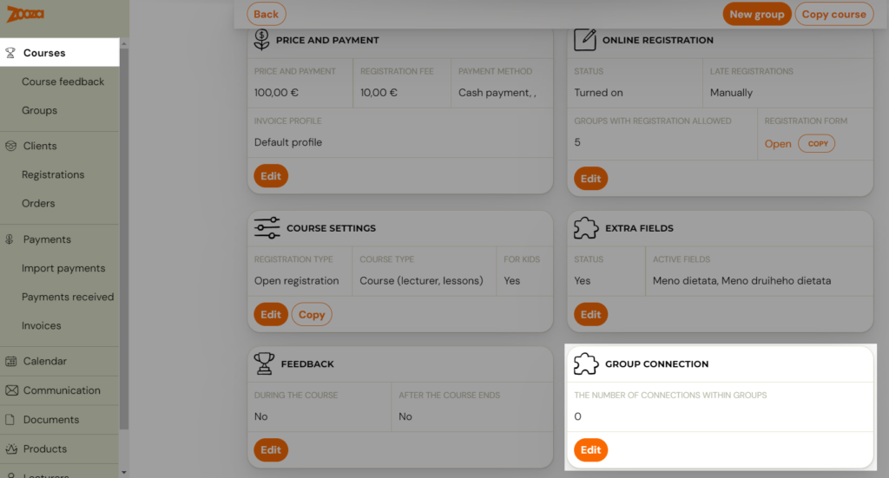
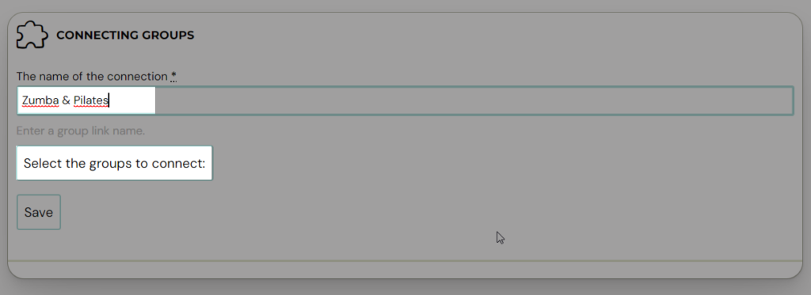
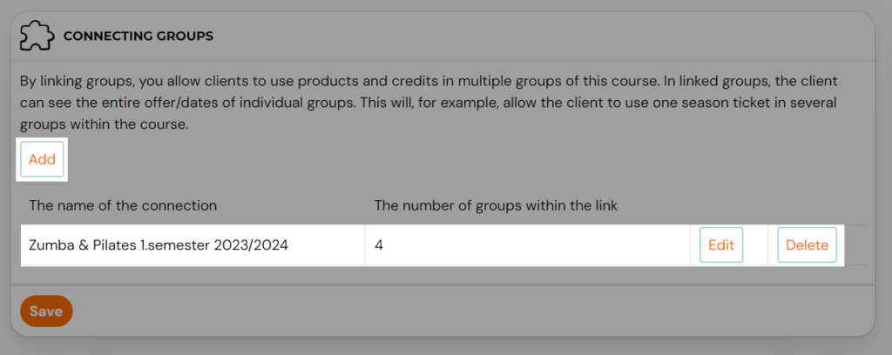

# Linked classes

Linked classes connect multiple classes within a Pay-as-you-go programme into a pool, so clients can pick sessions from any of the linked classes with a single booking.

## What are linked classes?

By default, a client registered in one class can only book sessions from that specific class. Linking classes removes this restriction — clients can browse and book sessions across all linked classes as if they were one combined schedule.

This feature is only available for Pay-as-you-go programmes.

## Use case: Multi-topic studio membership

You run a fitness studio with a single "Studio Membership" Pay-as-you-go programme containing three classes:

- Monday Kickbox
- Wednesday Pilates
- Friday Yoga

By linking these three classes, a client who registers for the programme can book any Monday kickbox session, any Wednesday pilates session, or any Friday yoga session — all from one booking.

## Use case: Same class, multiple locations or instructors

You offer the same yoga class at two locations or with different instructors. Each location or instructor has its own class for scheduling and capacity management, but you want clients to book sessions from either. Link the classes so clients see a unified session list.

## Step-by-step: How to link classes

1. Go to **Programmes** and select the programme you want to configure.
2. Click **Edit** in the **Class linking** section.
3. Click **Add** to create a new link.
4. Enter a **link name** (e.g. "Studio Membership Pool").
5. Click **Select Classes to connect** and choose the classes you want to link.
6. Click **Choose**.
7. Click **Save**.

After saving, you can **Add** another link, **Edit**, or **Delete** existing links from the list.

## Multiple links within one programme

You can create multiple separate links within the same programme. This lets you class classes in different combinations. For example:

- Link A: Kickbox Monday + Kickbox Wednesday (same discipline, different days)
- Link B: All classes (full studio access)

This gives you flexibility in structuring your offering and applying different entry passes to different class pools.

## Entry passes with linked classes

When classes are linked, a single entry pass covers all linked classes. The client can use their pass to book sessions from any class in the pool.

For details on creating entry passes, see [Creating entry passes](creating-entry-passes.md).

## Related guides

- [Pay-as-you-go programme](pay-as-you-go-programme.md) — The programme type that supports linked classes.
- [Creating entry passes](creating-entry-passes.md) — Set up passes that work across linked classes.
- [Programme settings](programme-settings.md) — The Class linking tile in programme settings.
- [Pay-as-you-go FAQ](../faq/pay-as-you-go-faq.md) — Common questions about linked classes.
