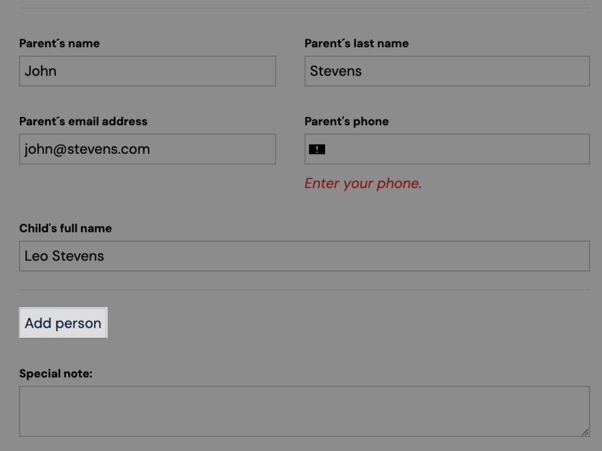
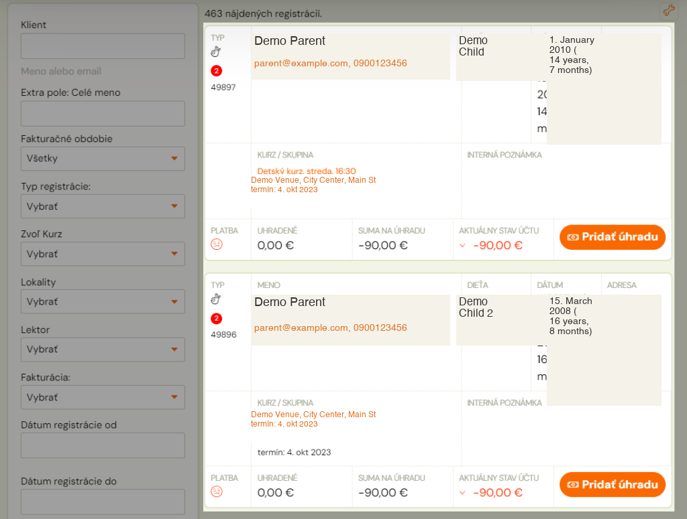
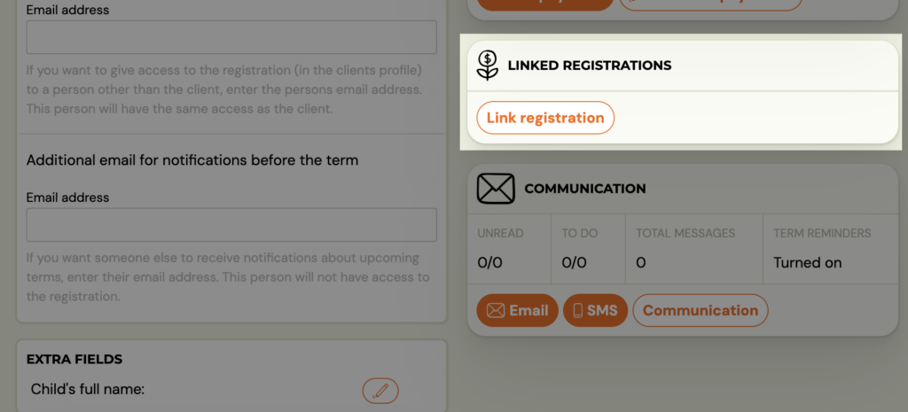
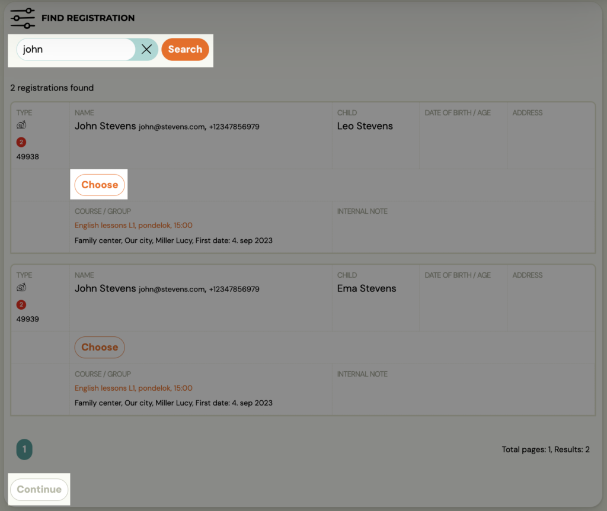
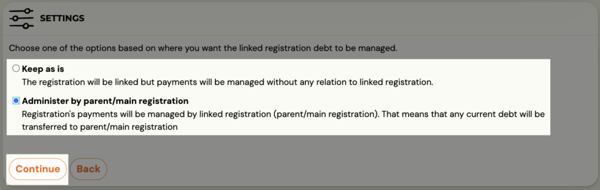
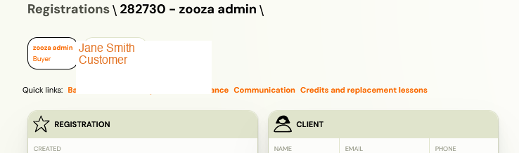
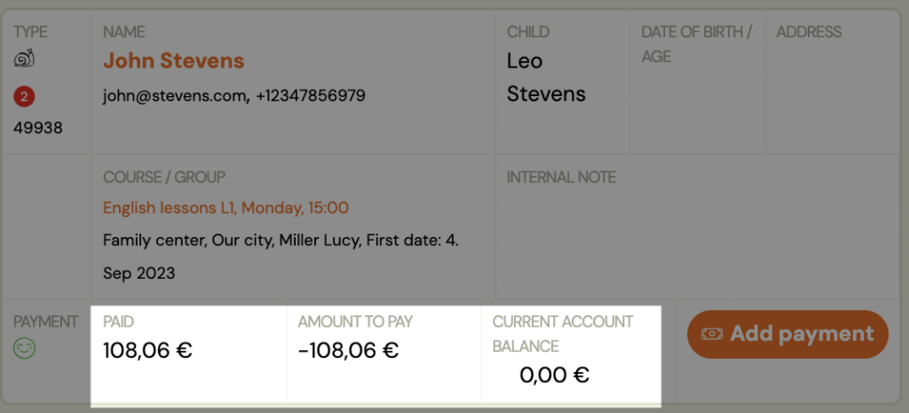
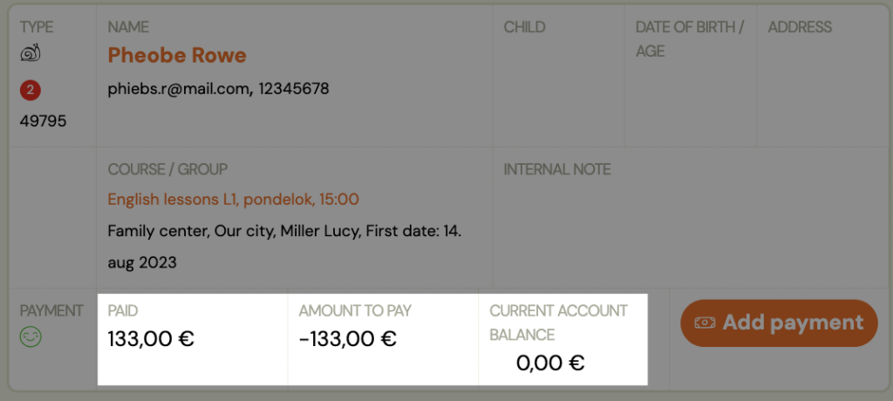

# Linked registrations

If you are an organisation that offers a wider range of courses for children and are used to having siblings enrolled, or your clients are enthusiasts and attend multiple courses on their own at once, there is a very useful functionality – related registrations.

With linked registrations, you essentially bundle payments for two or more registrations. For example, if a parent has 2 children and they are both registered with you. Or if an adult client takes two courses at the same time.

With linked registrations, you allow the client to make only one linked payment to one variable symbol and you can keep your payments in order.

## How does it work?

If the parent fills in the registration form fields for both children at the same time, i.e. uses the *Add person* option when filling in the registration form, the two registrations will automatically be linked and related.
How to set up the Add Person option and where to set it to link payments automatically can be found in this [manual](allowing-multiple-registration.md).

However, if you register your children or yourself in two different groups/courses and therefore fill in two registration forms, the system will not combine such registrations. However, you can pair them manually and they will continue to function as related.

## Link related registrations

So let’s see how we can link related registrations and set up a common payment for them.

1. Choose one of the registrations that you want to have as the main one (e.g. parent or older child, or simply one of the two), i.e. the one that will receive payments for both/all linked registrations.
 
2. On the registration card for that registration, you will find the *Linked Registrations *tile
3. Click on *Link registration*
 
4. Find the registration you want to link to this registration
5. Confirm the selection with the *Select *button
6. Click *Continue*
 
7. Select one of the options for how you want to link the registration
8. *Leave as it is – *link registrations but keep payments separate. Thanks to the link, you can quickly find your sibling’s registration, but the payments remain separate on each ragistration
9. *Manage parent/main registration *– links registration together with payments. It creates a debt on the master registration in the sum of the values of the two or more linked registrations, and credits the linked registrations with the payment.
 

If we have chosen the second option, it will create a debt on the main registration in the sum of the values of both or more linked registrations, it will credit the linked registrations with the payment.
Once successfully linked, each registration clearly indicates which is the main and which is linked, and you can easily switch between them.

The parent/client pays for both/multiple courses only once using one variable symbol. They can see the payment information in their profile.

