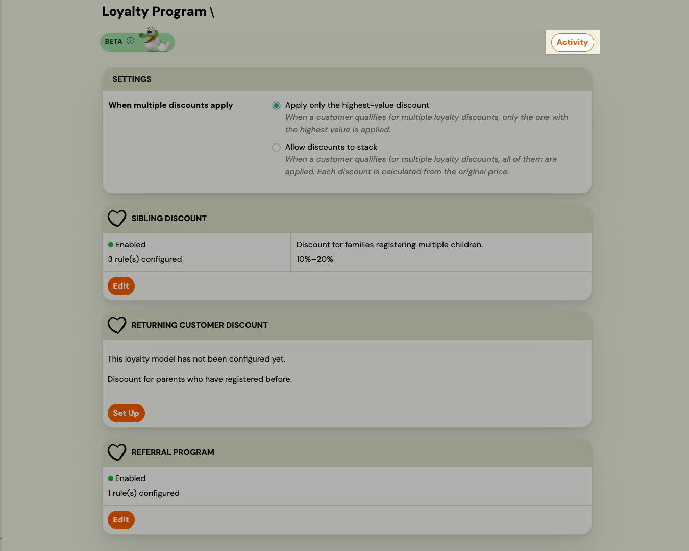
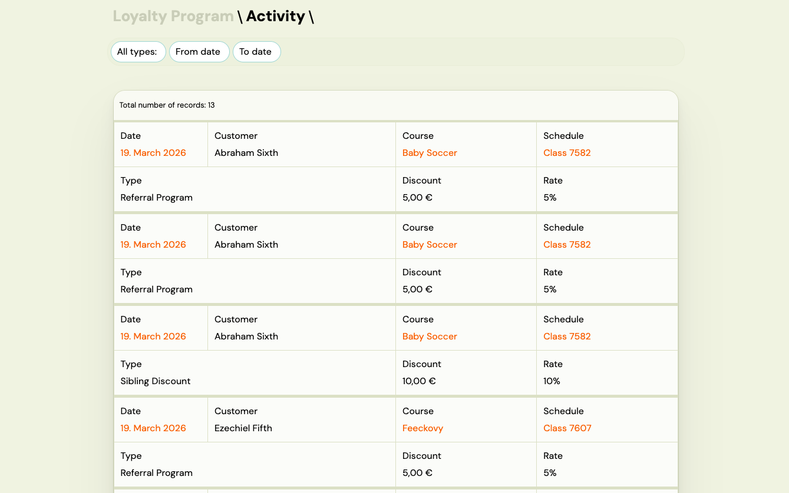
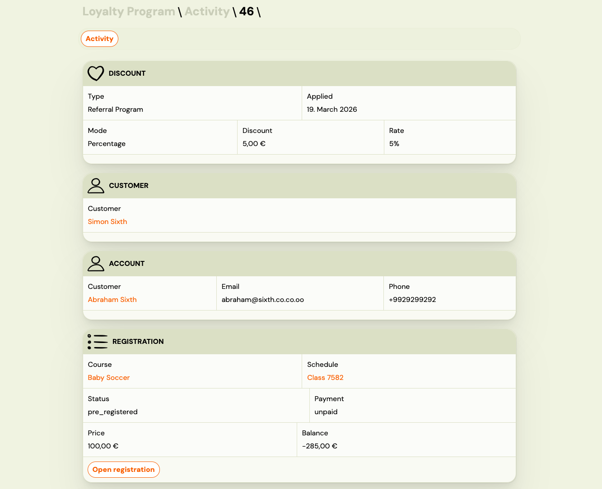
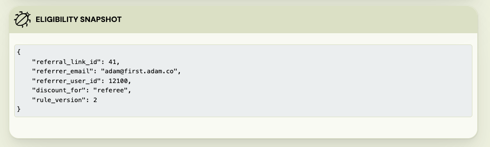

# Loyalty Activity Log

> **Beta feature.** Part of the [Loyalty Program](./loyalty-program.md).

The activity log is a full history of every loyalty discount applied to a booking in your company. Use it to audit your loyalty program, verify individual discounts, and understand which models are having the most impact.

---

## Opening the activity log

Go to **Sales & Payments → Loyalty Program**, then click the **Activity** button in the toolbar.

---

## The activity log list

The list shows one row per applied loyalty discount, with the most recent entries at the top.

Each row shows:

| Column | What it shows |
|---|---|
| **Date** | When the discount was applied. Click to open the full discount detail. |
| **Client** | The name of the person who received the discount. |
| **Programme** | The programme the discount was applied to. |
| **Schedule** | The schedule (class group) within that programme. |
| **Type** | Which loyalty model triggered the discount (Sibling Discount, Returning Client Discount, or Referral). |
| **Discount** | The monetary amount deducted. |
| **Rate** | The configured discount value (e.g., 10% or €20.00). |

---

## Filtering the log

Use the filters at the top of the page to narrow the list:

- **Type** — show only one loyalty model (Sibling Discount, Returning Client Discount, or Referral).
- **Date from / Date to** — limit results to a specific time range.

All filter selections are saved in the URL, so you can bookmark or share a filtered view.

---

## Discount detail

Click the **date** in any row to open the full detail for that discount event.

The detail page shows five sections:

### Discount
- Type of loyalty model
- Date and time the discount was applied
- Discount mode (percentage or fixed amount)
- Discount amount and rate

### Client
The person who attended the programme (the child or participant). Links to their client profile.

### Account
The parent or account holder who made the booking. Links to their client profile.

### Booking
- Programme and schedule name
- Booking status and payment status
- Total price and outstanding balance
- **Open booking** button — jumps directly to the booking record

### Eligibility snapshot
A technical record of the conditions at the time the discount was evaluated: how many qualifying previous bookings were found, which email address was used for the lookup, and which rule version was in effect. This information is stored permanently and does not change, even if you update your loyalty rules later.

---

## What you can do with this data

- **Verify a discount**: if a client asks why they received a particular discount (or why they didn't), open the activity log and find the booking date. The eligibility snapshot shows exactly what the system found at evaluation time.
- **Audit loyalty spend**: filter by type and date range to see the total impact of a specific loyalty model over a period.
- **Spot unexpected patterns**: if a programme is generating more discounts than expected, use the type filter to isolate it and investigate.
- **Navigate to the booking**: each detail page links directly to the booking record and client profile for quick follow-up.

---

## Notes

- The activity log is read-only. Discounts cannot be edited or reversed from this page.
- The log shows one entry per applied discount. A single booking can appear multiple times if multiple loyalty models applied (e.g., stacked sibling + returning client).
- The client name in the list is plain text (not clickable). Open the discount detail to access the client profile link.
