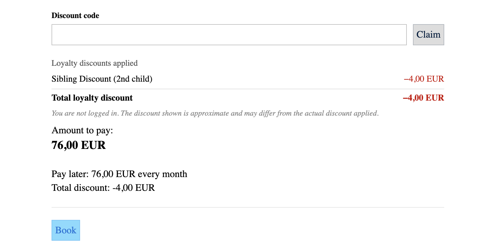
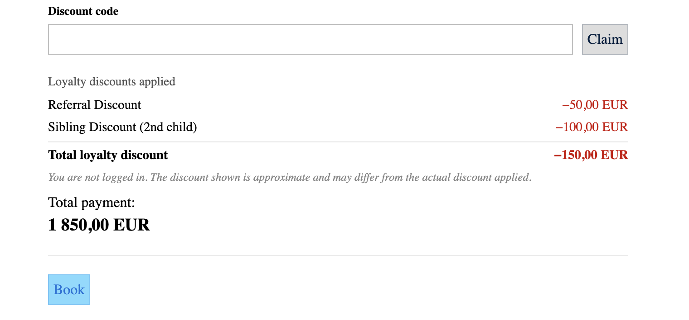
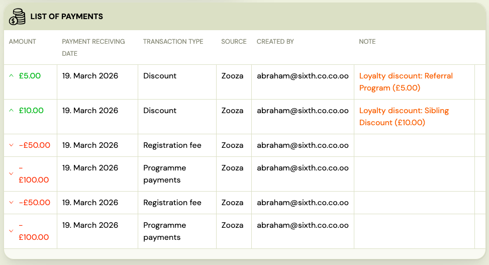
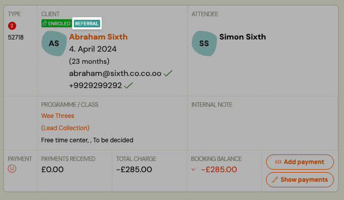
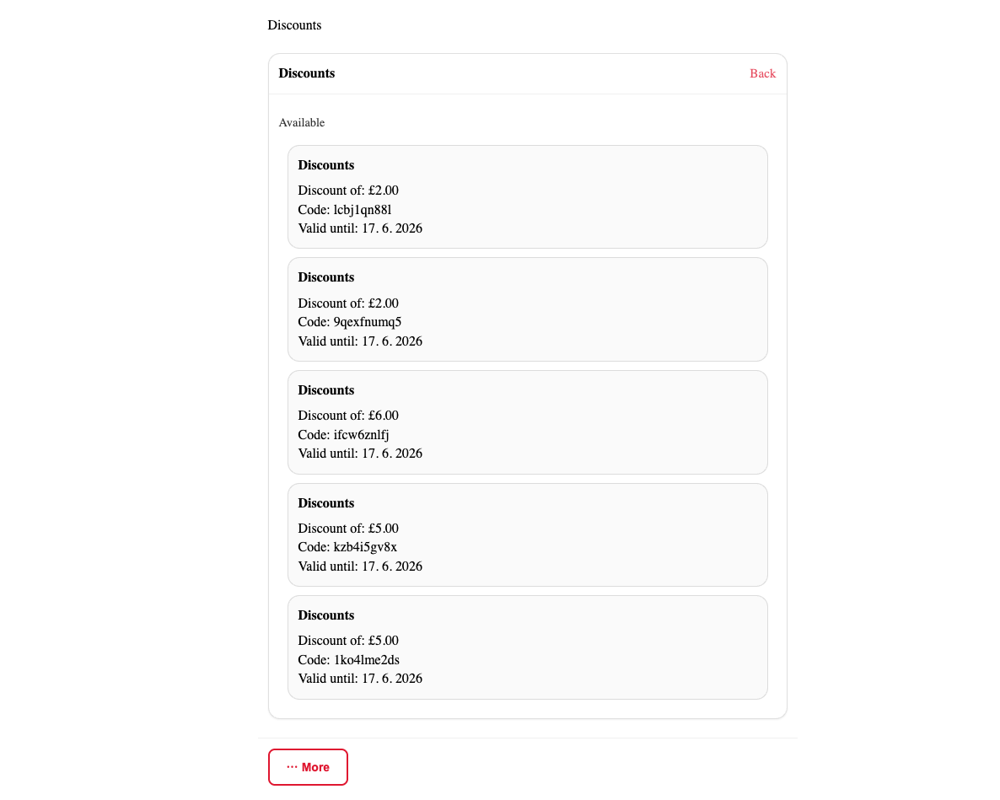

# Loyalty discounts — what clients and admins see

This guide shows how loyalty discounts appear in the booking widget (client side) and in the registration detail (admin side). It also covers the referral program's client profile section.

---

## What the client sees in the booking widget

### Price breakdown with a loyalty discount

When a loyalty discount applies to a booking, the client sees a price breakdown in the booking form before completing payment. The breakdown shows:

- The original programme price
- The loyalty discount as a separate line item (labelled with the discount type, e.g., "Sibling Discount" or "Returning Client Discount")
- The final price after the discount

The client can see exactly how much they are saving before they confirm the booking.

If multiple discounts apply (when combination mode is **Allow discounts to stack**), each discount appears as a separate line item so the client can see the breakdown clearly.

---

## What the admin sees in the registration detail

### Loyalty discount in the registration

In the registration detail, loyalty discounts are shown alongside other payment information. You can see:

- Which loyalty model applied (Sibling Discount, Returning Client Discount, or Referral)
- The discount amount
- The reduced price the client pays

### Loyalty discount badge in registration lists

Registrations where a loyalty discount was applied show a visual indicator in the registration list. This lets you spot discounted bookings at a glance without opening each record.

Hovering over the badge shows a tooltip with the discount type and amount.

---

## Referral program — client profile in the booking widget

Clients who are logged in to the booking widget can access their referral profile. This is found in the **profile section** of the widget.

### Referral link

Each client has a unique referral link. The profile shows:

- Their personal referral link with a **copy** button
- A summary of how many people they have referred
- A record of rewards earned (coupon codes generated)

Clients can share this link directly via messaging apps, email, or social media. When someone opens the link and completes a booking, the referral is tracked automatically.

### Referral discount at booking (for the new client)

When a new client arrives through a referral link, the discount appears automatically in the booking form price breakdown — the same way sibling and returning client discounts appear. The new client sees the referral discount as a labelled line item before they pay.

---

## Loyalty discount history on the client profile (admin)

In the admin client profile, you can see a summary of all loyalty discounts the client has received. This includes:

- Total number of loyalty discounts received
- Breakdown by type (Sibling Discount, Returning Client Discount, Referral)
- Total discount amount per type
- Links to individual registrations where the discount was applied

This section only appears when the client has at least one applied loyalty discount on record.

---

## Activity log (admin)

For a full audit trail of all applied loyalty discounts across all clients, use the **Activity** log. See [Loyalty Activity Log](./loyalty-activity-log.md).
