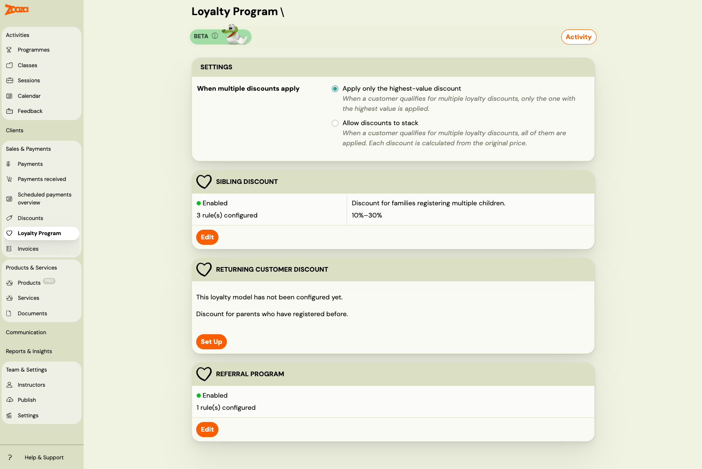
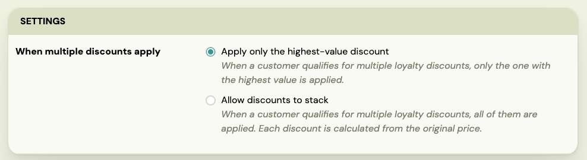

# Loyalty Program

> **Beta feature.** The loyalty program is available to all companies but is actively being developed. Some capabilities described here are planned for upcoming releases.

The loyalty program lets you reward clients automatically — no manual discount codes, no spreadsheets. Once you configure a model and enable it, Zooza applies the correct discount at booking time, every time.

---

## Why set up a loyalty program?

Attracting a new client costs significantly more than retaining an existing one. A structured loyalty program:

- **Reduces churn** — clients who feel rewarded come back term after term.
- **Drives referrals** — word-of-mouth is more powerful when you give clients a concrete reason to recommend you.
- **Encourages family sign-ups** — sibling discounts remove the hesitation when parents consider registering a second or third child.
- **Works automatically** — once configured, it runs in the background. You do not need to manually apply discounts or remember who qualifies.

---

## The three loyalty models

Zooza offers three types of automatic loyalty discounts. Each model is configured independently and can be enabled or disabled at any time.

| Model | What it does |
|---|---|
| **Sibling Discount** | Rewards families who register more than one child. The 2nd, 3rd, 4th, or 5th child gets a discount. |
| **Returning Client Discount** | Rewards clients who have registered before. Discount tiers can increase with the number of previous bookings. |
| **Referral Program** | Rewards clients who refer new customers. The referred new client and/or the referrer can both receive a discount. |

Go to **Sales & Payments → Loyalty Program** to see the status of all three models and navigate to each one's setup page.

---

## How discounts are applied

### Identity

All loyalty models use the **parent's email address** to identify returning clients and family members. The email is normalized (lowercased, trimmed) before comparison, so `Jana@example.com` and `jana@example.com` are treated as the same person.

### Rules

Each loyalty model is configured through **rules**. A rule defines:

- **Which programmes / classes** the discount applies to
- **What discount** to give (percentage or fixed amount)
- Optional: **tiers** based on child number or booking history

Rules let you offer different discounts for different programmes. A swim school might offer a 10% sibling discount on swimming lessons but a 20% discount on intensive camps.

### Eligibility is checked at booking time

When a client completes a booking, Zooza evaluates all enabled loyalty models. It checks whether the client qualifies for each model and which rule matches the programme being booked. The discount is applied instantly — the client sees the reduced price before payment.

Eligibility is checked **once at booking time** and not changed retroactively. If you update your loyalty rules later, existing bookings are unaffected.

---

## When multiple discounts apply

If you enable two or more models, a client might qualify for more than one discount on the same booking. Use the **combination mode** setting to control this.

The combination mode card appears automatically on the overview page when two or more models are enabled.

| Mode | What happens |
|---|---|
| **Apply only the highest-value discount** (default) | Zooza picks the single discount worth the most money and applies that one only. |
| **Allow discounts to stack** | All qualifying discounts are applied. Each is calculated from the original price, then summed. The total cannot exceed the booking price (price never goes below zero). |

### Example: returning client registers a second child

Setup: Sibling Discount (10%) and Returning Client Discount (15%) both enabled. Programme price: €200.

| Mode | Applied | Client pays |
|---|---|---|
| Highest-value only | Returning: €30 | €170 |
| Stack | Sibling €20 + Returning €30 = €50 | €150 |

### Example: returning client, second child, referred by a friend

All three models enabled, programme price: €200.

| Mode | Applied | Client pays |
|---|---|---|
| Highest-value only | Returning: €30 | €170 |
| Stack | Sibling €20 + Returning €30 + Referral €10 = €60 | €140 |

---

## How discounts work with payment plans

The discount behaviour depends on the payment plan type used at booking:

| Payment plan type | Discount behaviour |
|---|---|
| **One-off (single payment)** | Discount deducted from the total in one go. |
| **Instalments** | Discount distributed proportionally across all scheduled payments. |
| **Membership (monthly / quarterly / annual)** | Discount applied on every billing cycle renewal, not just the first. |
| **Pay per session (by attendance)** | Discount applied to each session individually. |

This means a client on a monthly membership with a sibling discount always pays the reduced rate — month after month, for as long as the membership is active and the loyalty model is enabled.

---

## Quick start

1. Go to **Sales & Payments → Loyalty Program**.
2. Click **Set Up** on the model you want to configure first.
3. Add at least one rule (choose programmes and set the discount).
4. Save the rule, then enable the model.
5. Repeat for any additional models.
6. If you enable two or more models, set the combination mode that suits your pricing strategy.

**Related guides:**
- [Sibling Discount](./loyalty-sibling-discount.md)
- [Returning Client Discount](./loyalty-returning-customer.md)
- [Referral Program](./loyalty-referral.md)
- [Loyalty Activity Log](./loyalty-activity-log.md)
- [What clients and admins see](./loyalty-client-view.md)
