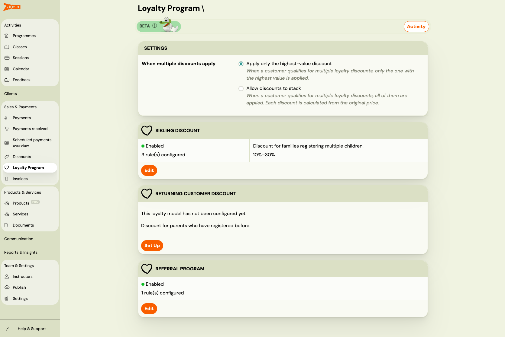
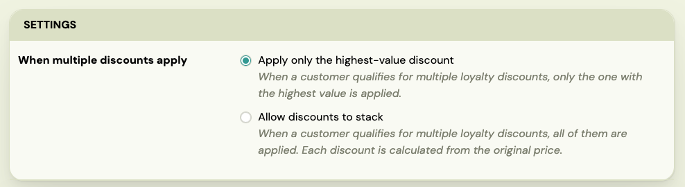

# Loyalty Program

> **Beta feature.** The loyalty program is available to all companies but is actively being developed. Some capabilities described here are planned for upcoming releases.

The loyalty program lets you reward clients automatically — no manual discount codes, no spreadsheets. Once you configure a model and enable it, Zooza applies the correct discount at booking time, every time.

---

## Why set up a loyalty program?

Attracting a new client costs significantly more than retaining an existing one. A structured loyalty program:

- **Reduces churn** — clients who feel rewarded come back term after term.
- **Drives referrals** — word-of-mouth is more powerful when you give clients a concrete reason to recommend you.
- **Encourages family sign-ups** — sibling discounts remove the hesitation when parents consider registering a second or third child.
- **Works automatically** — once configured, it runs in the background. You do not need to manually apply discounts or remember who qualifies.

---

## The three loyalty models

Zooza offers three types of automatic loyalty discounts. Each model is configured independently and can be enabled or disabled at any time.

| Model | What it does |
|---|---|
| **Sibling Discount** | Rewards families who register more than one child. The 2nd, 3rd, 4th, or 5th child gets a discount. |
| **Returning Client Discount** | Rewards clients who have registered before. Discount tiers can increase with the number of previous bookings. |
| **Referral Program** | Rewards clients who refer new customers. The referred new client and/or the referrer can both receive a discount. |

Go to **Sales & Payments → Loyalty Programme** to see the status of all three models and navigate to each one's setup page.

---

## How discounts are applied

### Identity

All loyalty models use the **parent's email address** to identify returning clients and family members. The email is normalized (lowercased, trimmed) before comparison, so `Jana@example.com` and `jana@example.com` are treated as the same person.

### Rules

Each loyalty model is configured through **rules**. A rule defines:

- **Name** — a short label to identify the rule in the list (e.g. "Sibling discount — 2nd child", "Referrer reward — summer campaign"). Optional but recommended once you have more than one rule.
- **Which programmes / classes** the discount applies to
- **What discount** to give (percentage or fixed amount)
- Optional: **tiers** based on child number or booking history

Rules let you offer different discounts for different programmes. A swim school might offer a 10% sibling discount on swimming lessons but a 20% discount on intensive camps.

### Eligibility is checked at booking time

When a client completes a booking, Zooza evaluates all enabled loyalty models. It checks whether the client qualifies for each model and which rule matches the programme being booked. The discount is applied instantly — the client sees the reduced price before payment.

Eligibility is checked **once at booking time** and not changed retroactively. If you update your loyalty rules later, existing bookings are unaffected.

---

## When multiple discounts apply

If you enable two or more models, a client might qualify for more than one discount on the same booking. Use the **combination mode** setting to control this.

The combination mode card appears automatically on the overview page when two or more models are enabled.

| Mode | What happens |
|---|---|
| **Apply only the highest-value discount** (default) | Zooza picks the single discount worth the most money and applies that one only. |
| **Allow discounts to stack** | All qualifying discounts are applied. Each is calculated from the original price, then summed. The total cannot exceed the booking price (price never goes below zero). |

### Example: returning client registers a second child

Setup: Sibling Discount (10%) and Returning Client Discount (15%) both enabled. Programme price: €200.

| Mode | Applied | Client pays |
|---|---|---|
| Highest-value only | Returning: €30 | €170 |
| Stack | Sibling €20 + Returning €30 = €50 | €150 |

### Example: returning client, second child, referred by a friend

All three models enabled, programme price: €200.

| Mode | Applied | Client pays |
|---|---|---|
| Highest-value only | Returning: €30 | €170 |
| Stack | Sibling €20 + Returning €30 + Referral €10 = €60 | €140 |

---

## How discounts work with payment plans

The discount behaviour depends on the payment plan type used at booking:

| Payment plan type | Discount behaviour |
|---|---|
| **One-off (single payment)** | Discount deducted from the total in one go. |
| **Instalments** | Discount distributed proportionally across all scheduled payments. |
| **Membership (monthly / quarterly / annual)** | Your choice, per rule — every billing cycle, or only the first. See [One-off reward or standing perk](#one-off-reward-or-standing-perk) below. Rules made before 29 September 2026 apply it to every cycle. |
| **Pay per session (by attendance)** | Discount applied to each session individually. |

### One-off reward or standing perk

On a membership, "10% off" is ambiguous in a way that costs real money, and the answer depends on what the rule is *for*:

- *"5% off for as long as you are a member"* is a **standing perk**. It should come off every payment.
- *"€10 off for coming back to us"* is a **one-off reward**. Taking €10 off every month turns a €10 thank-you into €120 a year — which has happened, and support had to unpick it by hand.

Since 29 September 2026 you say which one you mean, on each rule:

| **Discount on membership payments** | What it does |
|---|---|
| **All scheduled payments** | The discount comes off every payment. A percentage takes that share each time; a fixed amount is deducted each time. |
| **First scheduled payment only** | The discount is used up once. A percentage is taken from the first full payment; a fixed amount comes off the leading payment, and carries into the next one if it is bigger than the first. |

**All scheduled payments is the default**, and every rule created before that date keeps it — nothing changed by itself. Switch a rule to *First scheduled payment only* when it rewards an action rather than ongoing membership: coming back, being referred, signing up in a campaign.

> **Only memberships are affected.** A programme sold for a total price behaves the same as before, even when that total is split into instalments: the discount comes off the total and the instalments are recalculated from it. There is nothing to decide there, which is why the setting mentions membership by name.

**Discount codes are always one-off.** A percentage code on a membership used to be worked out from the whole term and taken off the first payment with no ceiling, which could make the first month free. Since the same date it is calculated on the first payment, capped at it, and anything left over carries forward.

---

## Quick start

1. Go to **Sales & Payments → Loyalty Programme**.
2. Click **Set Up** on the model you want to configure first.
3. Add at least one rule (choose programmes and set the discount).
4. Save the rule, then enable the model.
5. Repeat for any additional models.
6. If you enable two or more models, set the combination mode that suits your pricing strategy.

**Related guides:**
- [Sibling Discount](./loyalty-sibling-discount.md)
- [Returning Client Discount](./loyalty-returning-customer.md)
- [Referral Program](./loyalty-referral.md)
- [Loyalty Activity Log](./loyalty-activity-log.md)
- [What clients and admins see](./loyalty-client-view.md)
