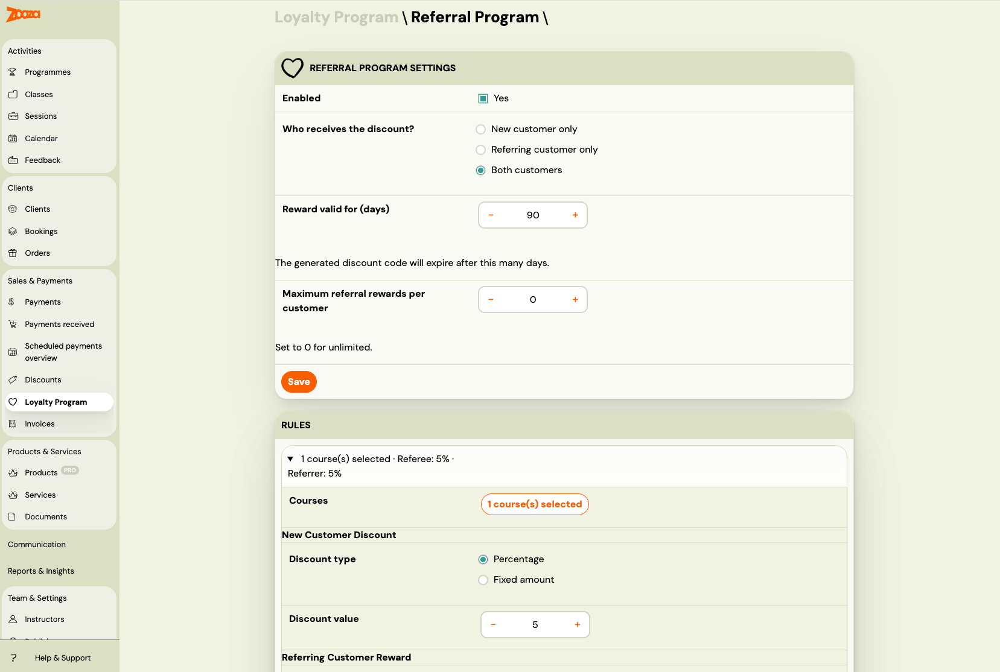
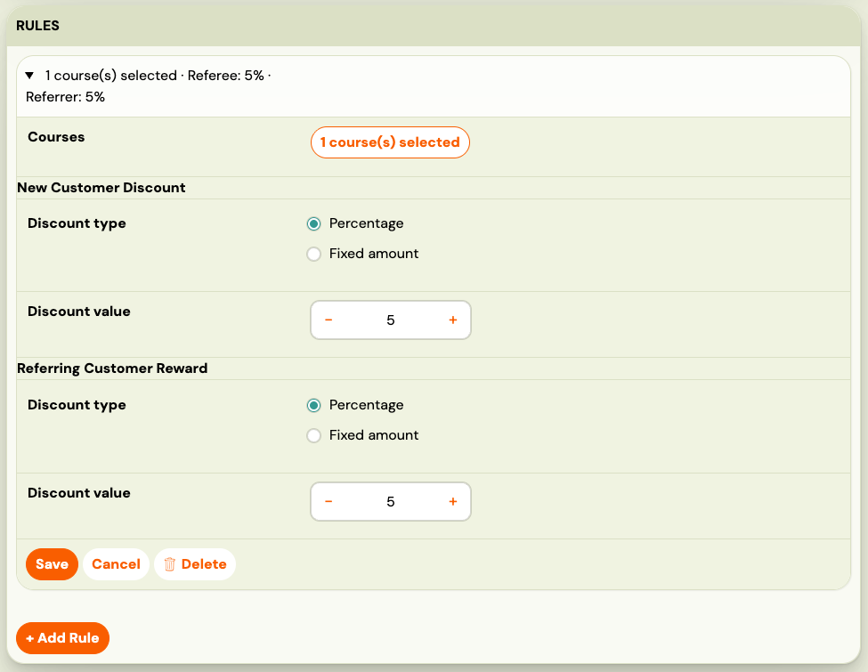
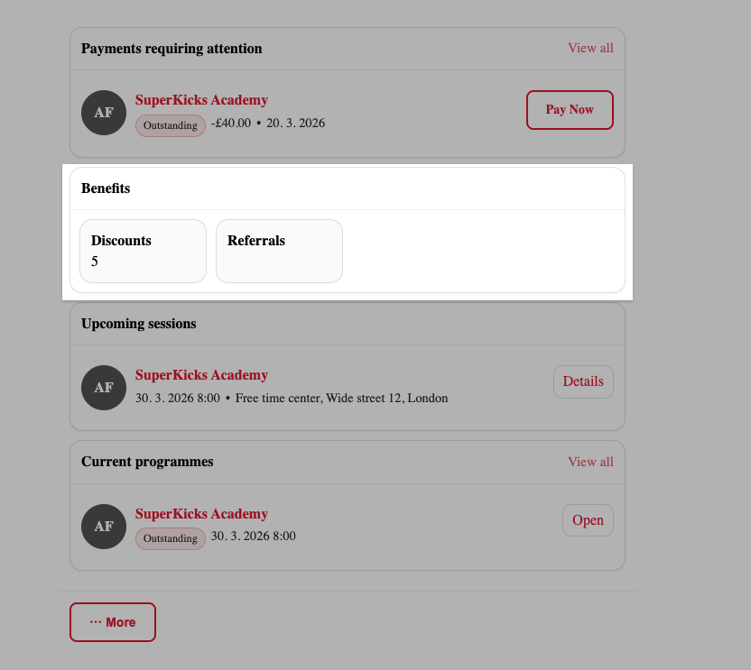
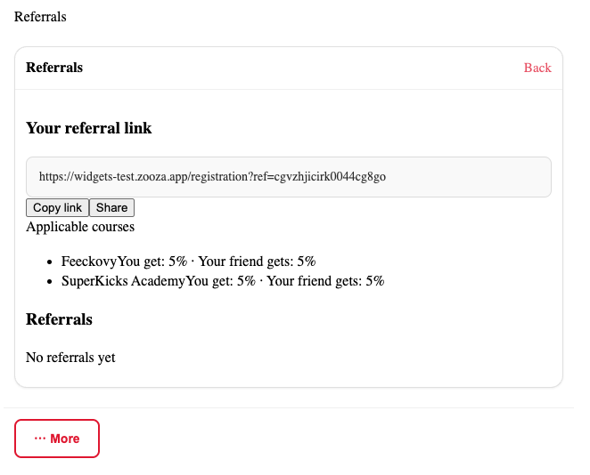

# Referral Program

> **Beta feature.** Part of the [Loyalty Program](./loyalty-program.md).

The referral program gives your existing clients a reason to recommend you. Each client gets a personal referral link they can share. When someone books using that link, both the new client and the referrer can receive a discount.

---

## Why run a referral program?

Word-of-mouth is the most trusted form of marketing — and the cheapest. A structured referral program:

- **Turns clients into advocates** — happy clients are already talking about you. A referral link gives them a tangible reason to actively recommend you.
- **Brings in pre-qualified leads** — a referred client already trusts you because someone they know does.
- **Rewards loyalty twice** — the existing client gets a benefit for referring, and the new client gets a welcome discount.
- **Scales without marketing spend** — every active client becomes a potential acquisition channel.

Studies show that referred clients have higher lifetime value and lower churn than clients acquired through advertising. A referral program systematises what your best clients are already doing informally.

---

## How it works

Each client has a unique referral link available in their **booking widget profile**. When a new client opens that link and completes a booking, the referral is tracked.

- **The new client (referee)** can receive a discount applied directly at booking time.
- **The existing client (referrer)** can receive a discount code (coupon) generated for use on their next booking.

You control who gets rewarded (one or both parties) and how much through rules that you configure per programme group.

---

## Set up the referral program

Go to **Sales & Payments → Loyalty Program → Referral Program**.

### Step 1: Configure shared settings

**Who receives the discount?**

| Option | What happens |
|---|---|
| **Both clients** (default) | The new client gets a discount at booking. The referrer receives a coupon code. |
| **New client only** | Only the new client gets a discount. The referrer receives nothing. |
| **Referring client only** | The new client pays full price. The referrer receives a coupon code. |

**Referrer reward valid for (days):** How many days the generated coupon code is valid. Default is 90 days. Only shown when the referrer receives a reward.

**Maximum referral rewards per client:** Limits how many coupons a single client can earn through referrals. Set to 0 for unlimited. This prevents a single highly-active referrer from accumulating unlimited discounts.

Click **Save Settings**.

### Step 2: Add rules

Each rule defines the discount for a specific group of programmes.

Click **+ Add Rule**.

**Courses:** Click the Courses button to open the programme picker and select which programmes this rule covers.

Depending on who receives the discount, you will see the following fields:

**New client discount** (shown when recipient includes new client):
- Discount type: percentage or fixed amount
- Discount value

**Referring client reward** (shown when recipient includes referrer):
- Discount type: percentage or fixed amount
- Discount value (used to generate the coupon)

Click **Save Rule**. Repeat for other programme groups.

### Step 3: Enable the referral program

Once you have at least one rule saved, the **Enabled** checkbox becomes active. Check it and click **Save Settings**.

**Note:** Rules are evaluated in order (top to bottom). The first rule whose programme list includes the booked programme wins. Use the up/down arrows to reorder rules.

---

## How clients access their referral link

Clients find their referral link in the **booking widget** — in the profile section of the widget embedded on your website or booking page.

The referral section shows:
- Their personal referral link (with a copy button)
- How many successful referrals they have made
- A breakdown of rewards earned

Clients can share the link directly via messaging, email, or social media. When someone opens the link and completes a booking, the referral is tracked automatically.

---

## How referral discounts work

### For the new client (referee)

The discount is applied directly at booking time, before payment. The new client sees the reduced price in the booking form.

A client qualifies as a "new client" if they have no previous bookings under the same email address. Self-referral (using your own link) is not allowed.

### For the referring client (referrer)

A coupon code is generated automatically using the existing coupon system. It is sent to the referrer after the new client's booking is confirmed. The coupon is valid for the configured number of days and can be used once on a future booking.

When the referrer has reached the maximum reward limit (if configured), they stop receiving new coupons — but the new client's discount still applies normally.

### Rule evaluation

Rules are evaluated in position order. The first rule whose programme list matches the programme being booked wins. If no rule matches the programme, no referral discount is applied to that booking.

---

## How discounts apply to payment plans

| Payment plan type | New client discount | Referrer coupon |
|---|---|---|
| **One-off** | Applied as a single discount row. | Used on a future booking. |
| **Instalments** | Distributed proportionally across all scheduled payments. | Used on a future booking. |
| **Membership** | Applied on every billing cycle renewal. | Used on a future booking. |
| **Pay per session** | Applied individually to each session. | Used on a future booking. |

The referrer's coupon is always a one-time-use code applied to a single future payment, regardless of the referrer's payment plan type.

---

## Changing the recipient setting after rules are created

If you change the **Who receives the discount** setting after rules already exist, the existing rules are not automatically updated. At evaluation time, the current recipient setting is authoritative — the system uses it to determine which discount fields to apply, regardless of what was saved in the rules at the time.

This means you can safely switch from "Both" to "New client only" and the referrer fields in existing rules will simply be ignored.

---

## Disable or edit the referral program

To **disable** without losing your rules: uncheck **Enabled** and click **Save Settings**.

To **delete a rule**: expand the rule, then click **Delete** inside the rule form. If you delete the last rule, the model is automatically disabled.

---

## Frequently asked questions

**Does a client need to share their link in advance, or can they share it after a friend has booked?**
The link must be used during the booking process. If a new client books without using the referral link, the referral is not tracked retroactively.

**Can an existing client refer themselves using a second email address?**
Self-referral (same email) is blocked. However, using a completely different email address for a second account is technically possible — the system cannot detect this without manual review.

**What if the referrer has already hit their maximum reward limit?**
They stop receiving new coupons, but the new client's discount still applies. The referrer limit only affects coupon generation, not the new client's price.

**How does the referrer receive their coupon?**
The coupon is generated automatically. Depending on your notification settings, it may be sent by email or available in the referrer's profile.

**Can I offer different discounts for different programmes?**
Yes. Create separate rules for different programme groups. The first matching rule wins.

**Is the referral discount stackable with sibling or returning client discounts?**
Yes, if combination mode is set to **Allow discounts to stack**. See [Loyalty Program — combination mode](./loyalty-program.md#when-multiple-discounts-apply).

For more, see [Loyalty Program FAQ](../faq/loyalty-faq.md).
