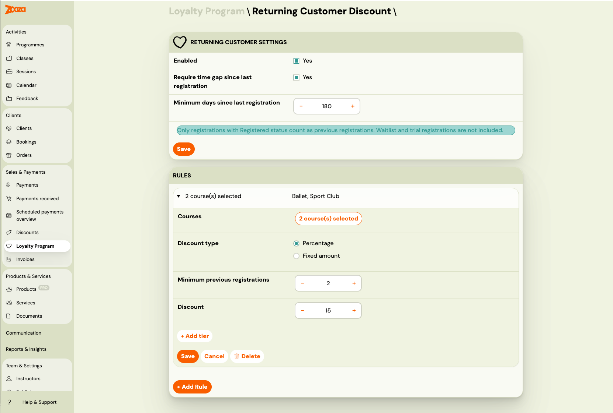
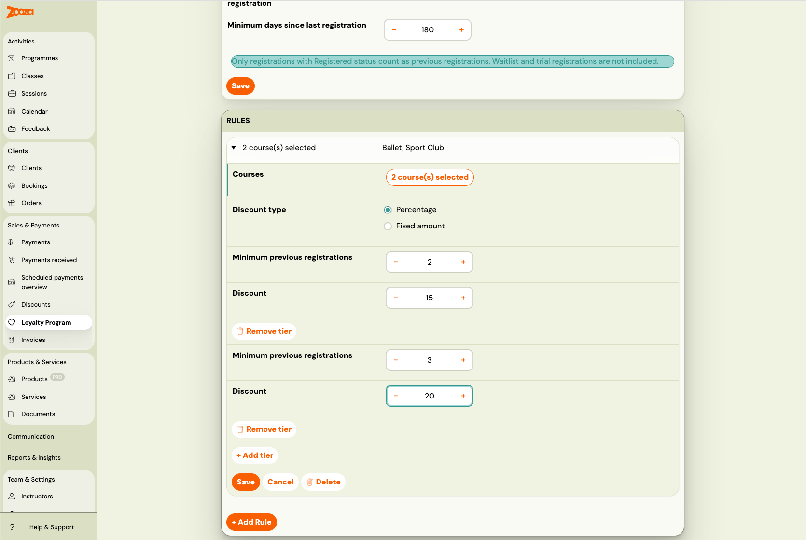

# Returning Client Discount

> **Beta feature.** Part of the [Loyalty Program](./loyalty-program.md).

The returning client discount automatically rewards clients who have booked with you before. When a parent with a history of qualifying bookings registers again, Zooza applies the configured discount — no coupon codes, no manual checks.

---

## Why reward returning clients?

Retaining an existing client is far cheaper than acquiring a new one. A returning client discount:

- **Shows clients they are valued** — recognition drives loyalty more than price alone.
- **Incentivises early re-registration** — clients are more likely to book the next term if they know they get a better deal.
- **Builds compound retention** — long-term clients who receive progressively better discounts have a strong reason to stay.
- **Complements your onboarding** — a new client gets a good first experience; a returning client gets rewarded for staying.

A typical setup: 5% discount from the 1st return booking, 10% from the 3rd, 15% from the 6th. You configure the tiers to match your business model.

---

## How it works

When a client completes a booking, Zooza counts the number of **previous qualifying bookings** under the same email address. The current booking is not counted — only prior ones.

**Qualifying bookings** means registrations with **Registered** status. Waitlist and trial bookings are excluded.

Zooza finds the matching rule for the programme being booked, then applies the highest discount tier where the client's previous booking count meets the threshold.

**Example:** Rule with tiers: 1+ previous → 5%, 3+ previous → 10%, 6+ previous → 15%. Client has 4 previous bookings → the 3+ tier applies (10%).

---

## Set up the returning client discount

Go to **Sales & Payments → Loyalty Program → Returning Client Discount**.

### Step 1: Configure shared settings

**Enabled:** You can only enable the model after adding at least one rule.

**Require time gap since last booking (optional):** When enabled, the client's most recent qualifying booking must be at least N days in the past. This prevents a client who is currently active in the same term from also qualifying as a "returning" client.

Use the time gap if:
- You run term-based programmes and want to reward clients who return *after* a break.
- You have both sibling and returning client discounts active and want to avoid double-qualifying clients who are already in the current term.

Leave it off if you want to reward any client who has ever booked with you, even if they are currently active.

### Step 2: Add rules

Each rule targets a group of programmes and defines discount tiers based on the number of previous bookings.

Click **+ Add Rule**.

**Course selection:** Click the Courses button to open the programme picker. Select all programmes this rule applies to. At least one programme is required.

**Discount type:** Choose percentage or fixed amount. This applies to all tiers within the rule.

**Tiers:** Add one or more tiers. Each tier has:
- **Minimum previous bookings** — the client must have at least this many prior registrations
- **Discount value** — the discount applied when the threshold is met

Click **+ Add tier** to add more tiers within a rule. The last tier covers all higher booking counts automatically (e.g., a 6+ tier applies to clients with 6, 10, 20, or any greater number of previous bookings).

Click **Save Rule**. Repeat for other programme groups.

**Tips:**
- Create separate rules for different programme groups if you want different discounts (e.g., higher discount on premium camps).
- Rules are evaluated in order. If a programme appears in multiple rules, the first matching rule wins. Use the up/down arrows to reorder rules.
- A programme should appear in only one rule per model to keep behaviour predictable.

### Step 3: Enable the discount

Once you have at least one rule saved, the **Enabled** checkbox becomes active. Check it and click **Save Settings**.

The returning client discount is now live and will be evaluated on every new booking.

---

## Tier evaluation logic

Within a matching rule, Zooza applies the **highest tier whose threshold is met**.

| Tiers configured | Previous bookings | Applied tier |
|---|---|---|
| 1+ → 5% | 0 | No discount (no previous bookings) |
| 1+ → 5% | 1 | 5% |
| 1+ → 5%, 3+ → 10% | 2 | 5% |
| 1+ → 5%, 3+ → 10% | 3 | 10% |
| 1+ → 5%, 3+ → 10%, 6+ → 15% | 8 | 15% |

---

## Rule ordering

Rules are evaluated in the order shown on the page (top to bottom). When a programme matches a rule, that rule is used and the rest are ignored.

Reorder rules using the up/down arrows in each rule's summary row. This matters when the same programme appears in more than one rule — the first match wins.

---

## How discounts apply to payment plans

| Payment plan type | How the returning client discount is applied |
|---|---|
| **One-off** | Deducted from the total in a single discount row. |
| **Instalments** | Distributed proportionally across all scheduled payments. |
| **Membership** | Applied on every billing cycle renewal for as long as the membership is active. |
| **Pay per session** | Applied individually to each session. |

---

## Disable or edit the discount

To **disable** without losing your rules: uncheck **Enabled** and click **Save Settings**.

To **delete a rule**: expand the rule by clicking its summary row, then click **Delete**. If you delete the last rule, the model is automatically disabled.

To **edit tiers**: expand the rule, update the tier values, and click **Save Rule**.

---

## Frequently asked questions

**Does the current booking count toward the "previous bookings" total?**
No. Only bookings made before the current one are counted. The client needs at least one prior booking to qualify.

**Do cancelled bookings count?**
No. Only bookings with Registered status count. Cancellations, waitlist, and trial bookings are excluded.

**Does the previous booking have to be in the same programme?**
No. Previous bookings from any programme count toward the eligibility check. The rule's programme selection only determines whether the discount applies to the *current* booking.

**I have a time gap of 90 days. A client who registered 60 days ago books again — do they qualify?**
No. Their most recent qualifying booking is only 60 days old, which is less than the 90-day threshold. They do not qualify until 90 days have passed.

**Can I give a higher discount to very long-term clients?**
Yes. Add a higher tier within the rule (e.g., 10+ previous bookings → 20%) to reward your most loyal clients.

**What happens if I change my rules after existing bookings?**
Existing bookings are unaffected. New rules apply only to bookings made after the change.

For more, see [Loyalty Program FAQ](../faq/loyalty-faq.md).
