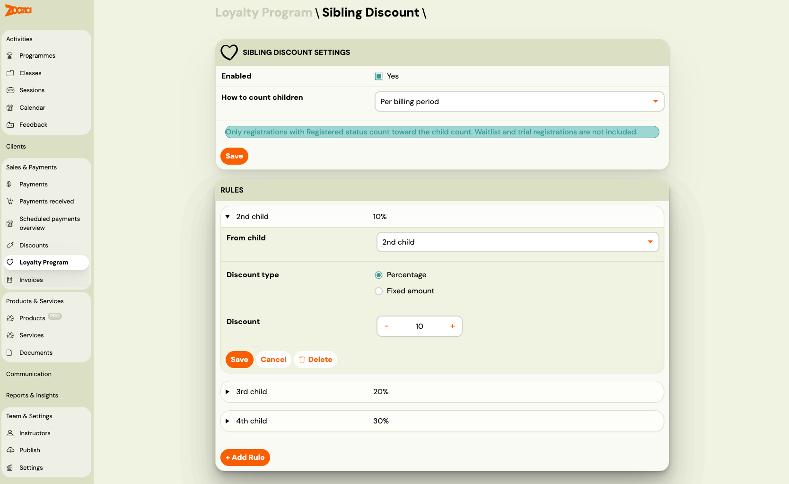
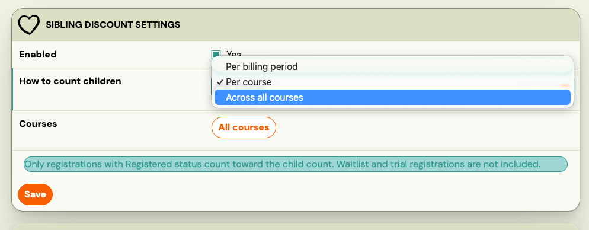
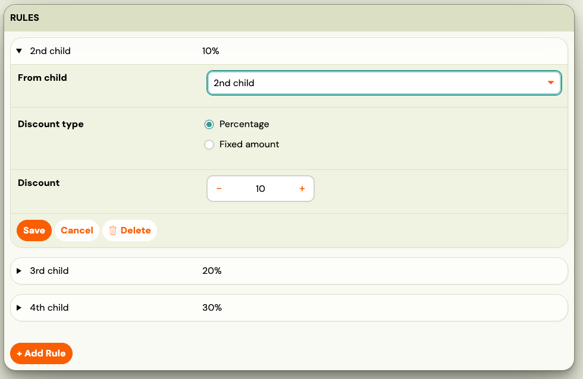

# Sibling Discount

> **Beta feature.** Part of the [Loyalty Program](./loyalty-program.md).

> **Pay-as-you-go programmes:** The sibling discount is designed for subscription, instalment, and one-off payment plans. It is **not recommended for Pay-as-you-go (pay per session) programmes** — the discount counting logic may not behave as expected. If you run Pay-as-you-go programmes and want to use a sibling discount, [contact us](mailto:support@zooza.app) and tell us how you'd like it to work.

The sibling discount automatically rewards families who register more than one child. When the same parent registers a second, third, or fourth child, Zooza applies the discount at booking — no manual codes needed.

---

## Why offer a sibling discount?

Families with multiple children are a high-value segment. When parents weigh the cost of registering siblings, the total price can become a barrier. A sibling discount:

- **Removes the hesitation** — a visible discount makes the decision easier for parents.
- **Increases retention across siblings** — once a family commits to multiple bookings, they are less likely to drop out.
- **Differentiates your school** — not every provider offers automatic family pricing.

A typical setup: 10% off for the 2nd child, 15% for the 3rd child, 20% for the 4th child or more. You configure the tiers to match your pricing strategy.

---

## How it works

When a parent completes a booking, Zooza counts how many qualifying registrations already exist under the same email address. The current booking counts as the Nth child.

**Qualifying registrations** means bookings with **Registered** status. Waitlist and trial bookings are not counted.

The system then finds the discount rule with the highest child threshold that is still ≤ N, and applies that discount.

**Example:** Rules set to 2nd child: 10%, 4th child: 20%. Parent registers their 3rd child → the 2nd-child rule applies (10%), because 3rd child is ≥ 2 but < 4.

---

## Set up the sibling discount

Go to **Sales & Payments → Loyalty Program → Sibling Discount**.

### Step 1: Choose how children are counted

The **counting scope** determines what registrations count toward the child number.

| Scope                            | What it counts                                                                                       |
| -------------------------------- | ---------------------------------------------------------------------------------------------------- |
| **Per billing period** (default) | Registrations within the same billing period across all programmes.                                  |
| **Per course**                   | Registrations in the same programme only. Both children must be registered in the same programme.    |
| **Across all classes**           | All registrations regardless of programme or period.                                                 |

When you select **Per course**, a course picker appears so you can choose which programmes participate.

### Step 2: Add discount rules (tiers)

Each rule defines the discount for a specific child threshold. You can add up to four rules — one for each of: 2nd, 3rd, 4th, and 5th child.

Click **+ Add Rule**. A rule form opens with the first available child number pre-selected.

For each rule, set:
- **From child** — which child number this tier starts at (2nd, 3rd, 4th, or 5th)
- **Discount type** — percentage or fixed amount
- **Discount value** — the amount to deduct

Click **Save Rule**. Repeat for each tier.

**Tips:**
- You do not need to define a rule for every child number. A single rule for the 2nd child applies to all subsequent children unless you add a higher tier.
- Rules with a lower child number automatically cover all children above them if no higher rule exists.
- Each child number can only be used once across all rules.

### Step 3: Enable the discount

Once you have at least one rule, the **Enabled** toggle becomes active. Check it and click **Save Settings**.

The sibling discount is now live. Zooza applies it automatically at the next qualifying booking.

---

## Discount rules in detail

### Which programmes are eligible?

By default (counting scope: Per billing period or Across all classes), the discount is evaluated across all your programmes. No additional programme filtering is needed.

When **Per course** scope is selected, you choose specific programmes via the course picker. Only bookings in those programmes count toward the child number, and only those programmes receive the discount.

### Tier evaluation logic

Rules are evaluated by child threshold from highest to lowest. The **highest rule that still applies** wins.

| Rules | Booking scenario | Applied discount |
|---|---|---|
| 2nd child: 10% | Registering 2nd child | 10% |
| 2nd child: 10%, 4th child: 20% | Registering 3rd child | 10% (2nd-child rule is the highest applicable) |
| 2nd child: 10%, 4th child: 20% | Registering 4th child | 20% |
| 2nd child: 10%, 4th child: 20% | Registering 1st child | No discount |

### Fixed amount vs percentage

Both discount types are supported. Fixed amount discounts are displayed with your currency (e.g., €10.00) in the rules list.

When stacking discounts across models (see [Loyalty Program — combination mode](./loyalty-program.md#when-multiple-discounts-apply)), each discount is calculated from the **original price** before any other loyalty discount is applied.

---

## How discounts apply to payment plans

| Payment plan type | How the sibling discount is applied |
|---|---|
| **One-off** | Deducted from the total in a single discount row. |
| **Instalments** | Distributed proportionally across all scheduled payments. |
| **Membership** | Applied on every billing cycle renewal for as long as the membership is active. |
| **Pay per session** | Applied individually to each session. |

---

## Applying discounts to manual registrations

The sibling discount is applied **automatically only when a client books through the booking widget**. When you create a registration manually from the admin panel, the loyalty discount is **not applied automatically**.

If you want to apply a family discount to a manually created registration, you have two options:

**Option 1 — Payment plan with a built-in discount**

Assign a payment plan that includes a percentage discount (configured in **Programmes → Settings → Price and Payment → Payment plans**). This is the cleanest way to apply a consistent discount to a specific registration.

**Option 2 — Discount code**

Create a one-time discount code and apply it to the booking. Discount codes work independently of the loyalty program and are a valid way to apply a sibling discount manually when needed. See [Discount code](./discount-code.md).

> Both options are complementary to the loyalty program — they do not replace it and do not interfere with automatic discount evaluation on online bookings.

---

## Disable or delete the sibling discount

To **disable** without losing your rules: uncheck **Enabled** and click **Save Settings**. The rules are preserved and you can re-enable later.

To **delete a rule**: open the rule by clicking its summary row, then click **Delete** in the rule form. If you delete the last rule, the model is automatically disabled.

---

## Frequently asked questions

**Does the 1st child ever get a discount?**
No. The sibling discount starts from the 2nd child. The first child always pays the full price.

**What if a parent registers 5 children but I only have a rule for 2nd and 3rd child?**
The 3rd-child rule applies to all children from the 3rd onward (4th, 5th, etc.) unless you add a higher tier.

**Does the discount apply if one child is on the waitlist?**
No. Waitlist and trial registrations do not count toward the child number.

**Can siblings be in different programmes?**
Yes, when counting scope is **Per billing period** or **Across all courses**. When scope is **Per course**, both children must be in the selected programme(s) for the count to apply.

**Can I offer a sibling discount on only some programmes?**
Use the **Per course** scope and select the programmes you want to include.

**What happens if I change my rules after existing bookings?**
Existing bookings are not affected. The new rules apply only to bookings made after the change.

For more, see [Loyalty Program FAQ](../faq/loyalty-faq.md).
